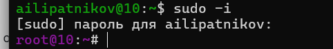
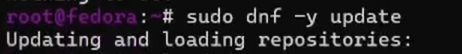
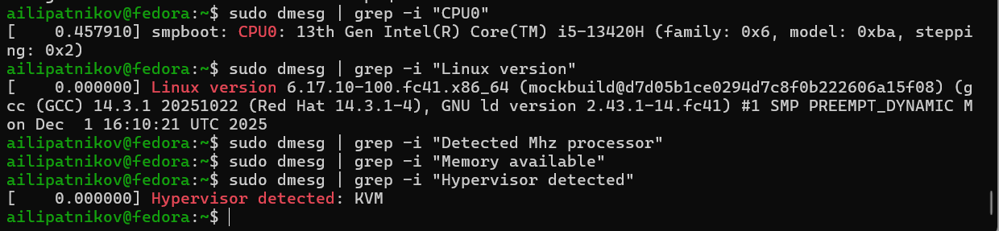

---
## Author
author:
  name: Липатников Андрей
  email: 1032253853@rudn.ru
  affiliation:
    - name: Российский университет дружбы народов
      country: Российская Федерация
      postal-code: 117198
      city: Москва
      address: ул. Миклухо-Маклая, д. 6
## Title
title: Лабораторная работа №1
subtitle: Установка операционной системы Linux
license: CC BY
date: today
date-format: "2026-10-07"
---

# Информация

## Докладчик

:::::::::::::: {.columns align=center}
::: {.column width="70%"}

  * Липатников Андрей
  * Студент Российского университета дружбы народов им. П. Лумумбы
  * [1032253853@rudn.ru](mailto:1032253853@rudn.ru)

:::
::: {.column width="30%"}

:::
::::::::::::::

::: notes
- Поприветствовать аудиторию.
- Кратко представиться: «Выполнил лабораторную работу №1 по установке ОС Linux».
:::

# Вводная часть

## Актуальность

- Изучение операционных систем требует безопасной и воспроизводимой среды
- Виртуализация позволяет экспериментировать без риска для основной системы
- Настроенное окружение --- фундамент всех последующих лабораторных работ
- Цель презентации: показать процесс установки Fedora Linux и подтвердить готовность окружения

::: notes
- Подчеркнуть: без подготовленного окружения невозможна ни одна следующая работа курса.
- Время: не более 1 минуты на этот слайд.
:::

## Объект и предмет исследования

- **Объект**: процесс развёртывания операционной системы Linux в виртуальной среде
- **Предмет**: установка Fedora 41 (Sway) в VirtualBox и настройка базовых сервисов
- **Критерий результата**: работоспособное окружение с средствами разработки и документации

::: notes
- Объект --- более широкая область (развёртывание ОС в виртуальной среде).
- Предмет --- конкретный аспект (Fedora 41 Sway в VirtualBox).
- Акцент на воспроизводимость: любые шаги можно повторить.
:::

## Цели и задачи

- Цель:
    - Приобрести практические навыки установки ОС на виртуальную машину и настройки минимально необходимых сервисов.
- Задачи:
    - Установить Fedora 41 (Sway) в VirtualBox и выполнить базовую настройку системы.
    - Установить средства разработки (development-tools, DKMS) и Guest Additions.
    - Установить средства документации (pandoc, TeX Live) и выполнить анализ загрузки через `dmesg`.

::: notes
- Задачи сгруппированы в три блока для удобства восприятия.
- Каждый блок соответствует группе слайдов с результатами.
:::

# Материалы и методы

## Используемое ПО и среда

- **ОС хоста**: Windows 11
- **Виртуальная машина**: VirtualBox 7.0+
- **Гостевая ОС**: Fedora 41 (Sway)
- **Инструменты**: `dnf`, `dmesg`, `nano`, `tmux`, `mc`

::: notes
- Подчеркнуть изоляцию среды: виртуальная машина отделяет эксперименты от хост-системы.
- Sway выбран как лёгкое окружение: минимум графики, максимум ресурсов под задачи.
:::

## Методика выполнения

- Установка ОС из образа Fedora 41 (Sway)
- Установка DKMS и Guest Additions из смонтированного образа
- Базовая настройка: обновления, SELinux (`permissive`), раскладка клавиатуры
- Установка групп пакетов и средств документации
- Анализ загрузки системы командой `dmesg`

::: notes
- Методика воспроизводима: каждый шаг документирован скриншотами в отчёте.
- DKMS решает известную проблему с kernel headers при сборке модулей.
:::

# Содержание исследования

## Монтирование образа Guest Additions

- Создана точка монтирования `/media`
- Образ Guest Additions смонтирован, содержимое просмотрено

:::::::::::::: {.columns}
::: {.column width="48%"}

:::
::: {.column width="48%"}

:::
::::::::::::::

::: notes
- Образ подключается как виртуальный CD-ROM средствами VirtualBox.
- Монтирование в /media --- подготовка к запуску установщика.
:::

## Установка DKMS и переход в root

- Установлен DKMS для автоматической сборки модулей ядра
- Дальнейшие действия выполняются от суперпользователя

:::::::::::::: {.columns}
::: {.column width="48%"}

:::
::: {.column width="48%"}

:::
::::::::::::::

::: notes
- DKMS пересобирает модуль vboxguest при каждом обновлении ядра.
- Переход в root: sudo -i, работа от суперпользователя для системных настроек.
:::

## Проверка модуля vboxguest

- Модуль `vboxguest` загружен в ядро
- Проверка: `lsmod | grep vboxguest`

::: notes
- Загруженный модуль подтверждает успешную установку Guest Additions.
- Общий буфер обмена и динамическое разрешение экрана работают через этот модуль.
:::

## Базовая настройка системы

- Обновление всех пакетов: `dnf update`
- SELinux переведён в режим `permissive`
- Настроена раскладка клавиатуры

:::::::::::::: {.columns}
::: {.column width="32%"}

:::
::: {.column width="32%"}

:::
::: {.column width="32%"}

:::
::::::::::::::

::: notes
- Не «отключение» SELinux, а перевод в permissive: нарушения политики фиксируются, но не блокируются.
- Раскладка настроена через конфигурацию клавиатуры.
:::

## Установка средств разработки

- Установлена группа пакетов `development-tools`
- Установлены консольные утилиты `tmux` и `mc`

:::::::::::::: {.columns}
::: {.column width="48%"}

:::
::: {.column width="48%"}

:::
::::::::::::::

::: notes
- development-tools --- компилятор gcc, make и весь набор для сборки из исходников.
- tmux --- мультиплексор терминала, mc --- файловый менеджер.
:::

## Установка средств документации

- Установлен `pandoc` для работы с Markdown
- Установлен TeX Live для сборки PDF

:::::::::::::: {.columns}
::: {.column width="48%"}

:::
::: {.column width="48%"}

:::
::::::::::::::

::: notes
- Pandoc + TeX Live --- инфраструктура всех отчётов курса.
- Отчёты собираются из Markdown в PDF и HTML.
:::

## Домашнее задание: анализ dmesg

- Проанализирован вывод `dmesg` --- кольцевой буфер сообщений ядра

::: notes
- dmesg --- источник сведений об оборудовании и ходе загрузки.
- Далее --- конкретные значения, полученные из вывода.
:::

# Результаты

## Полученные данные

- Система установлена и настроена, средства разработки и документации работают

| Параметр | Значение |
|----------|----------|
| Версия ядра | `6.17.10-100.fc41.x86_64` |
| Модель CPU0 | Intel(R) Core(TM) i5-13420H |
| Гипервизор | KVM |
| Частота процессора | `2.1 GHz` |
| Объём памяти | `16384 MB` |

::: notes
- Значения получены из вывода dmesg --- данные подтверждены скриншотом.
- Кратко прокомментировать каждую строку таблицы.
:::

# Заключение

## Главный вывод

Установленное и настроенное окружение (Fedora 41 Sway + VirtualBox) обеспечивает полный цикл работ курса: от разработки до сборки документации, --- и готово к использованию в последующих лабораторных работах.

::: notes
- Финальный аккорд: окружение готово, верифицировано анализом dmesg.
- После фразы сделать паузу 3--5 секунд, затем устно: «Я готов ответить на ваши вопросы».
- Будьте готовы к вопросам про SELinux, DKMS, VirtualBox, dmesg и файловые системы.
:::
