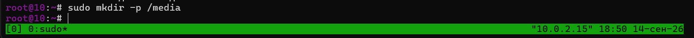
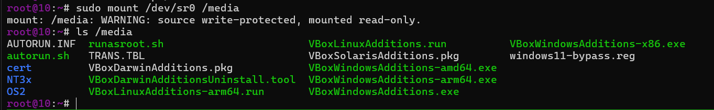
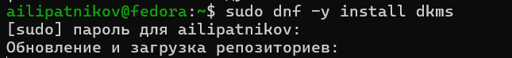
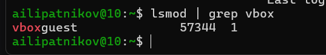
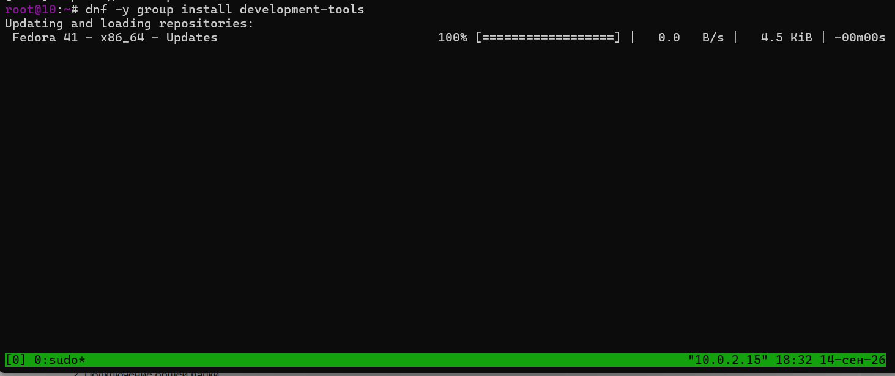
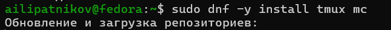
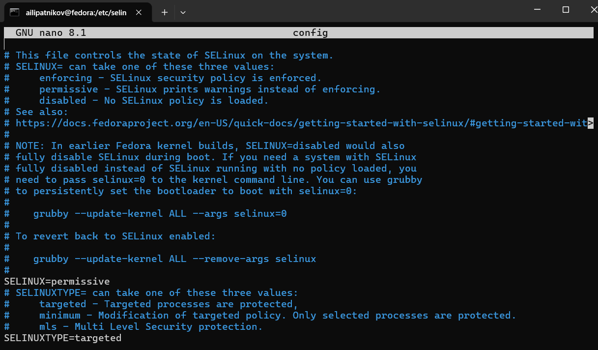
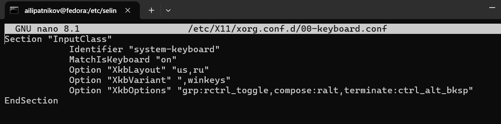
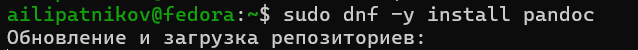
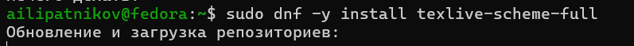

---
## Author
author:
  name: Липатников Андрей
  email: 1032253853@rudn.ru
  affiliation:
    - name: Российский университет дружбы народов
      country: Российская Федерация
      postal-code: 117198
      city: Москва
      address: ул. Миклухо-Маклая, д. 6

## Title
title: "Лабораторная работа №1"
subtitle: "Установка операционной системы Linux"
license: "CC BY"
abstract: |
  В данном отчёте представлены результаты выполнения лабораторной работы по теме «Установка операционной системы Linux».

  В ходе работы была установлена Fedora 41 (Sway) на виртуальную машину VirtualBox, выполнена базовая настройка системы, установлены средства разработки и документации, а также Guest Additions.

  Сделаны выводы о достижении поставленной цели.
keywords: [лабораторная работа, Linux, Fedora, VirtualBox, установка ОС]
date: today
date-format: "2026-10-07"
---

# Введение

## Актуальность

Изучение операционных систем требует работы в воспроизводимой и безопасной среде: установка и настройка дистрибутива Linux на реальном оборудовании сопряжена с риском нарушить работу основного устройства пользователя. Виртуализация (VirtualBox) решает эту проблему — позволяет разворачивать изолированные системы и экспериментировать без последствий. Fedora выбрана как современный дистрибутив с актуальными версиями инструментов, а минимальная среда Sway даёт лёгкое рабочее окружение без избыточных графических сервисов. Кроме того, для выполнения всех последующих лабораторных работ курса необходимо заранее подготовленное окружение: система контроля версий, компиляторы и средства генерации документации — их установка входит в данную работу.

## Объект и предмет исследования

- **Объект исследования:** процесс развёртывания операционной системы Linux в изолированной виртуальной среде.
- **Предмет исследования:** процедуры установки Fedora 41 (Sway) на виртуальную машину VirtualBox и настройки минимально необходимого набора сервисов для дальнейшей работы.

## Цель работы

Приобретение практических навыков установки операционной системы на виртуальную машину, настройки минимально необходимых для дальнейшей работы сервисов.

## Задачи

1. Установить Fedora 41 (Sway) на виртуальную машину VirtualBox.
2. Настроить систему: обновления, раскладка клавиатуры, SELinux.
3. Установить средства разработки (development-tools, DKMS).
4. Установить программное обеспечение для создания документации (pandoc, TeX Live).
5. Установить Guest Additions.
6. Выполнить домашнее задание (анализ `dmesg`).

# Теоретическая часть

Fedora — дистрибутив Linux, разрабатываемый сообществом Fedora Project и спонсируемый Red Hat. Отличается свежими версиями пакетов и поддержкой новых технологий.

**Sway** — тайловый оконный менеджер для Wayland, совместимый с i3.

**VirtualBox** — программа виртуализации, позволяющая запускать несколько ОС на одном компьютере.

# Материалы и методы

- **ОС хоста:** Windows 11
- **Виртуальная машина:** VirtualBox 7.0+
- **Гостевая ОС:** Fedora 41 (Sway)
- **Инструменты:** dnf, dmesg, nano, tmux, mc

## Схема выполнения работы

Работа выполняется в следующей последовательности:

1. Установка Fedora 41 (Sway) на виртуальную машину VirtualBox.
2. Установка DKMS и Guest Additions (монтирование образа, сборка модуля ядра).
3. Проверка модуля `vboxguest`.
4. Базовая настройка системы: обновления, перевод SELinux в режим `permissive`, настройка раскладки клавиатуры.
5. Установка средств разработки (development-tools) и утилит (tmux, mc).
6. Установка средств документации (pandoc, TeX Live).
7. Домашнее задание: анализ загрузки системы через `dmesg`.

# Выполнение лабораторной работы

## Создание точки монтирования

Создание папки `/media` для монтирования (рис. @fig-media).

{#fig-media width=70%}

## Монтирование Guest Additions

Монтирование образа Guest Additions и просмотр содержимого (рис. @fig-mount).

{#fig-mount width=70%}

## Установка DKMS

Установка пакета DKMS для сборки модулей ядра (рис. @fig-dkms).

{#fig-dkms width=70%}

## Проверка модуля vboxguest

Проверка загрузки модуля `vboxguest` (рис. @fig-lsmod).

{#fig-lsmod width=70%}

## Переход в режим суперпользователя

Переход в root для дальнейших действий (рис. @fig-sudo).

{#fig-sudo width=70%}

## Обновление системы

Обновление всех пакетов (рис. @fig-update).

{#fig-update width=70%}

## Установка средств разработки

Установка группы пакетов `development-tools` (рис. @fig-devtools).

{#fig-devtools width=70%}

## Установка tmux и mc

Установка полезных утилит для работы в консоли (рис. @fig-tmuxmc).

{#fig-tmuxmc width=70%}

## Перевод SELinux в режим permissive

Настройка SELinux в режим `permissive` (рис. @fig-selinux). Полное отключение SELinux не выполнялось: в режиме `permissive` нарушения политики лишь фиксируются в журнале, что безопаснее для учебной среды.

{#fig-selinux width=70%}

## Настройка раскладки клавиатуры

Настройка `/etc/X11/xorg.conf.d/00-keyboard.conf` (рис. @fig-keyboard).

{#fig-keyboard width=70%}

## Установка pandoc

Установка pandoc для работы с Markdown (рис. @fig-pandoc).

{#fig-pandoc width=70%}

## Установка TeX Live

Установка TeX Live для создания PDF (рис. @fig-texlive).

{#fig-texlive width=70%}

## Домашнее задание: анализ dmesg

Анализ загрузки системы через `dmesg` (рис. @fig-dmesg).

{#fig-dmesg width=70%}

**Полученная информация:**

- **Версия ядра Linux:** `6.17.10-100.fc41.x86_64`
- **Модель процессора (CPU0):** `Intel(R) Core(TM) i5-13420H`
- **Тип гипервизора:** `KVM`
- **Частота процессора:** `2.1GHz`
- **Объём памяти:** `16384MB`

# Результаты

В ходе работы были выполнены все задачи:

- установлена Fedora 41 (Sway) на VirtualBox;
- выполнена настройка системы (обновления, SELinux, клавиатура);
- установлены средства разработки (development-tools, DKMS);
- установлены Guest Additions;
- установлены pandoc и TeX Live;
- выполнено домашнее задание (анализ `dmesg`).

# Обсуждение результатов

Все шаги выполнены в соответствии с методическими указаниями. Система установлена и настроена. Инструменты для создания документации готовы к работе. Ошибок при выполнении не возникло (кроме известной проблемы с kernel headers при установке Guest Additions, которая решается установкой DKMS).

# Заключение

Цель работы достигнута. Приобретены практические навыки установки операционной системы на виртуальную машину, настройки минимально необходимых сервисов, установки средств разработки и документации.

# Ответы на контрольные вопросы

## Какую информацию содержит учётная запись пользователя? {.unnumbered}

- Имя пользователя (логин)
- UID (идентификатор пользователя)
- GID (идентификатор группы)
- Домашний каталог
- Командная оболочка (shell)
- Пароль (в зашифрованном виде в `/etc/shadow`)
- Дата создания и срок действия

## Команды терминала {.unnumbered}

### Получение справки по команде

```bash
man ls
ls --help
```

### Перемещение по файловой системе

```bash
cd /home/user
cd ..
cd ~
```

### Просмотр содержимого каталога

```bash
ls -la
ls -l /var/tmp
```

### Определение объёма каталога

```bash
du -sh /home/user
du -h --max-depth=1 /var
```

### Создание / удаление каталогов / файлов

```bash
mkdir new_folder
rm file.txt
rm -rf old_folder
touch new_file.txt
```

### Задание определённых прав на файл / каталог

```bash
chmod 755 script.sh
chmod u+x script.sh
chown username:groupname file.txt
```

### Просмотр истории команд

```bash
history
history 10
!123
```

## Что такое файловая система? Примеры {.unnumbered}

**Файловая система** — способ организации, хранения и управления данными на накопителе.

Примеры:

- **ext4** — журналируемая ФС Linux, высокая производительность.
- **NTFS** — ФС Windows, поддерживает права доступа, шифрование.
- **FAT32** — старая ФС, ограничение файла 4 ГБ.
- **Btrfs** — современная ФС Linux, снимки, сжатие.

## Как посмотреть, какие файловые системы подмонтированы? {.unnumbered}

```bash
mount
df -h
lsblk
findmnt
```

## Как удалить зависший процесс? {.unnumbered}

```bash
ps aux | grep "имя_процесса"
kill PID
kill -9 PID
pkill -9 "имя_процесса"
killall -9 "имя_процесса"
```

# Список литературы {.unnumbered}

::: {#refs}
:::
