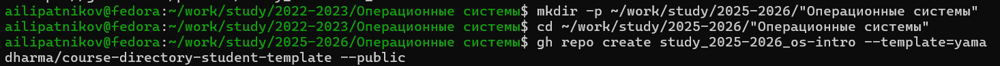

---
## Author
author:
  name: Липатников Андрей
  email: 1032253853@rudn.ru
  affiliation:
    - name: Российский университет дружбы народов
      country: Российская Федерация
      postal-code: 117198
      city: Москва
      address: ул. Миклухо-Маклая, д. 6
## Title
title: Лабораторная работа №2
subtitle: Установка и настройка инструментов для работы с Git
license: CC BY
date: today
date-format: "2026-10-06"
---

# Информация

## Докладчик

:::::::::::::: {.columns align=center}
::: {.column width="70%"}

  * Липатников Андрей
  * Студент Российского университета дружбы народов им. П. Лумумбы
  * [1032253853@rudn.ru](mailto:1032253853@rudn.ru)

:::
::: {.column width="30%"}


:::
::::::::::::::

::: notes
- Поприветствовать аудиторию.
- Кратко представиться: «Выполнил лабораторную работу №2 по настройке Git».
:::

# Вводная часть

## Актуальность

- Системы контроля версий (VCS) — стандарт индустрии для совместной разработки.
- Git — децентрализованная VCS, требующая корректной настройки перед работой.
- Навыки установки и настройки Git обязательны для любого разработчика и исследователя.
- Цель презентации: показать процесс настройки рабочего окружения и подтвердить его работоспособность.

::: notes
- Почему это важно именно сейчас: даже для одиночного проекта Git нужен для истории изменений.
- Время: не более 1 минуты на этот слайд.
:::

## Объект и предмет исследования

- **Объект**: инструменты работы с системами контроля версий (Git, gh, GPG).
- **Предмет**: процесс установки и настройки инструментов в ОС Fedora 41.
- **Конкретная задача**: создание рабочего пространства курса на основе шаблона и обеспечение верифицированных коммитов.

::: notes
- Объект — более широкая область (инструменты VCS).
- Предмет — конкретный аспект (настройка в Fedora).
- Акцент на верификацию (GPG) — это ключевое отличие от базовой настройки.
:::

## Цели и задачи

- **Цель**: приобрести практические навыки установки и настройки инструментов для работы с Git.
- **Задачи**:
    1. Установить git и gh, выполнить базовую настройку.
    2. Создать SSH и GPG ключи, добавить их в GitHub.
    3. Настроить автоматическую подпись коммитов.
    4. Создать рабочее пространство курса и отправить изменения.

::: notes
- Задачи сформулированы конкретно и измеримо (SMART).
- Каждая задача соответствует отдельному слайду с результатом.
:::

# Материалы и методы

## Используемое ПО и среда

- **ОС**: Fedora 41 (Sway) в VirtualBox.
- **Инструменты**:
    - `git` — система контроля версий.
    - `gh` — CLI-интерфейс GitHub.
    - `gpg` — создание и управление криптографическими ключами.
- **Терминал**: kitty, bash.

::: notes
- Подчеркнуть, что работа велась в изолированной среде (VirtualBox) — это важно для воспроизводимости.
:::

## Методика выполнения

- **Установка**: через пакетный менеджер `dnf`.
- **Настройка**: редактирование глобального конфига `~/.gitconfig`.
- **Генерация ключей**: `ssh-keygen` и `gpg --full-generate-key`.
- **Верификация**: проверка подписи коммитов через `git log --show-signature`.

::: notes
- Методика должна быть воспроизводимой: любой студент может повторить эти шаги.
:::

# Результаты и демонстрация

## Установка и базовая настройка

- Установлены пакеты `git` и `gh`.
- Настроены глобальные параметры: имя, email, кодировка, ветка по умолчанию.

{width=60%}

::: notes
- Покажите скриншот установки.
- Обратите внимание на команды `git config --global`.
:::

## Создание ключей

- **SSH-ключи**: RSA (4096 бит) и Ed25519 для аутентификации на GitHub.
- **GPG-ключ**: для подписи коммитов (обеспечение целостности и авторства).

{width=60%}

::: notes
- Объясните разницу: SSH — для доступа к репозиторию, GPG — для подписи коммитов.
- Покажите вывод команды `gpg --list-secret-keys`.
:::

## Настройка подписи коммитов

- Экспорт публичного GPG-ключа и добавление его в настройки GitHub.
- Настройка git на использование ключа по умолчанию.
- Включение автоматической подписи всех коммитов.

```bash
git config --global user.signingkey 82B0275108BEA39D
git config --global commit.gpgsign true
```

::: notes
- Это самый важный технический момент работы.
- Подчеркните, что без этого шага коммиты не будут верифицированы на GitHub.
:::

## Создание рабочего пространства

- Использование `gh repo create` с шаблоном для создания структуры курса.
- Клонирование репозитория и инициализация рабочей директории.
- Выполнение `make prepare` для генерации структуры папок.

{width=60%}

::: notes
- Покажите, как шаблон ускоряет работу: не нужно создавать папки вручную.
:::

## Финальная проверка

- Отправка изменений на GitHub (`git push`).
- Проверка статуса коммитов на GitHub: метка «Verified».
- Проверка истории коммитов с подписями локально.

{width=60%}

::: notes
- Главный результат работы — верифицированный коммит.
- Это доказывает, что все шаги выполнены правильно.
:::

# Заключение

## Главный вывод

- Все задачи лабораторной работы выполнены.
- Рабочее окружение для работы с Git настроено и готово к использованию.
- Настроена верификация коммитов через GPG — это стандарт безопасности в современной разработке.
- Получены практические навыки, применимые в любых проектах.

::: notes
- Повторите главную мысль: «Настроил Git, настроил безопасность (GPG), создал рабочее пространство».
- Будьте готовы ответить на вопросы про GPG и SSH.
:::

## Вопросы?

- Готов ответить на вопросы по настройке Git, GPG-ключей и работе с шаблонами.
- Контакты: 1032253853@rudn.ru

::: notes
- Последний слайд — только для вопросов. Не перегружайте его текстом.
:::
