---
## Author
author:
  name: Липатников Андрей
  email: 1032253853@rudn.ru
  affiliation:
    - name: Российский университет дружбы народов
      country: Российская Федерация
      postal-code: 117198
      city: Москва
      address: ул. Миклухо-Маклая, д. 6

## Title
title: "Лабораторная работа №2"
subtitle: "Установка и настройка инструментов для работы с Git"
license: "CC BY"
abstract: |
  В данном отчёте представлены результаты выполнения лабораторной работы по теме «Установка и настройка инструментов для работы с Git».

  В ходе работы были установлены git и gh, созданы SSH и GPG ключи, настроена подпись коммитов, создано рабочее пространство курса на основе шаблона.

  Сделаны выводы о достижении поставленной цели.
keywords: [лабораторная работа, Git, GPG, SSH, Markdown, Pandoc]
---

# Введение

## Актуальность

Системы контроля версий (VCS) являются основным инструментом для совместной работы над проектами. В данной лабораторной работе осваиваются базовые инструменты: git, gh, GPG-ключи, а также создание рабочего пространства курса на основе шаблона.

## Цель работы

Приобрести практические навыки установки и настройки инструментов для работы с системами контроля версий: git, gh, GPG-ключей, а также создания рабочего пространства курса на основе шаблона.

## Задачи

1. Установить git и gh.
2. Выполнить базовую настройку git.
3. Создать SSH-ключи (RSA и Ed25519).
4. Создать GPG-ключ и добавить его в GitHub.
5. Настроить автоматическую подпись коммитов.
6. Авторизоваться в gh.
7. Создать рабочее пространство курса на основе шаблона.
8. Создать структуру каталогов курса и отправить изменения на GitHub.

## Объект и предмет исследования

Объект — инструменты работы с системами контроля версий.
Предмет — процесс установки и настройки git, gh, GPG-ключей.

## Методы исследования

Практическая работа в терминале, установка ПО через dnf, настройка конфигураций, создание ключей, проверка работы через git и gh.

## Схема выполнения работы

На рис. -@fig-flowchart представлена общая последовательность действий при выполнении работы.

::: {#fig-flowchart}

```{mermaid}
%%| fig-width: 100%
graph TD
    A@{ shape: circle, label: "Начало" } --> B[Установить git и gh]
    B --> C[Настроить git]
    C --> D[Создать SSH и GPG ключи]
    D --> E[Добавить GPG в GitHub]
    E --> F[Настроить подпись коммитов]
    F --> G[Авторизоваться в gh]
    G --> H[Создать репозиторий из шаблона]
    H --> I[Создать структуру курса]
    I --> J[Отправить на GitHub]
    J --> K@{ shape: dbl-circ, label: "Конец" }
```

Блок-схема выполнения лабораторной работы

:::

# Теоретическая часть

Git — распределённая система контроля версий. Основные понятия:

- Репозиторий — хранилище файлов и истории изменений.
- Commit — фиксация изменений в репозитории.
- Ветка (branch) — отдельная линия разработки.
- Удалённый репозиторий — копия репозитория на сервере (например, GitHub).

В табл. -@tbl-git-cmds приведены основные команды Git.

| Команда        | Назначение                            |
|----------------|---------------------------------------|
| `git init`     | Инициализация репозитория             |
| `git clone`    | Клонирование репозитория              |
| `git add`      | Добавление файлов в индекс            |
| `git commit`   | Фиксация изменений                    |
| `git push`     | Отправка изменений на сервер          |
| `git pull`     | Получение изменений с сервера         |
| `git branch`   | Управление ветками                    |
| `git merge`    | Слияние веток                         |
| `git log`      | Просмотр истории                      |

: Основные команды Git {#tbl-git-cmds}

Более подробно про Git и системы контроля версий см. в [@tanenbaum_book_modern_os_ru; @robbins_book_bash_en].

# Материалы и методы

- ОС: Fedora 41 (Sway);
- виртуальная машина: VirtualBox;
- инструменты: git, gh, gpg, pandoc, quarto;
- терминал: kitty, bash.

# Выполнение лабораторной работы

## Установка git

Устанавливаю git (рис. -@fig-001).

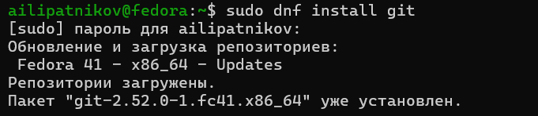{#fig-001 width=70%}

## Установка gh

Устанавливаю gh (рис. -@fig-002).

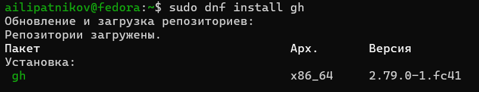{#fig-002 width=70%}

## Базовая настройка git

Произвожу базовую настройку git (рис. -@fig-003).

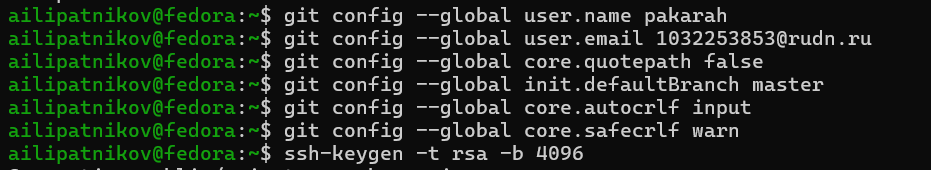{#fig-003 width=70%}

## Создание SSH-ключей

Создаю SSH-ключи (рис. -@fig-004).

{#fig-004 width=70%}

## Создание GPG-ключа

Создаю GPG-ключ (рис. -@fig-005).

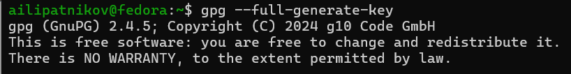{#fig-005 width=70%}

Просматриваю список ключей (рис. -@fig-006).

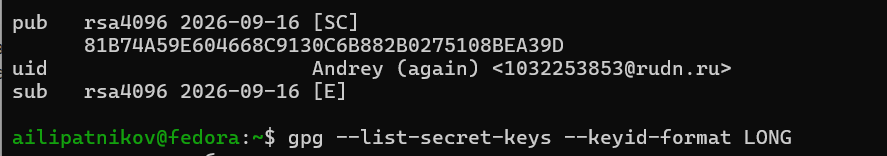{#fig-006 width=70%}

## Экспорт GPG-ключа

Экспортирую GPG-ключ для добавления на GitHub (рис. -@fig-007).

{#fig-007 width=70%}

## Настройка автоматической подписи коммитов

Настраиваю автоматическую подпись коммитов (рис. -@fig-008).

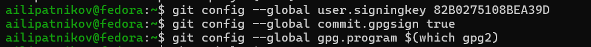{#fig-008 width=70%}

## Авторизация в gh

Авторизуюсь на GitHub для работы через терминал (рис. -@fig-009).

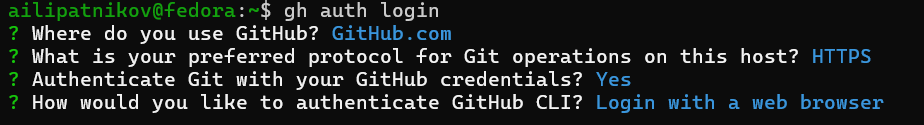{#fig-009 width=70%}

## Создание директории курса

Создаю директорию курса по шаблону (рис. -@fig-010) и клонирую репозиторий (рис. -@fig-011).

{#fig-010 width=70%}

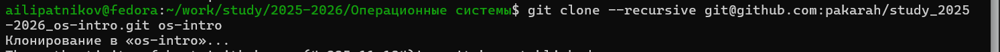{#fig-011 width=70%}

## Настройка рабочей директории

Настраиваю рабочую директорию (рис. -@fig-012) и просматриваю структуру каталогов (рис. -@fig-013).

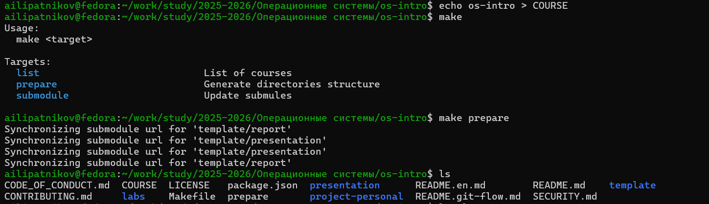{#fig-012 width=70%}

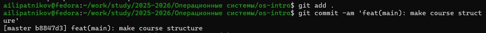{#fig-013 width=70%}

## Отправка изменений на GitHub

Отправляю изменения на GitHub (рис. -@fig-014).

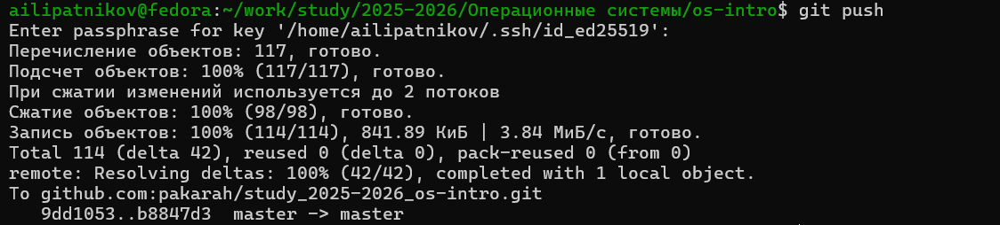{#fig-014 width=70%}

# Результаты

В ходе работы были выполнены все задачи:

- установлены git и gh;
- выполнена базовая настройка git;
- созданы SSH-ключи (RSA и Ed25519);
- создан GPG-ключ и добавлен в GitHub;
- настроена автоматическая подпись коммитов;
- выполнена авторизация в gh;
- создано рабочее пространство курса на основе шаблона;
- структура курса отправлена на GitHub.

# Обсуждение результатов

Все шаги выполнены в соответствии с методическими указаниями. Инструменты git, gh и GPG успешно настроены. Рабочее пространство курса создано и синхронизировано с GitHub. Ошибок при выполнении не возникло.

# Заключение

Цель работы достигнута. Освоены базовые инструменты работы с Git: git, gh, GPG-ключи. Настроена автоматическая подпись коммитов. Создано рабочее пространство курса на основе шаблона и отправлено на GitHub.

# Ответы на контрольные вопросы {.unnumbered}

## 1. Что такое системы контроля версий (VCS) и для решения каких задач они предназначаются?

VCS — это программные инструменты, которые позволяют отслеживать изменения в файлах и управлять ими. Они предназначены для:

- хранения истории изменений;
- совместной работы над проектом;
- отката к предыдущим версиям;
- ветвления и слияния изменений.

## 2. Объясните понятия VCS и их отношения: хранилище, commit, история, рабочая копия.

- Хранилище (repository) — место, где хранятся все версии файлов и история изменений.
- Commit — фиксация изменений в хранилище с комментарием.
- История — последовательность всех коммитов.
- Рабочая копия — текущее состояние файлов на диске, с которыми работает пользователь.

## 3. Что представляют собой и чем отличаются централизованные и децентрализованные VCS?

- Централизованные (SVN, CVS): одно центральное хранилище, все изменения идут через него.
- Децентрализованные (Git, Mercurial): у каждого пользователя есть полная копия хранилища, изменения можно синхронизировать между ними.

## 4. Опишите действия с VCS при единоличной работе с хранилищем.

1. Инициализация репозитория (`git init`).
2. Добавление файлов (`git add`).
3. Коммит (`git commit`).
4. Просмотр истории (`git log`).
5. Ветвление и слияние (`git branch`, `git merge`).

## 5. Опишите порядок работы с общим хранилищем VCS.

1. Клонирование (`git clone`).
2. Создание ветки (`git checkout -b`).
3. Внесение изменений и коммит.
4. Пуш в удалённый репозиторий (`git push`).
5. Создание pull request.
6. Слияние изменений.

## 6. Каковы основные задачи, решаемые инструментальным средством git?

- Отслеживание изменений.
- Совместная работа.
- Ветвление и слияние.
- Откат изменений.
- Хранение истории.

## 7. Назовите и дайте краткую характеристику командам git.

| Команда        | Назначение                   |
|----------------|------------------------------|
| `git init`     | Инициализация репозитория    |
| `git clone`    | Клонирование репозитория     |
| `git add`      | Добавление файлов в индекс   |
| `git commit`   | Фиксация изменений           |
| `git push`     | Отправка изменений на сервер |
| `git pull`     | Получение изменений с сервера|
| `git branch`   | Управление ветками           |
| `git merge`    | Слияние веток                |
| `git log`      | Просмотр истории             |

## 8. Приведите примеры использования при работе с локальным и удалённым репозиториями.

Работа с локальным репозиторием:

```bash
git init
git add .
git commit -m "Initial commit"
```

Работа с удалённым репозиторием:

```bash
git clone https://github.com/user/repo.git
git push origin master
git pull origin master
```

# Список литературы {.unnumbered}

::: {#refs}
:::

\appendix

# Что выносится в приложения {.appendix}

Листинг команд, выполненных в ходе лабораторной работы:

```bash
sudo dnf install git
sudo dnf install gh
git config --global user.name "Липатников Андрей"
git config --global user.email "1032253853@rudn.ru"
git config --global core.quotepath false
git config --global init.defaultBranch master
git config --global core.autocrlf input
git config --global core.safecrlf warn
ssh-keygen -t rsa -b 4096
ssh-keygen -t ed25519
gpg --full-generate-key
gpg --list-secret-keys --keyid-format LONG
gpg --armor --export 82B0275108BEA39D | xclip -sel clip
git config --global user.signingkey 82B0275108BEA39D
git config --global commit.gpgsign true
git config --global gpg.program 
