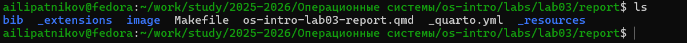
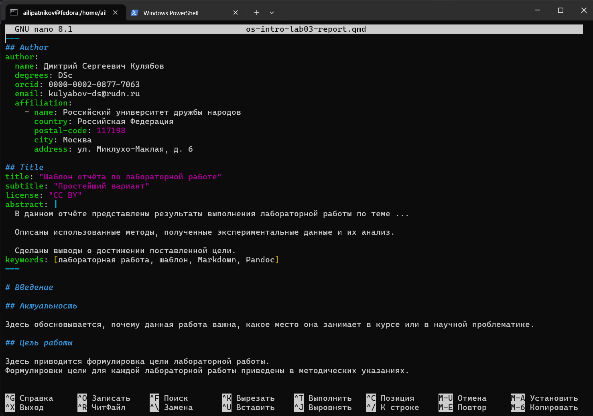
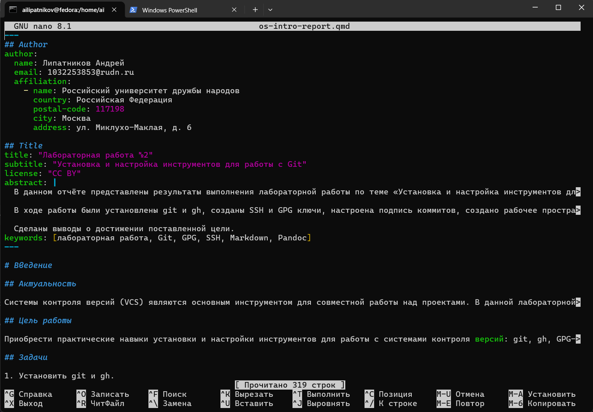
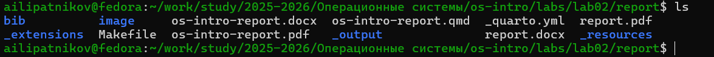
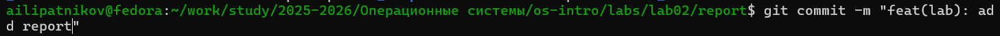

---
## Author
author:
  name: Липатников Андрей
  email: 1032253853@rudn.ru
  affiliation:
    - name: Российский университет дружбы народов
      country: Российская Федерация
      postal-code: 117198
      city: Москва
      address: ул. Миклухо-Маклая, д. 6
## Title
title: Лабораторная работа №3
subtitle: Markdown
license: CC BY
date: today
date-format: "2026-10-07"
---

# Информация

## Докладчик

:::::::::::::: {.columns align=center}
::: {.column width="70%"}

  * Липатников Андрей
  * Студент Российского университета дружбы народов им. П. Лумумбы
  * [1032253853@rudn.ru](mailto:1032253853@rudn.ru)

:::
::: {.column width="30%"}

:::
::::::::::::::

::: notes
- Поприветствовать аудиторию.
- Кратко представиться: «Выполнил лабораторную работу №3 по оформлению отчётов в Markdown».
:::

# Вводная часть

## Актуальность

- Markdown --- стандарт де-факто для технической документации
- Исходник читается без специального ПО и хранится в git
- Один исходник --- три формата: pdf, docx, md
- Все последующие отчёты курса готовятся именно в Markdown

::: notes
- Подчеркнуть: навык нужен для всего курса, а не для одной работы.
- Время: не более 1 минуты на этот слайд.
:::

## Объект и предмет исследования

- **Объект**: процесс подготовки отчётных документов в формате Markdown
- **Предмет**: оформление отчёта по лабораторной работе №2 на основе предоставленного шаблона Quarto
- **Критерий результата**: отчёт, собранный в форматы pdf, docx и md, загруженный в репозиторий GitHub

::: notes
- Объект --- более широкая область (документация в Markdown).
- Предмет --- конкретный аспект (отчёт по лабе №2 через шаблон Quarto).
- Акцент: не новый файл с нуля, а работа по предоставленному шаблону.
:::

## Цели и задачи

- Цель:
    - Научиться оформлять отчёты с помощью легковесного языка разметки Markdown.
- Задачи:
    - Подготовить отчёт по лабораторной работе №2 на основе предоставленного шаблона qmd.
    - Собрать отчёт в форматы pdf, docx и md и перенести файлы из `_output`.
    - Зафиксировать и загрузить изменения в репозиторий GitHub (add, commit, push).

::: notes
- Задач ровно три --- по шаблону.
- Каждая задача соответствует блоку слайдов с результатами.
:::

# Материалы и методы

## Используемое ПО и среда

- **Среда**: Fedora 41 (Sway) в VirtualBox (настроена в лабораторной работе №1)
- **Инструменты**:
    - Quarto --- система сборки документации
    - Pandoc --- конвертация Markdown в целевые форматы
    - Git и GitHub --- хранение и публикация
- **Исходные материалы**: шаблон отчёта qmd, проектный конфигурационный файл

::: notes
- Окружение подготовлено в первой лабораторной --- здесь оно уже используется.
- Новый Markdown-файл не создавался: работаем по предоставленному шаблону.
:::

## Методика выполнения

- Заполнение шаблона qmd содержанием отчёта по лабораторной работе №2
- Сборка отчёта командой рендера Quarto
- Перенос собранных файлов из выходного каталога `_output`
- Публикация через git: add, commit, push

::: notes
- Методика воспроизводима: сборка одной командой, публикация --- тремя командами git.
- Каждый шаг документирован скриншотом.
:::

# Содержание исследования

## Исходное состояние и шаблон отчёта

- Папка report изначально содержит шаблонные файлы и каталог `image`
- Предоставленный шаблон qmd соответствует структуре ГОСТ 7.32-2001

:::::::::::::: {.columns}
::: {.column width="48%"}

:::
::: {.column width="48%"}

:::
::::::::::::::

::: notes
- Слева --- исходное состояние папки отчёта.
- Справа --- предоставленный шаблон: YAML-блок метаданных и структура разделов.
:::

## Заполнение отчёта по шаблону

- В шаблон внесено содержание отчёта по лабораторной работе №2 (Git)
- Установка git и gh, SSH- и GPG-ключи, подпись коммитов, рабочее пространство

::: notes
- Отчёт по предыдущей лабораторной --- и есть предмет работы №3.
- Каждый шаг отчёта сопровождается скриншотами и ссылками на них.
:::

## Скрипт сборки

- Проектный конфигурационный файл задаёт форматы вывода, стили и параметры конвертации

::: notes
- Конфигурация отделяет оформление от содержания.
- Один раз настроено --- все отчёты курса собираются одинаково.
:::

## Сборка и перенос файлов

- Отчёт собран командой рендера
- Файлы из `_output` перенесены в рабочий каталог

:::::::::::::: {.columns}
::: {.column width="48%"}

:::
::: {.column width="48%"}

:::
::::::::::::::

::: notes
- Ключевое преимущество: правки вносятся в один исходник, форматы пересобираются одной командой.
- Перенос из _output --- это шаг разделения исходников и результатов сборки.
:::

## Публикация в репозиторий

- Изменения добавлены в индекс, зафиксированы и отправлены на GitHub

:::::::::::::: {.columns}
::: {.column width="32%"}

:::
::: {.column width="32%"}

:::
::: {.column width="32%"}

:::
::::::::::::::

::: notes
- git add --- в индекс; git commit --- фиксация с поясняющим сообщением; git push --- публикация.
- Классический цикл работы с системой контроля версий.
:::

# Результаты

## Полученные результаты

- Отчёт по лабораторной работе №2 подготовлен и собран в три формата

| Формат | Файл |
|--------|------|
| Markdown | `report.md` |
| PDF | `report.pdf` |
| DOCX | `report.docx` |

- Изменения загружены в репозиторий GitHub

::: notes
- Кратко прокомментировать таблицу: один исходник --- три целевых формата.
- Архив отчёта содержит также скриншоты и Makefile, как требует задание.
:::

# Заключение

## Главный вывод

Освоен автоматизированный цикл подготовки отчётов: один исходник в Markdown --- сборка в pdf, docx и md одной командой --- публикация через git. Навык применим ко всем последующим отчётам курса.

::: notes
- Финальный аккорд: автоматизация освобождает время для содержания.
- После фразы сделать паузу 3--5 секунд, затем устно: «Я готов ответить на ваши вопросы».
- Будьте готовы к вопросам про Pandoc, Makefile, разницу md и qmd.
:::
