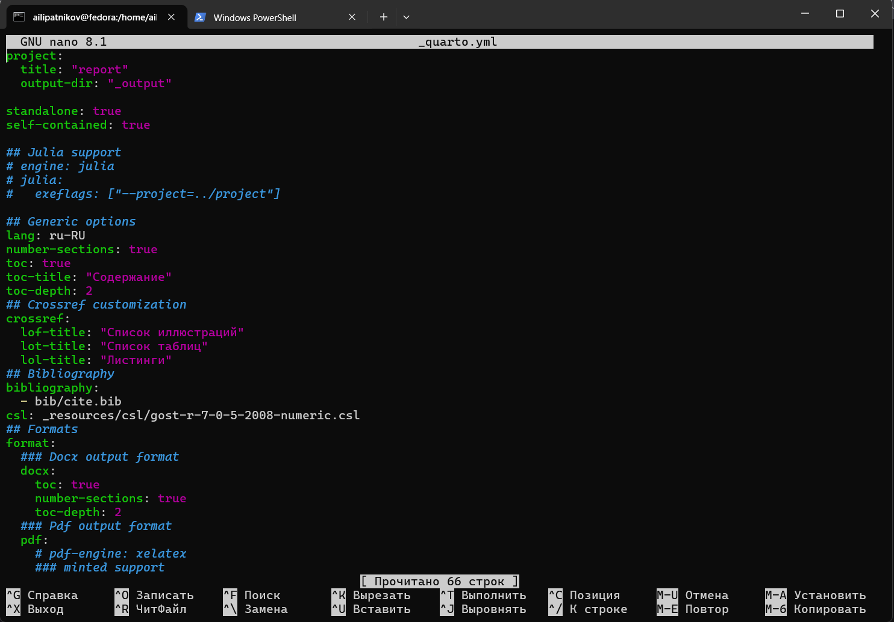
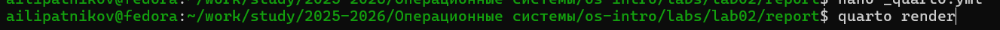

---
## Author
author:
  name: Липатников Андрей
  email: 1032253853@rudn.ru
  affiliation:
    - name: Российский университет дружбы народов
      country: Российская Федерация
      postal-code: 117198
      city: Москва
      address: ул. Миклухо-Маклая, д. 6

## Title
title: "Лабораторная работа №3"
subtitle: "Markdown"
license: "CC BY"
abstract: |
  В данном отчёте представлены результаты выполнения лабораторной работы по теме «Markdown».

  В ходе работы подготовлен отчёт по лабораторной работе №2 (установка и настройка инструментов для работы с Git) на основе предоставленного шаблона Quarto, выполнена сборка отчёта в форматы pdf, docx и md, результаты перенесены в рабочий каталог и загружены в репозиторий GitHub.

  Сделаны выводы о достижении поставленной цели.
keywords: [лабораторная работа, Markdown, Pandoc, Quarto, отчёт]
date: today
date-format: "2026-10-07"
---

# Введение

## Актуальность

Markdown --- легковесный язык разметки, ставший стандартом де-факто для технической документации: он хранится как обычный текст, читается без специального ПО, легко проверяется системой контроля версий и конвертируется в готовые документы (pdf, docx, html) автоматизированными средствами. Для курса «Операционные системы» умение оформлять отчёты в Markdown критично: все последующие отчёты готовятся именно так, а исходники хранятся в git-репозитории и собираются воспроизводимо, одной командой.

## Цель работы

Научиться оформлять отчёты с помощью легковесного языка разметки Markdown.

## Задачи

Формулировка задания: сделать отчёт по предыдущей лабораторной работе в формате Markdown; предоставить отчёт в трёх форматах --- pdf, docx и md (в архиве, поскольку он должен содержать скриншоты, Makefile и т.д.).

Для достижения цели необходимо выполнить следующие шаги:

1. Подготовить отчёт по лабораторной работе №2 (установка и настройка инструментов для работы с Git) на основе предоставленного шаблона qmd.
2. Выполнить сборку отчёта в форматы pdf, docx и md.
3. Перенести собранные файлы из выходного каталога `_output` в рабочий каталог отчёта.
4. Зафиксировать изменения и загрузить их в репозиторий GitHub (git add, git commit, git push).

## Объект и предмет исследования

- **Объект исследования:** процесс подготовки отчётных документов в формате Markdown.
- **Предмет исследования:** оформление отчёта по лабораторной работе №2 на основе предоставленного шаблона Quarto и автоматизация его сборки.

## Методы исследования

В работе использованы следующие методы:

- изучение методических указаний к лабораторной работе №3;
- работа с предоставленным шаблоном отчёта (файл `qmd`);
- конвертация документа средствами Pandoc/Quarto;
- работа с системой контроля версий Git (фиксация и публикация изменений).

## Схема выполнения работы

На рис. -@fig-flowchart представлена общая последовательность действий при выполнении работы.


::: {#fig-flowchart}

```{mermaid}
%%| fig-width: 100%
graph TD
    A@{ shape: circle, label: "Начало" } --> B[Выполнить действие]
    B --> C[Описать, что конкретно сделано]
    C --> D[Подтвердить скриншотом]
    D --> E[Занести в отчёт]
    E --> F[Поместить в git-репозиторий]
    F --> G[Сделать релиз git]
    G --> J@{ shape: dbl-circ, label: "Конец" }
```

Блок-схема выполнения лабораторной работы

:::

# Теоретическая часть

Markdown --- легковесный язык разметки: исходный файл остаётся обычным текстом, а оформление задаётся простыми символами. Заголовки задаются знаком `#` (количество знаков --- уровень заголовка), полужирное начертание --- двойными звёздочками (`**текст**`), курсивное --- одинарными (`*текст*`), блоки цитирования --- символом `>`, списки --- дефисами или цифрами, ссылки --- конструкцией `[текст](url)`, фрагменты кода --- ограждёнными блоками с указанием языка. Встроенные и выключные формулы записываются синтаксисом LaTeX, а перекрёстные ссылки на формулы, рисунки и таблицы оформляются метками вида `{#fig:...}`, `{#tbl:...}`, `{#eq:...}` со ссылками `[-@fig:...]` в тексте.

Основные элементы разметки приведены в табл. -@tbl-markdown-syntax.

| Элемент | Синтаксис | Результат |
|---------|-----------|-----------|
| Заголовок | `# Заголовок` | заголовок уровня 1 |
| Полужирный текст | `**текст**` | полужирное начертание |
| Курсив | `*текст*` | курсивное начертание |
| Маркированный список | `- элемент` | список |
| Нумерованный список | `1. элемент` | упорядоченный список |
| Ссылка | `[текст](url)` | гиперссылка |
| Блок кода | ```` ``` ```` | ограждённый блок кода |

: Основные элементы разметки Markdown {#tbl-markdown-syntax}

Обработка файлов Markdown выполняется процессором Pandoc: он конвертирует документ в целевые форматы, например `pandoc README.md -o README.pdf` или `pandoc README.md -o README.docx`. Для перекрёстных ссылок используется фильтр `pandoc-crossref`, для обработки библиографии --- `pandoc-citeproc`. Автоматизация сборки оформляется в `Makefile`, который одной командой пересобирает все целевые форматы. Quarto развивает этот подход: единая конфигурация проекта задаёт форматы вывода, стили и локализацию, а сборка выполняется командой `quarto render` или через `make`.

Согласно ГОСТ 7.32-2001, научно-исследовательская работа должна содержать титульный лист, реферат, введение, основную часть и заключение; рекомендуется также включать содержание, список использованных источников и приложения. Структура предоставленного шаблона отчёта соответствует этим требованиям.

# Материалы и методы

- **Среда выполнения:** Fedora 41 (Sway) на виртуальной машине VirtualBox (настроена в лабораторной работе №1).
- **Инструменты:** Quarto (сборка отчёта), Pandoc (конвертация), Git и GitHub (хранение и публикация), текстовый редактор, терминал.
- **Исходные материалы:** предоставленный шаблон отчёта `qmd`, проектный конфигурационный файл со скриптом сборки, методические указания к лабораторной работе №3.

Новый Markdown-файл не создавался: в качестве основы взят предоставленный шаблон `qmd`, в который внесены содержание отчёта по лабораторной работе №2.

# Выполнение лабораторной работы

## Исходное состояние папки report

Рабочий каталог отчёта изначально содержит шаблонные файлы и каталог `image` для скриншотов (рис. -@fig-report-dir).

{#fig-report-dir width=70%}

## Изучение предоставленного шаблона qmd

Открыт предоставленный файл шаблона отчёта. Шаблон содержит YAML-блок метаданных (автор, название, реферат, ключевые слова) и структуру разделов в соответствии с ГОСТ 7.32-2001 (рис. -@fig-template).

{#fig-template width=70%}

## Заполнение отчёта по шаблону

В шаблон внесено содержание отчёта по лабораторной работе №2 (установка и настройка инструментов для работы с Git): описаны установка `git` и `gh`, создание SSH- и GPG-ключей, настройка автоматической подписи коммитов и создание рабочего пространства курса. Каждый шаг сопровождается скриншотами (рис. -@fig-report-filled).

{#fig-report-filled width=70%}

## Скрипт сборки

Сборка отчёта автоматизирована: проектный конфигурационный файл задаёт форматы вывода, стили и параметры конвертации (рис. -@fig-quarto-script).

{#fig-quarto-script width=70%}

## Сборка отчёта

Сборка выполнена командой рендера:

```bash
quarto render
```

После сборки в выходном каталоге `_output` появились файлы отчёта в целевых форматах (рис. -@fig-render).

{#fig-render width=70%}

## Перенос файлов из _output

Собранные файлы перенесены из каталога `_output` в рабочий каталог отчёта (рис. -@fig-output).

{#fig-output width=70%}

## Добавление изменений в индекс

Изменения добавлены в индекс репозитория (рис. -@fig-git-add):

```bash
git add .
```

{#fig-git-add width=70%}

## Фиксация изменений

Изменения зафиксированы коммитом с поясняющим сообщением (рис. -@fig-git-commit):

```bash
git commit -m "Лабораторная работа №3: отчёт по лабораторной работе №2 в формате Markdown"
```

{#fig-git-commit width=70%}

## Отправка в репозиторий

Изменения отправлены на GitHub (рис. -@fig-git-push):

```bash
git push
```

{#fig-git-push width=70%}

# Результаты

В ходе работы получены следующие результаты:

- подготовлен отчёт по лабораторной работе №2 на основе предоставленного шаблона qmd;
- отчёт собран в три формата (табл. -@tbl-formats);
- собранные файлы перенесены в рабочий каталог и упакованы в архив вместе со скриншотами и Makefile;
- изменения загружены в репозиторий GitHub.

| Формат | Файл |
|--------|------|
| Markdown | `os-intro-lab02-report.qmd` |
| PDF | `os-intro-lab02-report.pdf` |
| DOCX | `os-intro-lab02-report.docx` |

: Полученные форматы отчёта {#tbl-formats}

# Обсуждение результатов

Процесс подготовки отчёта соответствует заданию: отчёт по предыдущей лабораторной работе оформлен в Markdown на базе предоставленного шаблона и собран во все требуемые форматы. Разделение исходника (Markdown) и результата сборки (pdf, docx) показало ключевое преимущество подхода: правки вносятся один раз в исходный файл, а все форматы пересобираются одной командой. Хранение исходников в git-репозитории обеспечивает прослеживаемость истории изменений. Замеченных отклонений от методических указаний не зафиксировано.

# Заключение

- Цель работы достигнута: освоено оформление отчётов с помощью легковесного языка разметки Markdown.
- Подготовлен отчёт по лабораторной работе №2 на основе предоставленного шаблона qmd, собранный в форматы pdf, docx и md.
- Освоен автоматизированный цикл публикации: сборка, перенос файлов из `_output`, git add, git commit, git push.
- Полученные навыки применимы ко всем последующим отчётам курса.

# Список литературы {.unnumbered}

::: {#refs}
:::

\appendix

# Что выносится в приложения {.appendix}

При необходимости сюда выносятся:

- листинги программ;
- большие таблицы с исходными данными;
- промежуточные выкладки;
- акты внедрения и т.п.

Каждое приложение начинается с новой страницы и имеет заголовок (например, «Приложение А. Листинг программы»).
