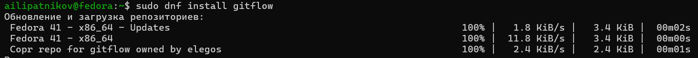
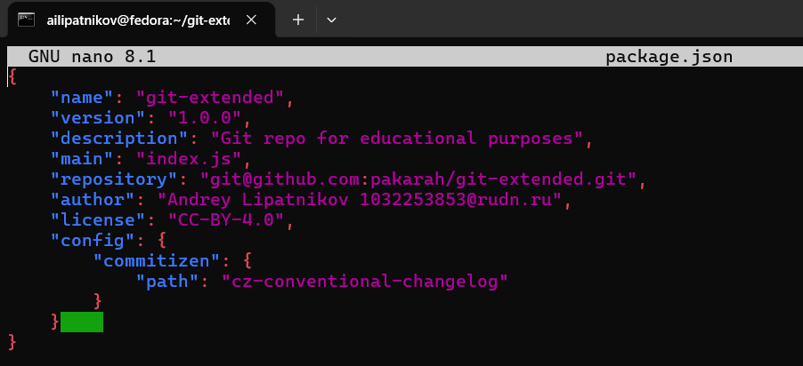
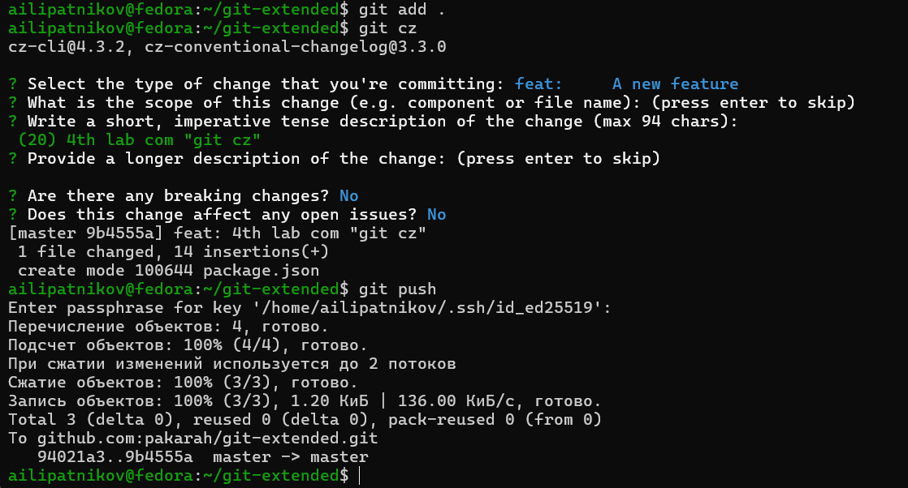
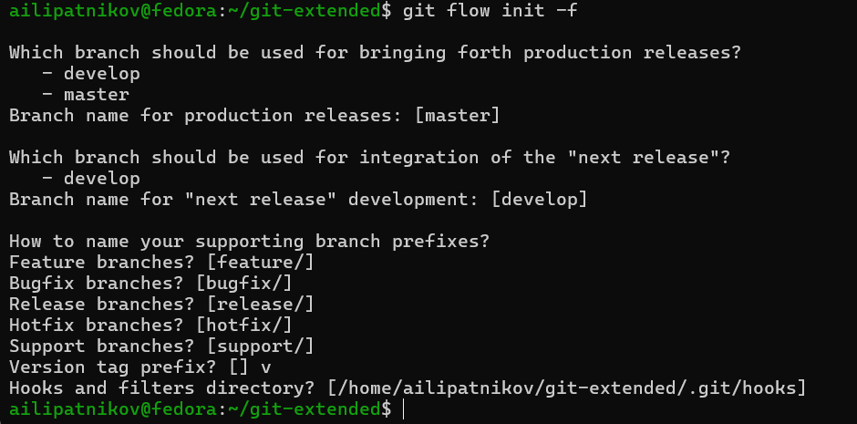
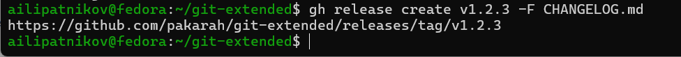

---
## Author
author:
  name: Липатников Андрей
  email: 1032253853@rudn.ru
  affiliation:
    - name: Российский университет дружбы народов
      country: Российская Федерация
      postal-code: 117198
      city: Москва
      address: ул. Миклухо-Маклая, д. 6
## Title
title: "Лабораторная работа №4"
subtitle: "Работа с репозиториями git: Gitflow и общепринятые коммиты"
license: "CC BY"
date: today
date-format: "2026-10-07"
---

# Информация

## Докладчик

:::::::::::::: {.columns align=center}
::: {.column width="70%"}

  * Липатников Андрей
  * Студент Российского университета дружбы народов им. П. Лумумбы
  * [1032253853@rudn.ru](mailto:1032253853@rudn.ru)

:::
::: {.column width="30%"}

:::
::::::::::::::

::: notes
- Поприветствовать аудиторию.
- Кратко представиться: «Выполнил лабораторную работу №4 по работе с репозиториями git».
:::

# Вводная часть

## Актуальность

- Современная разработка ведётся командами: релизы и новая функциональность идут параллельно
- Без строгой модели ветвления история проекта превращается в запутанный набор коммитов
- Gitflow упорядочивает процесс, а Conventional Commits и SemVer автоматизируют версионирование
- Весь практикум курса сдаётся через git-репозиторий

::: notes
- Подчеркнуть: навык нужен не для одной работы, а для всей отчётности курса.
- Время: не более 1 минуты на этот слайд.
:::

## Объект и предмет исследования

- **Объект**: процессы управления версиями и организации рабочего процесса в git
- **Предмет**: применение Gitflow, общепринятых коммитов и семантического версионирования в тестовом репозитории git-extended
- **Критерий результата**: опубликованные релизы v1.0.0 и v1.2.3 с журналом изменений

::: notes
- Объект --- более широкая область (управление версиями в git).
- Предмет --- конкретный аспект (Gitflow + Conventional Commits на тестовом репозитории).
:::

## Цели и задачи

- Цель:
    - Получить навыки правильной работы с репозиториями git.
- Задачи:
    - Установить ПО: git-flow, Node.js, pnpm, commitizen, standard-changelog.
    - Создать тестовый репозиторий git-extended и настроить общепринятые коммиты.
    - Развернуть git-flow и сформировать релизы 1.0.0 и 1.2.3 с журналом изменений.

::: notes
- Задач ровно три --- по шаблону.
- Каждая задача соответствует блоку слайдов с результатами.
:::

# Материалы и методы

## Используемое ПО и среда

- **Среда**: Fedora 41 (Sway) в VirtualBox (окружение из лабораторной работы №1)
- **Инструменты**:
    - `git-flow` --- модель ветвления в виде команд
    - `pnpm`, `commitizen`, `standard-changelog` --- общепринятые коммиты и changelog
    - `gh` --- публикация релизов на GitHub
- **Тестовый репозиторий**: git-extended на GitHub

::: notes
- git-flow установлен из репозитория Copr: в официальных репозиториях Fedora его нет.
- commitizen устанавливает скрипт git-cz --- им и формируем коммиты.
:::

## Методика выполнения

- Установка и настройка инструментов
- Создание репозитория и конфигурация формата коммитов
- Инициализация git-flow (префикс тегов `v`)
- Полный цикл релизов 1.0.0 и 1.2.3: ветка release, журнал изменений, публикация
- Цикл работы с функциональной веткой

::: notes
- Каждый шаг фиксируется скриншотом и заносится в отчёт.
- Команда git branch после init показывает ветку develop --- проверка корректности.
:::

# Содержание исследования

## Установка инструментов

- git-flow установлен из Copr, Node.js и pnpm --- из репозиториев Fedora
- Настройка окружения: `pnpm setup`, обновление PATH
- commitizen и standard-changelog установлены глобально

:::::::::::::: {.columns}
::: {.column width="48%"}

:::
::: {.column width="48%"}

:::
::::::::::::::

::: notes
- DKMS-подобная логика здесь не нужна, но сборка модулей --- не часть этой работы.
- PATH после pnpm setup указывает на исполняемые файлы, установленные yarn/pnpm.
:::

## Репозиторий и конфигурация коммитов

- Создан репозиторий git-extended на GitHub, выполнен первый коммит и push
- `pnpm init`, лицензия CC-BY-4.0, настройка commitizen в `package.json`
- Коммиты формируются через `git cz` в формате Conventional Commits

:::::::::::::: {.columns}
::: {.column width="48%"}

:::
::: {.column width="48%"}

:::
::::::::::::::

::: notes
- В package.json блок config.commitizen указывает формат cz-conventional-changelog.
- git cz --- интерактивный мастер: тип, область, описание изменения.
:::

## Инициализация git-flow

- Выполнен `git flow init`, префикс ярлыков установлен в `v`
- Проверена ветка: после инициализации работа идёт в `develop`
- Репозиторий отправлен на GitHub, develop привязана к origin

:::::::::::::: {.columns}
::: {.column width="48%"}

:::
::: {.column width="48%"}

:::
::::::::::::::

::: notes
- Две основные ветви: master --- официальная история релизов, develop --- объединение функций.
- Version tag prefix = v: теги получают вид v1.0.0, v1.2.3.
:::

## Релиз 1.0.0

- `git flow release start 1.0.0` --- создана релизная ветка
- Журнал изменений: `standard-changelog --first-release`
- Слияние с master, публикация веток и тегов

:::::::::::::: {.columns}
::: {.column width="48%"}

:::
::: {.column width="48%"}

:::
::::::::::::::

::: notes
- В ветке release --- только отладка и документация, новые функции запрещены.
- Релиз на GitHub создан командой gh release create v1.0.0 -F CHANGELOG.md.
:::

## Функциональная ветка и релиз 1.2.3

- Цикл: `git flow feature start` ... `git flow feature finish` --- ветка слита с develop
- Релиз 1.2.3: версия обновлена в `package.json`, changelog сгенерирован заново
- Релиз v1.2.3 опубликован на GitHub

:::::::::::::: {.columns}
::: {.column width="48%"}

:::
::: {.column width="48%"}

:::
::::::::::::::

::: notes
- feature всегда создаётся от develop, не от master --- это суть модели.
- Второй релиз показал повторяемость цикла: те же команды, новая версия.
:::

# Результаты

## Полученные результаты

- Репозиторий git-extended преобразован в git-flow с общепринятыми коммитами

| Результат | Значение |
|-----------|----------|
| Ветки | `master`, `develop`, `feature`, `release` |
| Префикс тегов | `v` |
| Формат коммитов | Conventional Commits (`git cz`) |
| Публикации | релизы `v1.0.0` и `v1.2.3` с `CHANGELOG.md` |

::: notes
- Таблица из четырёх строк --- в пределах правила шаблона (не более 5 строк).
- Связка типов коммитов и версий: fix --- PATCH, feat --- MINOR, BREAKING CHANGE --- MAJOR.
:::

# Заключение

## Главный вывод

Освоен производственный цикл работы с git: строгая модель ветвления Gitflow, стандартизованные коммиты через commitizen и автоматизированные релизы с журналом изменений --- теперь выпуски курса оформляются и публикуются единообразно одной последовательностью команд.

::: notes
- Финальный аккорд: повторяемость релизного цикла --- главный практический выигрыш.
- После фразы сделать паузу 3--5 секунд, затем устно: «Я готов ответить на ваши вопросы».
- Будьте готовы к вопросам про различие веток feature/release/hotfix и о связи типов коммитов с SemVer.
:::
