---
## Author
author:
  name: Липатников Андрей
  email: 1032253853@rudn.ru
  affiliation:
    - name: Российский университет дружбы народов
      country: Российская Федерация
      postal-code: 117198
      city: Москва
      address: ул. Миклухо-Маклая, д. 6

## Title
title: "Лабораторная работа №4"
subtitle: "Работа с репозиториями git: Gitflow и общепринятые коммиты"
license: "CC BY"
abstract: |
  В данном отчёте представлены результаты выполнения лабораторной работы по теме «Работа с репозиториями git».

  В ходе работы установлен пакет git-flow и инструменты для семантического версионирования на базе Node.js, выполнен практический сценарий работы с тестовым репозиторием: создание репозитория, инициализация git-flow, формирование релизов 1.0.0 и 1.2.3 с журналом изменений и публикацией релизов на GitHub.

  Сделаны выводы о достижении поставленной цели.
keywords: [лабораторная работа, git, git-flow, Conventional Commits, семантическое версионирование]
date: today
date-format: "2026-10-07" # Example: 2025-09-06
---

# Введение

## Актуальность

Современная разработка программного обеспечения ведётся командами, где одновременно идут доработка текущего выпуска и подготовка следующего. Без строгой модели ветвления история проекта превращается в запутанный набор коммитов, а выпуски теряют воспроизводимость. Модель Gitflow упорядочивает этот процесс раздельными ветками для функций, релизов и исправлений, а общепринятые коммиты (Conventional Commits) в связке с семантическим версионированием позволяют автоматически вести журнал изменений и присваивать версии. Для курса «Операционные системы» эти навыки обязательны: весь практикум сдаётся через git-репозиторий, и правильная структура веток с подписанными релизами — часть отчётности.

## Цель работы

Получение навыков правильной работы с репозиториями git.

## Задачи

1. Установить программное обеспечение: git-flow, Node.js, pnpm, commitizen, standard-changelog.
2. Выполнить работу для тестового репозитория: создать репозиторий git-extended и подключить его к GitHub.
3. Преобразовать рабочий репозиторий в репозиторий с git-flow и общепринятыми коммитами: инициализировать git-flow, настроить формат коммитов через commitizen, сформировать релизы 1.0.0 и 1.2.3 с журналом изменений.

## Объект и предмет исследования

- **Объект исследования:** процессы управления версиями и организации рабочего процесса в системе контроля версий git.
- **Предмет исследования:** применение модели ветвления Gitflow, общепринятых коммитов и семантического версионирования в тестовом репозитории git-extended.

## Методы исследования

В работе использованы следующие методы:

- установка и настройка программного обеспечения через пакетный менеджер `dnf` и пакетный менеджер `pnpm`;
- практический эксперимент: последовательность команд git и git-flow над тестовым репозиторием;
- анализ результатов: проверка ветвей, тегов и релизов на GitHub.

## Схема выполнения работы

На рис. -@fig-flowchart представлена общая последовательность действий при выполнении работы.


::: {#fig-flowchart}

```{mermaid}
%%| fig-width: 100%
graph TD
    A@{ shape: circle, label: "Начало" } --> B[Выполнить действие]
    B --> C[Описать, что конкретно сделано]
    C --> D[Подтвердить скриншотом]
    D --> E[Занести в отчёт]
    E --> F[Поместить в git-репозиторий]
    F --> G[Сделать релиз git]
    G --> J@{ shape: dbl-circ, label: "Конец" }
```

Блок-схема выполнения лабораторной работы

:::

# Теоретическая часть

## Рабочий процесс Gitflow

Рабочий процесс Gitflow, опубликованный и популяризованный Винсентом Дриссеном, предполагает выстраивание строгой модели ветвления с учётом выпуска проекта. Модель ориентирована на рабочий процесс на основе релизов и включает отдельную ветку для исправлений ошибок в рабочей среде.

В модели Gitflow используются две основные ветви: в ветке `master` хранится официальная история релиза (всем коммитам рекомендуется присваивать номер версии), а ветка `develop` предназначена для объединения всех функций. Из ветки `develop` создаются функциональные ветки `feature` и ветки выпуска `release`; по завершении работы ветка `feature` сливается с `develop`, а ветка `release` --- с ветками `develop` и `master`. Если в `master` обнаружена проблема, из неё создаётся ветка исправления `hotfix` --- единственная ветка, создаваемая непосредственно от `master`; по завершении она сливается с `develop` и `master`, и `master` помечается обновлённым номером версии. Наличие отдельных веток позволяет одной команде дорабатывать текущий выпуск, пока другая готовит функции для следующего, а исправления вносить, не прерывая рабочий процесс.

Инициализация структуры в существующем репозитории выполняется командой `git flow init`; для GitHub параметр Version tag prefix устанавливается в `v`.

## Семантическое версионирование

Версия программного обеспечения задаётся в виде кортежа МАЖОРНАЯ_ВЕРСИЯ.МИНОРНАЯ_ВЕРСИЯ.ПАТЧ. Номер версии увеличивается: мажорную версию --- при обратно несовместимых изменениях API, минорную --- при добавлении новой функциональности без нарушения обратной совместимости, патч-версию --- при обратно совместимых исправлениях. Для предрелизных и билд-метаданных допускаются дополнительные обозначения. На практике применяются комплексные продукты, использующие информацию из коммитов системы версионирования, --- поэтому коммиты должны иметь стандартизованный вид.

## Общепринятые коммиты (Conventional Commits)

Спецификация Conventional Commits --- соглашение о том, как писать сообщения коммитов, совместимое с семантическим версионированием. Структура коммита:

```text
<тип>(<область>): <описание изменения>
<пустая линия>
[необязательное тело]
<пустая линия>
[необязательный нижний колонтитул]
```

Заголовок обязателен; любая строка сообщения не может быть длиннее 100 символов; тема описывает изменение кратко, в повелительном наклонении настоящего времени, без заглавной первой буквы и точки в конце. Тело включает мотивацию изменения и противопоставление предыдущему поведению; нижний колонтитул содержит информацию о критических изменениях, внешние ссылки и ссылку на закрываемую issue. Критические изменения помечаются префиксом `BREAKING CHANGE:`.

Основные типы коммитов приведены в табл. -@tbl-commit-types.

| Тип | Назначение | Соответствие SemVer |
|-----|-----------|---------------------|
| `fix:` | исправление ошибки в коде | PATCH |
| `feat:` | новая функциональность | MINOR |
| `BREAKING CHANGE:` | изменение, нарушающее обратную совместимость | MAJOR |
| `revert:` | отмена предыдущей фиксации | --- |
| `docs:`, `style:`, `refactor:`, `perf:`, `test:`, `build:`, `ci:`, `chore:` | документация, форматирование, рефакторинг, производительность, тесты, сборка, CI | --- |

: Основные типы коммитов Conventional Commits {#tbl-commit-types}

Соглашение Angular требует дополнительные типы: `build` (система сборки, внешние зависимости), `ci` (конфигурация CI), `docs` (документация), `perf` (производительность), `refactor`, `style`, `test`. Областью действия должно быть имя затронутого пакета, с исключениями `packaging` и `changelog`.

Более подробно про Git и Bash см. в [@robbins_book_bash_en; @zarrelli_book_mastering-bash_en; @newham_book_learning-bash_en].

# Материалы и методы

- **Среда выполнения:** Fedora 41 (Sway) на виртуальной машине VirtualBox (настроена в лабораторной работе №1).
- **Устанавливаемое ПО:** git-flow (из репозитория Copr), Node.js и pnpm, глобальные пакеты commitizen и standard-changelog, утилита gh.
- **Тестовый репозиторий:** git-extended на GitHub, подключённый по SSH.
- **Методы:** последовательное выполнение команд из методических указаний с фиксацией каждого шага скриншотом; проверка состояния ветвей, тегов и релизов.

# Выполнение лабораторной работы

## Установка программного обеспечения

### Установка git-flow

Включён репозиторий Copr и установлен пакет git-flow (рис. -@fig-copr, рис. -@fig-install-gitflow):

```bash
dnf copr enable elegos/gitflow
dnf install gitflow
```

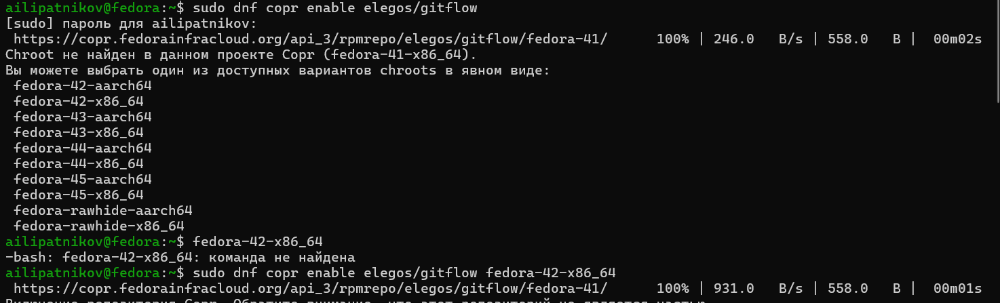{#fig-copr width=70%}

{#fig-install-gitflow width=70%}

### Установка Node.js и pnpm

Установлены Node.js и pnpm (рис. -@fig-install-nodejs, рис. -@fig-install-pnpm):

```bash
dnf install nodejs
dnf install pnpm
```

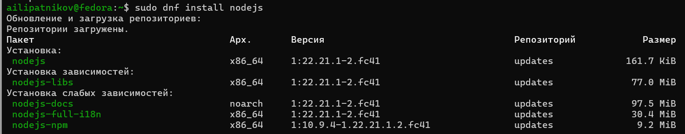{#fig-install-nodejs width=70%}

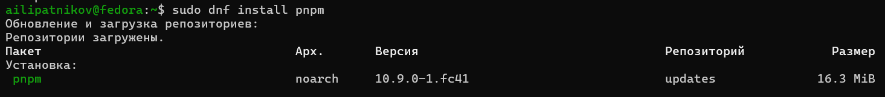{#fig-install-pnpm width=70%}

### Настройка Node.js

Выполнена настройка окружения: каталог с исполняемыми файлами, устанавливаемыми yarn, добавлен в переменную PATH (рис. -@fig-pnpm-setup):

```bash
pnpm setup
source ~/.bashrc
```

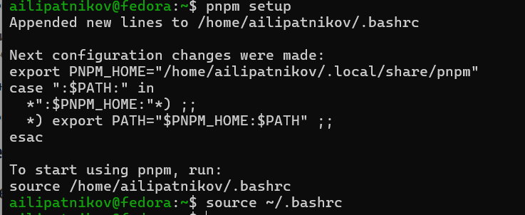{#fig-pnpm-setup width=70%}

## Установка инструментов общепринятых коммитов

Установлены глобально commitizen (для помощи в форматировании коммитов; устанавливается скрипт `git-cz`) и standard-changelog (для создания журналов изменений) (рис. -@fig-add-commitizen, рис. -@fig-add-standard-changelog):

```bash
pnpm add -g commitizen
pnpm add -g standard-changelog
```

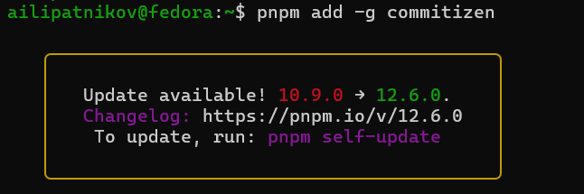{#fig-add-commitizen width=70%}

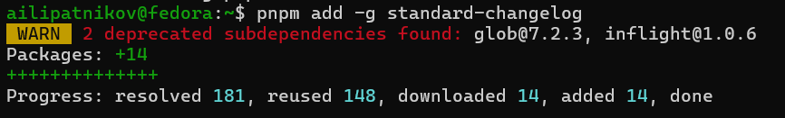{#fig-add-standard-changelog width=70%}

## Создание репозитория

Создан репозиторий git-extended на GitHub (рис. -@fig-github-repo). Выполнен первый коммит, репозиторий подключён как удалённый и отправлен на GitHub (рис. -@fig-first-commit):

```bash
git commit -m "first commit"
git remote add origin git@github.com:<username>/git-extended.git
git push -u origin master
```

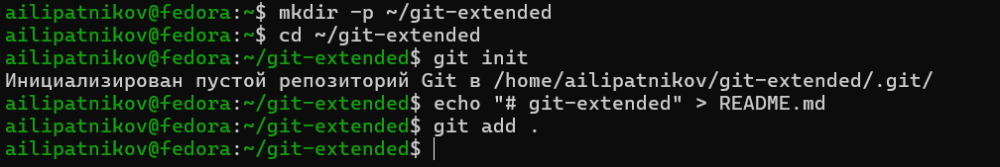{#fig-github-repo width=70%}

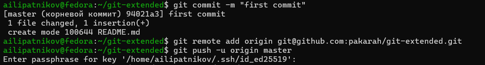{#fig-first-commit width=70%}

## Конфигурация общепринятых коммитов

Инициализирована конфигурация для пакетов Node.js (рис. -@fig-pnpm-init):

```bash
pnpm init
```

Заполнены параметры пакета: название, лицензия CC-BY-4.0. В файл `package.json` добавлена команда для формирования коммитов (рис. -@fig-package-json):

```json
"config": {
    "commitizen": {
        "path": "cz-conventional-changelog"
    }
}
```

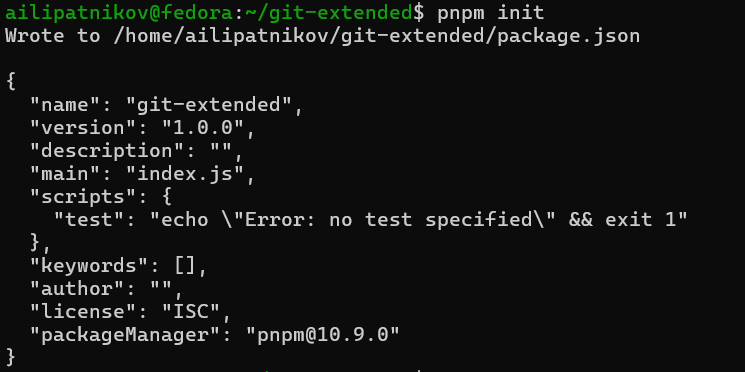{#fig-pnpm-init width=70%}

{#fig-package-json width=70%}

Новые файлы добавлены в индекс, выполнен коммит через git-cz, изменения отправлены на GitHub (рис. -@fig-add-cz-push):

```bash
git add .
git cz
git push
```

{#fig-add-cz-push width=70%}

## Конфигурация git-flow

Инициализирован git-flow, префикс для ярлыков установлен в `v` (рис. -@fig-flow-init). Проверена текущая ветка (рис. -@fig-branch): после инициализации работа идёт в ветке `develop`.

```bash
git flow init
git branch
```

{#fig-flow-init width=70%}

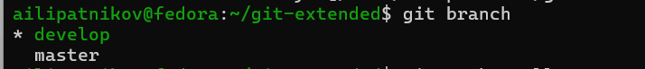{#fig-branch width=70%}

Весь репозиторий загружен в хранилище, внешняя ветка установлена как вышестоящая для ветки `develop` (рис. -@fig-push-all, рис. -@fig-set-upstream):

```bash
git push --all
git branch --set-upstream-to=origin/develop develop
```

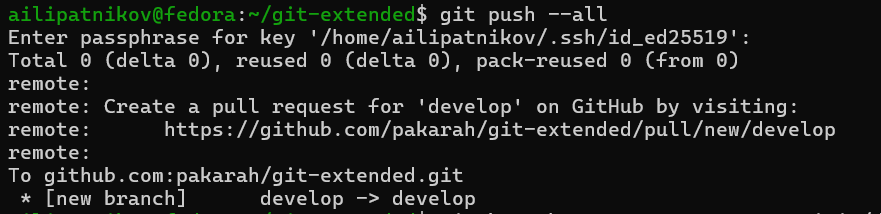{#fig-push-all width=70%}

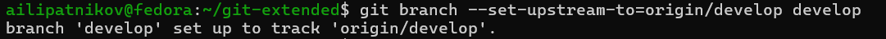{#fig-set-upstream width=70%}

## Создание релиза 1.0.0

Создан релиз с версией 1.0.0 (рис. -@fig-release-start):

```bash
git flow release start 1.0.0
```

Создан журнал изменений первой генерацией standard-changelog, добавлен в индекс и зафиксирован (рис. -@fig-changelog-first):

```bash
standard-changelog --first-release
git add CHANGELOG.md
git commit -am 'chore(site): add changelog'
```

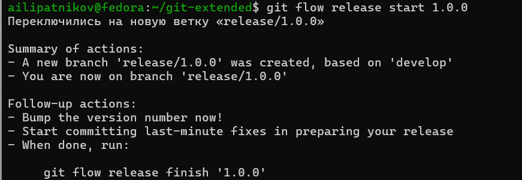{#fig-release-start width=70%}

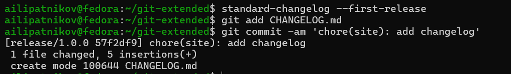{#fig-changelog-first width=70%}

Релизная ветка слита с основной (рис. -@fig-release-finish-100), данные отправлены на GitHub вместе с тегами (рис. -@fig-push-all-100, рис. -@fig-push-tags-100):

```bash
git flow release finish 1.0.0
git push --all
git push --tags
```

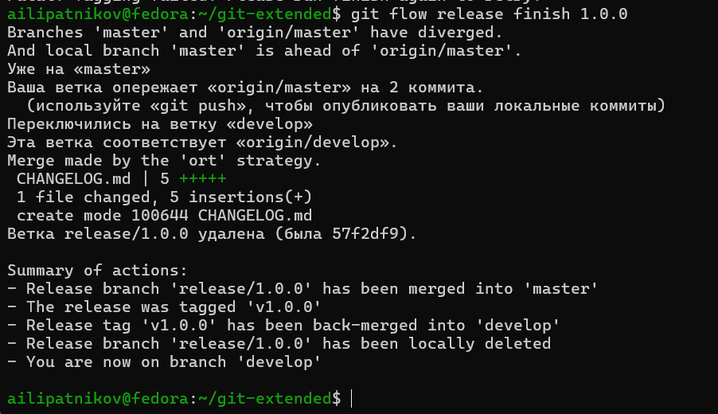{#fig-release-finish-100 width=70%}

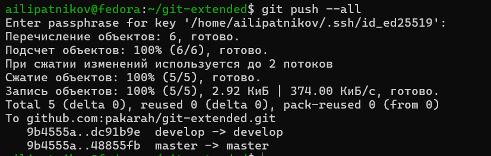{#fig-push-all-100 width=70%}

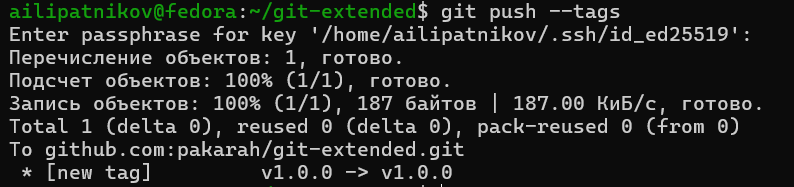{#fig-push-tags-100 width=70%}

Создан релиз на GitHub с журналом изменений в описании (рис. -@fig-gh-release-100):

```bash
gh release create v1.0.0 -F CHANGELOG.md
```

{#fig-gh-release-100 width=70%}

## Разработка новой функциональности

Создана ветка для новой функциональности; после завершения работы ветка объединена с `develop` (рис. -@fig-feature-start, рис. -@fig-feature-finish):

```bash
git flow feature start feature_branch
git flow feature finish feature_branch
```

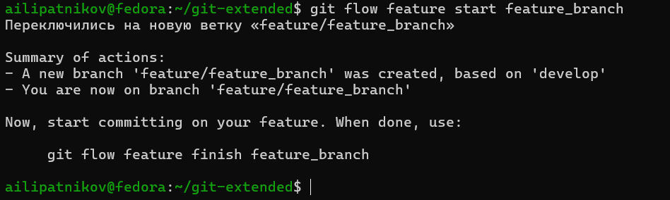{#fig-feature-start width=70%}

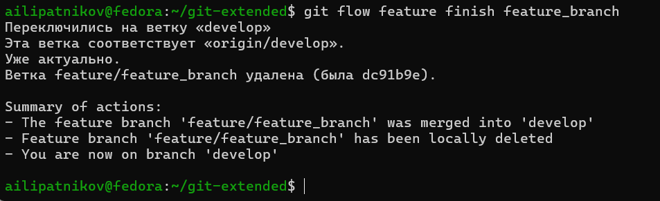{#fig-feature-finish width=70%}

## Создание релиза 1.2.3

Создан релиз с версией 1.2.3, номер версии обновлён в файле `package.json` (рис. -@fig-release-123):

```bash
git flow release start 1.2.3
```

Обновлена версия в `package.json` — установлена в 1.2.3 (рис. -@fig-release-123).

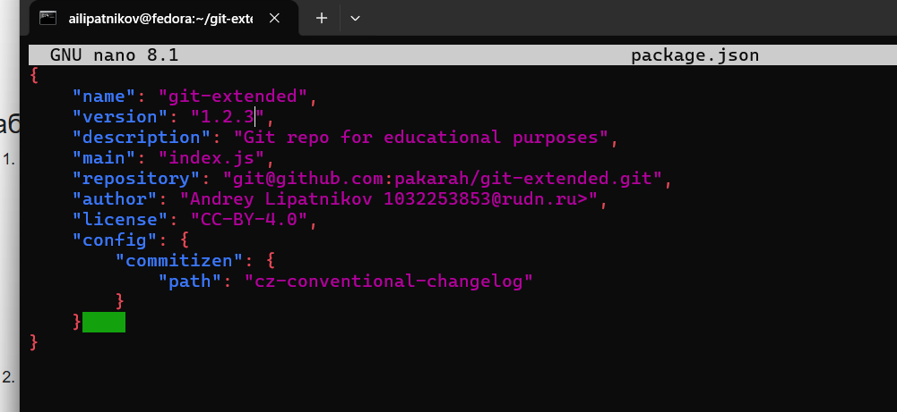{#fig-release-123 width=70%}

Создан журнал изменений обновлённой генерацией (рис. -@fig-standard-changelog), добавлен в индекс и зафиксирован (рис. -@fig-changelog-update):

```bash
standard-changelog
git add CHANGELOG.md
git commit -am 'chore(site): update changelog'
```

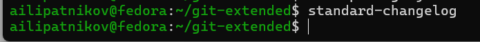{#fig-standard-changelog width=70%}

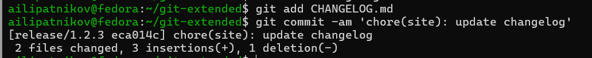{#fig-changelog-update width=70%}

Релизная ветка слита с основной (рис. -@fig-release-finish-123), данные и теги отправлены на GitHub (рис. -@fig-push-all-123, рис. -@fig-push-tags-123):

```bash
git flow release finish 1.2.3
git push --all
git push --tags
```

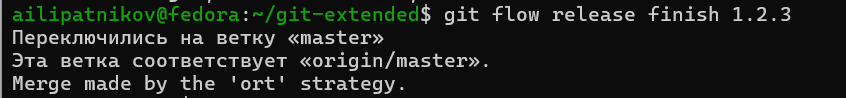{#fig-release-finish-123 width=70%}

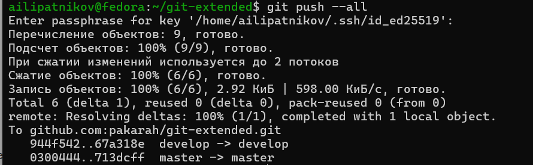{#fig-push-all-123 width=70%}

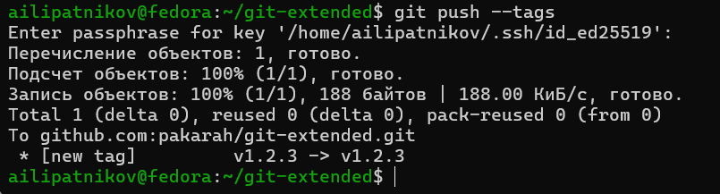{#fig-push-tags-123 width=70%}

Создан релиз v1.2.3 на GitHub с комментарием из журнала изменений (рис. -@fig-gh-release-123):

```bash
gh release create v1.2.3 -F CHANGELOG.md
```

{#fig-gh-release-123 width=70%}

# Результаты

В ходе работы получены следующие результаты:

- установлено программное обеспечение: git-flow (из Copr), Node.js, pnpm, commitizen, standard-changelog;
- создан тестовый репозиторий git-extended и подключён к GitHub;
- репозиторий преобразован в репозиторий с git-flow (префикс тегов `v`) и общепринятыми коммитами (cz-conventional-changelog в `package.json`);
- созданы и опубликованы релизы: теги `v1.0.0` и `v1.2.3` на GitHub с журналом изменений `CHANGELOG.md` в описании;
- выполнен полный цикл работы с функциональной веткой: `feature start` и `feature finish`.

# Обсуждение результатов

Последовательность выполнения соответствует методическим указаниям: модель ветвления Gitflow развёрнута на тестовом репозитории, коммиты формируются в стандартизованном виде через commitizen, релизы нумеруются по семантическому версионированию и автоматически сопровождаются журналом изменений standard-changelog. Разделение ветвей показало главное свойство модели: исправления и релизы не пересекаются с текущей разработкой --- после `git flow release start 1.0.0` в ветке релиза допустима только отладка и документация, новые функции туда не попадают. Связка типов коммитов с компонентами версии (`fix` → PATCH, `feat` → MINOR, `BREAKING CHANGE` → MAJOR) позволяет в дальнейшем вести версионирование автоматически. Замеченных отклонений от ожидаемого поведения команд не зафиксировано.

# Заключение

- Цель работы достигнута: получены навыки правильной работы с репозиториями git.
- Освоены модель ветвления Gitflow (ветки `master`, `develop`, `feature`, `release`, `hotfix`) и инструмент git-flow.
- Освоены общепринятые коммиты (Conventional Commits) и семантическое версионирование; сформированы и опубликованы релизы v1.0.0 и v1.2.3 с журналом изменений.
- Полученные навыки применимы ко всем последующим работам курса: репозиторий оформлен по стандарту, релизы публикуются утилитой gh.

# Список литературы {.unnumbered}

::: {#refs}
:::

\appendix

# Что выносится в приложения {.appendix}

При необходимости сюда выносятся:

- листинги программ;
- большие таблицы с исходными данными;
- промежуточные выкладки;
- акты внедрения и т.п.

Каждое приложение начинается с новой страницы и имеет заголовок (например, «Приложение А. Листинг программы»).
