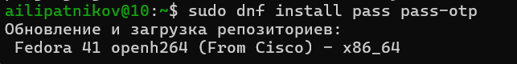
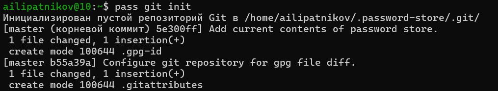
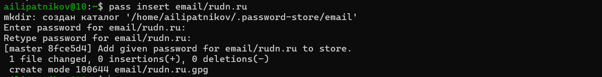
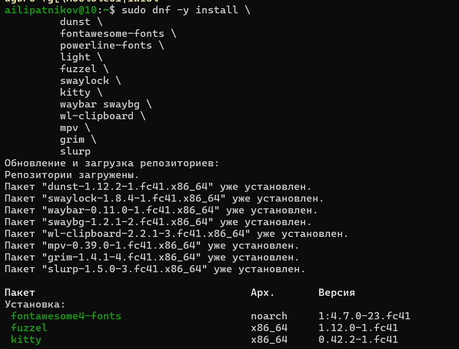
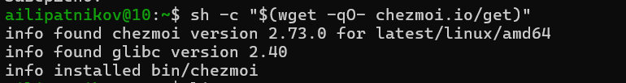
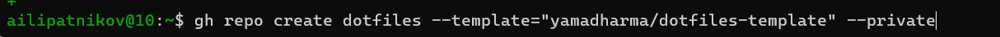
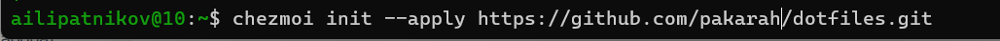
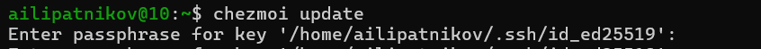
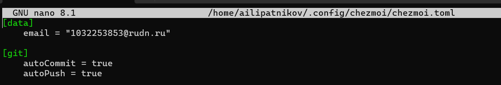

---
## Author
author:
  name: Липатников Андрей
  email: 1032253853@rudn.ru
  affiliation:
    - name: Российский университет дружбы народов
      country: Российская Федерация
      postal-code: 117198
      city: Москва
      address: ул. Миклухо-Маклая, д. 6
## Title
title: "Лабораторная работа №5"
subtitle: "Менеджер паролей pass и управление файлами конфигурации"
license: "CC BY"
date: today
date-format: "2026-10-08"
---

# Информация

## Докладчик

:::::::::::::: {.columns align=center}
::: {.column width="70%"}

  * Липатников Андрей
  * Студент Российского университета дружбы народов им. П. Лумумбы
  * [1032253853@rudn.ru](mailto:1032253853@rudn.ru)

:::
::: {.column width="30%"}


:::
::::::::::::::

::: notes
- Поприветствовать аудиторию.
- Кратко представиться: «Выполнил лабораторную работу №5 по менеджеру паролей pass и управлению файлами конфигурации».
:::

# Вводная часть

## Актуальность

- Работа с виртуальными машинами порождает две практические задачи:
    - безопасное хранение множества паролей и доступ к ним с разных устройств;
    - перенос файлов конфигурации (dotfiles) между машинами.
- Пароли в открытом виде недопустимы, облачные менеджеры требуют доверия к третьей стороне
- Ручное копирование настроек не масштабируется и приводит к расхождению конфигураций
- Весь практикум курса разворачивается и переносится именно этими инструментами

::: notes
- Подчеркнуть: навык нужен не для одной работы, а для всего курса.
- Время: не более 1 минуты на этот слайд.
:::

## Объект и предмет исследования

- **Объект**: процессы управления паролями и файлами конфигурации домашнего каталога пользователя
- **Предмет**: настройка менеджера паролей pass с шифрованием GPG и синхронизацией git, а также управление конфигурациями с помощью chezmoi и репозитория dotfiles
- **Критерий результата**: работающее шифрованное хранилище паролей и развёрнутые конфигурации на двух машинах

::: notes
- Объект --- более широкая область (управление паролями и конфигурациями).
- Предмет --- конкретный аспект (pass + GPG + git и chezmoi на виртуальной машине).
:::

## Цели и задачи

- Цель:
    - Получить навыки работы с менеджером паролей pass и утилитой управления файлами конфигурации chezmoi.
- Задачи:
    - Установить pass и gopass, настроить хранилище с шифрованием GPG-ключом.
    - Синхронизировать хранилище с git, настроить связь с браузером (browserpass).
    - Установить chezmoi, создать репозиторий dotfiles и развернуть конфигурации на двух машинах.

::: notes
- Задач ровно три --- по шаблону.
- Каждая задача соответствует блоку слайдов с результатами.
:::

# Материалы и методы

## Используемое ПО и среда

- **Среда**: Fedora 41 (Sway) в VirtualBox (окружение из лабораторной работы №1)
- **Инструменты**:
    - `pass`, `pass-otp`, `gopass`, `gnupg` --- хранилище паролей и шифрование
    - `browserpass` --- интеграция с браузером (репозиторий Copr)
    - `chezmoi`, `git`, `gh` --- управление файлами конфигурации
- **Репозитории**: личный репозиторий хранилища паролей и dotfiles на GitHub

::: notes
- browserpass и шрифты iosevka берутся из Copr: в официальных репозиториях Fedora их нет.
- Репозиторий dotfiles создаётся из шаблона yamadharma/dotfiles-template.
:::

## Методика выполнения

- Установка и настройка менеджера паролей pass
- Синхронизация хранилища с git-репозиторием
- Настройка взаимодействия с браузером и работа с паролями
- Установка дополнительного ПО и шрифтов рабочего окружения
- Развёртывание конфигураций chezmoi на первой и второй машинах
- Освоение ежедневных операций: diff, apply, update, autoCommit, autoPush

::: notes
- Каждый шаг фиксируется скриншотом и заносится в отчёт.
- Изменения домашнего каталога проверяются командой chezmoi diff до их применения.
:::

# Содержание исследования

## Установка pass и gopass

- Менеджер паролей pass установлен с модулем otp, реализация gopass --- отдельно
- Ключ для шифрования уже существует: генерация нового не потребовалась
- Список секретных ключей проверен командой `gpg --list-secret-keys`

:::::::::::::: {.columns}
::: {.column width="48%"}



:::
::: {.column width="48%"}


:::
::::::::::::::

::: notes
- Данные хранятся в файловой системе: каталоги и файлы, шифрованные GPG-ключом.
- Скриншоты 01, 02, 03 в отчёте.
:::

## Синхронизация хранилища с git

- Инициализация структуры git в хранилище: `pass git init`
- Задан адрес репозитория на GitHub, изменения отправлены: `pass git push`
- Прямые изменения файловой системы фиксируются вручную: pass отслеживает только свои операции

:::::::::::::: {.columns}
::: {.column width="48%"}



:::
::: {.column width="48%"}


:::
::::::::::::::

::: notes
- Статус синхронизации проверяется командой pass git status.
- Прямые изменения требуют ручного коммита --- скриншот 06.
:::

## Взаимодействие с браузером

- Интеграция с браузером --- через native messaging: плагин плюс программа-интерфейс
- Включён репозиторий Copr: `dnf copr enable maximbaz/browserpass`
- Установлен пакет browserpass

:::::::::::::: {.columns}
::: {.column width="48%"}


:::
::: {.column width="48%"}


:::
::::::::::::::

::: notes
- browserpass подставляет пароль из хранилища в браузер через native messaging, не попадая в файлы браузера в открытом виде.
:::

## Работа с паролями

- Добавлен пароль: `pass insert email/rudn.ru`
- Отображён: `pass email/rudn.ru`
- Заменён сгенерированным на месте: `pass generate --in-place email/rudn.ru`

:::::::::::::: {.columns}
::: {.column width="48%"}



:::
::: {.column width="48%"}


:::
::::::::::::::

::: notes
- Скриншоты 09, 10, 11 в отчёте.
- Имя записи задаёт семантику: email/rudn.ru --- иерархия каталогов.
:::

## Дополнительное ПО и шрифты

- Установлено ПО рабочего окружения: dunst, fuzzel, swaylock, kitty, waybar, wl-clipboard, mpv, grim, slurp
- Подключён репозиторий Copr с шрифтами iosevka
- Установлены варианты шрифта: fonts, aile, curly, slab, etoile, term

:::::::::::::: {.columns}
::: {.column width="48%"}



:::
::: {.column width="48%"}


:::
::::::::::::::

::: notes
- Скриншоты 12--15 в отчёте.
:::

## Установка chezmoi и репозиторий dotfiles

- Бинарный файл chezmoi установлен скриптом, определяющим архитектуру системы:

```bash
sh -c "$(wget -qO- chezmoi.io/get)"
```

- Создан приватный репозиторий dotfiles из шаблона утилитой gh:

```bash
gh repo create dotfiles --template="yamadharma/dotfiles-template" --private
```

:::::::::::::: {.columns}
::: {.column width="48%"}



:::
::: {.column width="48%"}



:::
::::::::::::::

::: notes
- Скриншоты 16, 17, 18 в отчёте.
- Состояние конфигураций chezmoi хранит в ~/.local/share/chezmoi --- клоне репозитория dotfiles.
:::

## Подключение репозитория к системе

- Инициализация: `chezmoi init git@github.com:pakarah/dotfiles.git`
- Проверка изменений до применения: `chezmoi diff`
- Применение с подробным выводом: `chezmoi apply -v`

:::::::::::::: {.columns}
::: {.column width="48%"}


:::
::: {.column width="48%"}


:::
::::::::::::::

::: notes
- chezmoi diff показывает изменения до их внесения --- ключевое преимущество для контроля.
- Скриншоты 19, 20, 21 в отчёте.
:::

## Вторая машина и настройка одной командой

- На второй машине: тот же цикл init, diff, apply --- конфигурация воспроизводится
- Настройка новой машины одной командой:

```bash
chezmoi init --apply https://github.com/pakarah/dotfiles.git
```

:::::::::::::: {.columns}
::: {.column width="48%"}


:::
::: {.column width="48%"}



:::
::::::::::::::

::: notes
- Скриншоты 22, 23, 24, 25 в отчёте.
- Для правки файла --- chezmoi edit, для слияния --- chezmoi merge.
:::

## Ежедневные операции

- Обновление одной командой: `chezmoi update`
    - эквивалент `git pull --autostash --rebase` и затем `chezmoi apply`
- Извлечение изменений без применения --- с просмотром разницы:

```bash
chezmoi git pull -- --autostash --rebase && chezmoi diff
```

:::::::::::::: {.columns}
::: {.column width="48%"}



:::
::: {.column width="48%"}


:::
::::::::::::::

::: notes
- Если изменения устраивают --- применяется командой chezmoi apply.
- Скриншоты 26, 27 в отчёте.
:::

## Автоматическая фиксация изменений

- В конфигурацию добавлены опции автоматизации:

```toml
[git]
    autoCommit = true
    autoPush = true
```

- chezmoi фиксирует изменения исходного каталога и отправляет их в репозиторий
- Опции отключены по умолчанию и включаются явно

:::::::::::::: {.columns}
::: {.column width="48%"}



:::
::: {.column width="48%"}


:::
::::::::::::::

::: notes
- Осторожность: при autoPush на общедоступном репозитории случайно добавленный секрет в открытом виде будет отправлен в репозиторий.
- Скриншот 28 в отчёте.
:::

# Результаты

## Полученные результаты

- Настроено шифрованное хранилище паролей с синхронизацией через git и интеграцией с браузером

| Результат | Значение |
|-----------|----------|
| Хранилище | `pass` + GPG-шифрование, репозиторий `pass.git` |
| Браузер | `browserpass` (native messaging) |
| Конфигурации | репозиторий `dotfiles` из шаблона, chezmoi |
| Развёртывание | `init`, `diff`, `apply`, `update` на двух машинах |

::: notes
- Таблица из четырёх строк --- в пределах правила шаблона (не более 5 строк).
- Развёртывание на второй машине подтвердило воспроизводимость окружения.
:::

# Заключение

## Главный вывод

Освоен полный цикл управления личными данными и окружением: пароли хранятся шифрованно и синхронизируются через git, а файлы конфигурации разворачиваются на любой машине одной командой chezmoi --- с предварительной проверкой изменений перед их применением.

::: notes
- Финальный аккорд: перенос окружения одной командой --- главный практический выигрыш.
- После фразы сделать паузу 3--5 секунд, затем устно: «Я готов ответить на ваши вопросы».
- Будьте готовы к вопросам про структуру базы паролей и про риски autoPush для секретов.
:::
