---
## Author
author:
  name: Липатников Андрей
  email: 1032253853@rudn.ru
  affiliation:
    - name: Российский университет дружбы народов
      country: Российская Федерация
      postal-code: 117198
      city: Москва
      address: ул. Миклухо-Маклая, д. 6

## Title
title: "Лабораторная работа №5"
subtitle: "Менеджер паролей pass и управление файлами конфигурации"
license: "CC BY"
abstract: |
  В данном отчёте представлены результаты выполнения лабораторной работы по теме «Менеджер паролей pass и управление файлами конфигурации».

  В ходе работы установлен и настроен менеджер паролей pass: создано хранилище паролей с шифрованием GPG-ключом, выполнена синхронизация с git и настройка взаимодействия с браузером. Установлена утилита chezmoi, создан личный репозиторий dotfiles на основе шаблона и развёрнуты конфигурационные файлы; освоены ежедневные операции с chezmoi.

  Сделаны выводы о достижении поставленной цели.
keywords: [лабораторная работа, pass, gopass, GPG, chezmoi, dotfiles]
date: today
date-format: "2026-10-07" # Example: 2025-09-06
---

# Введение

## Актуальность

Работа с виртуальными машинами и удалёнными серверами порождает две практические задачи. Первая --- безопасное хранение множества паролей и доступ к ним с разных устройств: пароли в открытом виде недопустимы, облачные менеджеры требуют доверия к третьей стороне. Менеджер паролей pass решает задачу в духе идеологии Unix: данные хранятся в файловой системе в обычных файлах, шифрованных GPG-ключом, а синхронизация выполняется средствами git --- всё под контролем самого пользователя. Вторая задача --- управление файлами конфигурации домашнего каталога (dotfiles) на нескольких машинах: ручное копирование настроек не масштабируется и приводит к расхождению конфигураций. Утилита chezmoi позволяет хранить конфигурации в репозитории, применять их одной командой и учитывать различия между машинами с помощью шаблонов. Оба инструмента используются в последующих работах курса: настраиваемое окружение развёртывается и переносится именно так.

## Цель работы

Получение навыков работы с менеджером паролей pass и утилитой управления файлами конфигурации chezmoi.

## Задачи

1. Установить менеджер паролей pass (и gopass) и настроить хранилище с шифрованием GPG-ключом.
2. Выполнить синхронизацию хранилища паролей с git-репозиторием.
3. Настроить взаимодействие менеджера паролей с браузером (плагин browserpass).
4. Сохранить тестовый пароль в хранилище и заменить его сгенерированным.
5. Установить дополнительное программное обеспечение и шрифты для рабочего окружения.
6. Установить chezmoi и создать личный репозиторий dotfiles на основе шаблона.
7. Развернуть конфигурации на виртуальной машине и освоить ежедневные операции с chezmoi (diff, apply, update, автоматическая фиксация изменений).

## Объект и предмет исследования

- **Объект исследования:** процессы управления паролями и файлами конфигурации домашнего каталога пользователя.
- **Предмет исследования:** настройка менеджера паролей pass с шифрованием GPG и синхронизацией git, а также управление файлами конфигурации с помощью chezmoi и репозитория dotfiles.

## Методы исследования

В работе использованы следующие методы:

- установка и настройка программного обеспечения средствами пакетного менеджера `dnf` (в том числе из репозиториев Copr);
- практический эксперимент: последовательное выполнение команд pass, gpg и chezmoi с фиксацией каждого шага скриншотом;
- сравнительный анализ: проверка изменений домашнего каталога командой `chezmoi diff` до их применения.

## Схема выполнения работы

На рис. -@fig-flowchart представлена общая последовательность действий при выполнении работы.

::: {#fig-flowchart}

```{mermaid}
%%| fig-width: 100%
graph TD
    A@{ shape: circle, label: "Начало" } --> B[Выполнить действие]
    B --> C[Описать, что конкретно сделано]
    C --> D[Подтвердить скриншотом]
    D --> E[Занести в отчёт]
    E --> F[Поместить в git-репозиторий]
    F --> G[Сделать релиз git]
    G --> J@{ shape: dbl-circ, label: "Конец" }
```

Блок-схема выполнения лабораторной работы

:::

# Теоретическая часть

## Менеджер паролей pass

Менеджер паролей pass --- программа, сделанная в рамках идеологии Unix, также известная как стандартный менеджер паролей для Unix. Данные хранятся в файловой системе в виде каталогов и файлов; файлы шифруются с помощью GPG-ключа. Существует реализация gopass на языке Go с дополнительными интегрированными функциями; далее используется pass, но всё то же самое можно сделать с помощью gopass.

Структура базы паролей может быть произвольной, если пользователь использует её напрямую. При использовании промежуточного программного обеспечения семантику необходимо заложить в структуру базы. Рассмотрим пользователя user в домене example.com, порт 22. Отсутствие имени пользователя или порта в имени файла означает, что любое имя пользователя и порт совпадают: запись `example.com.pgp` соответствует любому пользователю и порту. Соответствующее имя пользователя может быть именем файла внутри каталога, имя которого совпадает с хостом (`example.com/user.pgp` --- полезно при нескольких пользователях на одном хосте), либо префиксом, отделённым знаком @ (`user@example.com.pgp`). Порт указывается после хоста через двоеточие: `example.com:22.pgp`, `example.com:22/user.pgp`, `user@example.com:22.pgp`. Все записи могут располагаться в произвольных каталогах, задающих собственную иерархию.

## Реализации и интерфейсы

Существуют две основные реализации командной строки: классическая pass в виде shell-скриптов и gopass на Go. Графические интерфейсы: qtpass (работает как интерфейс к pass и как самостоятельная программа), gopass-ui, webpass (веб-интерфейс на Go). Для Android существуют приложения Password Store (синхронизация с git требует импорта ssh-ключей, поддерживает разблокировку по биометрии; для работы требует OpenKeychain: Easy PGP --- операции с PGP-ключами, без биометрической разблокировки) и OpenKeychain. Для Emacs предназначены пакеты pass (управление хранилищем и редактирование записей, запуск `M-x pass`), helm-pass (список записей в минибуфере, копирование пароля по Enter) и ivy-pass.

## Управление файлами конфигурации chezmoi

chezmoi --- утилита управления файлами конфигурации домашнего каталога пользователя. Состояние файлов конфигурации сохраняется в каталоге `~/.local/share/chezmoi`, который является клоном репозитория dotfiles. Файл конфигурации `~/.config/chezmoi/chezmoi.toml` (также поддерживаются JSON и YAML) специфичен для локальной машины. Файлы, одинаково содержимые на всех машинах, дословно копируются из исходного каталога; файлы, которые варьируются от машины к машине, выполняются как шаблоны с использованием данных из конфигурационного файла. При запуске `chezmoi apply` вычисляется желаемое содержимое и разрешения для каждого файла, после чего вносятся необходимые изменения; по умолчанию chezmoi изменяет файлы только в рабочей копии.

Шаблоны используются для изменения содержимого файла в зависимости от среды; применяется синтаксис шаблонов Go. Файл интерпретируется как шаблон, если имеет суффикс `.tmpl` либо находится в каталоге `.chezmoitemplates`. Действия шаблона записываются в двойных фигурных скобках `{{ }}`: переменные (например, `{{ .chezmoi.hostname }}`), условные выражения (`if`, `else if`, `else`, `end`), логические функции (`eq`, `not`, `and`, `or`) и целочисленные функции (`len`, `ne`, `lt`, `le`, `gt`, `ge`). Для управления пробелами рядом со скобками размещается знак минус. Данные шаблона доступны командой `chezmoi data`; отладка выполняется подкомандой `chezmoi execute-template`. Команда `chezmoi init` может автоматически создать конфигурационный файл из шаблона `.chezmoi.$FORMAT.tmpl`; функция `promptStringOnce` запрашивает у пользователя значение, если оно ещё не установлено.

При выполнении `chezmoi update` запускается `git pull --autostash --rebase` в исходном каталоге, а затем `chezmoi apply`. Поддерживается автоматическая фиксация и отправка изменений в репозиторий (опции `autoCommit` и `autoPush` в конфигурации): при использовании `autoPush` на общедоступном репозитории случайно добавленный секрет в открытом виде будет отправлен в репозиторий --- требуется осторожность.

# Материалы и методы

- **Среда выполнения:** Fedora 41 (Sway) на виртуальной машине VirtualBox (окружение настроено в лабораторной работе №1).
- **Программное обеспечение:** pass, pass-otp, gopass, gnupg, browserpass, chezmoi; дополнительное ПО рабочего окружения (dunst, fuzzel, swaylock, kitty, waybar, wl-clipboard, mpv, grim, slurp и др.) и шрифты iosevka; утилиты gh, git, wget.
- **Репозитории:** личный репозиторий хранилища паролей (pass) и репозиторий dotfiles на GitHub, созданный на основе шаблона yamadharma/dotfiles-template.
- **Методы:** последовательное выполнение команд с фиксацией каждого шага скриншотом; проверка изменений домашнего каталога через `chezmoi diff` перед применением.

# Выполнение лабораторной работы

## Менеджер паролей pass

### Установка

Установлены менеджер паролей pass с модулем otp и реализация gopass (рис. -@fig-install-pass, рис. -@fig-install-gopass):

```bash
dnf install pass pass-otp
dnf install gopass
```

{#fig-install-pass width=70%}

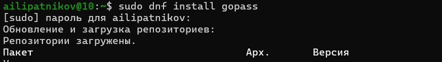{#fig-install-gopass width=70%}

### Ключи GPG

Просмотрен список секретных ключей (рис. -@fig-gpg-list):

```bash
gpg --list-secret-keys
```

Ключ для шифрования уже существует, генерация нового ключа (`gpg --full-generate-key`) не потребовалась.

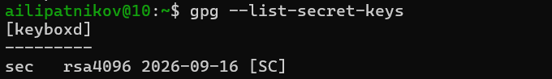{#fig-gpg-list width=70%}

### Синхронизация с git

Выполнена инициализация структуры git для хранилища паролей (рис. -@fig-pass-git-init):

```bash
pass git init
```

{#fig-pass-git-init width=70%}

Задан адрес репозитория на GitHub и изменения отправлены в хранилище (рис. -@fig-pass-git-remote):

```bash
pass git remote add origin git@github.com:pakarah/pass.git
pass git push
```

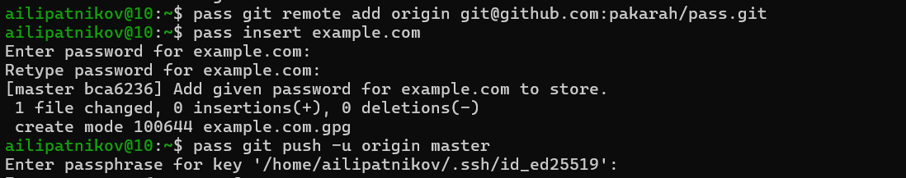{#fig-pass-git-remote width=70%}

### Прямые изменения

Изменения, внесённые непосредственно в файловую систему, зафиксированы вручную и отправлены в репозиторий (рис. -@fig-manual-edit):

```bash
cd ~/.password-store/
git add .
git commit -am 'edit manually'
git push
```

Отслеживаются только изменения, сделанные через сам pass; изменения на файловой системе требуют ручного коммита. Статус синхронизации проверяется командой `pass git status`.

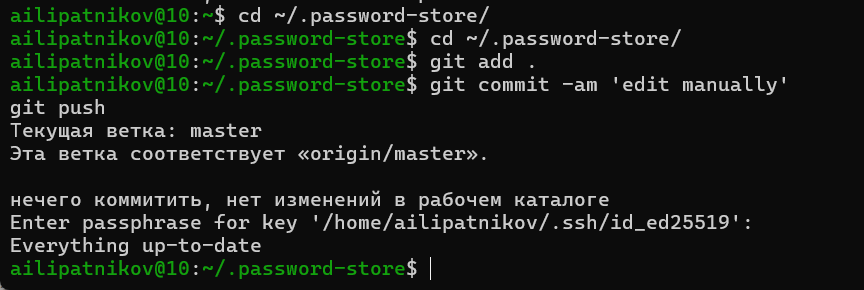{#fig-manual-edit width=70%}

### Настройка интерфейса с браузером

Для взаимодействия с браузером используется интерфейс native messaging: кроме плагина устанавливается программа, обеспечивающая этот интерфейс. Включён репозиторий Copr и установлен пакет browserpass (рис. -@fig-copr-browserpass, рис. -@fig-install-browserpass):

```bash
dnf copr enable maximbaz/browserpass
dnf install browserpass
```

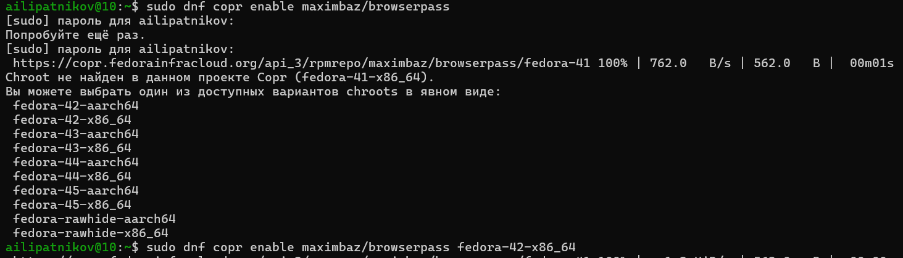{#fig-copr-browserpass width=70%}

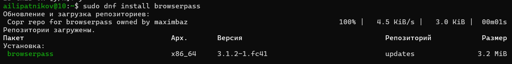{#fig-install-browserpass width=70%}

### Сохранение пароля

Добавлен новый пароль (рис. -@fig-pass-insert):

```bash
pass insert email/rudn.ru
```

{#fig-pass-insert width=70%}

Пароль отображён для указанного имени файла (рис. -@fig-pass-show):

```bash
pass email/rudn.ru
```

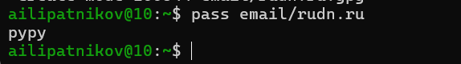{#fig-pass-show width=70%}

Существующий пароль заменён сгенерированным на месте (рис. -@fig-pass-generate):

```bash
pass generate --in-place email/rudn.ru
```

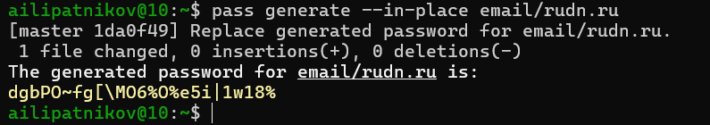{#fig-pass-generate width=70%}

## Управление файлами конфигурации

### Установка дополнительного программного обеспечения

Установлено дополнительное программное обеспечение рабочего окружения (рис. -@fig-extra-packages):

```bash
sudo dnf -y install \
         dunst \
         fontawesome-fonts \
         powerline-fonts \
         light \
         fuzzel \
         swaylock \
         kitty \
         waybar swaybg \
         wl-clipboard \
         mpv \
         grim \
         slurp
```

{#fig-extra-packages width=70%}

### Установка шрифтов

Подключён репозиторий Copr с шрифтами iosevka, выполнен поиск и установка вариантов шрифта (рис. -@fig-copr-iosevka, рис. -@fig-search-iosevka, рис. -@fig-install-iosevka):

```bash
sudo dnf copr enable peterwu/iosevka
sudo dnf search iosevka
sudo dnf install iosevka-fonts iosevka-aile-fonts iosevka-curly-fonts iosevka-slab-fonts iosevka-etoile-fonts iosevka-term-fonts
```

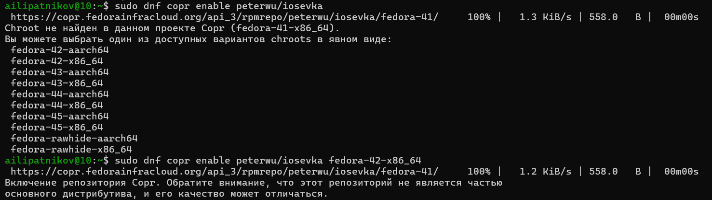{#fig-copr-iosevka width=70%}

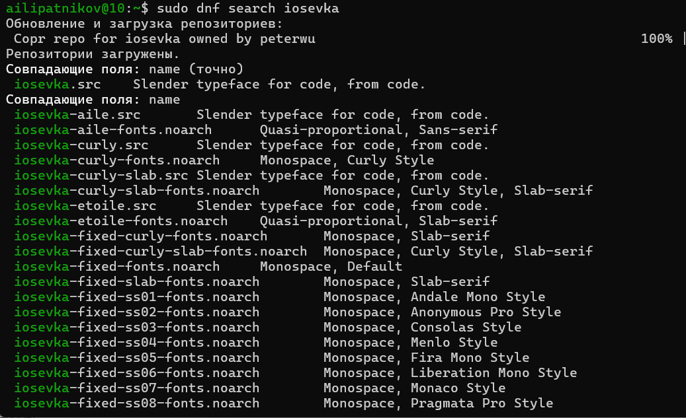{#fig-search-iosevka width=70%}

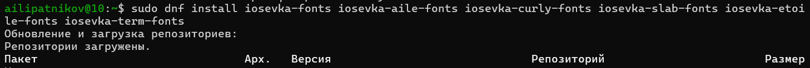{#fig-install-iosevka width=70%}

### Установка chezmoi

Бинарный файл chezmoi установлен с помощью скрипта, определяющего архитектуру процессора и операционную систему и скачивающего необходимый файл (рис. -@fig-install-chezmoi):

```bash
sh -c "$(wget -qO- chezmoi.io/get)"
```

{#fig-install-chezmoi width=70%}

### Создание собственного репозитория

Создан личный приватный репозиторий dotfiles на GitHub на основе шаблона с помощью утилиты gh (рис. -@fig-gh-repo-create). Созданный репозиторий dotfiles показан на GitHub (рис. -@fig-dotfiles-repo):

```bash
gh repo create dotfiles --template="yamadharma/dotfiles-template" --private
```

{#fig-gh-repo-create width=70%}

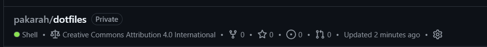{#fig-dotfiles-repo width=70%}

### Подключение репозитория к своей системе

Выполнена инициализация chezmoi с репозиторием dotfiles по SSH (рис. -@fig-chezmoi-init):

```bash
chezmoi init git@github.com:pakarah/dotfiles.git
```

{#fig-chezmoi-init width=70%}

Проверено, какие изменения внесёт chezmoi в домашний каталог, до их применения (рис. -@fig-chezmoi-diff):

```bash
chezmoi diff
```

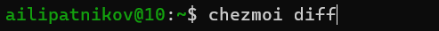{#fig-chezmoi-diff width=70%}

Изменения применены с подробным выводом (рис. -@fig-chezmoi-apply):

```bash
chezmoi apply -v
```

{#fig-chezmoi-apply width=70%}

## Использование chezmoi на второй машине

На второй машине выполнена инициализация chezmoi с тем же репозиторием dotfiles (рис. -@fig-chezmoi-init-2):

```bash
chezmoi init https://github.com/pakarah/dotfiles.git
```

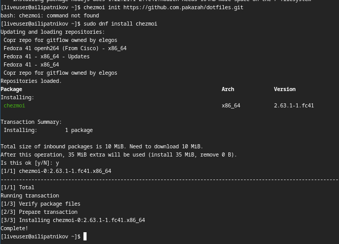{#fig-chezmoi-init-2 width=70%}

Проверены изменения перед применением (рис. -@fig-chezmoi-diff-2):

```bash
chezmoi diff
```

{#fig-chezmoi-diff-2 width=70%}

Изменения применены (рис. -@fig-chezmoi-apply-2):

```bash
chezmoi apply -v
```

{#fig-chezmoi-apply-2 width=70%}

Если изменения в файле не устраивают, он редактируется командой `chezmoi edit file_name`; для объединения изменений между текущим содержимым файла, файлом в рабочей копии и изменённым содержимым вызывается инструмент слияния `chezmoi merge file_name`.

## Настройка новой машины с помощью одной команды

Установка dotfiles на новый компьютер выполнена одной командой: инициализация с одновременным применением изменений (рис. -@fig-chezmoi-init-apply):

```bash
chezmoi init --apply https://github.com/pakarah/dotfiles.git
```

Возможна инициализация через SSH: `chezmoi init --apply git@github.com:pakarah/dotfiles.git`.

{#fig-chezmoi-init-apply width=70%}

## Ежедневные операции с chezmoi

Извлечение последних изменений из репозитория и их применение выполняются одной командой: запускается `git pull --autostash --rebase` в исходном каталоге, затем `chezmoi apply` (рис. -@fig-chezmoi-update):

```bash
chezmoi update
```

{#fig-chezmoi-update width=70%}

Извлечение изменений без их применения --- с последующим просмотром разницы между целевым состоянием, вычисленным из исходного каталога, и фактическим состоянием (рис. -@fig-git-pull-diff):

```bash
chezmoi git pull -- --autostash --rebase && chezmoi diff
```

Если изменения устраивают, они применяются командой `chezmoi apply`.

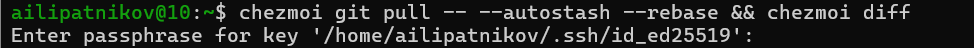{#fig-git-pull-diff width=70%}

## Автоматическая фиксация и отправка изменений

В файл конфигурации `~/.config/chezmoi/chezmoi.toml` добавлены опции автоматической фиксации и отправки изменений в репозиторий (рис. -@fig-git-autocommit):

```toml
[git]
    autoCommit = true
    autoPush = true
```

Всякий раз, когда в исходный каталог вносятся изменения, chezmoi фиксирует их с автоматически сгенерированным сообщением фиксации и отправляет в репозиторий. Функция отключена по умолчанию и включается явно. При использовании `autoPush` на общедоступном репозитории случайно добавленный в открытом виде секрет будет отправлен в репозиторий --- следует быть осторожным.

{#fig-git-autocommit width=70%}

# Результаты

В ходе работы получены следующие результаты:

- установлен менеджер паролей pass (с модулем pass-otp) и альтернативная реализация gopass;
- хранилище паролей синхронизировано с репозиторием GitHub (`pass git init`, `pass git remote add origin`, `pass git push`);
- освоены прямые изменения в хранилище с ручной фиксацией через git;
- установлен интерфейс взаимодействия с браузером browserpass (репозиторий Copr);
- в хранилище добавлен пароль `email/rudn.ru`, отображён и заменён сгенерированным (`pass generate --in-place`);
- установлено дополнительное программное обеспечение рабочего окружения и шрифты iosevka;
- установлена утилита chezmoi, создан личный репозиторий dotfiles из шаблона yamadharma/dotfiles-template;
- конфигурации развёрнуты на первой машине (init, diff, apply) и продемонстрировано развёртывание на второй машине;
- освоены ежедневные операции: `chezmoi init --apply`, `chezmoi update`, `chezmoi git pull -- --autostash --rebase` с просмотром diff;
- в конфигурацию включены опции автоматической фиксации и отправки изменений (`autoCommit`, `autoPush`).

# Обсуждение результатов

Хранилище pass построено по принципам Unix: файлы, шифрованные GPG-ключом, хранятся в каталоге `~/.password-store`, а история изменений ведётся git --- это даёт и резервное копирование, и прослеживаемость без доверия к облачному сервису. Семантика структуры базы показана на примере записи `email/rudn.ru`: иерархия каталогов задаёт назначение записи. Связка pass и browserpass закрывает практический цикл использования: пароль хранится в шифрованном хранилище и подставляется в браузер через native messaging, не попадая в файлы браузера в открытом виде.

chezmoi продемонстрировал ключевое свойство разделения целевого состояния и его применения: команда `chezmoi diff` показывает изменения до их внесения, что делает применение конфигураций контролируемым. Развёртывание на второй машине из того же репозитория подтвердило воспроизводимость: одна и та же последовательность init --- diff --- apply переносит конфигурации на любую машину. Опции `autoCommit` и `autoPush` упрощают поддержание актуальности репозитория, однако сопряжены с риском публикации секрета при общедоступном репозитории.

# Заключение

- Цель работы достигнута: получены навыки работы с менеджером паролей pass и утилитой управления файлами конфигурации chezmoi.
- Настроено шифрованное GPG-ключом хранилище паролей с синхронизацией через git; пароли добавляются, отображаются и генерируются командами pass.
- Создан личный репозиторий dotfiles, конфигурации развёрнуты и обновляются одной командой; освоены ежедневные операции chezmoi.
- Полученные навыки применимы для дальнейших работ курса: окружение воспроизводимо переносится на новые машины одной командой.

# Список литературы {.unnumbered}

::: {#refs}
:::

\appendix

# Что выносится в приложения {.appendix}

При необходимости сюда выносятся:

- листинги программ;
- большие таблицы с исходными данными;
- промежуточные выкладки;
- акты внедрения и т.п.

Каждое приложение начинается с новой страницы и имеет заголовок (например, «Приложение А. Листинг программы»).
