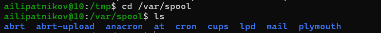
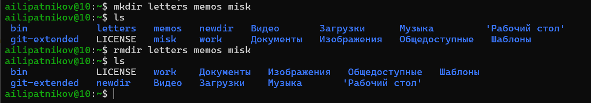
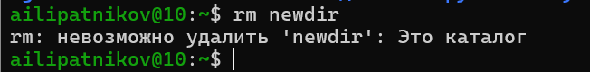
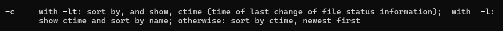
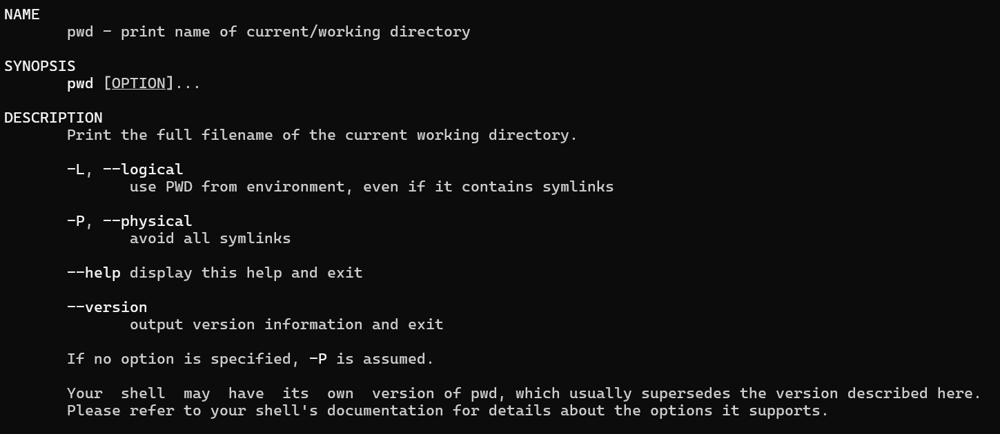
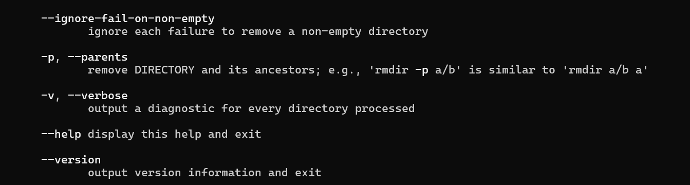

---
## Author
author:
  name: Липатников Андрей
  email: 1032253853@rudn.ru
  affiliation:
    - name: Российский университет дружбы народов
      country: Российская Федерация
      postal-code: 117198
      city: Москва
      address: ул. Миклухо-Маклая, д. 6
## Title
title: Лабораторная работа №6
subtitle: Основы интерфейса взаимодействия пользователя с системой Unix на уровне командной строки
license: CC BY
date: today
date-format: "2026-10-08"
---

# Информация

## Докладчик

:::::::::::::: {.columns align=center}
::: {.column width="70%"}

  * Липатников Андрей
  * Студент Российского университета дружбы народов им. П. Лумумбы
  * [1032253853@rudn.ru](mailto:1032253853@rudn.ru)

:::
::: {.column width="30%"}

:::
::::::::::::::

::: notes
- Поприветствовать аудиторию.
- Кратко представиться: «Выполнил лабораторную работу №6 по основам командной строки Unix».
:::

# Вводная часть

## Актуальность

- Командная строка --- основной инструмент взаимодействия с системой Unix
- Владение командами необходимо для администрирования и автоматизации
- Навыки, полученные в этой работе, используются во всех последующих лабораторных
- Цель презентации: показать процесс выполнения и подтвердить освоение базовых команд

::: notes
- Подчеркнуть: это фундамент для всего курса.
- Время: не более 1 минуты на этот слайд.
:::

## Объект и предмет исследования

- **Объект**: интерфейс взаимодействия пользователя с системой Unix
- **Предмет**: команды командной строки (`cd`, `pwd`, `ls`, `mkdir`, `rm`, `rmdir`, `man`, `history`)
- **Критерий результата**: освоены команды и их опции, зафиксированы скриншотами

::: notes
- Объект --- широкая область (интерфейс Unix).
- Предмет --- конкретные команды.
:::

## Цели и задачи

- Цель:
    - Приобрести практические навыки взаимодействия с системой посредством командной строки
- Задачи:
    - Изучить команды `cd`, `pwd`, `ls`, `mkdir`, `rm`, `rmdir`, `man`, `history`
    - Освоить опции команд (`ls -a`, `ls -la`, `ls -R`, `ls -lt`, `rm -r`, `rmdir`, `mkdir -p`)
    - Научиться работать с историей команд и модифицировать команды из буфера

::: notes
- Три задачи --- по структуре.
- Каждая задача соответствует блоку слайдов.
:::

# Материалы и методы

## Используемое ПО и среда

- **ОС**: Fedora 41 (Sway) в VirtualBox
- **Терминал**: bash
- **Инструменты**: `man`, `cd`, `pwd`, `ls`, `mkdir`, `rm`, `rmdir`, `history`

::: notes
- Все команды --- стандартные утилиты Unix.
- Среда изолирована в виртуальной машине.
:::

## Методика выполнения

- Изучение справок команд через `man`
- Выполнение практических заданий из методички
- Фиксация каждого шага скриншотом
- Анализ разницы вывода команд с разными опциями
- Модификация команд из буфера истории (`!<номер>:s/<что>/<на_что>`)

::: notes
- Каждый шаг документирован.
- Разница между `ls`, `ls -a`, `ls -la`, `ls -R` --- ключевая.
:::

# Содержание исследования

## Определение домашнего каталога

- Команда `pwd` выводит полный путь к текущему каталогу

{width=70%}

::: notes
- Домашний каталог: /home/ailipatnikov.
:::

## Переход в /tmp

- Команда `cd /tmp` меняет текущий каталог

{width=70%}

::: notes
- /tmp --- временные файлы.
:::

## Содержимое /tmp: ls

- Команда `ls` показывает имена файлов без подробностей

{width=70%}

::: notes
- Только имена --- самый простой вывод.
:::

## Содержимое /tmp: ls -a

- Опция `-a` показывает скрытые файлы (начинаются с точки)

{width=70%}

::: notes
- Появились .font-unix, .ICE-unix и др.
:::

## Содержимое /tmp: ls -la

- Опция `-l` — подробный вывод, `-a` — скрытые файлы

{width=70%}

::: notes
- Права, владелец, размер, дата, имя.
:::

## Проверка /var/spool на cron

- В каталоге /var/spool есть подкаталог cron

{width=70%}

::: notes
- Подтверждает наличие cron в системе.
:::

## Домашний каталог и владельцы

- Команда `ls -la` в домашнем каталоге показывает владельца файлов

{width=70%}

::: notes
- Владелец — пользователь ailipatnikov.
:::

## Создание newdir

- Команда `mkdir newdir` создаёт каталог в домашнем каталоге

{width=70%}

::: notes
- Каталог создан успешно.
:::

## Создание morefun в ~/newdir

- Вложенный каталог создан командой `mkdir morefun`

{width=70%}

::: notes
- Каталог morefun внутри newdir.
:::

## Создание и удаление трёх каталогов

- `mkdir letters memos misk` создаёт сразу три каталога
- `rmdir letters memos misk` удаляет их

{width=70%}

::: notes
- mkdir принимает несколько аргументов.
:::

## Попытка удалить newdir командой rm

- `rm newdir` выдаёт ошибку: это каталог

{width=70%}

::: notes
- Без опции -r rm не удаляет каталоги.
:::

## Удаление ~/newdir/morefun

- Команда `rmdir newdir/morefun` удаляет пустой подкаталог

{width=70%}

::: notes
- rmdir работает только с пустыми каталогами.
:::

## Поиск опции ls -R

- `man ls` показывает описание опции `-R` (рекурсивно)
- `ls -R` выводит содержимое всех подкаталогов

{width=70%}

::: notes
- -R — recursive.
:::

## Сортировка по времени: ls -lt

- Опция `-t` сортирует по времени последнего изменения содержимого
- Опция `-l` даёт развёрнутый вывод
- Итог: `ls -lt` (или `ls -ltr` для обратного порядка)

{width=70%}

::: notes
- -c работает с ctime (временем изменения статуса файла), а не содержимого.
- Задание методички требует сортировку по времени изменения содержимого — это -t.
:::

## Справки: man pwd и man cd

:::::::::::::: {.columns}
::: {.column width="48%"}

:::
::: {.column width="48%"}

:::
::::::::::::::

::: notes
- Встроенная pwd в bash по умолчанию логическая (-L): использует $PWD.
- Отдельный бинарник /bin/pwd по умолчанию физический (-P).
- cd: built-in Bash, справка через man или help cd.
:::

## Справки: man mkdir и man rmdir

:::::::::::::: {.columns}
::: {.column width="48%"}

:::
::: {.column width="48%"}

:::
::::::::::::::

::: notes
- mkdir: -m, -p, -v, -Z.
- rmdir: -p, -v, --ignore-fail-on-non-empty.
:::

## Справка man rm

- Опции: -f, -i, -I, -r, -d, -v

{width=70%}

::: notes
- -r — рекурсивное удаление.
:::

## Модификация команд через history

- Команда `history` показывает список выполненных команд с номерами
- Модификация и повторное выполнение: `!<номер>:s/<что>/<на_что>`
- Результат модификации: `rm -r newdir` и `pwd -L`

:::::::::::::: {.columns}
::: {.column width="48%"}

:::
::: {.column width="48%"}

:::
::::::::::::::

::: notes
- Пункт 7 методички: модификация команд из буфера.
- Обе команды получены модификацией предыдущих через history.
:::

# Результаты

## Полученные результаты

- Освоены команды работы с файловой системой и их опции

| Результат | Значение |
|-----------|----------|
| Навигация | `cd`, `pwd` (`-L`, `-P`) |
| Просмотр | `ls` (`-a`, `-l`, `-la`, `-R`, `-lt`) |
| Создание | `mkdir` (несколько аргументов, `-p`, `-m`) |
| Удаление | `rm` (`-r`, `-f`, `-i`), `rmdir` (только пустые) |
| История | `history`, `!<номер>:s/<что>/<на_что>` |

::: notes
- Таблица из пяти строк --- по правилу шаблона.
:::

# Заключение

## Главный вывод

Освоены базовые команды командной строки Unix, их опции и работа со справкой через `man`. Полученные навыки --- фундамент для всех последующих лабораторных работ курса.

::: notes
- Финальный аккорд: командная строка --- основной инструмент.
- После фразы сделать паузу, затем устно: «Я готов ответить на ваши вопросы».
:::
