---
## Author
author:
  name: Липатников Андрей
  email: 1032253853@rudn.ru
  affiliation:
    - name: Российский университет дружбы народов
      country: Российская Федерация
      postal-code: 117198
      city: Москва
      address: ул. Миклухо-Маклая, д. 6

## Title
title: "Лабораторная работа №6"
subtitle: "Основы интерфейса взаимодействия пользователя с системой Unix на уровне командной строки"
license: "CC BY"
abstract: |
  В данном отчёте представлены результаты выполнения лабораторной работы по теме «Основы интерфейса взаимодействия пользователя с системой Unix на уровне командной строки».

  Описаны использованные методы, полученные результаты выполнения базовых команд shell и их анализ.

  Сделаны выводы о достижении поставленной цели.
keywords: [Linux, командная строка, shell, файловая система, Unix]
date: today
date-format: "2026-10-08" # Example: 2025-09-06
---

# Введение

## Актуальность

Командная строка — основной интерфейс взаимодействия пользователя с системами типа Unix. Навыки работы с командной оболочкой shell являются базовыми для всего дальнейшего курса операционных систем: все последующие лабораторные работы выполняются через терминал, без графического интерфейса. Без освоения базовых команд навигации, создания и удаления каталогов, а также работы со справочной системой man невозможно выполнить ни одну из последующих работ курса.

## Цель работы

Приобретение практических навыков взаимодействия пользователя с системой посредством командной строки.

## Задачи

1. Определить полное имя домашнего каталога.
2. Выполнить навигацию по файловой системе и просмотр содержимого каталогов командой ls с различными опциями.
3. Создать и удалить каталоги: newdir, morefun, letters, memos, misk.
4. С помощью команды man определить опции команды ls для рекурсивного просмотра содержимого и сортировки по времени последнего изменения.
5. Просмотреть описания команд cd, pwd, mkdir, rmdir, rm с помощью man.
6. Выполнить модификацию и исполнение команд из буфера команд (history).

## Объект и предмет исследования

Объект исследования --- командная оболочка Unix (shell) как интерфейс взаимодействия пользователя с системой.

Предмет исследования --- базовые команды работы с файловой системой (pwd, cd, ls, mkdir, rmdir, rm, history) и их опции.

## Методы исследования

- Практическое выполнение команд в терминале.
- Изучение справочной документации с помощью команды man.
- Фиксация каждого шага выполнения работы скриншотом.

## Схема выполнения работы

На рис. -@fig-flowchart представлена общая последовательность действий при выполнении работы.

::: {#fig-flowchart}

```{mermaid}
%%| fig-width: 100%
graph TD
    A@{ shape: circle, label: "Начало" } --> B[Выполнить команду]
    B --> C[Зафиксировать результат скриншотом]
    C --> D[Занести в отчёт]
    D --> E[Поместить в git-репозиторий]
    E --> F[Сделать релиз git]
    F --> G@{ shape: dbl-circ, label: "Конец" }
```

Блок-схема выполнения лабораторной работы

:::

# Теоретическая часть

## Формат команды

Командой в операционной системе называется записанный по специальным правилам текст (возможно, с аргументами), представляющий собой указание на выполнение какого-либо действия в операционной системе. Первым словом идёт имя команды, остальной текст --- аргументы или опции, конкретизирующие действие.

Общий формат команды: <имя_команды> <разделитель> <аргументы>.

## Команда man

Команда man используется для просмотра руководства (manual) по основным командам операционной системы в диалоговом режиме. Формат: man <команда>.

Для управления просмотром используются клавиши:

- [Space] --- перемещение по документу на одну страницу вперёд;
- [Enter] --- перемещение на одну строку вперёд;
- [q] --- выход из режима просмотра.

## Команды навигации: cd и pwd

Команда cd используется для перемещения по файловой системе: cd [путь_к_каталогу]. Для перехода в домашний каталог используется cd без параметров или cd ~.

Команда pwd (print working directory) выводит абсолютный путь к текущему каталогу.

## Сокращения имён файлов

При работе с командами, аргументами которых выступает путь к каталогу или файлу, можно использовать сокращённую запись пути (табл. -@tbl-shortcuts).

| Символ | Значение |
|--------|----------|
| `~`    | Домашний каталог |
| `.`    | Текущий каталог |
| `..`   | Родительский каталог |

: Символы сокращения имён файлов {#tbl-shortcuts}

## Команда ls

Команда ls используется для просмотра содержимого каталога. Формат: ls [опции] [путь].

Скрытые файлы (имена начинаются с точки) отображаются опцией -a: ls -a.

Опция -F выводит в поле имени символ, определяющий тип файла (табл. -@tbl-types).

| Тип файла         | Символ |
|-------------------|--------|
| Каталог           | `/`    |
| Исполняемый файл  | `*`    |
| Ссылка            | `@`    |

: Символы, определяющие тип файла (опция -F) {#tbl-types}

Опция -l выводит подробную информацию о каждом файле и каталоге: тип файла, право доступа, число ссылок, владелец, группа, размер, дата последней ревизии, имя.

Опция -R выводит содержимое не только указанного каталога, но и всех его подкаталогов. Опция -t сортирует вывод по времени последнего изменения файла; в сочетании с -l даётся развёрнутое описание, а с -r порядок сортировки меняется на обратный.

## Команды mkdir, rmdir, rm

Команда mkdir используется для создания каталогов: mkdir имя_каталога1 [имя_каталога2 ...]. При задании нескольких аргументов создаётся несколько каталогов; можно использовать группировку: mkdir parentdir/{dir1,dir2,dir3}. Опция -m задаёт атрибуты доступа, опция -p создаёт каталог вместе с родительскими каталогами.

Команда rmdir удаляет пустые каталоги. Если удаляемый каталог содержит файлы, команда не будет выполнена.

Команда rm используется для удаления файлов и каталогов. Опция -i выдаёт запрос подтверждения на удаление файла. Чтобы удалить каталог, содержащий файлы, используется опция -r; без указания этой опции каталог не удаляется.

## Команда history и символ «;»

Команда history выводит список ранее выполненных команд с номерами. К любой команде из списка можно обратиться по её номеру: !<номер_команды>.

Модификация команды из списка выполняется конструкцией:

!<номер_команды>:s/<что_меняем>/<на_что_меняем>

Если требуется выполнить последовательно несколько команд, записанных в одной строке, используется символ «;»: cd; ls.

Более подробно про Unix см. в [@tanenbaum_book_modern-os_ru; @robbins_book_bash_en; @zarrelli_book_mastering-bash_en; @newham_book_learning-bash_en].

# Материалы и методы

- Среда: Fedora 41 (Sway) на виртуальной машине VirtualBox (окружение из лабораторной работы №1).
- Инструменты: командная оболочка bash, утилиты GNU coreutils (pwd, cd, ls, mkdir, rmdir, rm, history, man).
- Метод: последовательное выполнение команд с фиксацией каждого шага скриншотом; при необходимости --- модификация ранее выполненных команд из буфера команд.

# Выполнение лабораторной работы

## Определение домашнего каталога (шаг 1)

Командой pwd определено полное имя домашнего каталога. Далее относительно этого каталога выполняются последующие упражнения (рис. -@fig-001).

::: {#fig-001}
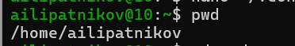{#fig-001 width=70%}

Определение полного имени домашнего каталога
:::

## Работа с каталогами /tmp и /var/spool (шаг 2)

Выполнен переход в каталог /tmp (рис. -@fig-002).

::: {#fig-002}
{#fig-002 width=70%}

Переход в каталог /tmp
:::

Просмотрено содержимое каталога /tmp командой ls без опций (рис. -@fig-003).

::: {#fig-003}
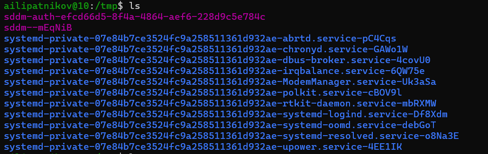{#fig-003 width=70%}

Просмотр содержимого каталога /tmp командой ls
:::

Просмотрено содержимое с опцией -a: в выводе добавляются скрытые файлы, имена которых начинаются с точки, а также записи «.» и «..» (рис. -@fig-004).

::: {#fig-004}
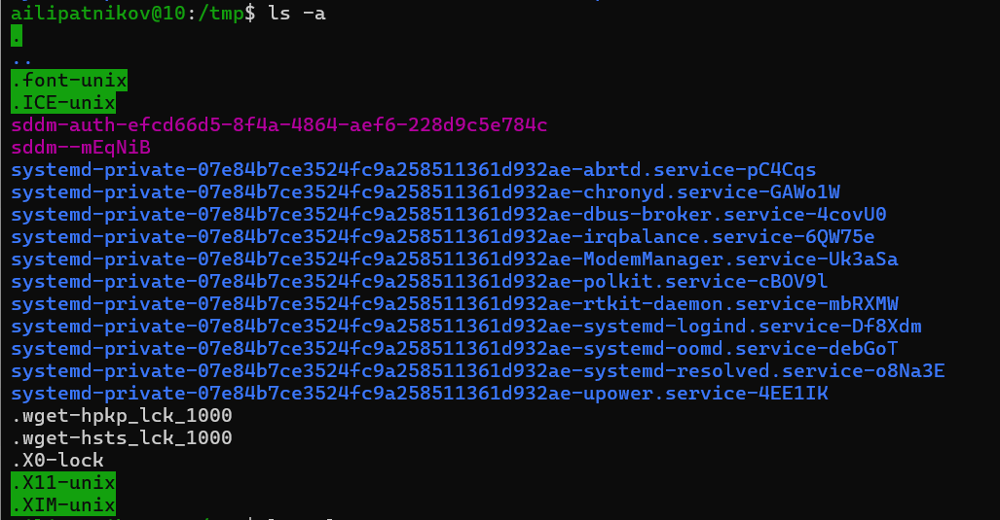{#fig-004 width=70%}

Просмотр скрытых файлов командой ls -a
:::

Просмотрено содержимое с опциями -la: для каждого файла выводятся права доступа, число ссылок, владелец, группа, размер и дата последней ревизии (рис. -@fig-005).

::: {#fig-005}
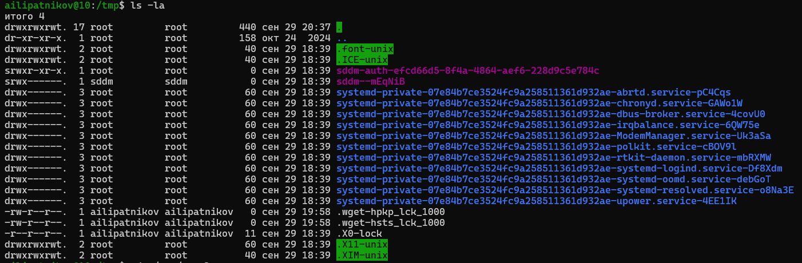{#fig-005 width=70%}

Подробный вывод содержимого командой ls -la
:::

Выполнен переход в каталог /var/spool и просмотр его содержимого: определено, есть ли подкаталог с именем cron (рис. -@fig-006).

::: {#fig-006}
{#fig-006 width=70%}

Проверка наличия подкаталога cron в каталоге /var/spool
:::

Выполнен переход в домашний каталог и просмотр его содержимого: определены владельцы файлов и подкаталогов (рис. -@fig-007).

::: {#fig-007}
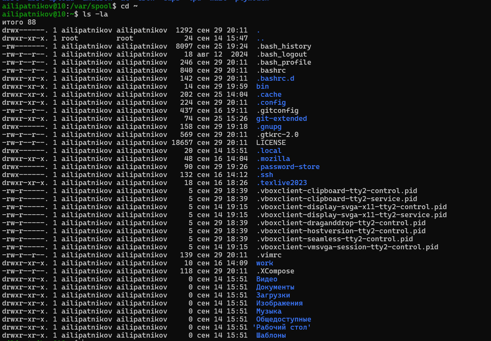{#fig-007 width=70%}

Просмотр содержимого домашнего каталога
:::

## Создание и удаление каталогов (шаг 3)

В домашнем каталоге создан новый каталог newdir (рис. -@fig-008).

::: {#fig-008}
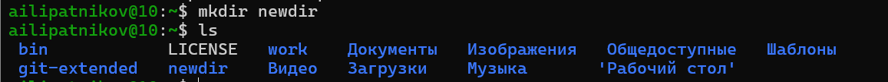{#fig-008 width=70%}

Создание каталога newdir
:::

В каталоге ~/newdir создан подкаталог morefun (рис. -@fig-009).

::: {#fig-009}
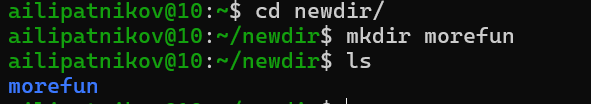{#fig-009 width=70%}

Создание подкаталога morefun
:::

В домашнем каталоге одной командой созданы три новых каталога (letters, memos, misk), затем они же удалены одной командой rmdir (рис. -@fig-010).

::: {#fig-010}
{#fig-010 width=70%}

Создание и удаление трёх каталогов одной командой
:::

Выполнена попытка удалить ранее созданный каталог ~/newdir командой rm без опций. Каталог не удалён: без опции -r команда rm не удаляет каталоги (рис. -@fig-011).

::: {#fig-011}
{#fig-011 width=70%}

Попытка удаления каталога newdir командой rm
:::

Из домашнего каталога удалён каталог ~/newdir/morefun командой rmdir; удаление проверено переходом в каталог newdir (рис. -@fig-012).

::: {#fig-012}
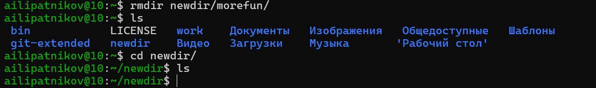{#fig-012 width=70%}

Удаление каталога ~/newdir/morefun
:::

## Опции команды ls (шаги 4--5)

С помощью команды man определена опция команды ls, позволяющая просматривать содержимое не только указанного каталога, но и входящих в него подкаталогов, --- опция -R. Выполнен просмотр содержимого с этой опцией (рис. -@fig-013).

::: {#fig-013}
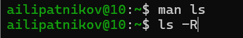{#fig-013 width=70%}

Опция -R команды ls: рекурсивный просмотр
:::

С помощью команды man определён набор опций команды ls, позволяющий отсортировать по времени последнего изменения выводимый список содержимого каталога с развёрнутым описанием файлов: -l -t (или ls -lt; с опцией -r сортировка меняется на обратную --- ls -lrt) (рис. -@fig-014).

::: {#fig-014}
{#fig-014 width=70%}

Сортировка вывода ls по времени последнего изменения
:::

## Справка man для основных команд (шаг 6)

Просмотрены описания команд cd, pwd, mkdir, rmdir, rm с помощью команды man.

Описана команда pwd (рис. -@fig-015).

::: {#fig-015}
{#fig-015 width=70%}

Справка man по команде pwd
:::

Описана команда cd (рис. -@fig-016).

::: {#fig-016}
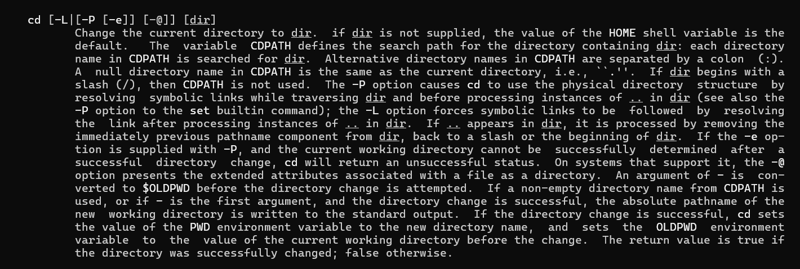{#fig-016 width=70%}

Справка man по команде cd
:::

Описана команда mkdir: основные опции --- -m (установка атрибутов доступа) и -p (создание каталога вместе с родительскими каталогами) (рис. -@fig-017).

::: {#fig-017}
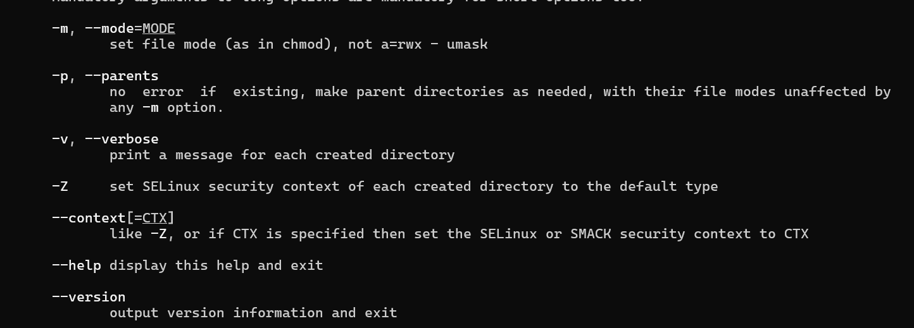{#fig-017 width=70%}

Справка man по команде mkdir
:::

Описана команда rmdir (рис. -@fig-018).

::: {#fig-018}
{#fig-018 width=70%}

Справка man по команде rmdir
:::

Описана команда rm: основные опции --- -i (запрос подтверждения), -r (рекурсивное удаление каталогов с содержимым) (рис. -@fig-019).

::: {#fig-019}
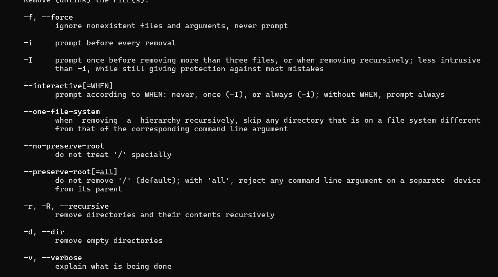{#fig-019 width=70%}

Справка man по команде rm
:::

## Модификация команд из истории (шаг 7)

Командой history выведен список ранее выполненных команд. Используя полученную информацию, выполнена модификация и исполнение команд из буфера команд. Исполнены две команды: удаление каталога newdir вместе с содержимым (rm -r newdir) и вывод абсолютного пути к текущему каталогу с опцией -L (pwd -L) (рис. -@fig-020 и рис. -@fig-021).

::: {#fig-020}
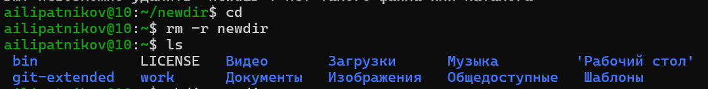{#fig-020 width=70%}

Удаление каталога newdir командой rm -r
:::

::: {#fig-021}
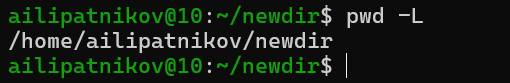{#fig-021 width=70%}

Выполнение команды pwd -L
:::

# Результаты

В ходе работы выполнены все пункты последовательности выполнения работы. Перечень выполненных действий приведён в табл. -@tbl-results.

| Шаг | Действие | Результат |
|-----|----------|-----------|
| 1 | `pwd` | определено полное имя домашнего каталога |
| 2.2 | `ls`, `ls -a`, `ls -la` | получены три варианта просмотра содержимого /tmp |
| 2.3 | `cd /var/spool; ls` | проверено наличие подкаталога cron |
| 2.4 | `cd ~; ls -la` | определены владельцы файлов домашнего каталога |
| 3.1--3.2 | `mkdir newdir`, `mkdir morefun` | созданы каталоги newdir и ~/newdir/morefun |
| 3.3 | `mkdir letters memos misk` | созданы и удалены три каталога |
| 3.4 | `rm newdir` | каталог не удалён (без опции -r) |
| 3.5 | `rmdir newdir/morefun` | подкаталог удалён |
| 4--5 | `ls -R`, `ls -lt` | изучены опции рекурсии и сортировки по времени |
| 6 | `man cd pwd mkdir rmdir rm` | изучены описания пяти команд |
| 7 | `rm -r newdir`, `pwd -L` | команды исполнены из буфера команд |

: Перечень выполненных действий {#tbl-results}

Каталог ~/newdir/morefun удалён командой rmdir, каталог ~/newdir удалён командой rm -r; каталоги letters, memos, misk созданы и удалены. Все действия зафиксированы на 21 скриншоте.

# Обсуждение результатов

Полученные результаты соответствуют теоретическим ожиданиям:

- Команды ls без опций, с опцией -a и с опциями -la дают различный объём информации: без опций выводятся только имена файлов, опция -a добавляет скрытые файлы (имена начинаются с точки), опции -la --- подробную информацию о каждом объекте.
- Команда rm без опций отказалась удалять каталог newdir: без опции -r каталоги не удаляются. Это встроенная защита от случайного удаления данных, а не ошибка выполнения.
- Команда rmdir удалила пустой каталог morefun; каталог с содержимым она бы удалить не смогла.
- Команда rm -r корректно удалила каталог newdir вместе с содержимым.
- Опция -L команды pwd выводит логический путь (значение переменной окружения PWD), в отличие от опции -P, которая разрешает символические ссылки и выводит физический путь.
- Модификация команд из истории (!номер:s/.../...) позволяет исправить ранее введённую команду без повторного набора --- сокращает объём ручного ввода.

Практическая значимость результатов: освоенные команды и приёмы работы с историей команд применяются во всех последующих лабораторных работах курса.

# Заключение

- Цель работы достигнута: приобретены практические навыки взаимодействия пользователя с системой посредством командной строки.
- Освоены команды навигации (cd, pwd), просмотра содержимого каталогов (ls с опциями -a, -l, -F, -R, -t), создания (mkdir) и удаления (rm, rmdir) каталогов.
- Изучена справочная система man для пяти основных команд.
- Освоена работа с историей команд: модификация и повторное исполнение команд из буфера.

# Список литературы {.unnumbered}

::: {#refs}
:::

\appendix

# Ответы на контрольные вопросы {.appendix}

1. **Что такое командная строка?** Текстовый интерфейс взаимодействия пользователя с операционной системой: команды вводятся построчно и интерпретируются командной оболочкой (shell).

2. **При помощи какой команды можно определить абсолютный путь текущего каталога?** Команда pwd (print working directory). Пример: pwd выводит /home/user.

3. **При помощи какой команды и каких опций можно определить только тип файлов и их имена в текущем каталоге?** Команда ls с опцией -F: в поле имени выводится символ типа файла (/ --- каталог, * --- исполняемый файл, @ --- ссылка). Пример: ls -F.

4. **Каким образом отобразить информацию о скрытых файлах?** Командой ls с опцией -a (или -A). Пример: ls -a ~.

5. **При помощи каких команд можно удалить файл и каталог? Можно ли это сделать одной и той же командой?** Файл удаляется командой rm имя_файла, пустой каталог --- командой rmdir имя_каталога, каталог с содержимым --- командой rm -r имя_каталога. Да, командой rm с опцией -r можно удалить и файл, и каталог.

6. **Каким образом можно вывести информацию о последних выполненных пользователем командах?** Командой history; для вывода последних N команд --- history N.

7. **Как воспользоваться историей команд для их модифицированного выполнения?** Обратиться к команде по номеру и применить замену: !<номер>:s/<что_меняем>/<на_что_меняем>. Пример: !3:s/a/F преобразует ls -a в ls -F и выполнит её.

8. **Приведите примеры запуска нескольких команд в одной строке.** С помощью символа «;»: cd; ls. Также возможно: cd && ls (вторая команда выполнится только при успехе первой).

9. **Дайте определение и приведите примеры символов экранирования.** Экранирование --- отключение специального значения символа путём постановки перед ним обратного слэша «\\». Примеры: ls \* (звёздочка не раскрывается как шаблон), echo \$HOME (имя переменной выводится как текст).

10. **Охарактеризуйте вывод информации на экран после выполнения команды ls с опцией l.** Выводится подробная информация по каждому объекту в отдельной строке: тип файла и права доступа, число ссылок, владелец, группа, размер, дата последней ревизии, имя.

11. **Что такое относительный путь к файлу?** Путь, отсчитываемый от текущего каталога, в отличие от абсолютного пути, отсчитываемого от корня «/». Примеры: относительный --- cd ../work, ls ./dir; абсолютный --- ls /var/spool, cd ~/work.

12. **Как получить информацию об интересующей вас команде?** Командой man <имя_команды>; также доступны info <имя_команды> и <имя_команды> --help.

13. **Какая клавиша или комбинация клавиш служит для автоматического дополнения вводимых команд?** Клавиша Tab: первое нажатие дополняет имя команды или файла, повторное (Tab-Tab) выводит список возможных вариантов продолжения.
