---
## Author
author:
  name: Липатников Андрей
  email: 1032253853@rudn.ru
  affiliation:
    - name: Российский университет дружбы народов
      country: Российская Федерация
      postal-code: 117198
      city: Москва
      address: ул. Миклухо-Маклая, д. 6
## Title
title: Лабораторная работа №7
subtitle: Анализ файловой системы Linux. Команды для работы с файлами и каталогами
license: CC BY
date: today
date-format: "2026-10-08"
---

# Информация

## Докладчик

:::::::::::::: {.columns align=center}
::: {.column width="70%"}

  * Липатников Андрей
  * Студент Российского университета дружбы народов им. П. Лумумбы
  * [1032253853@rudn.ru](mailto:1032253853@rudn.ru)

:::
::: {.column width="30%"}

:::
::::::::::::::

::: notes
- Поприветствовать аудиторию.
- Кратко представиться: «Выполнил лабораторную работу №7 по анализу файловой системы Linux».
:::

# Вводная часть

## Актуальность

- 90% работы администратора Linux --- терминал и файловая система
- Ошибки в правах доступа --- источник уязвимостей и потери данных
- `fsck` и `mkfs` --- последние инструменты спасения при сбое диска

::: notes
- Яркий факт для начала: любая команда, которую вводит системный администратор, работает с файловой системой.
- Навыки этой работы нужны во всех последующих лабораторных курса.
- Время: не более 1 минуты на этот слайд.
:::

## Цель и задачи

- Цель: ознакомление с файловой системой Linux, её структурой, именами и содержанием каталогов; практические навыки работы с файлами и каталогами, процессами и обслуживанием ФС
- Задачи:
    - Выполнить примеры методических указаний
    - Определить опции `chmod` для заданных прав
    - Выполнить упражнения с `feathers` и `play`
    - Прочитать `man` по `mount`, `fsck`, `mkfs`, `kill`
    - Ответить на контрольные вопросы

::: notes
- Пять задач --- по методичке, каждая соответствует блоку слайдов.
- Цель сформулирована дословно по методическим указаниям.
:::

# Материалы и методы

## Среда и методика

- **ОС**: Fedora 41 (Sway) в VirtualBox, терминал bash
- **Инструменты**: стандартные утилиты GNU (`touch`, `cp`, `mv`, `chmod`, `mount`, `df`, `fsck`, `mkfs`, `kill`)
- Методика: задание из методички --- справка `man` --- фиксация скриншотом
- Все 27 шагов задокументированы снимками

::: notes
- Среда изолирована в виртуальной машине.
- Подробная таблица команд --- в отчёте и в резервных слайдах.
:::

# Содержание исследования

## Файлы и каталоги

- Создание и просмотр: `touch`, `cat`, `less`, `head`, `tail`
- Копирование: `cp` (опция `-r` для каталогов)
- Перемещение и переименование: `mv` --- файлы и каталоги

{width=55%}

::: notes
- Принцип: у cp и mv одинаковое устройство аргументов --- источник, приёмник.
- Один снимок показан как пример; полная цепочка шагов --- в резерве.
:::

## Права доступа: chmod

- Символьная форма: `chmod u+x may`, `chmod g-r,o-r monthly`
- Числовая форма: `australia` --- 744 (`rwxr--r--`), `my_os` --- 544 (`r-xr--r--`)
- Ключевой вывод: право `x` для каталога --- право входа в него

{width=55%}

::: notes
- Упражнения с feathers и play: лишение u-r блокирует cat и cp, лишение u-x блокирует cd.
- В методичке опечатка: /etc/password --- правильно /etc/passwd.
:::

## Анализ и обслуживание файловой системы

- Анализ: `mount` (список ФС), `df` (свободное место), `/etc/fstab` (статическая конфигурация)
- Обслуживание: `fsck` --- проверка целостности, `mkfs` --- создание ФС
- Обе операции требуют прав root

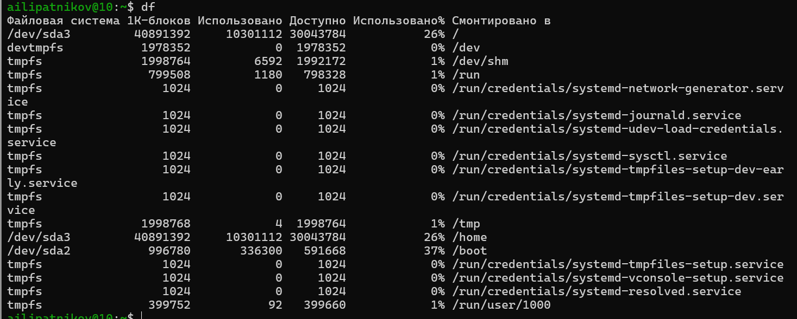{width=55%}

::: notes
- mount без параметров --- список смонтированных ФС; используется в ответе на контрольный вопрос 1.
- mkfs уничтожает данные на разделе --- осторожность.
:::

## Управление процессами

- `kill PID` --- сигнал завершения (SIGTERM по умолчанию)
- `kill -9 PID` --- принудительный SIGKILL

{width=55%}

::: notes
- Если процесса с таким PID нет --- выводится ошибка.
:::

# Результаты

## Полученные результаты

| Результат | Команды |
|-----------|---------|
| Файлы и каталоги | `touch`, `cat`, `less`, `head`, `tail`, `cp`, `mv`, `mkdir` |
| Права доступа | `chmod` (символьная и числовая формы) |
| Анализ ФС | `mount`, `df`, `cat /etc/fstab` |
| Обслуживание ФС и процессы | `fsck`, `mkfs`, `kill` |

::: notes
- Таблица из четырёх строк --- в пределах правила пяти.
- Все задания методички выполнены, зафиксированы 27 скриншотами (полная цепочка --- в резерве).
:::

# Заключение

## Главный вывод

Освоены команды работы с файлами и каталогами, управление правами доступа в двух формах записи, анализ и обслуживание файловой системы Linux и управление процессами. Командная строка --- универсальный инструмент администрирования, и эти навыки --- основа всех последующих лабораторных работ курса.

::: notes
- Финальный аккорд: повторить главную мысль, сделать паузу.
- Затем устно: «Я готов ответить на ваши вопросы».
- Дальше --- резервные слайды: открывать только по конкретным вопросам.
:::

# Резерв

## Резерв: примеры первой части методички

::: incremental

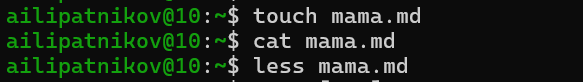{width=60%}

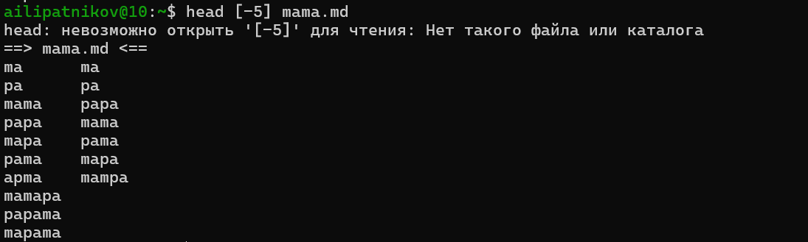{width=60%}

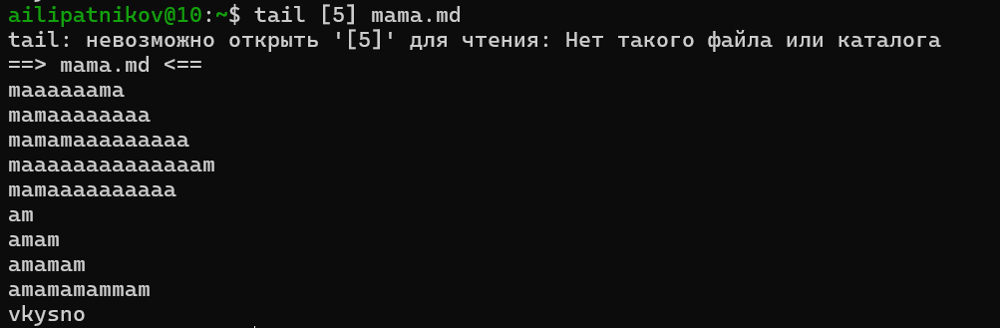{width=60%}

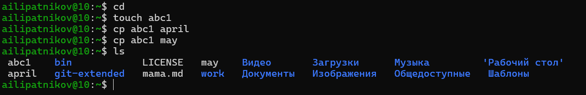{width=60%}

{width=60%}

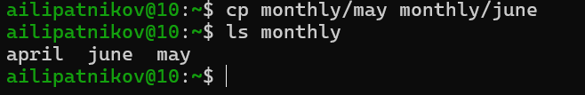{width=60%}

{width=60%}

:::

::: notes
- Резервный слайд: листать по клику только если спросят конкретный шаг.
- Шаги: touch/cat/less (01), head (02), tail (03), cp abc1 (04), cp в monthly (05), cp с новым именем (06), cp -r (07).
:::

## Резерв: переименование и перемещение

::: incremental

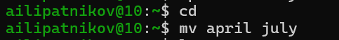{width=60%}

{width=60%}

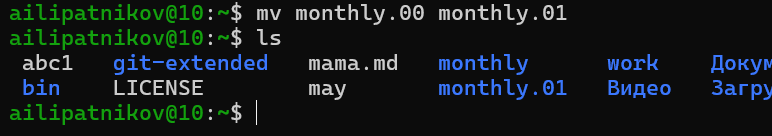{width=60%}

{width=60%}

:::

::: notes
- mv april july (08), mv july в monthly.00 (09), переименование каталога (10), перемещение в reports (11).
:::

## Резерв: права доступа и проверка ФС

::: incremental

{width=60%}

{width=60%}

{width=60%}

{width=60%}

:::

::: notes
- chmod u+x (12), u-x (13), g-r,o-r (14), g+w (15).
:::

## Резерв: анализ файловой системы

::: incremental

{width=60%}

{width=60%}

{width=60%}

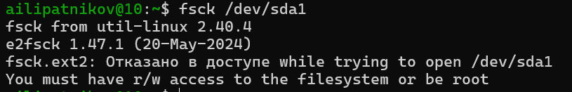{width=60%}

:::

::: notes
- mount (16), fstab (17), df (18), fsck /dev/sda1 (19).
:::

## Резерв: упражнения feathers и play

::: incremental

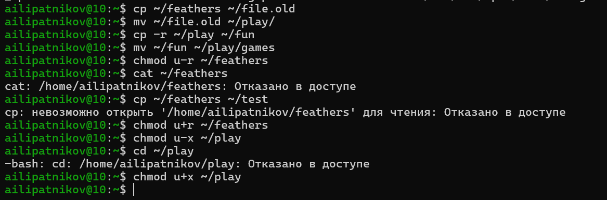{width=60%}

{width=60%}

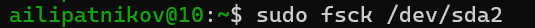{width=60%}

{width=60%}

{width=60%}

:::

::: notes
- Упражнения feathers/play (23), затем примеры: mount (24), fsck (25), mkfs (26), kill (27).
:::

## Резерв: ski.plases и восьмеричные права

::: incremental

{width=60%}

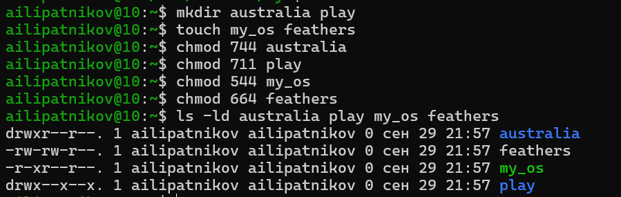{width=60%}

{width=60%}

:::

::: notes
- Копирование equipment (20), ski.plases (21), восьмеричные права (22).
:::
