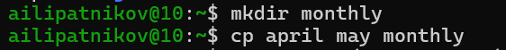
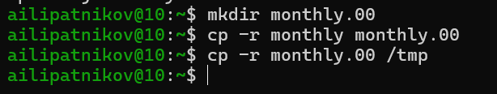
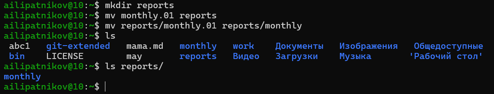
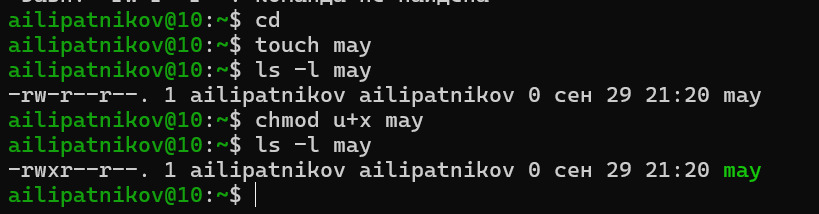
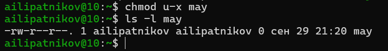
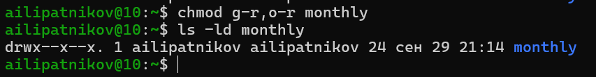
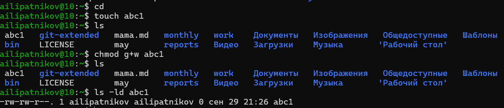
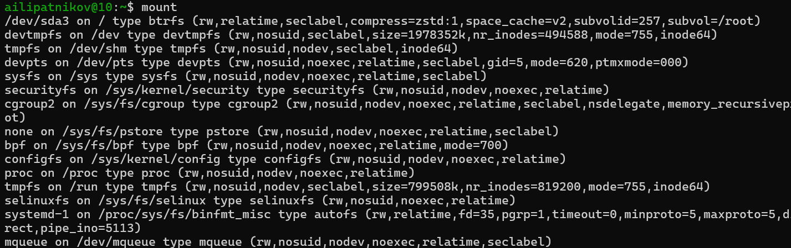
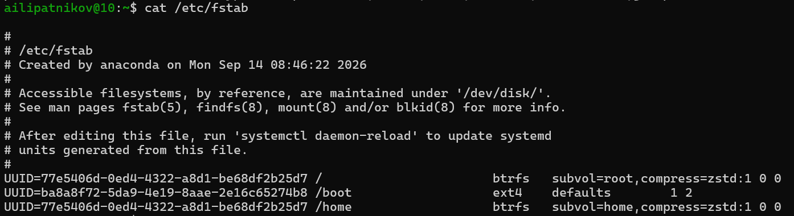
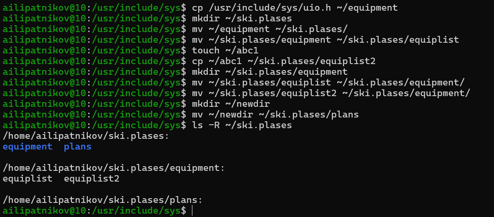

---
## Author
author:
  name: Липатников Андрей
  email: 1032253853@rudn.ru
  affiliation:
    - name: Российский университет дружбы народов
      country: Российская Федерация
      postal-code: 117198
      city: Москва
      address: ул. Миклухо-Маклая, д. 6

## Title
title: "Лабораторная работа №7"
subtitle: "Анализ файловой системы Linux. Команды для работы с файлами и каталогами"
license: "CC BY"
abstract: |
  В данном отчёте представлены результаты выполнения лабораторной работы по теме «Анализ файловой системы Linux. Команды для работы с файлами и каталогами».

  Описаны команды работы с файлами и каталогами, управление правами доступа, анализ и обслуживание файловой системы, а также управление процессами.

  Сделаны выводы о достижении поставленной цели.
keywords: [лабораторная работа, Linux, файловая система, chmod, cp, mv, df, fsck, kill]
date: today
date-format: "2026-10-08" # Example: 2025-09-06
---

# Введение

## Актуальность

Файловая система --- фундамент операционной системы Linux. Владение командами работы с файлами, каталогами и правами доступа необходимо для администрирования, разработки и повседневной работы. Команды анализа и обслуживания файловой системы позволяют диагностировать и восстанавливать данные.

## Цель работы

Ознакомление с файловой системой Linux, её структурой, именами и содержанием каталогов. Приобретение практических навыков по применению команд для работы с файлами и каталогами, по управлению процессами (и работами), по проверке использования диска и обслуживанию файловой системы.

## Задачи

1. Изучить команды работы с файлами (`touch`, `cat`, `less`, `head`, `tail`) и каталогами (`mkdir`, `cp`, `mv`).
2. Освоить управление правами доступа (`chmod`) в символьной и числовой формах.
3. Изучить команды анализа файловой системы (`mount`, `cat /etc/fstab`, `df`, `fsck`).
4. Выполнить практические задания методических указаний, зафиксировав каждый шаг скриншотом.
5. Освоить обслуживание файловой системы (`mkfs`, `fsck`) и управление процессами (`kill`).

## Объект и предмет исследования

Объект --- файловая система Linux.

Предмет --- команды работы с файлами и каталогами, управление правами доступа, анализ и обслуживание файловой системы.

## Методы исследования

Практическая работа в терминале, изучение `man`-справок, выполнение заданий методических указаний, фиксация результатов скриншотами.

## Схема выполнения работы

На рис. -@fig-flowchart представлена общая последовательность действий при выполнении работы.

::: {#fig-flowchart}

```{mermaid}
%%| fig-width: 100%
graph TD
    A@{ shape: circle, label: "Начало" } --> B[Изучить команды]
    B --> C[Выполнить задания]
    C --> D[Зафиксировать скриншотами]
    D --> E[Занести в отчёт]
    E --> F[Поместить в git-репозиторий]
    F --> G[Сделать релиз git]
    G --> H@{ shape: dbl-circ, label: "Конец" }
```

Блок-схема выполнения лабораторной работы

:::

# Теоретическая часть

## Команды работы с файлами

Для создания пустого файла используется `touch`, для просмотра --- `cat` (целиком) и `less` (постранично, клавиши [Space], ENTER, [b], [h], [q]). Команда `head` выводит по умолчанию первые 10 строк файла, `tail` --- 10 последних строк; число строк задаётся опцией `-n`. Основные команды сведены в табл. -@tbl-file-cmds.

| Команда | Назначение |
|---------|-----------|
| `touch имя-файла` | Создать пустой файл |
| `cat имя-файла` | Просмотр файла целиком |
| `less имя-файла` | Постраничный просмотр |
| `head [-n] имя-файла` | Первые n строк (по умолчанию 10) |
| `tail [-n] имя-файла` | Последние n строк (по умолчанию 10) |

: Команды просмотра файлов {#tbl-file-cmds}

## Команды работы с каталогами

Копирование выполняется командой `cp` (для каталогов обязательна опция `-r`), перемещение и переименование --- `mv`, создание каталогов --- `mkdir`. Основные команды сведены в табл. -@tbl-dir-cmds.

| Команда | Назначение |
|---------|-----------|
| `cp` | Копирование файлов и каталогов (`-r` для каталогов) |
| `mv` | Перемещение и переименование |
| `mkdir` | Создание каталогов (`-p` для вложенных) |
| `rm` | Удаление файлов (`-r` для каталогов) |
| `rmdir` | Удаление пустых каталогов |

: Команды работы с каталогами {#tbl-dir-cmds}

## Права доступа

Каждый файл или каталог имеет права доступа для трёх категорий: владелец (`u`), группа (`g`), остальные (`o`). Права: `r` (чтение), `w` (запись), `x` (выполнение). Права доступа к файлу или каталогу можно изменить командой `chmod`; сделать это может владелец файла или администратор. Режим команды составляется из операций (`=` установить право, `+` дать право, `-` лишить права), категорий (`u`, `g`, `o`) и самих прав. Помимо символьной записи используется восьмеричная (табл. -@tbl-chmod).

| Двоичная | Восьмеричная | Символьная |
|----------|--------------|------------|
| 111 | 7 | rwx |
| 110 | 6 | rw- |
| 101 | 5 | r-x |
| 100 | 4 | r-- |
| 011 | 3 | -wx |
| 010 | 2 | -w- |
| 001 | 1 | --x |
| 000 | 0 | --- |

: Формы записи прав доступа {#tbl-chmod}

## Анализ и обслуживание файловой системы

Существует несколько типов файловых систем; наиболее часто встречаются ext2fs, ext3fs, ext4, ReiserFS, xfs, fat, ntfs. Список смонтированных файловых систем выводит команда `mount` без параметров; статическая информация о монтировании хранится в файле `/etc/fstab`. Объём свободного пространства показывает команда `df`. Целостность файловой системы проверяет (а в ряде случаев восстанавливает) команда `fsck имя_устройства`; создавать файловую систему на разделе позволяет семейство команд `mkfs`.

## Управление процессами

Команда `kill PID` отправляет процессу сигнал завершения (по умолчанию SIGTERM), `kill -9 PID` --- принудительный сигнал SIGKILL.

В табл. -@tbl-std-dir приведено краткое описание стандартных каталогов Unix.

| Имя каталога | Описание каталога |
|--------------|-------------------|
| `/` | Корневая директория, содержащая всю файловую систему |
| `/bin` | Основные системные утилиты, необходимые как в однопользовательском режиме, так и при обычной работе всем пользователям |
| `/etc` | Общесистемные конфигурационные файлы и файлы конфигурации установленных программ |
| `/home` | Содержит домашние директории пользователей, которые, в свою очередь, содержат персональные настройки и данные пользователя |
| `/media` | Точки монтирования для сменных носителей |
| `/root` | Домашняя директория пользователя `root` |
| `/tmp` | Временные файлы |
| `/usr` | Вторичная иерархия для данных пользователя |

: Описание некоторых каталогов файловой системы GNU Linux {#tbl-std-dir}

Более подробно про Unix см. в [@tanenbaum_book_modern-os_ru; @robbins_book_bash_en; @zarrelli_book_mastering-bash_en; @newham_book_learning-bash_en].

# Материалы и методы

Работа выполнялась в виртуальной машине со следующей конфигурацией:

- операционная система: Fedora 41 (графическая среда Sway);
- командная оболочка: bash;
- инструментальные средства: стандартные утилиты GNU (`touch`, `cat`, `less`, `head`, `tail`, `cp`, `mv`, `mkdir`, `chmod`, `mount`, `df`, `fsck`, `mkfs`, `kill`), справочная система `man`.

Последовательность действий: изучение справки команды, выполнение примера из методических указаний, фиксация результата скриншотом, занесение результата в отчёт.

# Выполнение лабораторной работы

## Задание 1: примеры из первой части методических указаний

Выполнены все примеры, приведённые в первой части описания лабораторной работы (просмотр файлов, копирование, перемещение, права доступа, анализ файловой системы). Скриншоты выполнения приведены ниже по ходу отчёта.

## Задание 2: команды и результаты выполнения

### Шаг 2.1: создание и просмотр файла

```bash
touch mama.md
cat mama.md
less mama.md
```

Файл `mama.md` создан командой `touch`; его пустое содержимое показано командами `cat` и `less` (рис. -@fig-001).

{#fig-001 width=70%}

### Шаг 2.2: вывод первых строк файла

```bash
head [-5] mama.md
```

Проверена команда `head` с указанием числа строк (рис. -@fig-002).

{#fig-002 width=70%}

### Шаг 2.3: вывод последних строк файла

```bash
tail [5] mama.md
```

Проверена команда `tail` с указанием числа строк (рис. -@fig-003).

{#fig-003 width=70%}

### Шаг 2.4: копирование файла в текущем каталоге

```bash
cd
touch abc1
cp abc1 april
cp abc1 may
ls
```

Файл `abc1` скопирован в файлы `april` и `may` (рис. -@fig-004).

{#fig-004 width=70%}

### Шаг 2.5: копирование нескольких файлов в каталог

```bash
mkdir monthly
cp april may monthly
```

Создан каталог `monthly`, в него скопированы файлы `april` и `may` (рис. -@fig-005).

{#fig-005 width=70%}

### Шаг 2.6: копирование с новым именем

```bash
cp monthly/may monthly/june
ls monthly
```

Файл `monthly/may` скопирован в файл `monthly/june`; содержимое каталога показано командой `ls` (рис. -@fig-006).

{#fig-006 width=70%}

### Шаг 2.7: рекурсивное копирование каталогов

```bash
mkdir monthly.00
cp -r monthly monthly.00
cp -r monthly.00 /tmp
```

Каталог `monthly` скопирован в `monthly.00`, затем `monthly.00` --- в каталог `/tmp`. Для копирования каталогов использована опция `-r` (рис. -@fig-007).

{#fig-007 width=70%}

### Шаг 2.8: переименование файла

```bash
cd
mv april july
```

Файл `april` переименован в `july` командой `mv` в текущем каталоге (рис. -@fig-008).

{#fig-008 width=70%}

### Шаг 2.9: перемещение файла в другой каталог

```bash
mv july monthly.00
ls monthly.00
```

Файл `july` перемещён в каталог `monthly.00`; результат подтверждён командой `ls` (рис. -@fig-009).

{#fig-009 width=70%}

### Шаг 2.10: переименование каталога

```bash
mv monthly.00 monthly.01
ls
```

Каталог `monthly.00` переименован в `monthly.01` (рис. -@fig-010).

{#fig-010 width=70%}

### Шаг 2.11: перемещение каталога в другой каталог

```bash
mkdir reports
mv monthly.01 reports
mv reports/monthly.01 reports/monthly
ls
```

Каталог `monthly.01` перемещён в каталог `reports` и переименован в `reports/monthly` (рис. -@fig-011).

{#fig-011 width=70%}

## Задание 3: управление правами доступа

### Шаг 3.1: право выполнения для владельца

```bash
cd
touch may
ls -l may
chmod u+x may
ls -l may
```

Файлу `may` предоставлено право выполнения для владельца (`u+x`) (рис. -@fig-012).

{#fig-012 width=70%}

### Шаг 3.2: лишение права выполнения

```bash
chmod u-x may
ls -l may
```

У владельца файла `may` отнято право выполнения (`u-x`) (рис. -@fig-013).

{#fig-013 width=70%}

### Шаг 3.3: запрет чтения для группы и остальных

```bash
chmod g-r, o-r monthly
ls -ld monthly
```

Каталогу `monthly` запрещено чтение для членов группы и всех остальных (`g-r, o-r`) (рис. -@fig-014).

{#fig-014 width=70%}

### Шаг 3.4: право записи для группы

```bash
cd
touch abc1
chmod g+w abc1
ls -ld abc1
```

Файлу `abc1` предоставлено право записи для членов группы (`g+w`) (рис. -@fig-015).

{#fig-015 width=70%}

## Задание 4: анализ и обслуживание файловой системы

### Шаг 4.1: список смонтированных файловых систем

```bash
mount
```

Команда `mount` без параметров вывела список смонтированных файловых систем с именами устройств, точками монтирования, типами и опциями (рис. -@fig-016).

{#fig-016 width=70%}

### Шаг 4.2: файл /etc/fstab

```bash
cat /etc/fstab
```

Показано содержимое файла `/etc/fstab` со статической информацией о монтировании (рис. -@fig-017).

{#fig-017 width=70%}

### Шаг 4.3: свободное место на файловой системе

```bash
df
```

Команда `df` вывела список файловых систем с размером, занятым и свободным объёмом, процентом использования и точкой монтирования (рис. -@fig-018).

{#fig-018 width=70%}

### Шаг 4.4: проверка целостности файловой системы

```bash
fsck /dev/sda1
```

Выполнена проверка целостности файловой системы командой `fsck` (рис. -@fig-019).

{#fig-019 width=70%}

## Задание 5: работа с файлами и каталогами (ski.plases)

### Шаг 5.1: копирование файла с новым именем

```bash
cp /usr/include/sys/uio.h ~/equipment
```

Файл из каталога `/usr/include/sys/` скопирован в домашний каталог под именем `equipment` (использован файл `uio.h`, так как файла `io.h` в системе нет) (рис. -@fig-020).

{#fig-020 width=70%}

### Шаг 5.2–5.8: каталог ski.plases

```bash
mkdir ~/ski.plases
mv ~/equipment ~/ski.plases
mv ~/ski.plases/equipment ~/ski.plases/equiplist
touch ~/abc1
cp ~/abc1 ~/ski.plases/equiplist2
mkdir ~/ski.plases/equipment
mv ~/ski.plases/equiplist ~/ski.plases/equiplist2 ~/ski.plases/equipment
mkdir ~/newdir
mv ~/newdir ~/ski.plases/plans
ls -R ~/ski.plases
```

Выполнены пункты 2.2--2.8 методических указаний: создан каталог `~/ski.plases`, файл `equipment` перемещён в него и переименован в `equiplist`; создан файл `equiplist2` копией `abc1`; создан каталог `equipment`, в который перемещены оба файла; каталог `~/newdir` перемещён в `~/ski.plases` под именем `plans` (рис. -@fig-021).

{#fig-021 width=70%}

## Задание 6: права в числовой форме

```bash
cd
mkdir australia play
touch my_os feathers
chmod 744 australia
chmod 711 play
chmod 544 my_os
chmod 664 feathers
ls -l australia play my_os feathers
```

Определены права в восьмеричной записи: `australia` --- 744 (`rwxr--r--`), `play` --- 711 (`rwx--x--x`), `my_os` --- 544 (`r-xr--r--`), `feathers` --- 664 (`rw-rw-r--`) (рис. -@fig-022).

{#fig-022 width=70%}

## Задание 7: упражнения с feathers и play

```bash
cat /etc/passwd
cp ~/feathers ~/file.old
mv ~/file.old ~/play
cp -r ~/play ~/fun
mv ~/fun ~/play/games
chmod u-r ~/feathers
cat ~/feathers
cp ~/feathers ~/month
chmod u+r ~/feathers
chmod u-x ~/play
cd ~/play
chmod u+x ~/play
```

Просмотрено содержимое `/etc/passwd` (список пользователей; в тексте методических указаний имя файла приведено с опечаткой `password`). Затем: файл `~/feathers` скопирован в `~/file.old`; `file.old` перемещён в `~/play`; каталог `~/play` скопирован в `~/fun`; `fun` перемещён в `~/play` с именем `games`. Далее выполнены упражнения с правами: лишение владельца `~/feathers` права чтения (`u-r`) приводит к ошибке «Permission denied» при попытках `cat` и `cp`; после возврата права (`u+r`) операции проходят. Лишение владельца каталога `~/play` права выполнения (`u-x`) делает невозможным переход в каталог командой `cd`; после возврата права (`u+x`) переход снова работает (рис. -@fig-023).

{#fig-023 width=70%}

## Задание 8: man по командам mount, fsck, mkfs, kill

Прочитаны справочные страницы команд `mount`, `fsck`, `mkfs`, `kill`; краткие характеристики приведены в теоретической части. Ниже приведены примеры применения.

### Пример mount

```bash
sudo mount /dev/sdb1 /mnt/usb
```

Файловая система устройства `/dev/sdb1` смонтирована в каталог `/mnt/usb` (рис. -@fig-024).

{#fig-024 width=70%}

### Пример fsck

```bash
sudo fsck /dev/sda2
```

Выполнена проверка целостности файловой системы на устройстве `/dev/sda2` (рис. -@fig-025).

{#fig-025 width=70%}

### Пример mkfs

```bash
sudo mkfs.ext4 /dev/sdb1
```

На устройстве `/dev/sdb1` создана файловая система ext4 (рис. -@fig-026).

{#fig-026 width=70%}

### Пример kill

```bash
kill 1234
```

Процессу с идентификатором 1234 отправлен сигнал завершения (рис. -@fig-027).

{#fig-027 width=70%}

# Результаты

В ходе работы выполнены все примеры первой части методических указаний и все задания пунктов 2--5, зафиксированные 27 скриншотами (рис. -@fig-001 --- -@fig-027). Сводка полученных результатов приведена в табл. -@tbl-results.

| Действие | Результат |
|----------|-----------|
| Просмотр файлов | Файлы создаются командой `touch`, просматриваются `cat`/`less`, `head`/`tail` выводят первые/последние строки |
| Копирование | `cp` копирует файлы с переименованием; каталоги копируются только с опцией `-r` |
| Перемещение | `mv` переименовывает и перемещает файлы и каталоги |
| Права доступа | `chmod` изменяет права в символьной (`u+x`, `g-r, o-r`, `g+w`) и числовой (744, 711, 544, 664) формах |
| Анализ ФС | `mount`, `cat /etc/fstab` и `df` выводят список ФС, точки монтирования и свободное место |
| Обслуживание ФС | `fsck` проверяет целостность, `mkfs` создаёт файловую систему |
| Процессы | `kill` завершает процесс по идентификатору |

: Сводка результатов выполнения заданий {#tbl-results}

# Обсуждение результатов

Полученные результаты соответствуют теоретическим ожиданиям. Копирование каталогов командой `cp` без опции `-r` невозможно --- это поведение полностью согласуется с документацией. `chmod` в символьной форме удобен для точечного изменения отдельных прав, в числовой --- для задания полного набора прав сразу. Проверка и создание файловых систем (`fsck`, `mkfs`) требуют прав администратора, что согласуется с принципом разделения привилегий в Unix. Символическая форма записи прав в задании 3 была переведена в восьмеричную по табл. -@tbl-chmod: `rwx` = 7, `r--` = 4, `--x` = 1, `rw-` = 6.

# Заключение

- Цель работы достигнута: выполнено ознакомление с файловой системой Linux, её структурой, именами и содержанием каталогов.
- Приобретены практические навыки применения команд для работы с файлами и каталогами (`touch`, `cat`, `less`, `head`, `tail`, `cp`, `mv`, `mkdir`).
- Освоено управление правами доступа командой `chmod` в символьной и числовой формах.
- Освоены команды проверки использования диска и обслуживания файловой системы (`mount`, `df`, `fsck`, `mkfs`).
- Освоено управление процессами командой `kill`.

Полученные навыки являются основой для дальнейшей работы с операционной системой и последующих лабораторных работ курса.

# Список литературы {.unnumbered}

::: {#refs}
:::

\appendix

# Приложение А. Ответы на контрольные вопросы {.appendix}

## 1. Характеристика файловых систем на жёстком диске

По выводу команд `mount` и `df` на виртуальной машине (рис. -@fig-016, -@fig-018) присутствуют следующие файловые системы (сверить с собственным выводом): корневой раздел с файловой системой ext4 (журналируемая файловая система, наиболее распространённая в современных дистрибутивах Linux), загрузочный раздел (ext4), раздел подкачки swap (используется ядром для выгрузки страниц памяти, файловой системой в обычном смысле не является), а также виртуальные файловые системы: `devtmpfs` (`/dev`, файлы устройств), `tmpfs` (`/dev/shm`, `/run`, `/tmp` --- хранение в оперативной памяти), `proc` (`/proc` --- интерфейс к данным процессов и ядра), `sysfs` (`/sys` --- интерфейс к устройствам и драйверам), `cgroup2` (контроль групп ресурсов), `securityfs`, `bpf`, `configfs`, `pstore`, `autofs`, `mqueue`.

## 2. Общая структура файловой системы и каталоги первого уровня

Каталоги первого уровня приведены в табл. -@tbl-fs-appendix.

| Каталог | Назначение |
|---------|-----------|
| `/` | Корневая директория, содержащая всю файловую систему |
| `/bin` | Основные системные утилиты |
| `/boot` | Файлы загрузчика и ядро системы |
| `/dev` | Файлы устройств |
| `/etc` | Общесистемные конфигурационные файлы |
| `/home` | Домашние директории пользователей |
| `/lib` | Системные библиотеки |
| `/media` | Точки монтирования сменных носителей |
| `/mnt` | Точки временного монтирования |
| `/opt` | Дополнительное программное обеспечение |
| `/proc` | Виртуальная файловая система процессов |
| `/root` | Домашняя директория пользователя `root` |
| `/run` | Временные файлы с момента загрузки |
| `/sbin` | Системные утилиты администратора |
| `/srv` | Данные сервисов |
| `/sys` | Виртуальная файловая система ядра |
| `/tmp` | Временные файлы |
| `/usr` | Вторичная иерархия данных пользователя |
| `/var` | Переменные данные (журналы, кэш) |

: Каталоги первого уровня файловой системы {#tbl-fs-appendix}

## 3. Какая операция делает содержимое файловой системы доступным?

Монтирование командой `mount`: файловая система привязывается к точке монтирования --- каталогу в общем дереве каталогов, после чего её содержимое становится доступным операционной системе. Пример: `sudo mount /dev/sdb1 /mnt/usb`.

## 4. Причины нарушения целостности файловой системы и их устранение

Причины: внезапное отключение питания, аппаратные сбои накопителя или контроллера, ошибки ядра и драйверов, некорректное завершение работы системы, сбои при записи данных. Устранение: проверка и восстановление командой `fsck имя_устройства` (при необходимости с опцией `-y` для автоматического исправления обнаруженных ошибок); корневую файловую систему проверяют из восстановительного режима или с загрузочного носителя.

## 5. Как создаётся файловая система?

Командой семейства `mkfs` (например, `mkfs.ext4 /dev/sdb1`) на разделе создаётся структура файловой системы (форматирование). Все данные на разделе при этом уничтожаются.

## 6. Характеристика команд просмотра текстовых файлов

Характеристики сведены в табл. -@tbl-view-appendix.

| Команда | Характеристика |
|---------|----------------|
| `cat файл` | Выводит файл целиком в стандартный поток |
| `less файл` | Постраничный просмотр: [Space] --- следующая страница, ENTER --- строка вперёд, [b] --- назад, [q] --- выход |
| `head -n файл` | Первые n строк (по умолчанию 10) |
| `tail -n файл` | Последние n строк (по умолчанию 10) |
| `tail -f файл` | Слежение за файлом в реальном времени |

: Команды просмотра текстовых файлов {#tbl-view-appendix}

## 7. Основные возможности команды cp

Копирование файла в файл с тем же или новым именем; копирование нескольких файлов в каталог; рекурсивное копирование каталогов с опцией `-r`. Опции: `-i` --- запрос подтверждения перед перезаписью, `-n` --- не перезаписывать существующие файлы, `-v` --- подробный вывод, `-u` --- копировать только более новые файлы, `-p` --- сохранять атрибуты (время, права), `-a` --- архивный режим (рекурсивно с сохранением атрибутов).

## 8. Основные возможности команды mv

Перемещение файлов и каталогов в другой каталог; переименование файлов и каталогов в текущем каталоге; перемещение с одновременным переименованием. Опции: `-i` --- запрос подтверждения перед перезаписью, `-f` --- перезапись без подтверждения, `-n` --- не перезаписывать, `-v` --- подробный вывод, `-u` --- перемещать только более новые файлы.

## 9. Права доступа и их изменение

Права доступа --- разрешения для владельца (`u`), группы владельца (`g`) и всех остальных (`o`) на чтение (`r`), запись (`w`) и выполнение (`x`) файла; для каталога право выполнения означает право входа в него. Изменяются командой `chmod режим имя_файла` в символьной (`chmod u+x файл`, `chmod g-r, o-r каталог`) или восьмеричной (`chmod 744 файл`) форме. Изменять права может владелец файла или администратор.

# Приложение Б. Листинг выполненных команд {.appendix}

```bash
# Задание 2: файлы и каталоги
touch mama.md
cat mama.md
less mama.md
head -n 5 mama.md
tail -n 5 mama.md
cd
touch abc1
cp abc1 april
cp abc1 may
mkdir monthly
cp april may monthly
cp monthly/may monthly/june
ls monthly
mkdir monthly.00
cp -r monthly monthly.00
cp -r monthly.00 /tmp
cd
mv april july
mv july monthly.00
ls monthly.00
mv monthly.00 monthly.01
ls
mkdir reports
mv monthly.01 reports
mv reports/monthly.01 reports/monthly
ls

# Задание 3: права доступа
cd
touch may
ls -l may
chmod u+x may
ls -l may
chmod u-x may
ls -l may
mkdir monthly
chmod g-r, o-r monthly
ls -ld monthly
cd
touch abc1
chmod g+w abc1
ls -ld abc1

# Задание 4: анализ файловой системы
mount
cat /etc/fstab
df
fsck /dev/sda1

# Задание 5: ski.plases
cp /usr/include/sys/uio.h ~/equipment
mkdir ~/ski.plases
mv ~/equipment ~/ski.plases
mv ~/ski.plases/equipment ~/ski.plases/equiplist
touch ~/abc1
cp ~/abc1 ~/ski.plases/equiplist2
mkdir ~/ski.plases/equipment
mv ~/ski.plases/equiplist ~/ski.plases/equiplist2 ~/ski.plases/equipment
mkdir ~/newdir
mv ~/newdir ~/ski.plases/plans
ls -R ~/ski.plases

# Задание 6: права в числовой форме
mkdir australia play
touch my_os feathers
chmod 744 australia
chmod 711 play
chmod 544 my_os
chmod 664 feathers
ls -l australia play my_os feathers

# Задание 7: упражнения с feathers и play
cat /etc/passwd
cp ~/feathers ~/file.old
mv ~/file.old ~/play
cp -r ~/play ~/fun
mv ~/fun ~/play/games
chmod u-r ~/feathers
cat ~/feathers
cp ~/feathers ~/month
chmod u+r ~/feathers
chmod u-x ~/play
cd ~/play
chmod u+x ~/play

# Задание 8: примеры man
sudo mount /dev/sdb1 /mnt/usb
sudo fsck /dev/sda2
sudo mkfs.ext4 /dev/sdb1
kill 1234
```
