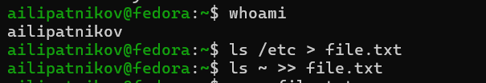
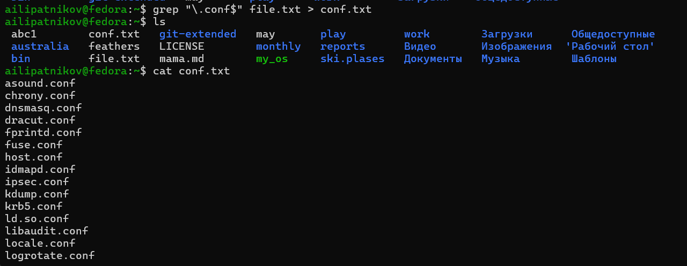
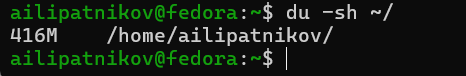

---
## Author
author:
  name: Липатников Андрей
  email: 1032253853@rudn.ru
  affiliation:
    - name: Российский университет дружбы народов
      country: Российская Федерация
      postal-code: 117198
      city: Москва
      address: ул. Миклухо-Маклая, д. 6

## Title
title: "Лабораторная работа №8"
subtitle: "Поиск файлов. Перенаправление ввода-вывода. Просмотр запущенных процессов"
license: "CC BY"
date: today
date-format: "2026-10-08"
---

# Информация

## Докладчик

:::::::::::::: {.columns align=center}
::: {.column width="70%"}

  * Липатников Андрей
  * Студент Российского университета дружбы народов им. П. Лумумбы
  * [1032253853@rudn.ru](mailto:1032253853@rudn.ru)

:::
::: {.column width="30%"}

:::
::::::::::::::

::: notes
- Поприветствовать аудиторию.
- Кратко представиться: «Выполнил лабораторную работу №6 по поиску файлов, перенаправлению ввода-вывода и процессам».
:::

# Вводная часть

## Актуальность

- Поиск и фильтрация --- ежедневные задачи администратора
- Перенаправление заменяет десятки ручных операций
- Зависший процесс угрожает стабильности системы

::: notes
- Конкретика: одна строка `ls /etc > file.txt` собирает список файлов быстрее, чем десятки копипаст.
- Пример из практики: зависший gedit снимается одной командой, если знать его PID.
- Время: не более 1 минуты.
:::

## Цель и задачи

- Цель:
    - Ознакомление с инструментами поиска файлов и фильтрации текстовых данных; практические навыки управления процессами и заданиями, проверки использования диска и обслуживания файловых систем.
- Задачи:
    - Освоить перенаправление потоков ввода-вывода
    - Освоить поиск файлов (`find`) и фильтрацию (`grep`)
    - Освоить запуск в фоне и управление процессами
    - Проверить использование диска (`df`, `du`)
    - Зафиксировать каждый шаг скриншотом

::: notes
- Цель --- дословно из п. 6.1 методических указаний.
- Пять задач --- по пунктам последовательности выполнения 6.3.
:::

# Материалы и методы

## Среда и методика

- **ОС**: Fedora 41 (Sway) в VirtualBox
- **Терминал**: bash
- **Инструменты**: `find`, `grep`, `ps`, `jobs`, `kill`, `pkill`, `df`, `du`, справочник `man`

::: notes
- Все команды --- стандартные утилиты GNU.
- Среда изолирована в виртуальной машине.
:::

# Содержание исследования

## Перенаправление потоков

- `stdin` (0) --- ввод, `stdout` (1) --- вывод, `stderr` (2) --- ошибки

| Оператор | Действие |
|----------|----------|
| `>` | Перезапись файла |
| `>>` | Добавление в конец |
| `2>` | Ошибки в файл |
| `&>` | stdout и stderr вместе |

::: notes
- Пример: `ls /etc > file.txt` --- перезапись, `ls ~ >> file.txt` --- дозапись.
- Дескрипторы 0, 1, 2 --- константы shell.
:::

## Поиск и фильтрация файлов

- `find` --- поиск по имени, типу, глубине
- `grep` --- фильтрация текста по шаблону
- Конвейер `|` --- цепочка фильтров

{width=60%}

::: notes
- Задание п. 4: три способа найти файлы на c: `find ~ -maxdepth 1 -name "c*"`, `ls ~/c*`, `ls ~ | grep "c"`.
- Задание п. 5: `ls /etc | grep "^h" | less` --- постраничный вывод.
:::

## Процессы и задания

- `gedit &` --- запуск в фоновом режиме
- `ps aux | grep gedit` --- поиск PID
- `pidof gedit`, `pgrep gedit` --- альтернативы
- `kill PID` --- завершение процесса

{width=60%}

::: notes
- PID определён тремя способами: конвейер, `pidof`, `pgrep`.
- По методичке --- `kill`; в практике применён `pkill` (завершение по имени). Оба варианта названы в отчёте.
:::

## Проверка использования диска

- `df -h` --- размер разделов и свободное место
- `du -sh ~` --- объём домашнего каталога

{width=60%}

::: notes
- Перед выполнением изучены man-справки обеих команд (п. 11 методички).
- Опция -h выводит размеры в человекочитаемом виде.
:::

# Результаты

## Полученные результаты

| Результат | Команды |
|-----------|---------|
| Перенаправление | `>`, `>>`, `2>`, `&>` |
| Поиск и фильтрация | `find`, `grep`, конвейер |
| Процессы | `ps`, `pidof`, `pgrep`, `jobs` |
| Завершение | `kill`, `pkill` |
| Диск | `df`, `du` |

::: notes
- Таблица из пяти строк --- в пределах правила.
- Выполнены пункты 2--12 методички, зафиксированы 10 скриншотами.
:::

# Заключение

## Главный вывод

Освоены поиск файлов и фильтрация текстовых данных командами `find` и `grep`, перенаправление потоков ввода-вывода, управление процессами и заданиями (запуск в фоне, определение PID, завершение), проверка использования диска командами `df` и `du`. Эти навыки --- основа автоматизации администрирования Linux.

::: notes
- Финальный аккорд: конвейер и перенаправление превращают отдельные команды в инструменты.
- После паузы: «Я готов ответить на ваши вопросы».
:::

# Резервные слайды

## Резерв: перенаправление потоков

::: incremental

{width=70%}

{width=70%}

:::

::: notes
- Пункты 2--3: `whoami`, запись `/etc` и `~` в `file.txt`, выборка `.conf` в `conf.txt`.
:::

## Резерв: поиск файлов

::: incremental

{width=70%}

{width=70%}

:::

::: notes
- Пункты 4--5: три способа поиска на c, постраничный вывод `/etc` на h.
:::

## Резерв: фоновый поиск

::: incremental

{width=70%}

:::

::: notes
- Пункты 6--7: фоновый поиск `find / -name "log*" > ~/logfile 2>/dev/null &`, `jobs`, удаление `~/logfile`.
:::

## Резерв: управление процессами

::: incremental

{width=70%}

{width=70%}

:::

::: notes
- Пункты 8--10: `gedit &`, PID тремя способами, завершение процесса.
:::

## Резерв: проверка диска

::: incremental

{width=70%}

{width=70%}

:::

::: notes
- Пункт 11: `df -h` и `du -sh ~/`.
:::

## Резерв: каталоги домашнего дерева

::: incremental

{width=70%}

:::

::: notes
- Пункт 12: `find ~ -type d` --- все директории домашнего каталога.
:::
