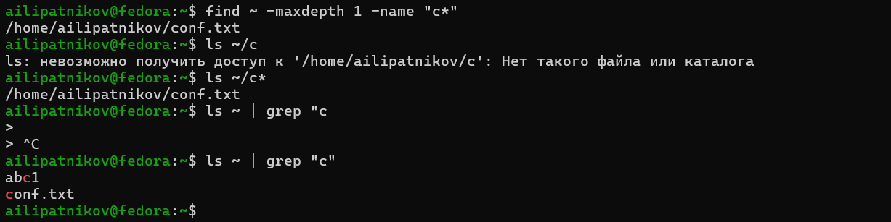
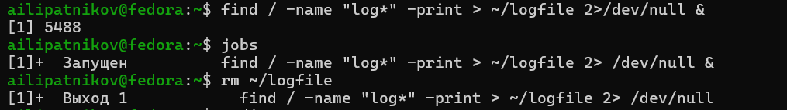
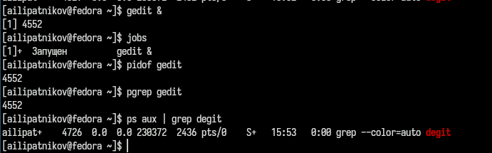
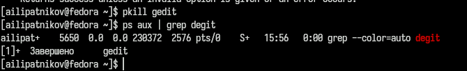
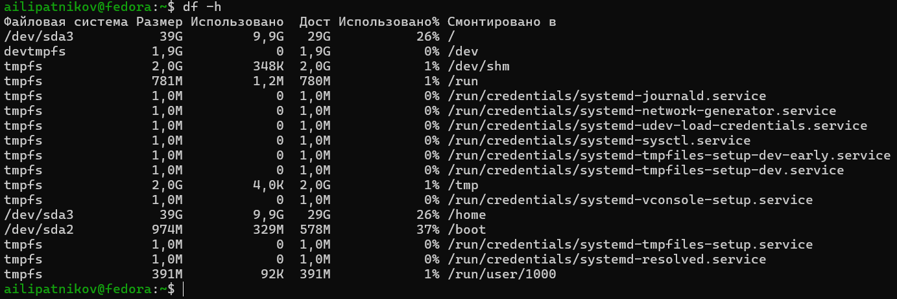
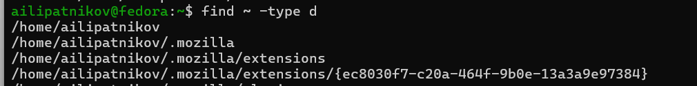

---
## Author
author:
  name: Липатников Андрей
  email: 1032253853@rudn.ru
  affiliation:
    - name: Российский университет дружбы народов
      country: Российская Федерация
      postal-code: 117198
      city: Москва
      address: ул. Миклухо-Маклая, д. 6

## Title
title: "Лабораторная работа №6"
subtitle: "Поиск файлов. Перенаправление ввода-вывода. Просмотр запущенных процессов"
license: "CC BY"
abstract: |
  В данном отчёте представлены результаты выполнения лабораторной работы по теме «Поиск файлов. Перенаправление ввода-вывода. Просмотр запущенных процессов».

  Описаны команды поиска файлов, фильтрации текстовых данных, перенаправления потоков ввода-вывода, а также управления задачами и процессами.

  Сделаны выводы о достижении поставленной цели.
keywords: [лабораторная работа, Linux, find, grep, перенаправление, процессы, jobs, kill, df, du]
date: today
date-format: "2026-10-08"
---

# Введение

## Актуальность

Поиск файлов и фильтрация текстовых данных --- подавляющая часть повседневной работы системного администратора в терминале. Перенаправление потоков ввода-вывода и конвейеры --- основа автоматизации рутинных операций. Управление процессами (зависший редактор, фоновый поиск) --- штатная ситуация, требующая владения командами `ps`, `kill`, `jobs`.

## Цель работы

Ознакомление с инструментами поиска файлов и фильтрации текстовых данных. Приобретение практических навыков: по управлению процессами (и заданиями), по проверке использования диска и обслуживанию файловых систем.

## Задачи

1. Освоить перенаправление потоков ввода-вывода (`>`, `>>`, `2>`, конвейеры).
2. Изучить поиск файлов командой `find` и фильтрацию текста командой `grep`.
3. Освоить управление задачами и процессами (`jobs`, `ps`, `pgrep`, `kill`, `pkill`).
4. Изучить проверку использования диска (`df`, `du`).
5. Выполнить задания методических указаний, зафиксировав каждый шаг скриншотом.

## Объект и предмет исследования

Объект --- механизмы поиска файлов и управления процессами в Linux.

Предмет --- команды поиска и фильтрации (`find`, `grep`), перенаправления потоков, управления задачами и процессами (`jobs`, `ps`, `kill`), проверки использования диска (`df`, `du`).

## Методы исследования

Практическая работа в терминале, изучение `man`-справок, выполнение заданий методических указаний, фиксация результатов скриншотами.

## Схема выполнения работы

На рис. -@fig-flowchart представлена общая последовательность действий при выполнении работы.

::: {#fig-flowchart}

```{mermaid}
%%| fig-width: 100%
graph TD
    A@{ shape: circle, label: "Начало" } --> B[Изучить команды]
    B --> C[Выполнить задания]
    C --> D[Зафиксировать скриншотами]
    D --> E[Занести в отчёт]
    E --> F[Поместить в git-репозиторий]
    F --> G[Сделать релиз git]
    G --> H@{ shape: dbl-circ, label: "Конец" }
```

Блок-схема выполнения лабораторной работы

:::

# Теоретическая часть

## Потоки ввода-вывода и перенаправление

В системе по умолчанию открыты три специальных потока: стандартный ввод (stdin, файловый дескриптор 0), стандартный вывод (stdout, дескриптор 1) и стандартный поток ошибок (stderr, дескриптор 2). Потоки можно перенаправлять в файлы и устройства (табл. -@tbl-redir).

| Оператор | Действие |
|----------|----------|
| `> файл` | stdout в файл (перезапись, файл создаётся) |
| `>> файл` | stdout в файл (добавление в конец) |
| `2> файл` | stderr в файл |
| `&> файл` | stdout и stderr в один файл |
| `< файл` | stdin из файла |

: Операторы перенаправления {#tbl-redir}

## Конвейер

Конвейер объединяет команды в цепочки: вывод предыдущей команды передаётся на ввод следующей. Пример: `ls -la | sort > sorting_list` --- вывод списка файлов сортируется и записывается в файл. Наиболее часто в конвейерах используются фильтры: `grep` (поиск по шаблону), `sort`, `uniq`, `wc`.

## Поиск файлов: find

Команда `find` ищет файлы по заданным критериям: `find путь [-опции]`. Основные опции: `-name` (шаблон имени в кавычках), `-type` (тип: `f` --- файл, `d` --- каталог), `-maxdepth` (глубина поиска), `-print` (вывод результатов), `-exec` (выполнение команды для каждого найденного файла). Примеры: `find ~ -name "f*" -print`, `find /etc -name "p*" -print`, `find ~ -name "*-" -exec rm "{}" \;`.

## Фильтрация текста: grep

Команда `grep строка файл` ищет в файле указанную строку. Через конвейер `grep` обрабатывает вывод других команд: `ls -l | grep лаб`. Поиск по содержимому каталога выполняется с опцией `-r`.

## Проверка использования диска

Команда `df` показывает размер каждого смонтированного раздела диска (опция `-h` --- в человекочитаемых единицах). Команда `du` показывает объём, используемый файлами и каталогами (опция `-s` --- итог, `-h` --- читаемые единицы).

## Задачи и процессы

Команда с амперсандом в конце (`gedit &`) запускается в фоновом режиме; консоль остаётся свободной. Запущенные фоном программы --- задачи (jobs), список показывает `jobs`, завершение задачи --- `kill %номер`. Каждому процессу присваивается идентификатор процесса (PID); информация о процессах --- `ps aux`. Определить PID можно и командами `pidof имя`, `pgrep имя`, завершить процесс по имени --- `pkill имя`. Команда `kill PID` отправляет сигнал завершения: по умолчанию SIGTERM, `kill -9 PID` --- принудительный SIGKILL.

Более подробно про Unix см. в [@tanenbaum_book_modern-os_ru; @robbins_book_bash_en; @zarrelli_book_mastering-bash_en; @newham_book_learning-bash_en].

# Материалы и методы

Работа выполнялась в виртуальной машине со следующей конфигурацией:

- операционная система: Fedora 41 (графическая среда Sway);
- командная оболочка: bash;
- инструментальные средства: стандартные утилиты GNU (`find`, `grep`, `ps`, `jobs`, `pidof`, `pgrep`, `pkill`, `kill`, `df`, `du`), справочная система `man`.

Последовательность действий: выполнение задания методических указаний, фиксация результата скриншотом, занесение результата в отчёт.

# Выполнение лабораторной работы

## Пункт 2: запись списка файлов в file.txt

```bash
whoami
ls /etc > file.txt
ls ~ >> file.txt
```

Командой `whoami` определён текущий пользователь. Названия файлов каталога `/etc` записаны в `file.txt` (создание файла), названия файлов домашнего каталога дописаны в тот же файл (режим добавления) (рис. -@fig-001).

{#fig-001 width=70%}

## Пункт 3: выборка файлов с расширением .conf

```bash
grep "\.conf$" file.txt > conf.txt
ls
cat conf.txt
```

Имена всех файлов из `file.txt` с расширением `.conf` выведены фильтром `grep` и записаны в новый файл `conf.txt`. Точка экранирована, так как в регулярных выражениях она означает любой символ; `$` закрепляет расширение за концом имени (рис. -@fig-002).

{#fig-002 width=70%}

## Пункт 4: файлы домашнего каталога на букву c

```bash
find ~ -maxdepth 1 -name "c*"
ls ~/c*
ls ~ | grep "c"
```

Задание выполнено тремя способами: командой `find` с опциями `-maxdepth 1` и `-name` (шаблон в кавычках), подстановкой оболочки `ls ~/c*` и конвейером `ls ~ | grep "c"`. Способы дают согласованные результаты (рис. -@fig-003).

{#fig-003 width=70%}

## Пункт 5: постраничный вывод файлов каталога /etc

```bash
ls /etc | grep "^h" | less
```

Имена файлов каталога `/etc`, начинающиеся с символа `h`, выведены постранично: конвейер `ls /etc | grep "^h"` передаёт отфильтрованный список команде `less`, листающей вывод по странице за раз (рис. -@fig-004).

{#fig-004 width=70%}

## Пункты 6–7: фоновый поиск файлов log и удаление logfile

```bash
find / -name "log*" -print > ~/logfile 2>/dev/null &
jobs
rm ~/logfile
```

В фоновом режиме запущен процесс поиска: `find` выводит имена файлов, начинающихся с `log`, в файл `~/logfile`; ошибки доступа к системным каталогам (stderr) отброшены перенаправлением `2>/dev/null`. Фоновая задача подтверждена командой `jobs`, после завершения файл `~/logfile` удалён (рис. -@fig-005).

{#fig-005 width=70%}

## Пункты 8–9: запуск gedit в фоновом режиме и определение PID

```bash
gedit &
jobs
pidof gedit
pgrep gedit
ps aux | grep gedit
```

Редактор `gedit` запущен из консоли в фоновом режиме. Идентификатор процесса определён тремя способами: конвейером `ps aux | grep gedit`, а также командами `pgrep gedit` и `pidof gedit`. Все способы дали согласованный PID (рис. -@fig-006).

{#fig-006 width=70%}

## Пункт 10: завершение процесса gedit

```bash
pkill gedit
ps aux | grep gedit
```

Изучена справка `man kill`: команда отправляет процессу сигнал завершения (`kill PID` --- SIGTERM, `kill -9 PID` --- принудительный SIGKILL). Процесс `gedit` завершён командой `pkill gedit`, которая отправляет сигнал всем процессам с данным именем --- это эквивалентно `kill PID` с определением идентификатора на предыдущем шаге. Повторный вызов `ps aux | grep gedit` подтверждает отсутствие процесса (рис. -@fig-007).

{#fig-007 width=70%}

## Пункт 11: команды df и du

```bash
df -h
```

По справке `man df` выполнена проверка использования диска: `df -h` вывела смонтированные файловые системы с размером, занятым и свободным объёмом и процентом использования в человекочитаемых единицах (рис. -@fig-008).

{#fig-008 width=70%}

```bash
du -sh ~/
```

По справке `man du` определён объём домашнего каталога командой `du -sh ~/`: опция `-s` выводит итог, `-h` --- в читаемых единицах (рис. -@fig-009).

{#fig-009 width=70%}

## Пункт 12: директории домашнего каталога

```bash
find ~ -type d
```

По справке `man find` выведены имена всех директорий домашнего каталога: опция `-type d` ограничивает поиск каталогами (рис. -@fig-010).

{#fig-010 width=70%}

# Результаты

Выполнены все пункты методических указаний (2--12), зафиксированные 10 скриншотами (рис. -@fig-001 --- -@fig-010). Сводка полученных результатов приведена в табл. -@tbl-results.

| Действие | Результат |
|----------|-----------|
| Перенаправление | `>` перезаписывает файл, `>>` добавляет в конец; списки `/etc` и `~` объединены в `file.txt` |
| Фильтрация | `grep "\.conf$"` выбирает имена по регулярному выражению, результат записан в `conf.txt` |
| Поиск файлов | `find` с опциями `-name`, `-type d`, `-maxdepth`; файлы на `c` найдены тремя способами |
| Фоновые задачи | `&` запускает задачу, `jobs` показывает список; `ps aux`, `pgrep`, `pidof` определяют PID |
| Управление процессами | `kill` отправляет SIGTERM/SIGKILL; `pkill` завершает процесс по имени |
| Диск | `df -h` --- разделы и свободное место, `du -sh` --- объём каталога |

: Сводка результатов выполнения заданий {#tbl-results}

# Обсуждение результатов

Полученные результаты соответствуют теоретическим ожиданиям. Различие `>` и `>>` подтверждено: повторное перенаправление перезаписывает файл, дописывание сохраняет содержимое. Поиск файлов на букву `c` тремя независимыми способами дал согласованные результаты --- это подтверждает эквивалентность `find -name` и шаблонов оболочки с конвейером. Определение PID `gedit` тремя способами также дало согласованный результат. Завершение процесса выполнено командой `pkill` (по имени); эквивалентный путь через `kill PID` изучен по `man kill`. Ошибки доступа при поиске по корню каталога отброшены перенаправлением `2>/dev/null` --- без него поток stderr засоряет вывод, что видно при выполнении без перенаправления.

# Заключение

- Цель работы достигнута: изучены инструменты поиска файлов и фильтрации текстовых данных.
- Освоено перенаправление потоков ввода-вывода и конвейеры.
- Освоен поиск файлов командой `find` и фильтрация командой `grep`.
- Приобретены навыки управления процессами и заданиями (`jobs`, `ps`, `kill`, `pkill`).
- Освоены команды проверки использования диска (`df`, `du`).

Полученные навыки являются основой для автоматизации работы с системой и последующих лабораторных работ курса.

# Список литературы {.unnumbered}

::: {#refs}
:::

\appendix

# Приложение А. Ответы на контрольные вопросы {.appendix}

## 1. Потоки ввода-вывода

Три стандартных потока: стандартный ввод (stdin, дескриптор 0, по умолчанию клавиатура), стандартный вывод (stdout, дескриптор 1, по умолчанию консоль), стандартный поток ошибок (stderr, дескриптор 2, по умолчанию консоль).

## 2. Разница между > и >>

`>` перенаправляет вывод в файл с перезаписью: если файл существовал, его содержимое заменяется. `>>` открывает файл в режиме добавления: новое содержимое дописывается в конец, прежнее сохраняется.

## 3. Конвейер

Конвейер --- механизм передачи стандартного вывода одной команды на стандартный ввод другой: `команда1 | команда2`. Конвейеры можно группировать в цепочки и завершать перенаправлением в файл. Пример: `ls -la | sort > sorting_list`.

## 4. Процесс и программа

Программа --- набор инструкций, хранящийся на диске как исполняемый файл. Процесс --- выполняющийся экземпляр программы: ядро выделяет ему память, файловые дескрипторы, идентификатор PID. Одна программа может породить несколько процессов.

## 5. PID и GID

PID (process ID) --- уникальный числовой идентификатор процесса, присваиваемый ядром. GID (group ID) --- идентификатор группы пользователя или процесса; группы определяют коллективные права доступа к ресурсам.

## 6. Задачи и управление ими

Задача (job) --- процесс, запущенный в фоновом режиме из командной оболочки (амперсанд в конце команды). Список задач выводит `jobs`; перевод задачи на передний план --- `fg %номер`, в фон --- `bg %номер`, завершение --- `kill %номер`.

## 7. Утилиты top и htop

`top` выводит таблицу процессов в реальном времени: загрузку процессора и памяти, PID, владельца, время работы; позволяет управлять процессами (k) и сортировать список. `htop` --- усовершенствованный аналог: цветной интерфейс, прокрутка списка, поиск по имени, дерево процессов, мышь.

## 8. Команда поиска файлов

Основная команда --- `find`: `find путь -опции`. Опции: `-name` --- шаблон имени, `-type` --- тип объекта, `-user` --- владелец, `-mtime` --- время изменения, `-exec` --- выполнение команды над найденным. Примеры: `find ~ -name "*.txt" -print`, `find /etc -name "p*" -print`. Дополнительно: `locate` --- быстрый поиск по заранее построенной базе имён.

## 9. Поиск файла по содержимому

Да. Команда `grep` ищет по содержимому файлов: `grep строка файл`, а по множеству файлов --- рекурсивно: `grep -r строка каталог`. В сочетании с `find`: `find ~ -name "*.md" -exec grep строка "{}" \;`.

## 10. Объём свободной памяти на жёстком диске

Команда `df` (опция `-h` --- человекочитаемые единицы): выводит каждый смонтированный раздел с общим, занятым и свободным объёмом.

## 11. Объём домашнего каталога

Команда `du -sh ~/` --- итоговый объём домашнего каталога; `du -a ~/` --- по каждому файлу.

## 12. Удаление зависшего процесса

Определить PID: `ps aux | grep имя`, `pidof имя`, `pgrep имя`. Затем отправить сигнал: `kill PID` (вежливое завершение), при отказе --- `kill -9 PID` (принудительное) или `pkill имя`. В графической среде зависшее окно закрывает `xkill`; интерактивно процессы можно завершать из `top`/`htop`.

# Приложение Б. Листинг выполненных команд {.appendix}

```bash
# Пункт 2: запись списков файлов
whoami
ls /etc > file.txt
ls ~ >> file.txt

# Пункт 3: выборка .conf
grep "\.conf$" file.txt > conf.txt
ls
cat conf.txt

# Пункт 4: файлы на букву c (три способа)
find ~ -maxdepth 1 -name "c*"
ls ~/c*
ls ~ | grep "c"

# Пункт 5: постраничный вывод /etc на букву h
ls /etc | grep "^h" | less

# Пункты 6-7: фоновый поиск и удаление
find / -name "log*" -print > ~/logfile 2>/dev/null &
jobs
rm ~/logfile

# Пункты 8-9: gedit и определение PID
gedit &
jobs
pidof gedit
pgrep gedit
ps aux | grep gedit

# Пункт 10: завершение процесса
pkill gedit
ps aux | grep gedit

# Пункт 11: диск
df -h
du -sh ~/

# Пункт 12: директории домашнего каталога
find ~ -type d
```
