---
## Author
author:
  name: Липатников Андрей
  email: 1032253853@rudn.ru
  affiliation:
    - name: Российский университет дружбы народов
      country: Российская Федерация
      postal-code: 117198
      city: Москва
      address: ул. Миклухо-Маклая, д. 6
## Title
title: "Лабораторная работа №9"
subtitle: "Командная оболочка Midnight Commander"
license: "CC BY"
date: today
date-format: "2026-10-08"
---

# Информация

## Докладчик

:::::::::::::: {.columns align=center}
::: {.column width="70%"}

  * Липатников Андрей
  * Студент НКАбд-04-25
  * Российский университет дружбы народов
  * [1032253853@rudn.ru](mailto:1032253853@rudn.ru)

:::
::: {.column width="30%"}

:::
::::::::::::::

::: notes
- Поприветствовать аудиторию.
- Представиться кратко, даже если вас объявили.
- Доклад посвящён лабораторной работе по командной оболочке Midnight Commander.
:::

# Вводная часть

## Актуальность

- mc объединяет просмотр, поиск, копирование и редактирование файлов
- операции в два-три нажатия клавиш вместо набора команд
- встроенный редактор --- часть оболочки

::: notes
- Рутинные операции администрирования ускоряются за счёт псевдографического интерфейса с панелями.
- Навигация и операции с файлами выполняются без набора полных путей.
- Время: не более 1 минуты на этот слайд.
:::

## Объект и предмет исследования

- Объект --- командная оболочка Midnight Commander
- Предмет --- операции с файлами и каталогами средствами mc: навигация, меню, встроенный редактор

::: notes
- Объект --- более широкая область (файловые менеджеры и оболочки).
- Предмет --- конкретные операции: просмотр, копирование, перемещение, редактирование.
:::

## Цели и задачи

- Цель: освоение основных возможностей командной оболочки Midnight Commander; приобретение навыков практической работы по просмотру каталогов и файлов; манипуляций с ними.
- Задачи:
    - изучить справку `man mc` и структуру mc
    - освоить операции с панелями и файлами
    - освоить меню панелей, Файл, Команда, Настройки
    - освоить редактирование во встроенном редакторе
    - отработать подсветку синтаксиса

::: notes
- Цель дословно из методических указаний (п. 7.1).
- Задачи соответствуют пунктам 7.3.1 и 7.3.2.
- Обратить внимание: задач пять, они идут по порядку методички.
:::

## Материалы и методы

- операционная система: Fedora 41 (графическая среда Sway), оболочка bash
- инструментальные средства: Midnight Commander, справка `man`
- выполнено 21 снимок: задания 7.3.1 (1--7) и 7.3.2 (1--6)
- цикл: справка --- задание --- скриншот --- отчёт

::: notes
- Кратко пройтись по окружению и циклу работы.
- Подробная методика --- в отчёте.
:::

# Ход работы

## Панели и функциональные клавиши

| Клавиша | Действие |
|---------|----------|
| [F3] | Просмотр файла |
| [F4] | Вызов встроенного редактора |
| [F5] | Копирование в каталог второй панели |
| [F6] | Перенос в каталог второй панели |
| [F10] | Выход из mc |

: Функциональные клавиши mc {#tbl-fkeys}

Панели: Ctrl-u --- поменять местами, Ctrl-o --- отключить

::: notes
- Полная таблица клавиш [F1]--[F10] в отчёте, здесь основные.
- Ctrl-x d --- сравнение каталогов на панелях.
:::

## Меню mc

- Файл: просмотр, правка, копирование, каталог, удаление
- Команда: поиск файла, дерево каталогов, история команд
- Настройки: Full screen, Double Width, Show Hidden Files

{width=70%}

::: notes
- Операции меню Настройки определяют структуру экрана (п. 7.3.1.7): Full screen --- панель на весь экран, Double Width --- двойная ширина панели, Show Hidden Files --- показ скрытых файлов.
:::

## Поиск и навигация

- поиск файла по расширению и строке в подменю Команда
- дерево каталогов --- структура системы
- форматы списка: стандартный и расширенный

{width=70%}

::: notes
- Поиск выполнялся по файлам с расширением .c, содержащим строку main.
- Расширенный формат списка показывает права, владельца и группу --- их нет в стандартном.
:::

## Редактор mc

| Клавиша | Действие |
|---------|----------|
| [F3] | Начало/окончание выделения |
| [F5] | Копировать фрагмент |
| [F6] | Переместить фрагмент |
| Ctrl-y | Удалить строку |
| Ctrl-u | Отмена последней операции |

: Клавиши редактора mc по табл. 7.2 методических указаний {#tbl-ekeys}

Поиск [F7], повтор поиска [F17], замена [F4]; сохранение [F2], выход [F10]

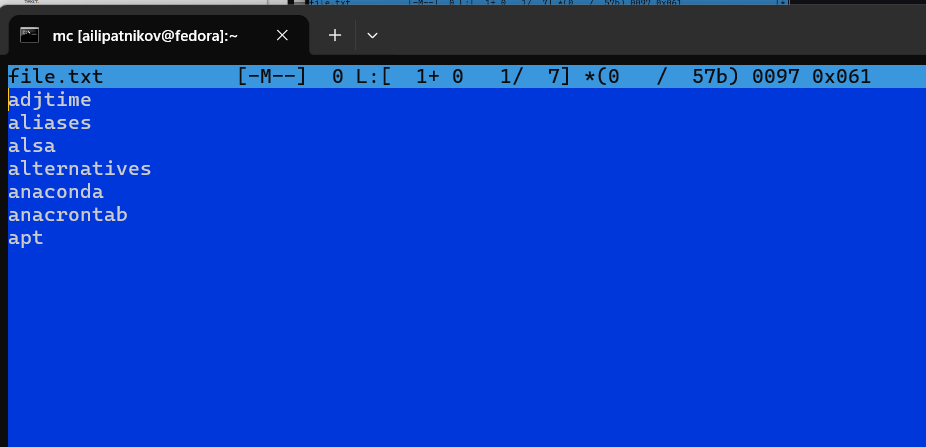{width=70%}

::: notes
- Подчеркнуть: Ctrl-y удаляет строку, Ctrl-u отменяет операцию --- частая путаница.
- Отмена работает только в пределах сеанса редактирования, после сохранения и выхода содержимое вернуть нельзя.
:::

# Результаты

## Сводка результатов

| Действие | Результат |
|----------|-----------|
| Справка и запуск | Освоены панели и функциональные клавиши |
| Операции | Копирование, перемещение, каталог, права |
| Меню mc | Файл, Команда, Настройки, структура экрана |
| Редактор | Правка text.txt клавишами, подсветка синтаксиса |
| Фиксация | 21 снимок экрана |

: Сводка результатов выполнения заданий {#tbl-results}

::: notes
- 21 снимок, все задания пунктов 7.3.1 (задания 1--7) и 7.3.2 (задания 1--6) выполнены.
- mc выполняет те же операции, что и shell, но быстрее за счёт панелей.
:::

# Заключение

## Главный вывод

mc позволяет выполнять те же операции, что и shell, но быстрее: копирование сводится к отметке файлов и [F5] без набора полных путей, а подсветка синтаксиса облегчает чтение исходного кода без дополнительных настроек.

::: notes
- Финальный аккорд: повторить главную мысль и переходить к вопросам.
- Переход к вопросам: резерв со всеми снимками разворачивается по клику.
- Избегать финального слайда вида «Спасибо за внимание» или «Вопросы».
:::

# Резерв

## Справка и запуск

::: incremental
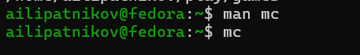{width=60%}
{width=60%}
:::

::: notes
Использовать при вопросе о запуске mc и его рабочем пространстве.
:::

## Панели и операции

::: incremental
{width=60%}
{width=60%}
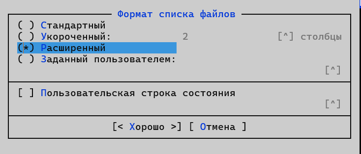{width=60%}
:::

::: notes
Формат списка: стандартный против расширенного --- здесь подробности вывода информации о файлах.
:::

## Меню Файл

::: incremental
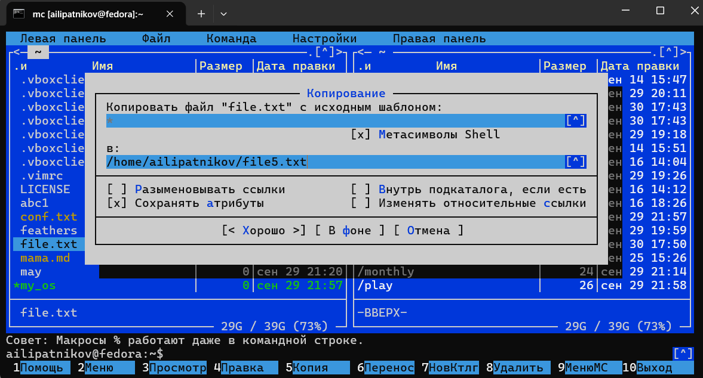{width=60%}
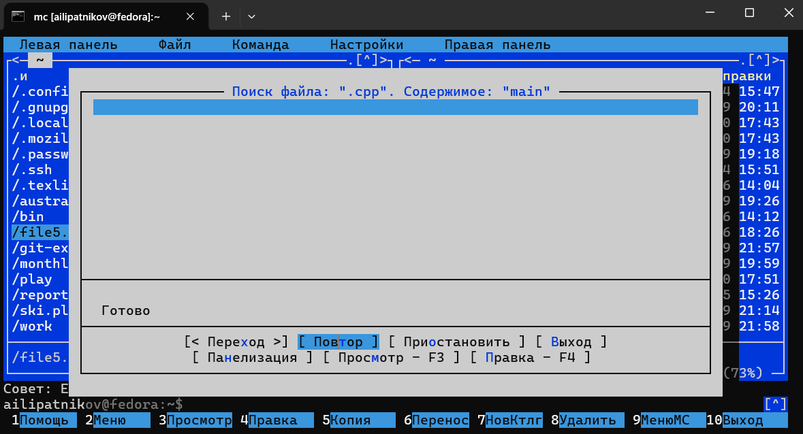{width=60%}
{width=60%}
:::

::: notes
Сюда же относится редактирование содержимого файла без сохранения результатов (п. 7.3.1.5).
:::

## Меню Команда

::: incremental
{width=60%}
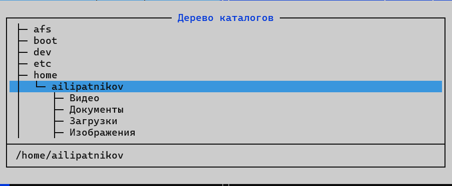{width=60%}
{width=60%}
:::

::: notes
Поиск по расширению .c со строкой main; дерево каталогов; история командной строки.
:::

## Меню Настройки

::: incremental
{width=60%}
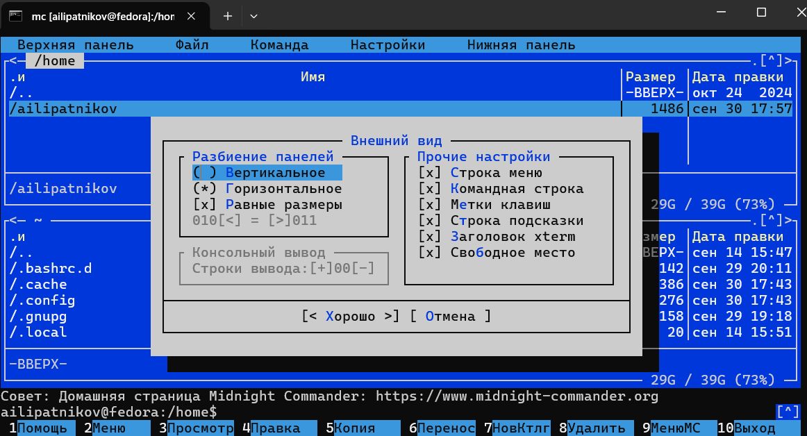{width=60%}
:::

::: notes
Full screen, Double Width, Show Hidden Files --- операции структуры экрана (п. 7.3.1.7).
:::

## Редактор --- правка и фрагменты

::: incremental
{width=60%}
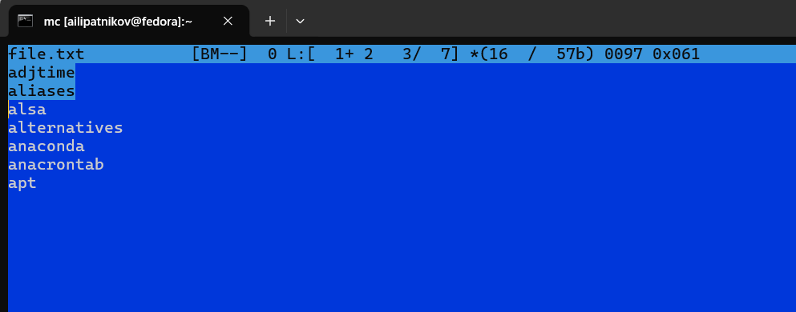{width=60%}
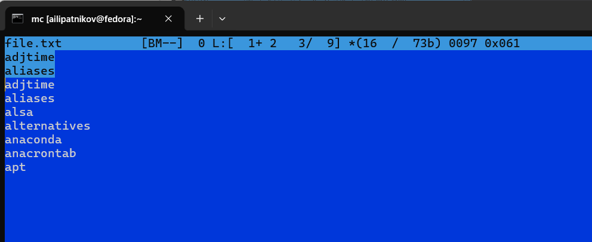{width=60%}
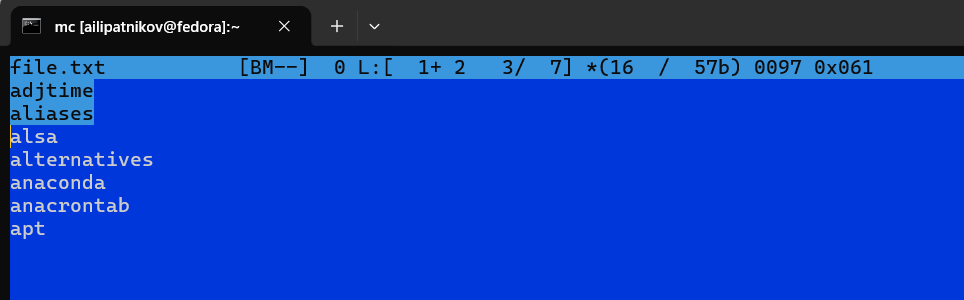{width=60%}
:::

::: notes
Порядок по методичке: вставка текста, удаление строки (Ctrl-y), выделение и копирование фрагмента (F3/F5), перемещение фрагмента (F6).
:::

## Редактор --- навигация и подсветка

::: incremental
{width=60%}
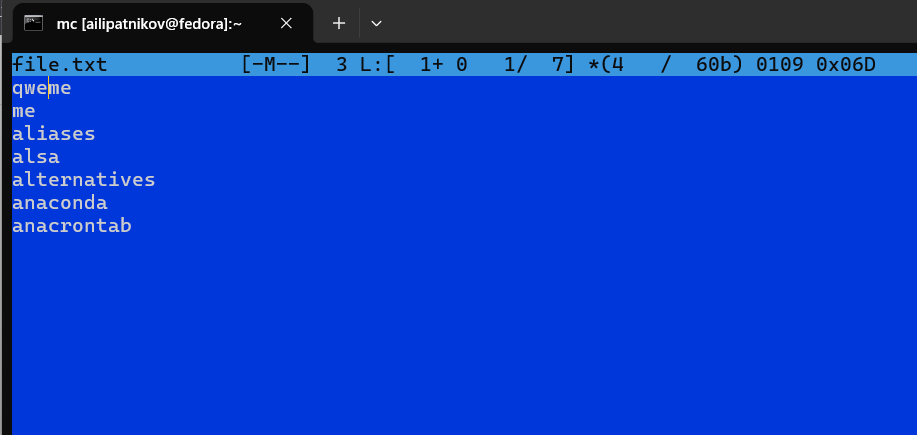{width=60%}
{width=60%}
{width=60%}
:::

::: notes
Дальше по методичке: сохранение (4.4), отмена Ctrl-u (4.5), конец и начало файла, сохранение и закрытие (4.8), подсветка синтаксиса для файла исходного кода.
:::
