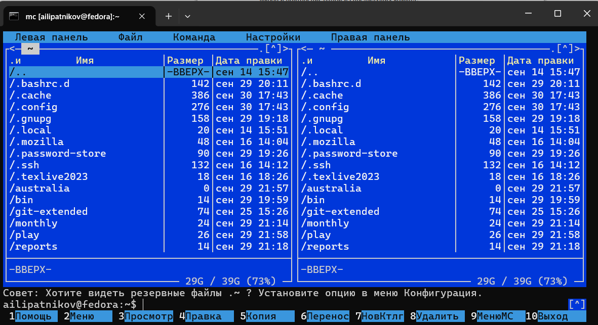
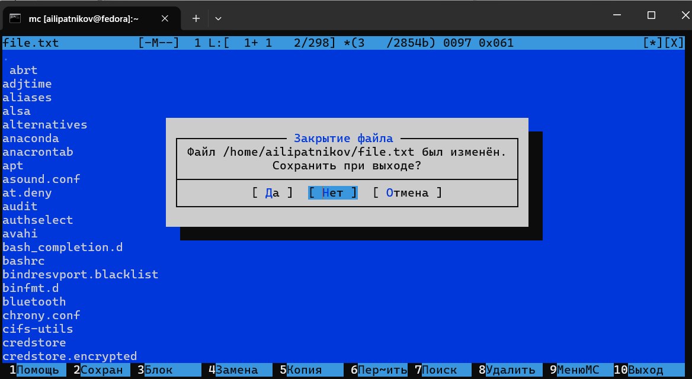
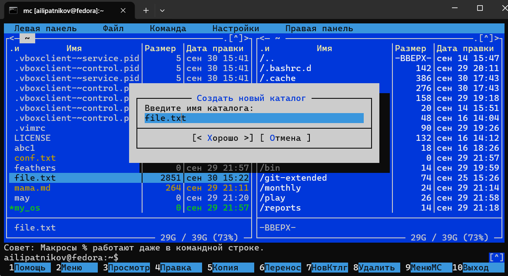
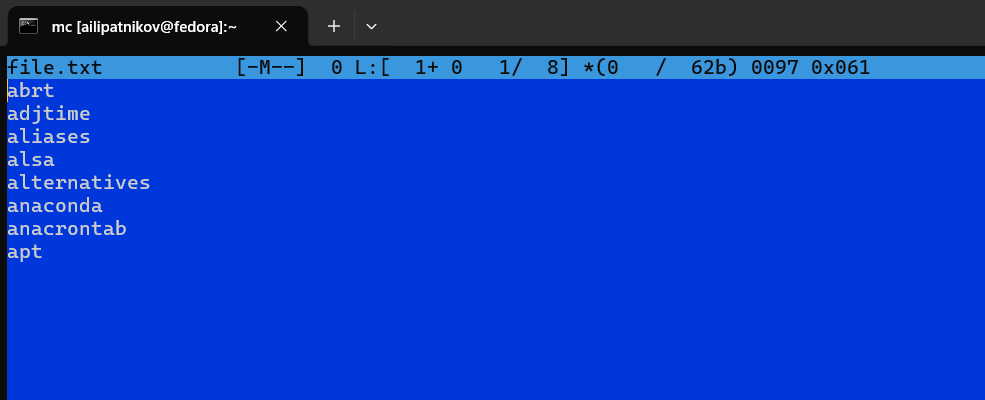
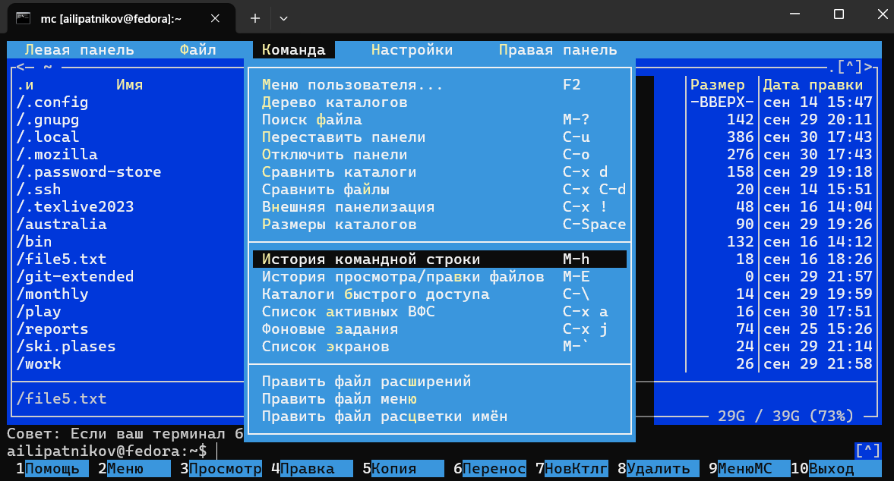
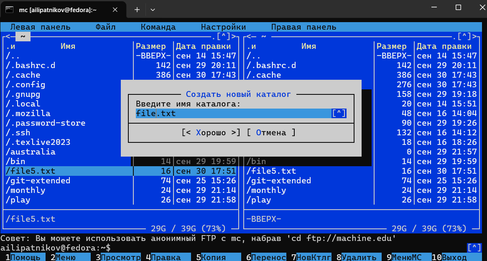
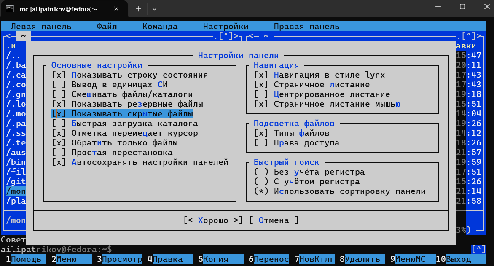
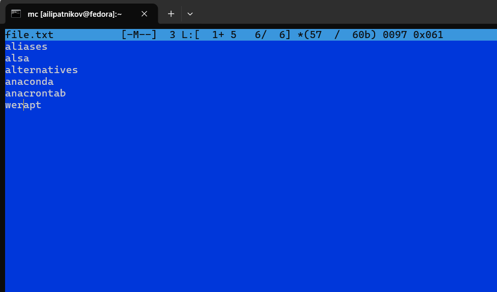
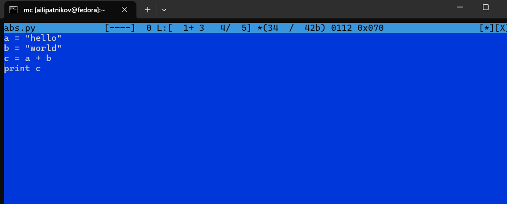
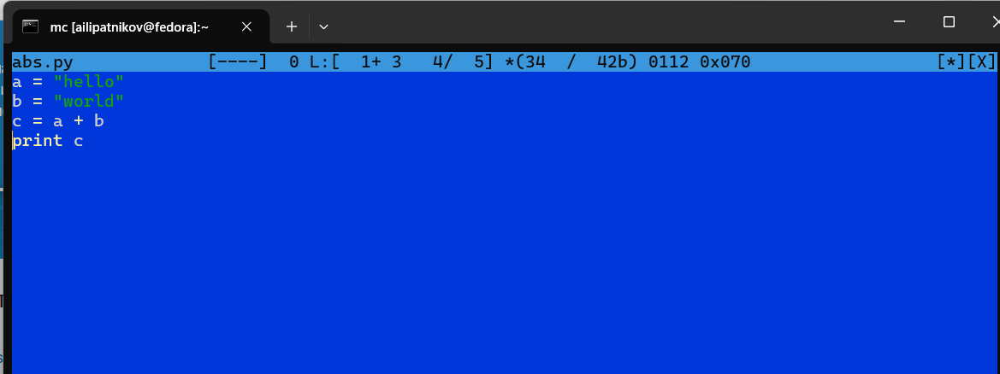

---
## Author
author:
  name: Липатников Андрей
  email: 1032253853@rudn.ru
  affiliation:
    - name: Российский университет дружбы народов
      country: Российская Федерация
      postal-code: 117198
      city: Москва
      address: ул. Миклухо-Маклая, д. 6

## Title
title: "Лабораторная работа №9"
subtitle: "Командная оболочка Midnight Commander"
license: "CC BY"
abstract: |
  В данном отчёте представлены результаты выполнения лабораторной работы по освоению командной оболочки Midnight Commander.

  Описаны структура и меню mc, операции с файлами и каталогами, режимы отображения панелей, встроенный редактор и его возможности.

  Сделаны выводы о достижении поставленной цели.
keywords: [лабораторная работа, Linux, Midnight Commander, mc, файловый менеджер, редактор]
date: today
date-format: "2026-10-08"
---

# Введение

## Актуальность

Midnight Commander --- псевдографическая оболочка, которая объединяет просмотр, поиск, копирование и редактирование файлов в одном интерфейсе. Владение mc ускоряет рутинные операции администрирования: навигация по каталогам и операции с файлами выполняются в два-три нажатия клавиш вместо набора полных команд. Встроенный редактор mc является частью этой оболочки, поэтому навыки работы с ним дополняют навыки работы с файлами.

## Цель работы

Освоение основных возможностей командной оболочки Midnight Commander. Приобретение навыков практической работы по просмотру каталогов и файлов; манипуляций с ними.

## Задачи

1. Изучить справку `man mc` и структуру рабочего пространства mc.
2. Выполнить операции с панелями и файлами с помощью управляющих клавиш.
3. Освоить меню панелей, меню Файл, меню Команда и меню Настройки.
4. Выполнить задания методических указаний по mc и встроенному редактору.
5. Освоить приёмы редактирования текста и подсветку синтаксиса в редакторе mc.

## Объект и предмет исследования

Объект --- командная оболочка Midnight Commander.

Предмет --- операции с файлами и каталогами средствами mc: навигация, меню, встроенный редактор.

## Методы исследования

Практическая работа в терминале, изучение `man`-справок, выполнение заданий методических указаний, фиксация результатов скриншотами.

## Схема выполнения работы

На рис. -@fig-flowchart представлена общая последовательность действий при выполнении работы.

::: {#fig-flowchart}

```{mermaid}
%%| fig-width: 100%
graph TD
    A@{ shape: circle, label: "Начало" } --> B[Изучить справку mc]
    B --> C[Выполнить задания]
    C --> D[Зафиксировать скриншотами]
    D --> E[Занести в отчёт]
    E --> F[Поместить в git-репозиторий]
    F --> G[Сделать релиз git]
    G --> H@{ shape: dbl-circ, label: "Конец" }
```

Блок-схема выполнения лабораторной работы

:::

# Теоретическая часть

## Общие сведения о Midnight Commander

*Командная оболочка* --- интерфейс взаимодействия пользователя с операционной системой и программным обеспечением посредством команд. *Midnight Commander* (или *mc*) --- псевдографическая командная оболочка для UNIX/Linux систем. Для запуска mc необходимо в командной строке набрать `mc` и нажать [Enter]. Рабочее пространство mc имеет две панели, отображающие по умолчанию списки файлов двух каталогов.

Над панелями располагается меню, доступ к которому осуществляется с помощью клавиши [F9]. Под панелями внизу расположены управляющие экранные кнопки, ассоциированные с функциональными клавишами [F1]--[F10] (табл. -@tbl-fkeys). Над ними располагается командная строка, предназначенная для ввода команд.

| Клавиша | Действие |
|---------|----------|
| [F1] | Вызов контекстно-зависимой подсказки |
| [F2] | Вызов пользовательского меню |
| [F3] | Просмотр содержимого файла без возможности редактирования |
| [F4] | Вызов встроенного редактора для файла |
| [F5] | Копирование отмеченных файлов в каталог второй панели |
| [F6] | Перенос отмеченных файлов в каталог второй панели |
| [F7] | Создание подкаталога в активной панели |
| [F8] | Удаление отмеченных файлов и каталогов |
| [F9] | Вызов меню mc |
| [F10] | Выход из mc |

: Функциональные клавиши mc {#tbl-fkeys}

## Режимы отображения панелей

Панель в mc отображает список файлов текущего каталога; абсолютный путь к нему выводится в заголовке панели. Панели можно поменять местами (Ctrl-u) или временно отключить (Ctrl-o) --- это полезно, когда необходимо увидеть вывод команды shell. Последовательное применение комбинации клавиш [Ctrl-x] d позволяет сравнить каталоги на двух панелях. Панели дополнительно переводятся в режимы Информация (сведения о файле и файловой системе) и Дерево (структура дерева каталогов). Управлять режимами отображения можно через пункты меню Правая панель и Левая панель.

В меню каждой панели можно выбрать Формат списка: стандартный (имя, размер, время правки), ускоренный (число столбцов без дополнительной информации), расширенный (права, владелец, группа, размер, время) и определённый пользователем. Подпункт Порядок сортировки задаёт критерий сортировки: без сортировки, по имени, расширенный, время правки, время доступа, время изменения атрибута, размер, узел.

## Меню mc

В строке меню пять пунктов: Левая панель, Файл, Команда, Настройки и Правая панель.

Меню Файл содержит команды, применяемые к одному или нескольким файлам и каталогам: Просмотр ([F3]), Просмотр вывода команды, Правка ([F4]), Копирование ([F5]), Права доступа (Ctrl-x c), Жёсткая и Символическая ссылки (Ctrl-x l, Ctrl-x s), Владелец/группа (Ctrl-x o), Переименование ([F6]), Создание каталога ([F7]), Удалить ([F8]), Выход ([F10]).

Меню Команда содержит общие команды: Дерево каталогов, Поиск файла, Переставить панели, Сравнить каталоги, Размеры каталогов, История командной строки, Каталоги быстрого доступа (Ctrl-\\), Восстановление файлов, Редактировать файл расширений, Редактировать файл меню, Редактировать файл расцветки имён.

Меню Настройки содержит опции внешнего вида и функциональности: Конфигурация, Внешний вид, Настройки панелей, Биты символов, Подтверждение, Распознание клавиш, Виртуальные ФС, Сохранить настройки.

## Редактор mc

Встроенный редактор вызывается клавишей [F4]. Основные комбинации: Ctrl-y --- отмена последней операции, Ctrl-u --- вставка/замена, [F7] --- поиск, Ctrl-n/Ctrl-p --- перемещение курсора, Ctrl-] --- начало выделения (повторное --- окончание), Ctrl-с --- копирование фрагмента, Ctrl-t --- перемещение фрагмента, Ctrl-d --- удаление фрагмента, [F2] --- сохранение, [F10] --- выход. В редакторе поддерживается подсветка синтаксиса для файлов исходного кода, включаемая и выключаемая через меню редактора.

Более подробно про Unix см. в [@tanenbaum_book_modern-os_ru; @robbins_book_bash_en; @zarrelli_book_mastering-bash_en; @newham_book_learning-bash_en].

# Материалы и методы

Работа выполнялась в виртуальной машине со следующей конфигурацией:

- операционная система: Fedora 41 (графическая среда Sway);
- командная оболочка: bash;
- инструментальные средства: файловый менеджер Midnight Commander, справочная система `man`.

Последовательность действий: изучение справки и структуры mc, выполнение операций через меню и управляющие клавиши, редактирование файла во встроенном редакторе, фиксация результата скриншотом, занесение результата в отчёт.

# Выполнение лабораторной работы

## Задание 1: справка man mc

Изучена информация о mc, вызванная командой `man mc` (рис. -@fig-001).

{#fig-001 width=70%}

## Задание 2: запуск mc и изучение структуры

Из командной строки запущен mc, изучены его рабочее пространство, две панели и меню (рис. -@fig-002).

{#fig-002 width=70%}

## Задание 3: операции с панелями и файлами

Выполнены операции с помощью управляющих клавиш: переключение панелей, выделение файлов, копирование и перемещение, получение информации о размере и правах доступа (рис. -@fig-003).

{#fig-003 width=70%}

## Задание 4: команды меню панели

Выполнены основные команды меню левой панели; оценена степень подробности вывода информации о файлах (рис. -@fig-004).

{#fig-004 width=70%}

Сравнены форматы списка: стандартный и расширенный (рис. -@fig-005).

{#fig-005 width=70%}

## Задание 5: подменю Файл

С помощью подменю Файл просмотрено содержимое текстового файла (рис. -@fig-006).

{#fig-006 width=70%}

Выполнено копирование файлов (рис. -@fig-007).

{#fig-007 width=70%}

Создан каталог (рис. -@fig-008).

{#fig-008 width=70%}

## Задание 6: подменю Команда

С помощью подменю Команда выполнен поиск файла с заданными условиями (рис. -@fig-009).

{#fig-009 width=70%}

Изучено меню Команда: повторение предыдущих команд, переход в домашний каталог, анализ файла меню и файла расширений (рис. -@fig-010).

{#fig-010 width=70%}

Рассмотрен режим Дерево каталогов (рис. -@fig-011).

{#fig-011 width=70%}

## Задание 7: подменю Настройки

Вызвано подменю Настройки; освоены операции, определяющие структуру экрана mc (рис. -@fig-012).

{#fig-012 width=70%}

Изменены параметры внешнего вида mc (рис. -@fig-013).

{#fig-013 width=70%}

## Задание 8: встроенный редактор

Создан файл `text.txt` и открыт во встроенном редакторе mc ([F4]) (рис. -@fig-014).

{#fig-014 width=70%}

В файл вставлен фрагмент текста, после чего удалена строка текста (Ctrl-y) (рис. -@fig-015).

{#fig-015 width=70%}

Выделен фрагмент текста и скопирован на новую строку (рис. -@fig-016).

{#fig-016 width=70%}

Выделен фрагмент и перенесён на новую строку; перемещение курсора по файлу (рис. -@fig-017).

{#fig-017 width=70%}

Продолжено редактирование файла (рис. -@fig-018).

{#fig-018 width=70%}

Переход в конец файла (Ctrl-End) и добавление текста; сохранение ([F2]) (рис. -@fig-019).

{#fig-019 width=70%}

Переход в начало файла (Ctrl-Home) и добавление текста (рис. -@fig-020).

{#fig-020 width=70%}

## Задание 9: подсветка синтаксиса

Открыт файл с исходным текстом на языке C; через меню редактора переключена подсветка синтаксиса (рис. -@fig-021).

{#fig-021 width=70%}

# Результаты

В ходе работы выполнены все задания пунктов 7.3.1 и 7.3.2, зафиксированные 21 скриншотом (рис. -@fig-001 --- -@fig-021). Сводка приведена в табл. -@tbl-results.

| Действие | Результат |
|----------|-----------|
| Справка и запуск | Изучена справка `man mc`, освоены панели и функциональные клавиши |
| Операции с файлами | Копирование, перемещение, создание каталога, информация о правах |
| Меню mc | Освоены меню панелей, Файл, Команда, Настройки |
| Поиск и навигация | Поиск файла с условиями, дерево каталогов, форматы списка |
| Редактор | Редактирование text.txt горячими клавишами, подсветка синтаксиса |

: Сводка результатов выполнения заданий {#tbl-results}

# Обсуждение результатов

Полученные результаты соответствуют теоретическим ожиданиям. Операции mc и команды shell дают одинаковый результат, но mc выполняет их быстрее за счёт интерфейса с панелями: копирование сводится к отметке файлов и [F5] без набора полных путей. Расширенный формат списка выводит права, владельца и группу --- эта информация в стандартном формате отсутствует. Подсветка синтаксиса облегчает чтение исходного кода: ключевые слова и строки выделяются цветом без дополнительных настроек. Изменения настроек через меню Настройки сохраняются между сеансами, поэтому однократная настройка работает во всех последующих запусках.

# Заключение

- Цель работы достигнута: освоены основные возможности командной оболочки Midnight Commander.
- Приобретены навыки просмотра каталогов и файлов, манипуляций с ними средствами mc.
- Освоены четыре меню mc и операции с панелями и файлами с помощью управляющих клавиш.
- Освоены приёмы редактирования текста горячими клавишами во встроенном редакторе mc.
- Отработано переключение подсветки синтаксиса для файлов исходного кода.

Полученные навыки дополняют владение командами shell: mc позволяет выполнять те же операции быстрее за счёт псевдографического интерфейса.

# Список литературы {.unnumbered}

::: {#refs}
:::

\appendix

# Приложение А. Ответы на контрольные вопросы {.appendix}

## 1. Режимы работы mc

Текстовый (в терминале, без X Window --- псевдографика средствами терминала) и графический (в графическом терминале того же текстового вида). Основные режимы отображения панелей: списки файлов (стандартный, ускоренный, расширенный, определяемый пользователем), Информация и Дерево каталогов; дополнительный режим --- быстрый просмотр содержимого панели.

## 2. Операции shell и mc

Просмотр (`cat`/`less` и [F3]), редактирование (nano, vim и [F4]), копирование (`cp` и [F5]), перемещение/переименование (`mv` и [F6]), создание каталога (`mkdir` и [F7]), удаление (`rm`/`rmdir` и [F8]), смена прав (`chmod` и Ctrl-x c).

## 3. Меню левой (правой) панели

Список файлов (форматы: стандартный, ускоренный, расширенный, определяемый пользователем), Быстрый просмотр, Информация, Дерево; Формат списка, Порядок сортировки, Фильтр, Выбор кодировки; соединения FTP/Shell/SMB; Панелизация и Пересмотреть.

## 4. Меню Файл

Просмотр [F3], Просмотр вывода команды, Правка [F4], Копирование [F5], Права доступа Ctrl-x c, Жёсткая ссылка Ctrl-x l, Символическая ссылка Ctrl-x s, Владелец/группа Ctrl-x o, Переименование [F6], Создание каталога [F7], Удалить [F8], Смена каталога, Отметить группу/Снять отметку/Обратить выделение, Выход [F10].

## 5. Меню Команда

Дерево каталогов, Поиск файла, Переставить панели, Сравнить каталоги Ctrl-x d, Размеры каталогов, История командной строки, Каталоги быстрого доступа Ctrl-\\, Восстановление файлов, Редактировать файл расширений/меню/расцветки имён.

## 6. Меню Настройки

Конфигурация (настройки работы с панелями), Внешний вид и Настройки панелей (элементы интерфейса, геометрия, цвет), Биты символов, Подтверждение (диалоги удаления, перезаписи, выхода), Распознание клавиш, Виртуальные ФС, Сохранить настройки.

## 7. Встроенные команды mc

Командная строка над панелями принимает команды shell; макросы (`$(...)`, `$(pwd)`) подставляют имена файлов и текущий каталог; Ctrl-\\ открывает каталоги быстрого доступа; командная строка поддерживает автодополнение (M-Tab).

## 8. Команды редактора mc

Поиск [F7] (с регулярными выражениями), повтор поиска, замена, отмена Ctrl-y, начало выделения Ctrl-] , копирование Ctrl-с, перемещение Ctrl-t, удаление Ctrl-d, сохранение [F2], выход [F10].

## 9. Пользовательские меню

Пункт Редактировать файл меню в подменю Команда открывает пользовательский файл меню (`~/.config/mc/menu`); синтаксис: описание, команда, действие; меню вызывается клавишей [F2].

## 10. Действия над текущим файлом

Файл расширений (Редактировать файл расширений) связывает расширения файлов с действиями: запуск, просмотр, редактирование программой по типу файла; используется при [Enter] и в пользовательском меню.

# Приложение Б. Листинг выполненных действий {.appendix}

```text
# Задание 1-2: справка и запуск
man mc
mc

# Задание 3: операции с панелями и файлами
# (копирование [F5], перемещение [F6], создание каталога [F7],
#  информация о размере Ctrl-Space, права Ctrl-x c)

# Задание 5: подменю Файл
# Просмотр [F3], правка [F4], создание каталога [F7],
# копирование файлов в созданный каталог [F5]

# Задание 6: подменю Команда
# Поиск файла (расширение .c, строка main),
# повторение команды из истории, переход в домашний каталог,
# анализ файла меню и файла расширений

# Задание 7: подменю Настройки
# Full screen, Double Width, Show Hidden Files и др.

# Задание 8: редактор mc
touch text.txt
mc
# [F4] --- редактор: вставка текста, Ctrl-y (удаление строки),
# Ctrl-] (выделение), Ctrl-с (копирование), Ctrl-t (перемещение),
# [F2] (сохранение), Ctrl-Home/Ctrl-End (начало/конец файла)

# Задание 9: подсветка синтаксиса
# открыть файл .c, меню редактора, переключить подсветку
```
