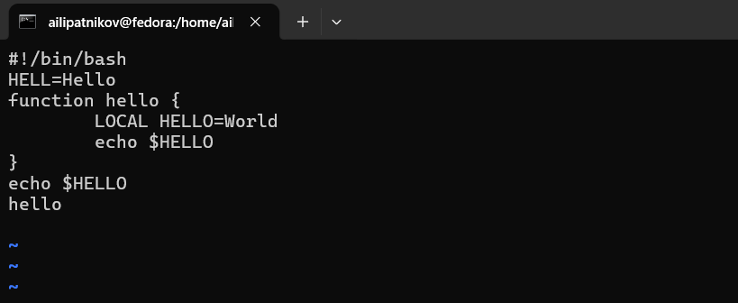
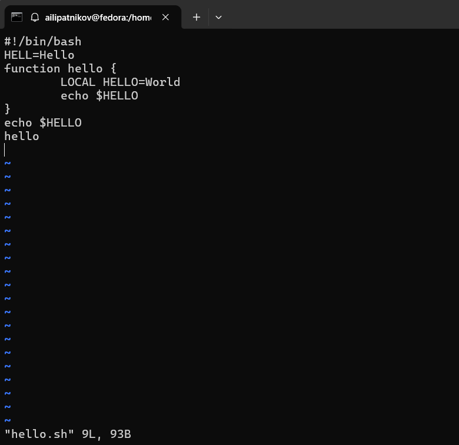
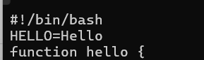
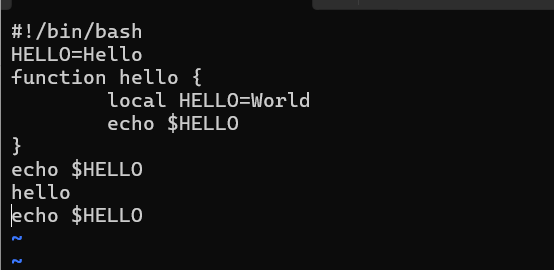
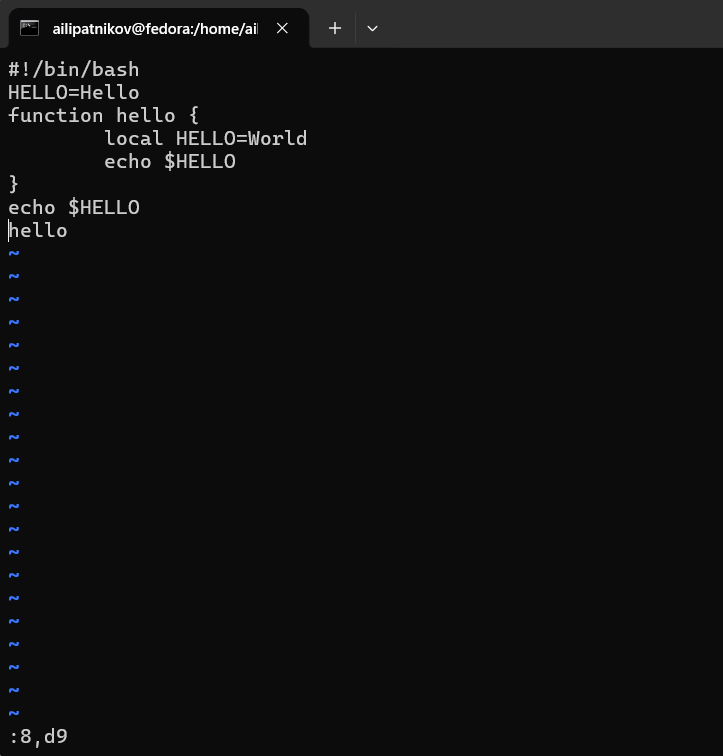
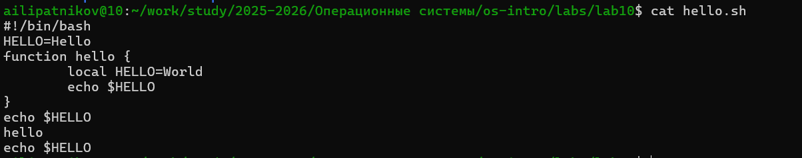

---
## Author
author:
  name: Липатников Андрей
  email: 1032253853@rudn.ru
  affiliation:
    - name: Российский университет дружбы народов
      country: Российская Федерация
      postal-code: 117198
      city: Москва
      address: ул. Миклухо-Маклая, д. 6
## Title
title: "Лабораторная работа №10"
subtitle: "Текстовой редактор vi"
license: "CC BY"
abstract: |
  Доклад посвящён лабораторной работе по текстовому редактору vi: рассмотрены режимы работы редактора, команды навигации и редактирования, создание и правка сценария hello.sh.
keywords: [лабораторная работа, Linux, vi, текстовый редактор, hello.sh]
date: today
date-format: "2026.10.08"
---

# Информация

## Докладчик

:::::::::::::: {.columns align=center}
::: {.column width="70%"}

  * Липатников Андрей
  * Студент НКАбд-04-25
  * Российский университет дружбы народов
  * [1032253853@rudn.ru](mailto:1032253853@rudn.ru)

:::
::: {.column width="30%"}

:::
::::::::::::::

::: notes
- Поприветствовать аудиторию.
- Представиться кратко, даже если вас объявили.
- Доклад посвящён лабораторной работе по текстовому редактору vi.
:::

# Вводная часть

## Актуальность

- vi установлен по умолчанию практически во всех дистрибутивах Linux
- присутствует даже в минимальных системах без графики
- обязательный навык администратора при работе через ssh
- модальная модель vi --- основа vim и современных редакторов

::: notes
- Подчеркнуть: восстановление системы и правка конфигурационных файлов выполняются в терминале, где графические редакторы недоступны.
- Время: не более 1 минуты на этот слайд.
:::

## Объект и предмет исследования

- **Объект**: текстовый редактор vi
- **Предмет**: режимы работы vi, команды навигации и редактирования, создание и правка скрипта hello.sh

::: notes
- Объект --- широкая область (текстовые редакторы в Linux).
- Предмет --- конкретные режимы и команды vi.
:::

## Цели и задачи

- **Цель**: познакомиться с операционной системой Linux; получить практические навыки работы с редактором vi, установленным по умолчанию практически во всех дистрибутивах.
- **Задачи**:
    - изучить три режима работы vi
    - создать файл hello.sh средствами vi
    - сделать файл исполняемым
    - отредактировать hello.sh командами vi
    - освоить команды навигации и редактирования

::: notes
- Цель дословно из методических указаний (п. 8.1).
- Задачи соответствуют пунктам 8.3.1 и 8.3.2 методических указаний.
:::

## Материалы и методы

- ОС: Fedora 41 (графическая среда Sway), оболочка bash
- инструменты: vi, chmod, man, cat
- цикл: справка --- задание --- снимок экрана --- отчёт
- выполнено 13 снимков: 12 по заданиям и снимок итогового содержимого файла (cat)
- нумерация: в методических указаниях работа значится под № 8, в плане курса --- № 10; ссылки на пункты (8.x) --- по нумерации источника

::: notes
- Кратко пройтись по окружению и циклу работы.
- Методические указания предлагают каталог ~/work/os/lab06; работа выполнялась в каталоге репозитория курса labs/lab10 --- фактические команды в приложении В отчёта.
- Подробная методика --- в отчёте.
:::

# Содержание исследования

## Режимы работы vi

- **Командный режим** --- навигация и команды редактирования
- **Режим вставки** --- ввод текста
- **Режим последней строки** --- запись в файл, выход, настройки

:::::::::::::: {.columns align=center}
::: {.column width="48%"}

Возврат в командный --- [Esc]

Вход в режим вставки --- i, a, I, A, o, O

:::
::: {.column width="48%"}

Вход в режим последней строки --- [Shift-:]

Выход --- :wq, :q, :q!

:::
::::::::::::::

::: notes
- Ключевое: ввод текста возможен только в режиме вставки.
- vi различает прописные и строчные буквы при наборе команд.
:::

## Создание файла hello.sh

- Выполнен переход в каталог лабораторной работы, вызван vi hello.sh
- Нажата i, введён текст скрипта
- Нажата [Esc] --- возврат в командный режим
- Выполнено :wq --- запись и выход

{width=70%}

::: notes
- Файл отсутствовал --- vi создаёт его автоматически при первом сохранении.
- Введённый текст (начальная версия): шебанг #!/bin/bash; строка HELL=Hello; функция hello с переменной LOCAL HELLO=World и командой echo \$HELLO внутри; после функции --- echo \$HELLO и вызов hello. После задания 2 строка станет HELLO=Hello, а LOCAL --- local.
- Полный листинг --- приложение Б (Б.1) отчёта.
:::

## Ввод текста и возврат в командный режим

:::::::::::::: {.columns align=center}
::: {.column width="48%"}

:::
::: {.column width="48%"}

:::
::::::::::::::

::: notes
- Слева --- введённый текст скрипта в режиме вставки.
- Справа --- возврат в командный режим клавишей [Esc] (курсор внизу, на пустых строках --- символы тильды).
:::

## Права на выполнение

- Выполнено chmod +x hello.sh

{width=70%}

::: notes
- chmod +x добавляет право на выполнение.
- Проверить можно командой ls -l hello.sh --- у файла появятся права на выполнение.
:::

## Открытие файла на редактирование

- Выполнено vi hello.sh
- Строка состояния: 9L, 93B

{width=70%}

::: notes
- Строка состояния показывает 9 строк и 93 байта --- фактические параметры файла на момент открытия.
- Листинг исходного варианта --- приложение Б (Б.1) отчёта.
- Редактирование --- по п. 8.3.2 методических указаний.
:::

## Замена HELL на HELLO

- Курсор в конец слова HELL второй строки
- Нажата i, введена буква O, нажата [Esc]

{width=70%}

::: notes
- Слово стало HELLO: строка приняла вид HELLO=Hello.
:::

## Удаление и вставка слова

:::::::::::::: {.columns align=center}
::: {.column width="48%"}

:::
::: {.column width="48%"}

:::
::::::::::::::

::: notes
- Слева --- слово LOCAL удалено командой dw; переменная стала глобальной.
- Справа --- нажата i, введено local (со строчной буквы), нажата [Esc]; строка приняла вид local HELLO=World.
:::

## Вставка и удаление строки

:::::::::::::: {.columns align=center}
::: {.column width="48%"}

:::
::: {.column width="48%"}

:::
::::::::::::::

::: notes
- Слева --- после последней строки файла командой o вставлена строка echo \$HELLO.
- Справа --- последняя строка удалена командой dd.
:::

## Отмена удаления

- Команда u вернула удалённую строку

{width=70%}

::: notes
- u отменяет одно последнее действие.
- Команда вернула строку echo \$HELLO.
:::

## Сохранение изменений и выход

- Выполнено :wq в режиме последней строки

{width=70%}

::: notes
- Изменения записаны, vi завершён.
- Итоговое содержимое файла --- на следующем слайде.
:::

# Результаты

## Полученные результаты

| Действие | Команды vi | Результат |
|----------|------------|-----------|
| Создание файла | `vi hello.sh`, `i`, `[Esc]`, `:wq` | Файл создан, сохранён |
| Права | `chmod +x hello.sh` | Файл исполняемый |
| Правка | `i`, `dw`, `o`, `dd`, `u`, `:wq` | Файл отредактирован |
| Контроль | `cat hello.sh` | Содержимое соответствует шагам правки |

: Сводка результатов {#tbl-results}

::: notes
- Все задания п. 8.3.1 и 8.3.2 методических указаний выполнены.
- Выполнено 13 снимков: 12 по заданиям и снимок итогового содержимого файла.
:::

## Итоговое содержимое файла

{width=70%}

::: notes
- В файле девять строк: строка echo \$HELLO стоит после вызова hello --- добавлена в задании 2 и возвращена отменой u.
- По п. 8.4 методических указаний в отчёт включаются результаты выполнения программ: снимок запуска ./hello.sh добавляется перед сдачей (ожидаемый вывод: Hello, World, Hello).
:::

## Ключевые команды

| Команда | Действие |
|---------|----------|
| `i`, `a`, `o`, `O` | Вход в режим вставки |
| `[Esc]` | Возврат в командный режим |
| `dw` | Удалить слово |
| `dd` | Удалить строку |
| `u` | Отменить последнее действие |
| `:wq` | Сохранить и выйти |
| `:q!` | Выйти без сохранения |

: Основные команды vi {#tbl-cmds}

::: notes
- При вопросе о командах vi --- таблица на экране.
- Полный список --- в отчёте (приложение А, вопрос 6).
:::

# Заключение

## Главный вывод

vi требует освоения трёх режимов и непривычен после непрерывных редакторов, но окупается скоростью навигации и композиции команд. Навык работы с vi --- обязательный минимум администратора Linux, особенно при работе через ssh.

::: notes
- Финальный аккорд: повторить главную мысль и перейти к вопросам.
- После паузы: «Я готов ответить на ваши вопросы».
- Финальный слайд вида «Спасибо за внимание» или «Вопросы» не используется.
:::
