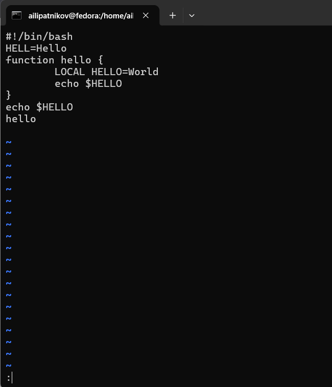
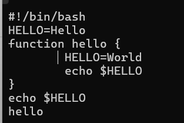
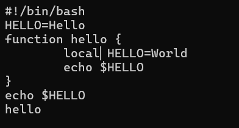
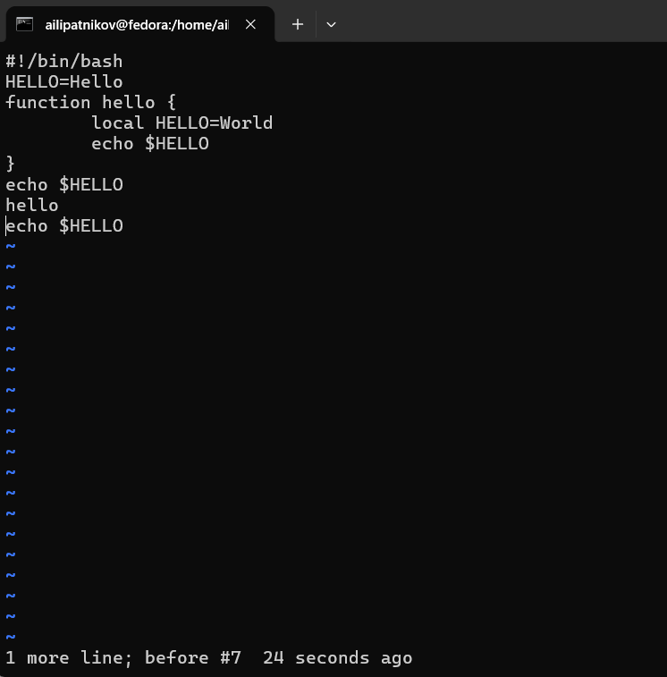
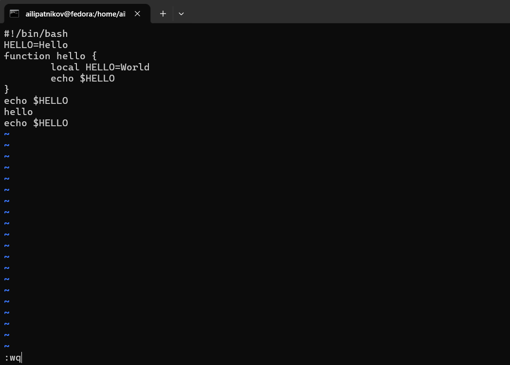

---
## Author
author:
  name: Липатников Андрей
  email: 1032253853@rudn.ru
  affiliation:
    - name: Российский университет дружбы народов
      country: Российская Федерация
      postal-code: 117198
      city: Москва
      address: ул. Миклухо-Маклая, д. 6
## Title
title: "Лабораторная работа №10"
subtitle: "Текстовой редактор vi"
license: "CC BY"
abstract: |
  В данном отчёте представлены результаты выполнения лабораторной работы по теме «Текстовой редактор vi».

  Описаны режимы работы редактора vi, команды навигации и редактирования, создание и правка файла hello.sh.

  Сделаны выводы о достижении поставленной цели.
keywords: [лабораторная работа, Linux, vi, текстовый редактор, hello.sh]
date: today
date-format: "2026.10.08"
---

# Введение

## Актуальность

Редактор vi установлен по умолчанию практически во всех дистрибутивах Linux и остаётся основным инструментом правки конфигурационных файлов и скриптов на серверах. Умение работать в vi без графической среды --- обязательный навык системного администратора.

## Цель работы

Познакомиться с операционной системой Linux. Получить практические навыки работы с редактором vi, установленным по умолчанию практически во всех дистрибутивах.

## Задачи

1. Изучить три режима работы vi (командный, вставки, последней строки).
2. Создать файл hello.sh с помощью vi.
3. Сделать файл исполняемым.
4. Выполнить правку файла hello.sh средствами vi.
5. Освоить основные команды навигации и редактирования.

## Объект и предмет исследования

Объект --- текстовый редактор vi.

Предмет --- режимы vi, команды навигации и редактирования, создание и правка скрипта.

## Методы исследования

Практическая работа в терминале, изучение man vi, выполнение заданий методических указаний, фиксация результатов скриншотами (выполнено 13 снимков: 12 по заданиям и снимок итогового содержимого файла).

Замечания о расхождениях с методическими указаниями:

- файл методических указаний нумерует данную работу как № 8 (разделы 8.1--8.5), в плане курса она значится под № 10. Ссылки на пункты методических указаний приводятся по нумерации файла источника (8.x);
- методические указания предлагают каталог ~/work/os/lab06; работа выполнялась в каталоге репозитория курса labs/lab10, фактические команды приведены в приложении В.

## Схема выполнения работы

На рис. -@fig-flowchart представлена общая последовательность действий при выполнении работы.

::: {#fig-flowchart}

```{mermaid}
%%| fig-width: 100%
graph TD
    A@{ shape: circle, label: "Начало" } --> B[Создать hello.sh в vi]
    B --> C[Ввести текст, выйти :wq]
    C --> D[chmod +x hello.sh]
    D --> E[Правка файла в vi]
    E --> F[Отмена, сохранение :wq]
    F --> G[Зафиксировать скриншотами]
    G --> H[Занести в отчёт]
    H --> I[Поместить в git-репозиторий]
    I --> J@{ shape: dbl-circ, label: "Конец" }
```

Блок-схема выполнения лабораторной работы

:::

# Теоретическая часть

## Режимы работы vi

Редактор vi имеет три режима:

- **Командный режим** --- навигация и ввод команд редактирования.
- **Режим вставки** --- ввод текста.
- **Режим последней строки** --- запись изменений в файл и выход.

Переход в командный режим --- [Esc]. Переход в режим последней строки --- [Shift-:] из командного режима. vi различает прописные и строчные буквы при наборе команд (п. 8.2).

## Основные команды

| Группа | Команды |
|--------|---------|
| Управление курсором | h или Backspace (влево), Space или l (вправо), Enter или j (вниз), k (вверх) |
| Позиционирование | 0 (начало строки), \$ (конец строки), G (конец файла), nG (строка n) |
| Перемещение по файлу | Ctrl-d (пол-экрана вперёд), Ctrl-u (пол-экрана назад), [Ctrl-f] (страница вперёд), Ctrl-b (страница назад) |
| Перемещение по словам | W или w (слово вперёд), nW или nw (n слов), B или b (слово назад), nb или nB (n слов назад) |
| Вставка текста | a (после курсора), A (конец строки), i (перед курсором), ny (n раз), I (начало строки) |
| Вставка строки | o (под курсором), O (над курсором) |
| Удаление | x (символ), dw (слово), d\$ (до конца строки), d0 (от начала до курсора), dd (строка), ndd (n строк) |
| Отмена и повтор | u (отменить последнее изменение), Ctrl-r (повтор последнего изменения) |
| Копирование в буфер | yy (строка), nyy (n строк), yw (слово) |
| Вставка из буфера | p (после курсора), P (перед курсором) |
| Замена | cw (слово), cnw (n слов), C (до конца строки), r (символ), R (текст) |
| Поиск | /текст (вперёд), ?текст (назад) |
| Копирование и перемещение | :n,m d (удалить), :i,j m k (переместить), :i,j t k (копировать), :i,j w файл (записать) |
| Запись и выход | :w (записать), :w файл (в новый файл), :wq (записать и выйти), :q (выйти), :q! (без записи), :e! (отменить изменения с последней записи) |

: Команды редактора vi по группам (пп. 8.2.1--8.2.3 методических указаний) {#tbl-vi}

## Опции (:set)

- :set all --- полный список опций.
- :set nu --- номера строк.
- :set list --- невидимые символы.
- :set ic --- не учитывать регистр при поиске.
- Префикс no отменяет опцию (:set nonu).

Более подробно про Unix см. в [@tanenbaum_book_modern-os_ru; @robbins_book_bash_en; @zarrelli_book_mastering-bash_en; @newham_book_learning-bash_en].

# Материалы и методы

- ОС: Fedora 41 (графическая среда Sway)
- Терминал: bash
- Инструменты: vi, chmod, man, cat

Последовательность: переход в каталог лабораторной работы, создание файла hello.sh в vi, ввод текста, запись :wq, chmod +x, открытие файла в vi, правка (замена, удаление, вставка, отмена), запись изменений, контроль содержимого командой cat.

# Выполнение лабораторной работы

## Задание 1. Создание нового файла hello.sh

### Шаг 1. Каталог и вызов vi

Выполнен переход в каталог лабораторной работы, вызван vi hello.sh (рис. -@fig-001).

{#fig-001 width=70%}

::: {.notes}
Файл отсутствовал --- vi создаёт его автоматически при первом сохранении.
:::

### Шаг 2. Ввод текста в режиме вставки

Нажата клавиша i, введён текст скрипта (рис. -@fig-002).

{#fig-002 width=70%}

::: {.notes}
Текст по методичке (п. 8.3.1, шаг 4): шебанг, переменная HELL, функция hello с переменной LOCAL и echo внутри, echo после функции, вызов hello. Полный листинг --- в приложении Б.
:::

### Шаг 3. Возврат в командный режим

После завершения ввода нажата клавиша [Esc] (рис. -@fig-003).

{#fig-003 width=70%}

::: {.notes}
На незаполненных строках --- символы тильды, курсор вернулся в командный режим.
:::

### Шаг 4. Запись и выход

Нажата [:], внизу появилось приглашение в виде двоеточия; набраны w и q, затем [Enter] --- текст сохранён, vi завершён. Отдельного снимка шаг не оставляет: состояние экрана совпадает с командным режимом.

### Шаг 5. Сделать файл исполняемым

Выполнено chmod +x hello.sh (рис. -@fig-004).

{#fig-004 width=70%}

::: {.notes}
chmod +x добавляет право на выполнение; проверить можно командой ls -l hello.sh.
:::

## Задание 2. Редактирование существующего файла

### Шаг 1. Открытие файла

Выполнено открытие файла на редактирование: vi hello.sh (рис. -@fig-005).

{#fig-005 width=70%}

::: {.notes}
Внизу --- строка статуса vi: имя файла, 9L (строк), 93B (байт). Листинг файла --- в приложении Б: восемь смысловых строк; показание 9L объясняется хвостовой пустой строкой, 93B --- односимвольными отступами внутри функции.
:::

### Шаг 2. Замена HELL на HELLO

Курсор установлен в конец слова HELL второй строки, нажата i, слово заменено на HELLO, нажата [Esc] (рис. -@fig-006).

{#fig-006 width=70%}

::: {.notes}
Вторая строка приняла вид HELLO=Hello.
:::

### Шаг 3. Удаление слова LOCAL

Курсор установлен на четвёртую строку, слово LOCAL удалено командой dw (рис. -@fig-007).

{#fig-007 width=70%}

::: {.notes}
В строке осталось HELLO=World: переменная стала глобальной.
:::

### Шаг 4. Вставка слова local

Нажата i, введено local, нажата [Esc] (рис. -@fig-008).

{#fig-008 width=70%}

::: {.notes}
Строка приняла вид local HELLO=World.
:::

### Шаг 5. Добавление строки echo \$HELLO

Курсор установлен на последней строке файла, после неё вставлена строка echo \$HELLO, нажата [Esc] (рис. -@fig-009).

{#fig-009 width=70%}

::: {.notes}
По методичке (п. 8.3.2, шаг 6) --- вставка после последней строки файла, то есть после вызова hello.
:::

### Шаг 6. Удаление последней строки

Последняя строка удалена командой dd (рис. -@fig-010).

{#fig-010 width=70%}

::: {.notes}
Удалена строка echo \$HELLO, вставленная на предыдущем шаге.
:::

### Шаг 7. Отмена удаления

Введена команда отмены изменений u --- последняя команда отменена (рис. -@fig-011).

{#fig-011 width=70%}

::: {.notes}
Команда u вернула удалённую строку echo \$HELLO.
:::

### Шаг 8. Запись и выход

Нажата [:], выполнены w и q, затем [Enter] --- изменения записаны, vi завершён (рис. -@fig-012).

{#fig-012 width=70%}

::: {.notes}
Итоговое содержимое файла проверено командой cat (рис. -@fig-013): строка echo \$HELLO после вызова hello возвращена отменой и записана в файл.
:::

# Результаты

В ходе работы:

- создан файл hello.sh, сделан исполняемым (chmod +x);
- по строке статуса vi при открытии файл содержит 9 строк и 93 байта (см. приложение Б);
- выполнена правка: замена HELL на HELLO, удаление слова LOCAL, вставка слова local, добавление строки echo \$HELLO, удаление последней строки, отмена удаления командой u;
- изменения записаны (:wq);
- итоговое содержимое файла зафиксировано командой cat (рис. -@fig-013): в файле девять строк, строка echo \$HELLO стоит после вызова hello.

| Задание | Команды vi | Результат |
|---------|-----------|-----------|
| Создание файла | vi hello.sh, i, [Esc], :wq | Файл создан, сохранён |
| Права | chmod +x hello.sh | Файл исполняемый |
| Правка | i, dw, o, dd, u, :wq | Файл отредактирован |
| Контроль | cat hello.sh | Содержимое соответствует шагам правки |

: Сводка результатов {#tbl-results}

{#fig-013 width=70%}

Согласно п. 8.4 методических указаний, в отчёт включаются результаты выполнения программ. Вывод запуска сценария ./hello.sh отдельным снимком не зафиксирован; перед сдачей следует добавить снимок вывода в данный раздел.

# Обсуждение результатов

Все задания методических указаний выполнены. vi подтвердил деление на три режима: ввод текста возможен только в режиме вставки, навигация и команды --- в командном. Отмена u работает на одно действие и возвращает удалённую строку (рис. -@fig-011). Показание строки статуса vi (9 строк, 93 байта) согласуется с листингом приложения Б: восемь смысловых строк и односимвольные отступы внутри функции дают 93 байта с учётом завершающих переводов строк. Содержимое файла после правки подтверждено командой cat (рис. -@fig-013) и полностью соответствует последовательности шагов задания 2. Опции :set nu, :set all, :set ic позволяют настраивать рабочую среду, но для базового редактирования не требуются.

# Заключение

- Цель работы достигнута: получены практические навыки работы с редактором vi.
- Освоены три режима работы vi и команды навигации.
- Создан и отредактирован файл hello.sh; освоены команды i, dw, dd, u, :wq.
- Файл сделан исполняемым; итоговое содержимое подтверждено командой cat.

Полученные навыки применимы при правке конфигурационных файлов и скриптов в Linux.

# Список литературы {.unnumbered}

::: {#refs}
:::

\appendix

# Приложение А. Ответы на контрольные вопросы {.appendix}

## 1. Краткая характеристика режимов работы vi

- **Командный режим** --- навигация, удаление, копирование, вставка. Вход --- [Esc].
- **Режим вставки** --- ввод текста. Вход --- i, a, I, A, o, O.
- **Режим последней строки** --- запись изменений в файл, выход, настройки, поиск. Вход --- [Shift-:] из командного режима.

## 2. Выход без сохранения

Набрать :q! в режиме последней строки (выйти без записи); :e! --- вернуться в командный режим, отменив все изменения со времени последней записи.

## 3. Команды позиционирования

0 --- начало строки; \$ --- конец строки; G --- конец файла; nG --- строка с номером n.

## 4. Что для vi является словом

Последовательность букв, цифр и подчёркиваний, ограниченная разделителями. При командах W и B (прописные) под разделителями понимаются только пробел, табуляция и возврат каретки; при w и b (строчные) --- также любые знаки пунктуации (п. 8.2.1.4 методических указаний).

## 5. Переход в начало и конец файла

1G --- начало файла; G --- конец файла.

## 6. Основные группы команд редактирования

- **Вставка текста**: a, A, i, ny, I.
- **Вставка строки**: o, O.
- **Удаление**: x, dw, d\$, d0, dd, ndd.
- **Отмена и повтор**: u, Ctrl-r.
- **Копирование в буфер**: yy, nyy, yw.
- **Вставка из буфера**: p, P.
- **Замена**: cw, cnw, C, r, R.
- **Поиск**: /текст, ?текст.

## 7. Заполнить строку символами \$

Перейти в режим вставки (i) и набрать нужное количество символов \$, затем нажать [Esc]. В vim быстрее: 80i\$ и [Esc] --- вставить символ \$ 80 раз.

## 8. Отмена некорректного действия

u --- отменить последнее изменение; повторное u --- отменить предыдущее; :e! --- отменить все изменения со времени последней записи.

## 9. Основные группы команд режима последней строки

- **Копирование и перемещение**: :n,m d (удалить строки), :i,j m k (переместить), :i,j t k (копировать), :i,j w файл (записать в файл).
- **Запись и выход**: :w, :w файл, :wq, :q, :q!, :e!.
- **Опции**: :set all, :set nu, :set list, :set ic.
- **Выполнение команд оболочки**: :!команда.
- **Поиск и замена**: :s/старое/новое/g.

## 10. Позиция конца строки без перемещения курсора

Собственных средств для этого в vi нет: команда \$ перемещает курсор в конец строки. Информацию о текущей позиции (номер строки, доля файла) показывает Ctrl-g.

## 11. Анализ опций vi

Опций несколько десятков (полный список выводит :set all). Назначение конкретной опции --- в man vi (в vim --- :help имя_опции). Опции делятся на переключатели (включение/отключение префиксом no) и опции со значением. Для базовой работы достаточно :set nu и :set ic.

## 12. Как определить режим работы vi

В vim в режиме вставки внизу экрана отображается -- INSERT --; в режиме последней строки внизу --- приглашение в виде двоеточия. В классическом vi индикатора нет --- режим определяется по поведению редактора: если набираемые символы появляются в тексте, редактор в режиме вставки; если выполняются команды --- в командном.

## 13. Граф взаимосвязи режимов vi

```{mermaid}
%%| fig-width: 100%
graph TD
    CMD[Командный режим] -- "i a I A ny o O" --> INS[Режим вставки]
    CMD -- "Shift-:" --> LAST[Режим последней строки]
    INS -- Esc --> CMD
    LAST -- Enter и выход --> CMD
```

Из любого режима в командный ведёт клавиша [Esc]; режим последней строки доступен только из командного нажатием [Shift-:].

# Приложение Б. Листинг программы hello.sh {.appendix}

## Б.1. Исходный вариант (после создания, до правки)

По снимку экрана редактора (п. «Шаг 1» задания 2): восемь смысловых строк; отступы внутри функции на снимке отображаются мелко, точную фиксацию даёт итоговый листинг Б.2. Показание строки статуса vi --- 9L, 93B: девятая строка --- хвостовая пустая строка, 93 байта соответствуют листингу с односимвольными отступами.

```bash
#!/bin/bash
HELL=Hello
function hello {
 LOCAL HELLO=World
 echo $HELLO
}
echo $HELLO
hello
```

## Б.2. Итоговый вариант (после правки, по команде cat)

```bash
#!/bin/bash
HELL=Hello
function hello {
	local HELLO=World
	echo $HELLO
}
echo $HELLO
hello
echo $HELLO
```

Отличия от исходного варианта: HELL заменена на HELLO (строка 2), слово LOCAL заменено на local (результат удаления и вставки, шаги 2--4 задания 2), после вызова hello добавлена строка echo \$HELLO (шаг 5, возвращена отменой на шаге 7).

# Приложение В. Листинг команд {.appendix}

```text
# Задание 1
cd ~/work/study/2025-2026/Операционные\ системы/os-intro/labs/lab10
vi hello.sh
# i, ввод текста, Esc, :wq
chmod +x hello.sh

# Задание 2
vi hello.sh
# замена HELL -> HELLO
# dw (удалить LOCAL)
# i -> local -> Esc
# o -> echo $HELLO -> Esc
# dd (удалить строку)
# u (отменить)
# :wq
cat hello.sh
```
