---
## Author
author:
  name: Липатников Андрей
  email: 1032253853@rudn.ru
  affiliation:
    - name: Российский университет дружбы народов
      country: Российская Федерация
      postal-code: 117198
      city: Москва
      address: ул. Миклухо-Маклая, д. 6
## Title
title: "Лабораторная работа №11"
subtitle: "Текстовой редактор emacs"
license: "CC BY"
date: today
date-format: "2026-10-08"
---

# Информация

## Докладчик

:::::::::::::: {.columns align=center}
::: {.column width="70%"}

  * Липатников Андрей
  * Студент НКАбд-04-25
  * Российский университет дружбы народов
  * [1032253853@rudn.ru](mailto:1032253853@rudn.ru)

:::
::: {.column width="30%"}

:::
::::::::::::::

::: notes
- Поприветствовать аудиторию.
- Представиться кратко, даже если вас объявили.
- Доклад посвящён лабораторной работе по текстовому редактору Emacs.
:::

# Вводная часть

## Актуальность

::: {.incremental}
- Emacs установлен во всех основных дистрибутивах Linux
- используется как редактор и как среда разработки
- встроенные режимы поддерживают C, Python, Perl, Lisp
- навык применим в администрировании и разработке
:::

::: notes
- Подчеркнуть универсальность Emacs.
- Время: не более 1 минуты.
:::

## Объект и предмет исследования

- **Объект**: текстовой редактор Emacs
- **Предмет**: команды Emacs, работа с буферами, окнами и поиском

::: notes
- Объект --- широкая область.
- Предмет --- конкретные команды Emacs.
:::

## Цели и задачи

- **Цель**: познакомиться с Linux; получить практические навыки работы с редактором Emacs.
- **Задачи**:

::: {.incremental}
- изучить термины Emacs (буфер, фрейм, окно, минибуфер)
- освоить создание и сохранение файла
- освоить работу с текстом
- освоить управление буферами и окнами
- освоить режим поиска и замены
:::

::: notes
- Цель дословно из методических указаний (п. 9.1).
- Задачи соответствуют пунктам 9.3.1--9.3.4.
:::

## Материалы и методы

- ОС: Fedora 41 (Sway), оболочка bash
- инструменты: emacs, cat
- цикл: справка --- задание --- снимок --- отчёт
- 20 снимков по заданиям 9.3.1--9.3.4
- нумерация: в методичке № 9, в плане курса № 11

::: notes
- Кратко по окружению и циклу.
- Подробная методика --- в отчёте.
:::

# Содержание исследования

## Термины Emacs

::: {.incremental}
- **Буфер** --- объект, содержащий текст (файл, справка, компиляция)
- **Фрейм** --- окно в обычном понимании
- **Окно** --- прямоугольная область фрейма, отображающая буфер
- **Минибуфер** --- область ввода дополнительной информации
- **Точка вставки** --- место вставки/удаления данных
:::

::: notes
- Ключевое отличие от vi: Emacs непрерывный, без режимов.
- Эти термины --- база для понимания команд.
:::

## Запуск Emacs и создание файла

:::::::::::::: {.columns align=center}
::: {.column width="48%"}

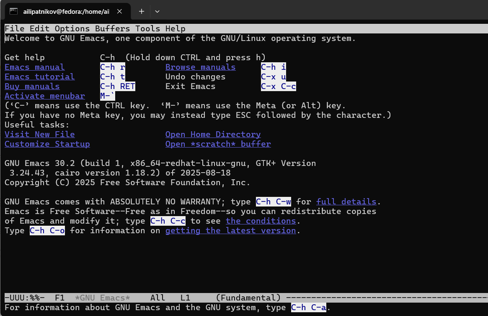

:::
::: {.column width="48%"}

:::
::::::::::::::

- `C-x C-f` --- открыть файл; минибуфер: `~/work/os/lab07/lab07.sh`

::: notes
- Emacs GNU 30.2, режим Fundamental.
- Файл отсутствовал --- Emacs создаёт его.
:::

## Ввод и сохранение текста

- введён текст скрипта (шебанг, функция hello, вызов hello)
- `C-x C-s` --- сохранение

{width=70%}

::: notes
- Строка статуса: lab07.sh  All L9  (Shell-script[sh]).
- Внизу: `Write /home/ailipatnikov/work/os/lab07/lab07.sh`.
:::

## Навигация и переход в конец строки

:::::::::::::: {.columns align=center}
::: {.column width="48%"}

:::
::: {.column width="48%"}

:::
::::::::::::::

- `M-<` --- начало буфера; `C-e` --- конец строки

::: notes
- Слева: L2, курсор после шебанга.
- Справа: L9, курсор в конце строки HELL=Hello.
:::

## Работа с текстом: выделение, копирование, вставка

:::::::::::::: {.columns align=center}
::: {.column width="33%"}

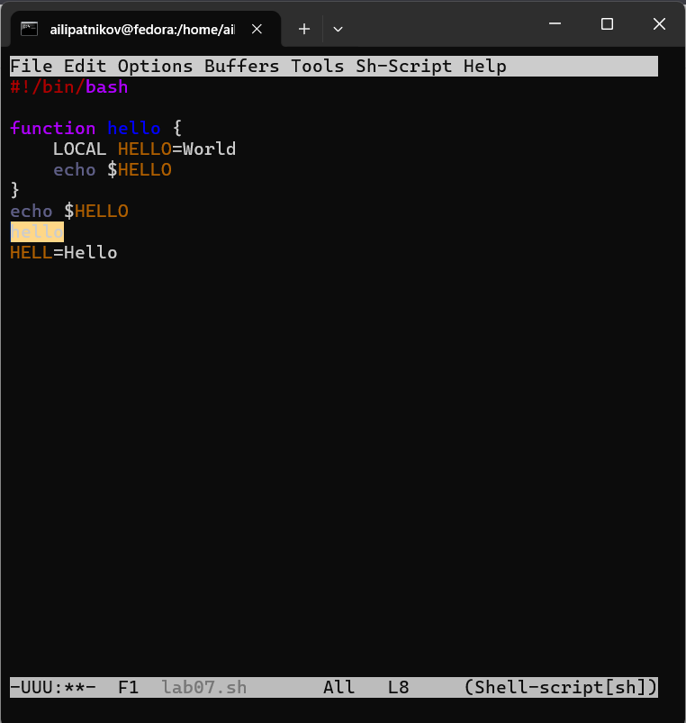

:::
::: {.column width="33%"}

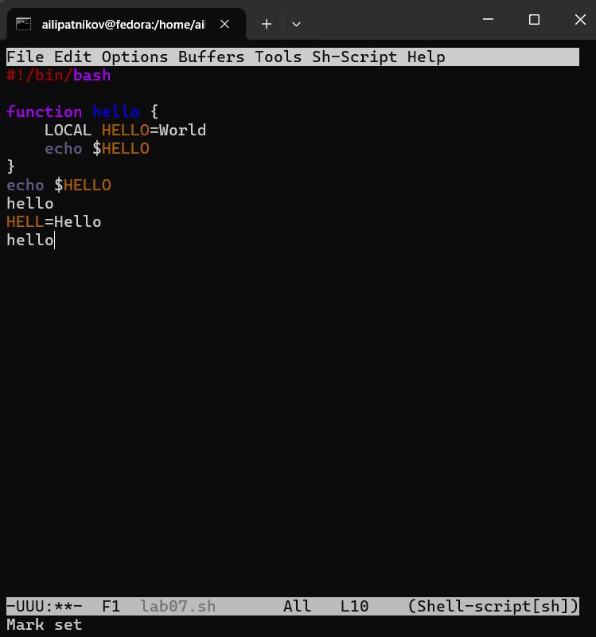

:::
::: {.column width="33%"}

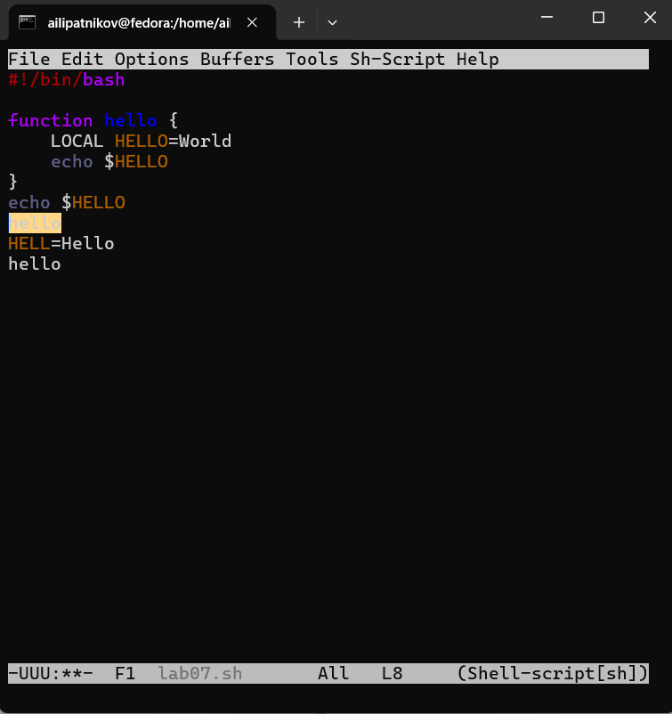

:::
::::::::::::::

- `C-space` --- метка; `M-w` --- копировать; `C-y` --- вставить; `C-w` --- вырезать

::: notes
- В области вывода: Mark set.
- Слева: L8. Центр: L10. Справа: L8.
:::

## Переход в конец буфера и отмена

:::::::::::::: {.columns align=center}
::: {.column width="48%"}

:::
::: {.column width="48%"}

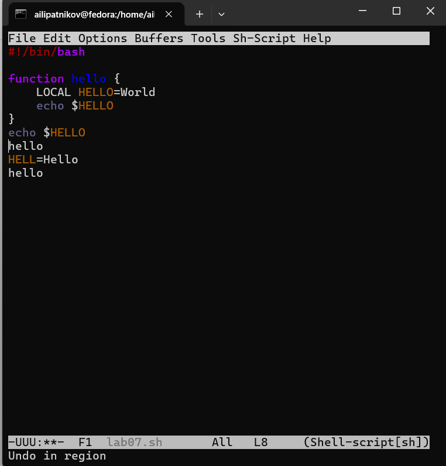

:::
::::::::::::::

- `M->` --- конец буфера; `C-/` --- отмена

::: notes
- Слева: курсор в конце файла.
- Справа: Undo in region; L8.
:::

## Управление буферами

:::::::::::::: {.columns align=center}
::: {.column width="33%"}

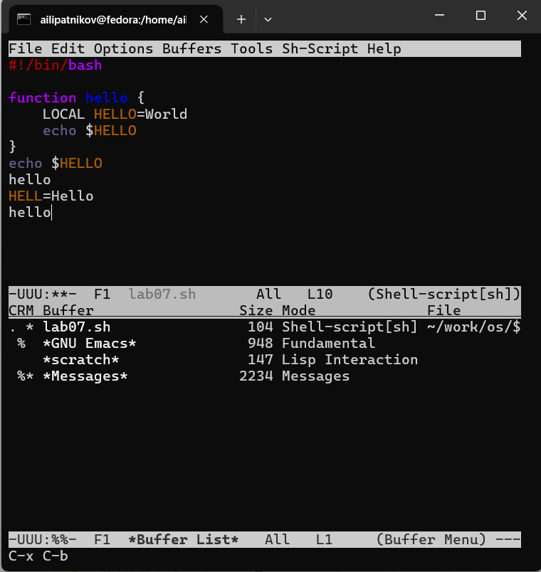

:::
::: {.column width="33%"}

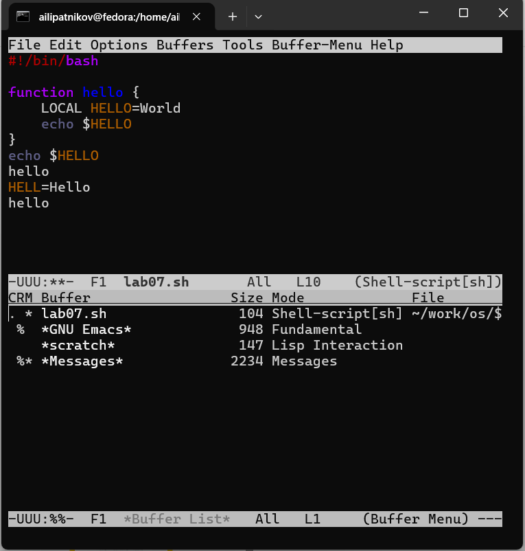

:::
::: {.column width="33%"}

:::
::::::::::::::

- `C-x C-b` --- список; `C-x o` --- другое окно; `C-x b` --- переключить буфер

::: notes
- Буферы: lab07.sh, *GNU Emacs*, *scratch*, *Messages*.
- Минибуфер `Switch to buffer (default *scratch*):`.
:::

## Разделение фрейма на 4 окна

:::::::::::::: {.columns align=center}
::: {.column width="48%"}

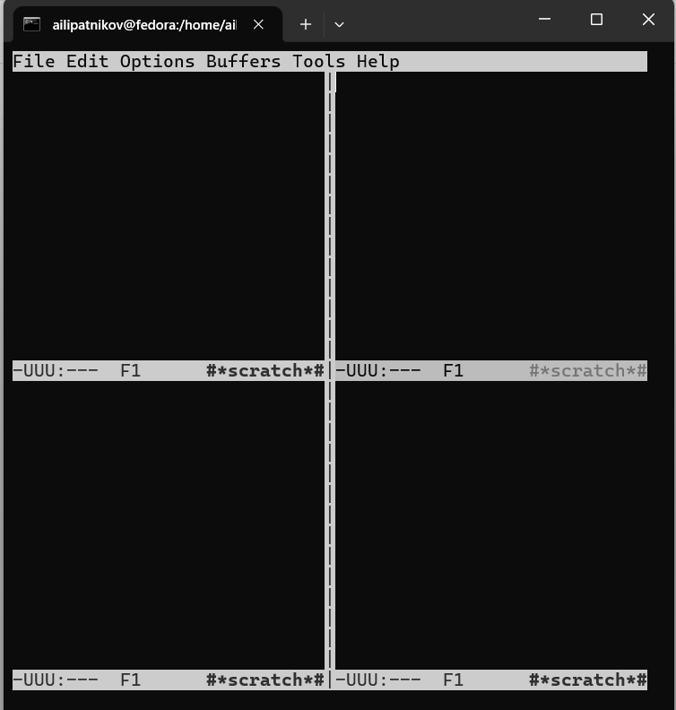

:::
::: {.column width="48%"}

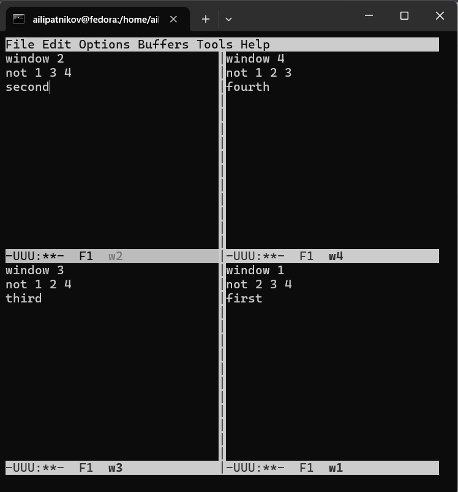

:::
::::::::::::::

- `C-x 3` --- вертикально; `C-x 2` --- горизонтально в каждом окне

::: notes
- 8.1: 4 окна **scratch**.
- 8.2: в каждом окне --- свой буфер с текстом (w1--w4).
:::

## Режим поиска

:::::::::::::: {.columns align=center}
::: {.column width="48%"}

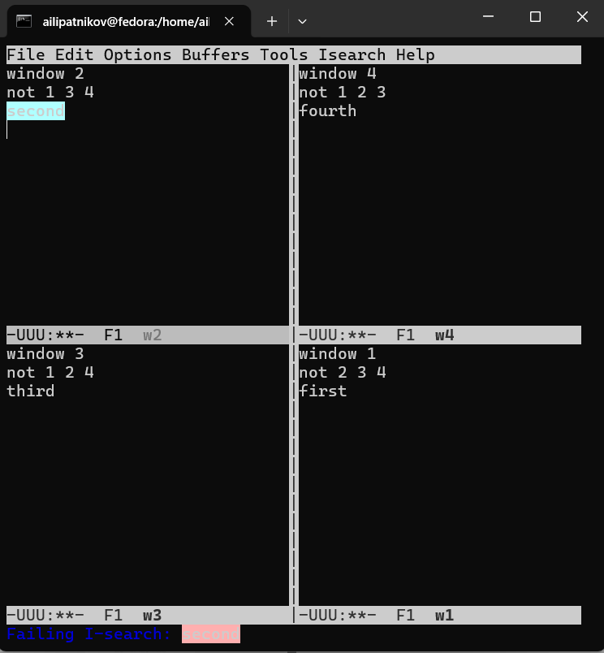

:::
::: {.column width="48%"}

:::
::::::::::::::

- `C-s` --- поиск вперёд; `M-%` --- поиск и замена

::: notes
- C-s подсвечивает слово second в окне w2.
- M-%: минибуфер `Query replace (default ! -> ):`.
:::

## Occur и выход из поиска

:::::::::::::: {.columns align=center}
::: {.column width="48%"}

:::
::: {.column width="48%"}

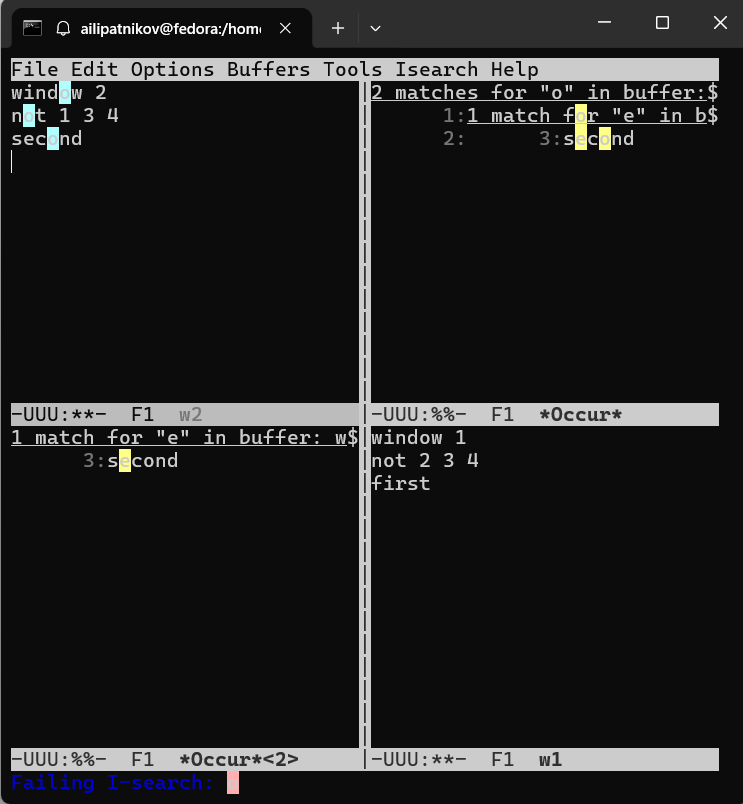

:::
::::::::::::::

- `M-s o` --- Occur: список всех совпадений
- `C-g` --- выход из поиска

::: notes
- Occur: буфер *Occur* со списком строк, содержащих шаблон.
- Отличие от C-s: все совпадения сразу.
- C-g: Failing I-search --- возврат к обычному режиму.
:::

# Результаты

## Полученные результаты

| Действие | Команды Emacs |
|----------|---------------|
| Создание файла | `C-x C-f`, `C-x C-s` |
| Навигация | `M-<`, `C-e`, `M->` |
| Работа с текстом | `C-space`, `M-w`, `C-y`, `C-w`, `C-/` |
| Буферы | `C-x C-b`, `C-x o`, `C-x b` |
| Окна | `C-x 3`, `C-x 2` |
| Поиск | `C-s`, `M-%`, `M-s o`, `C-g` |

: Сводка результатов {#tbl-results}

::: notes
- Все задания методички (9.3.1--9.3.4) выполнены.
- 20 снимков.
:::

# Заключение

## Главный вывод

Emacs — непрерывный редактор без разделения на режимы: ввод текста и команды доступны одновременно. Управление буферами и окнами даёт обзор нескольких файлов сразу, а режим Occur удобнее пошагового поиска. Навыки Emacs применимы и для правки текста, и для работы с кодом в Linux.

::: notes
- Финальный аккорд: повторить главную мысль и перейти к вопросам.
- После паузы: «Я готов ответить на ваши вопросы».
- Финальный слайд «Спасибо за внимание» не используется.
:::
