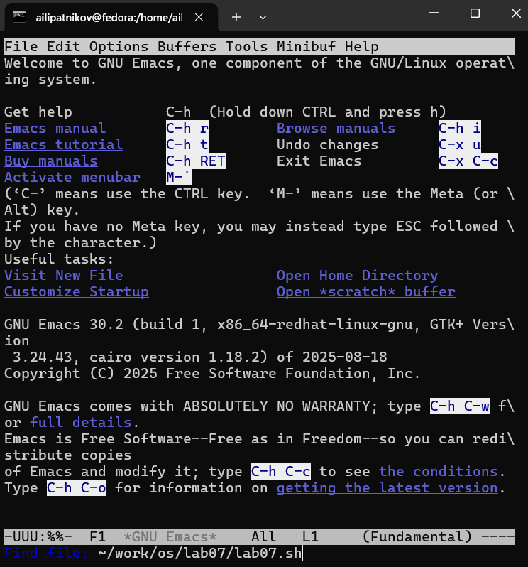
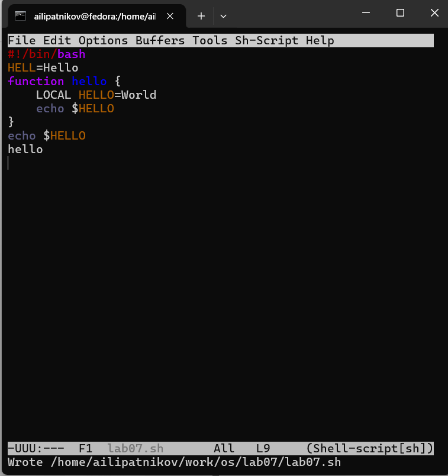
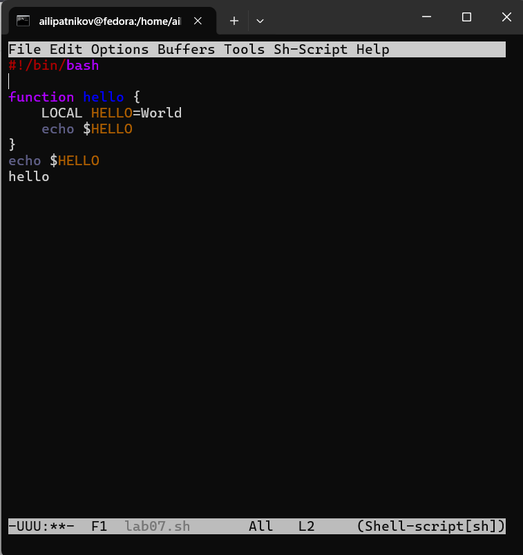
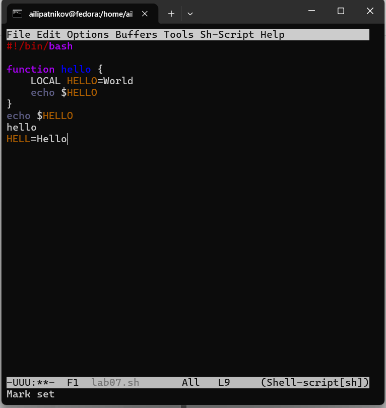
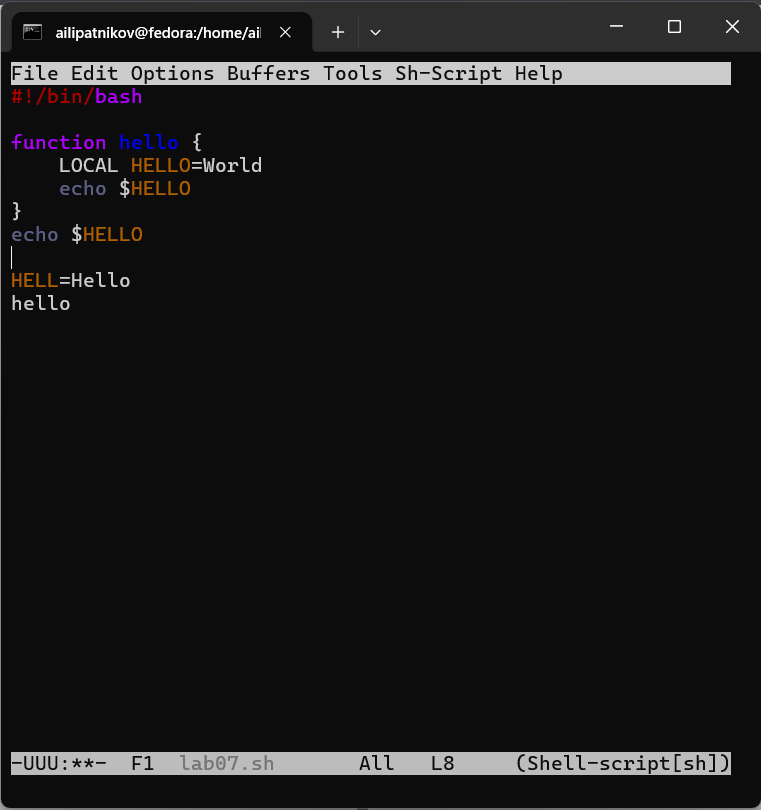
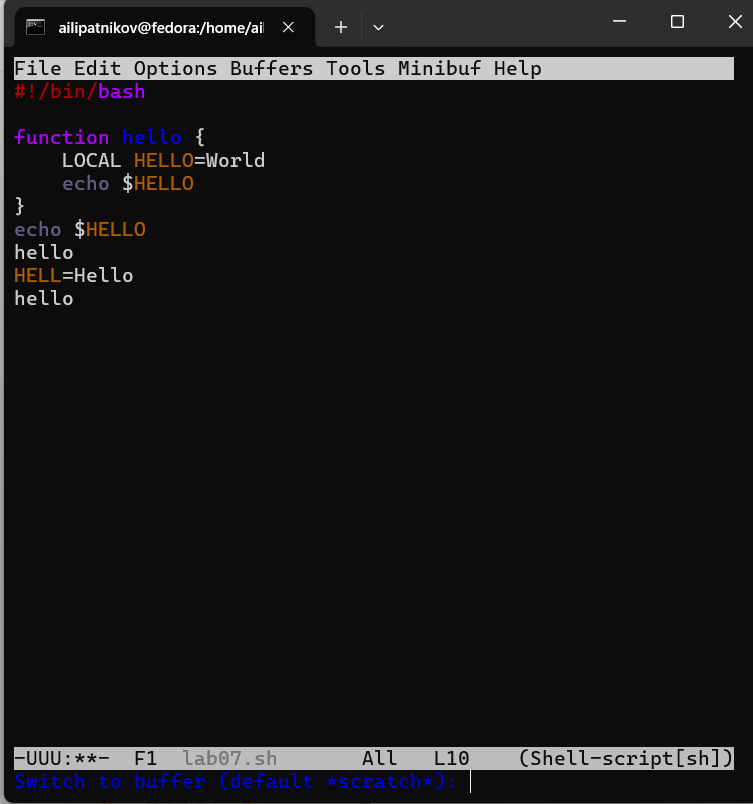
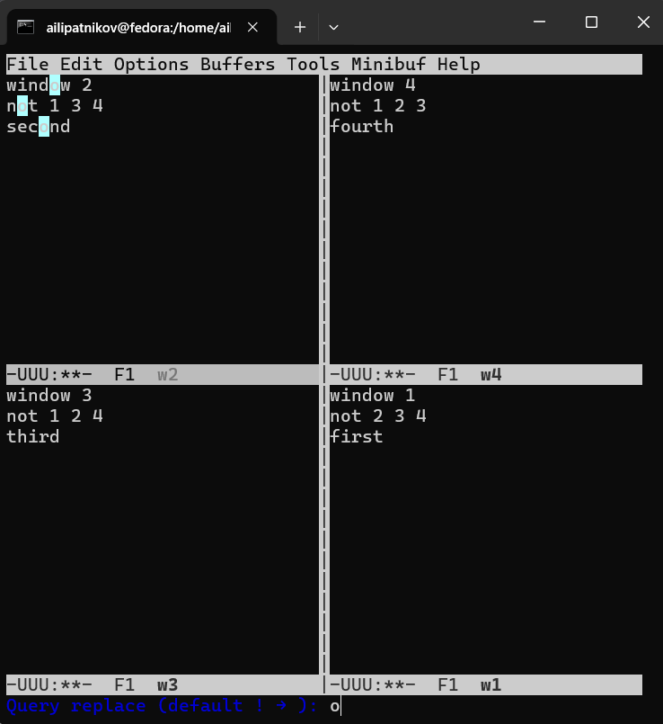
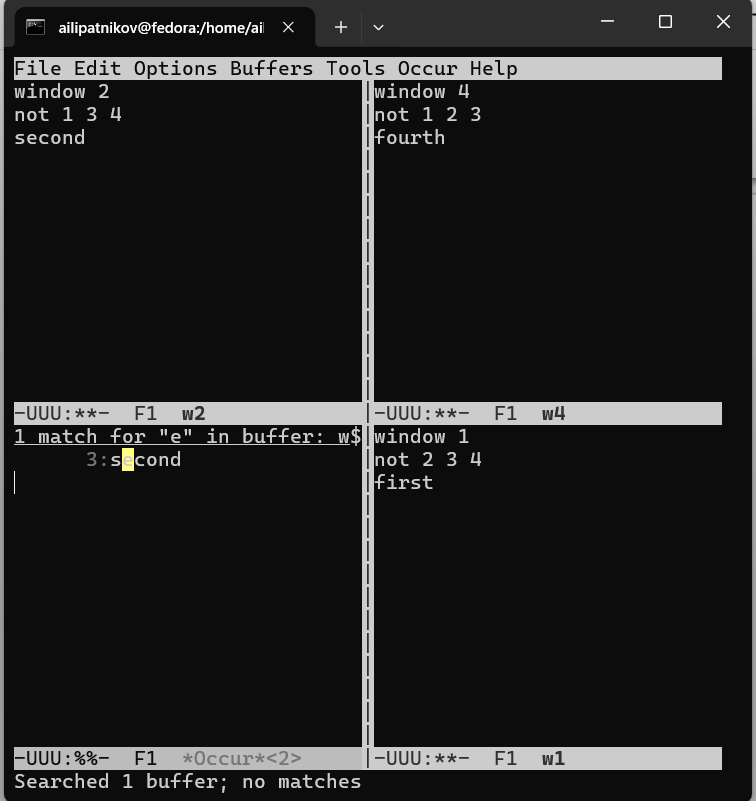
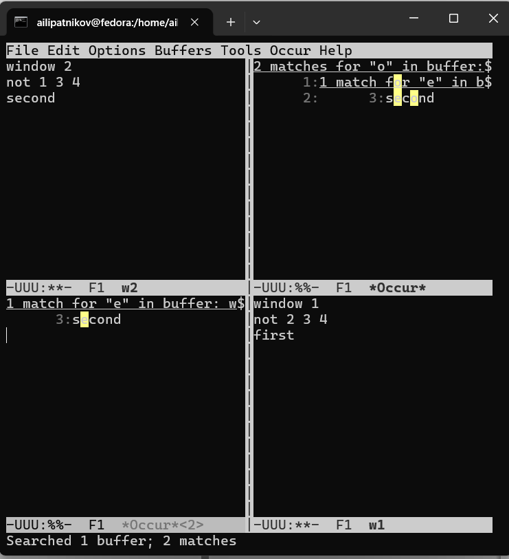

---
## Author
author:
  name: Липатников Андрей
  email: 1032253853@rudn.ru
  affiliation:
    - name: Российский университет дружбы народов
      country: Российская Федерация
      postal-code: 117198
      city: Москва
      address: ул. Миклухо-Маклая, д. 6

## Title
title: "Лабораторная работа №11"
subtitle: "Текстовой редактор emacs"
license: "CC BY"
abstract: |
  В данном отчёте представлены результаты выполнения лабораторной работы по теме «Текстовой редактор emacs».

  Описаны основные термины Emacs (буфер, фрейм, окно, область вывода, минибуфер, точка вставки), базовые команды, управление буферами и окнами, режимы поиска.

  Сделаны выводы о достижении поставленной цели.
keywords: [лабораторная работа, Linux, emacs, текстовый редактор, буфер]
date: today
date-format: "2026.10.08"
---

# Введение

## Актуальность

Emacs — один из старейших и наиболее расширяемых экранных редакторов Linux. Он установлен во всех основных дистрибутивах и используется не только для правки текста, но и как среда разработки: встроенные режимы поддерживают работу с кодом на C, Python, Perl, Lisp. Навык работы с Emacs даёт универсальный инструмент для задач администрирования и разработки.

## Цель работы

Познакомиться с операционной системой Linux. Получить практические навыки работы с редактором Emacs.

## Задачи

1. Изучить основные термины Emacs: буфер, фрейм, окно, область вывода, минибуфер, точка вставки.
2. Освоить команды создания файла, сохранения, работы с текстом.
3. Освоить управление буферами и окнами.
4. Освоить режим поиска и замены.
5. Создать и отредактировать файл `lab07.sh`.

## Объект и предмет исследования

Объект --- текстовой редактор Emacs.

Предмет --- основные команды Emacs, работа с буферами и окнами, режим поиска.

## Методы исследования

Практическая работа в терминале, изучение справки Emacs (`C-h`), выполнение заданий методических указаний, фиксация результатов скриншотами.

## Схема выполнения работы

На рис. -@fig-flowchart представлена общая последовательность действий при выполнении работы.

::: {#fig-flowchart}

```{mermaid}
%%| fig-width: 100%
graph TD
    A@{ shape: circle, label: "Начало" } --> B[Запуск emacs]
    B --> C[Создать lab07.sh]
    C --> D[Ввести текст, сохранить C-x C-s]
    D --> E[Правка текста: C-k, C-y, C-space, M-w, C-w, C-/]
    E --> F[Навигация и буферы]
    F --> G[Разделение окон]
    G --> H[Поиск и замена]
    H --> I[Зафиксировать скриншотами]
    I --> J[Занести в отчёт]
    J --> K@{ shape: dbl-circ, label: "Конец" }
```

Блок-схема выполнения лабораторной работы

:::

# Теоретическая часть

## Основные термины Emacs

- **Буфер** --- объект, представляющий какой-либо текст (файл, результаты компиляции, справка).
- **Фрейм** --- окно в обычном понимании (окно приложения).
- **Окно** --- прямоугольная область фрейма, отображающая один из буферов.
- **Область вывода** --- одна или несколько строк внизу фрейма для сообщений и запросов.
- **Минибуфер** --- область ввода дополнительной информации в области вывода.
- **Точка вставки** --- место вставки/удаления данных в буфере.

## Базовые команды

| Комбинация | Действие |
|------------|----------|
| `C-x C-f` | Открыть файл |
| `C-x C-s` | Сохранить файл |
| `C-x C-c` | Выйти из Emacs |
| `C-x C-b` | Список открытых буферов |
| `C-x b` | Переключиться на другой буфер |
| `C-x 0` | Закрыть текущее окно |
| `C-x 1` | Закрыть все окна, кроме текущего |
| `C-x 2` | Разделить окно по горизонтали |
| `C-x 3` | Разделить окно по вертикали |
| `C-x o` | Перейти в другое окно |
| `C-x i` | Вставить содержимое файла в буфер |

: Основные команды Emacs {#tbl-basic}

## Навигация по буферу

| Комбинация | Действие |
|------------|----------|
| `C-p` | Строка вверх |
| `C-n` | Строка вниз |
| `C-f` | Символ вправо |
| `C-b` | Символ влево |
| `C-a` | В начало строки |
| `C-e` | В конец строки |
| `C-v` | Страница вперёд |
| `M-v` | Страница назад |
| `M-f` | Слово вперёд |
| `M-b` | Слово назад |
| `M-<` | В начало буфера |
| `M->` | В конец буфера |
| `C-g` | Отменить текущую операцию |

: Команды навигации {#tbl-nav}

## Работа с текстом

| Комбинация | Действие |
|------------|----------|
| `C-d` | Удалить символ справа от курсора |
| `M-d` | Удалить слово справа |
| `C-k` | Удалить текст до конца строки |
| `M-k` | Удалить до конца предложения |
| `M-\` | Удалить все пробелы и табуляции вокруг курсора |
| `C-q` | Вставить символ по нажатой клавише |
| `C-space` | Начать выделение |
| `C-w` | Вырезать выделенное |
| `M-w` | Копировать выделенное |
| `C-y` | Вставить из буфера обмена |
| `M-y` | Заменить вставленное следующим элементом |
| `C-/` | Отменить последнее действие |

: Команды работы с текстом {#tbl-edit}

## Режим поиска

| Комбинация | Действие |
|------------|----------|
| `C-s` | Поиск вперёд |
| `C-r` | Поиск назад |
| `M-%` | Поиск и замена с подтверждением |
| `M-s o` | Occur: список строк, соответствующих шаблону |

: Команды поиска {#tbl-search}

## Справка

| Комбинация | Действие |
|------------|----------|
| `C-h ?` | Информация о справочной системе |
| `C-h t` | Интерактивный учебник |
| `C-h f` | Справка по функции |
| `C-h v` | Справка по переменной |
| `C-h k` | Справка по комбинации клавиш |
| `C-h a` | Поиск по справке |
| `C-h F` | Emacs FAQ |

: Справочные команды Emacs {#tbl-help}

Более подробно про Unix см. в [@tanenbaum_book_modern-os_ru; @robbins_book_bash_en; @zarrelli_book_mastering-bash_en; @newham_book_learning-bash_en].

# Материалы и методы

- **ОС:** Fedora 41 (графическая среда Sway)
- **Терминал:** bash
- **Инструменты:** `emacs`, `cat`

Последовательность: запуск Emacs, создание файла `lab07.sh`, ввод текста, сохранение, правка текста, работа с буферами, разделение окон, режим поиска. Все действия документированы 20 скриншотами.

# Выполнение лабораторной работы

## Запуск Emacs

Выполнен запуск Emacs из терминала. Показан стартовый экран с приветствием и списком базовых команд (рис. -@fig-001).

{#fig-001 width=70%}

::: {.notes}
- Emacs GNU 30.2, GTK+ Version.
- Строка статуса внизу: `*GNU Emacs*`, режим Fundamental.
:::

## Создание файла lab07.sh

Выполнена команда `C-x C-f`. В минибуфере набрано имя файла: `~/work/os/lab07/lab07.sh` (рис. -@fig-002).

{#fig-002 width=70%}

::: {.notes}
- Минибуфер внизу: `Find file: ~/work/os/lab07/lab07.sh`.
- Файл отсутствовал --- Emacs создаёт его.
:::

## Ввод и сохранение текста

Введён текст скрипта (шебанг, функция hello, вызов hello). Выполнено сохранение `C-x C-s`. В области вывода --- сообщение `Write /home/ailipatnikov/work/os/lab07/lab07.sh` (рис. -@fig-003).

{#fig-003 width=70%}

::: {.notes}
- Строка статуса: `lab07.sh  All L9  (Shell-script[sh])`.
- Внизу --- сообщение об успешной записи файла.
:::

## Курсор в начале буфера

Выполнена команда `M-<` (переход в начало буфера). Строка статуса: `L2` (рис. -@fig-004).

{#fig-004 width=70%}

::: {.notes}
- Курсор на второй строке --- после шебанга.
- Демонстрация навигации.
:::

## Перемещение курсора в конец строки

Выполнена команда `C-e` (в конец строки). Курсор в конце строки `HELL=Hello` (рис. -@fig-005).

{#fig-005 width=70%}

::: {.notes}
- Строка статуса: `L9`.
- Демонстрация навигации по строке.
:::

## Выделение и копирование фрагмента

Установлена метка `C-space`, выделено слово `hello`, скопировано в буфер обмена `M-w` (рис. -@fig-006).

{#fig-006 width=70%}

::: {.notes}
- В области вывода: `Mark set`.
- Строка статуса: `L8`.
:::

## Вставка и удаление строки

Вставлена строка в конец файла `C-y`, результат виден по строке статуса `L10` (рис. -@fig-007).

{#fig-007 width=70%}

::: {.notes}
- В области вывода: `Mark set`.
- Строка статуса: `L10`.
:::

## Выделение и вырезание области

Снова установлена метка `C-space`, выделено слово `HELL`, вырезано `C-w` (рис. -@fig-008).

{#fig-008 width=70%}

::: {.notes}
- В области вывода: `Mark set`.
- Строка статуса: `L8`.
:::

## Переход в конец буфера

Выполнена команда `M->` (в конец буфера). Курсор в конце файла (рис. -@fig-009).

{#fig-009 width=70%}

::: {.notes}
- Строка статуса: `L8`.
- Демонстрация навигации по буферу.
:::

## Отмена последнего действия

Выполнена команда `C-/` (отмена). В области вывода: `Undo in region` (рис. -@fig-010).

{#fig-010 width=70%}

::: {.notes}
- В области вывода: `Undo in region`.
- Строка статуса: `L8`.
:::

## Список буферов

Выполнена команда `C-x C-b` (список буферов). Открыт буфер `*Buffer List*` с четырьмя записями: `lab07.sh`, `*GNU Emacs*`, `*scratch*`, `*Messages*` (рис. -@fig-011).

{#fig-011 width=70%}

::: {.notes}
- Столбцы: CRM, Buffer, Size, Mode, File.
- Строка статуса: `*Buffer List*  All L1  (Buffer Menu)`.
:::

## Переключение в окно списка буферов

Выполнена команда `C-x o` (переход в другое окно). Курсор в окне `*Buffer List*` (рис. -@fig-012).

{#fig-012 width=70%}

::: {.notes}
- Верхнее окно --- `lab07.sh`, нижнее --- `*Buffer List*`.
- Активное окно --- нижнее.
:::

## Переключение между буферами

Выполнена команда `C-x b`. В минибуфере --- `Switch to buffer (default *scratch*):` (рис. -@fig-013).

{#fig-013 width=70%}

::: {.notes}
- По умолчанию --- `*scratch*`.
- Строка статуса: `lab07.sh  All L10  (Shell-script[sh])`.
:::

## Разделение фрейма на 4 окна

Выполнено разделение фрейма: `C-x 3` (вертикально), затем `C-x 2` (горизонтально в каждом окне). Получено 4 окна `**scratch**` (рис. -@fig-014).

{#fig-014 width=70%}

::: {.notes}
- Все 4 окна показывают буфер `**scratch**`.
- Строка статуса каждого окна: `-UUU:---  F1  **scratch**`.
:::

## Текст в четырёх окнах

В каждом из четырёх окон открыт новый буфер и введено несколько строк текста (рис. -@fig-015).

{#fig-015 width=70%}

::: {.notes}
- Верхние окна: `window 2`, `window 4`.
- Нижние окна: `window 3`, `window 1`.
- Строки статуса: `w1`, `w2`, `w3`, `w4`.
:::

## Режим поиска C-s

Выполнена команда `C-s` (поиск вперёд). В области вывода --- `I-search:` (рис. -@fig-016).

{#fig-016 width=70%}

::: {.notes}
- Поиск подсвечивает слово `second` в окне `w2`.
- Выход из поиска --- `C-g`.
:::

## Поиск и замена M-%

Выполнена команда `M-%` (поиск и замена). В минибуфере --- `Query replace (default ! -> ):` (рис. -@fig-017).

{#fig-017 width=70%}

::: {.notes}
- Emacs запрашивает пару: что найти и на что заменить.
- После ввода --- подтверждение для каждого совпадения.
:::

## Режим Occur M-s o

Выполнена команда `M-s o` (режим Occur). Открыт буфер `*Occur*` со списком совпадений (рис. -@fig-018, -@fig-019).

{#fig-018 width=70%}

{#fig-019 width=70%}

::: {.notes}
- Occur показывает все строки, содержащие шаблон, в отдельном буфере.
- Отличие от C-s: не по одному совпадению, а списком.
:::

## Выход из режима поиска

Выполнена команда `C-g` (выход из поиска). В области вывода --- `Failing I-search:` (рис. -@fig-020).

{#fig-020 width=70%}

::: {.notes}
- C-g отменяет текущую операцию.
- Возврат в обычный режим редактирования.
:::

# Результаты

В ходе работы выполнены все задания методических указаний (9.3.1--9.3.4), зафиксированные 20 скриншотами (рис. -@fig-001 --- -@fig-020). Сводка результатов приведена в табл. -@tbl-results.

| Задание | Действия | Результат |
|---------|----------|-----------|
| 9.3.1 | Создание `lab07.sh`, ввод текста, `C-x C-s`, `C-k`, `C-y`, `C-space`, `M-w`, `C-w`, `C-/` | Файл создан и отредактирован |
| 9.3.2 | `C-x C-b`, `C-x o`, `C-x b` | Освоено управление буферами |
| 9.3.3 | `C-x 3`, `C-x 2`, 4 окна | Освоено управление окнами |
| 9.3.4 | `C-s`, `M-%`, `M-s o`, `C-g` | Освоены режимы поиска и замены |

: Сводка выполнения заданий {#tbl-results}

# Обсуждение результатов

Все задания методички выполнены. Emacs подтвердил ключевое отличие от vi: это **непрерывный** редактор (нет разделения на режимы), поэтому ввод текста и команды доступны одновременно. Управление буферами (`C-x C-b`, `C-x b`) позволяет работать с несколькими файлами в одном фрейме, а разделение окон (`C-x 3`, `C-x 2`) даёт одновременный обзор разных частей документа. Режим `M-s o` (Occur) удобнее `C-s`: он показывает **все** совпадения сразу, а не по одному. Отмена `C-/` работает **многократно** в отличие от `u` в vi (только одно действие).

# Заключение

- Цель работы достигнута: получены практические навыки работы с редактором Emacs.
- Освоены основные термины Emacs: буфер, фрейм, окно, минибуфер, точка вставки.
- Освоены базовые команды (`C-x C-f`, `C-x C-s`, `C-x C-c`), навигация (`C-a`, `C-e`, `M-<`, `M->`).
- Освоено управление буферами (`C-x C-b`, `C-x b`) и окнами (`C-x 3`, `C-x 2`, `C-x o`).
- Освоены режимы поиска и замены (`C-s`, `M-%`, `M-s o`).

Полученные навыки применимы при работе с текстом и кодом в Linux.

# Список литературы {.unnumbered}

::: {#refs}
:::

\appendix

# Приложение А. Ответы на контрольные вопросы {.appendix}

## 1. Краткая характеристика редактора Emacs

Emacs — экранный редактор, написанный на языке Elisp. Расширяемый: функциональность добавляется через пакеты. Поддерживает буферы, окна, фреймы, режимы (основные и второстепенные), встроенную справку (`C-h`). Используется не только как редактор, но и как среда разработки.

## 2. Особенности, делающие Emacs сложным для новичка

- Непривычные обозначения: `C-` (Ctrl), `M-` (Meta/Alt), `S-` (Shift).
- Специфическая терминология: буфер, фрейм, окно, точка вставки, минибуфер.
- Большое количество комбинаций клавиш (сотни).
- Меню и графика вторичны — принято работать через клавиатуру.
- Много «режимов» (Fundamental, Text, Lisp, C, Texinfo и др.).

## 3. Буфер и окно в терминологии Emacs

- **Буфер** — объект, содержащий текст (файл, справка, результаты компиляции).
- **Окно** — прямоугольная область фрейма, отображающая один из буферов.
- Один буфер может отображаться в нескольких окнах; одно окно показывает только один буфер.

## 4. Можно ли открыть больше 10 буферов в одном окне

Да. Окно отображает один буфер, но количество буферов в сессии **не ограничено**. Список — `C-x C-b`. Переключение — `C-x b`.

## 5. Буферы по умолчанию при запуске Emacs

- `*scratch*` — для временных заметок.
- `*Messages*` — системные сообщения.
- `*GNU Emacs*` — стартовый экран.
- `*Buffer List*` — создаётся при `C-x C-b`.

## 6. Клавиши для команд C-c l и C-c C-l

- **C-c l** — нажать `Ctrl+c`, затем `l` без отпускания `Ctrl`.
- **C-c C-l** — нажать `Ctrl+c`, затем `Ctrl+l`.
В Emacs `C-` означает удержание `Ctrl`; последовательность набирается **без отпускания модификатора**.

## 7. Как поделить окно на две части

- Горизонтально: `C-x 2`.
- Вертикально: `C-x 3`.

## 8. Где хранятся настройки Emacs

- Для Emacs: `~/.emacs` или `~/.emacs.d/init.el`.
- Для Spacemacs: `~/.spacemacs`.
- Для Doom Emacs: `~/.doom.d/`.

## 9. Функция клавиши C-l и её переназначение

`C-l` центрирует экран на текущей строке (`recenter-top-bottom`). Переназначить: в `~/.emacs`:
```elisp
(global-set-key (kbd "C-l") 'имя-функции)
```

## 10. Что удобнее — vi или Emacs

Зависит от задачи. **vi** удобнее для быстрых правок из терминала: модальность ускоряет навигацию и команды. **Emacs** удобнее для длительной работы: буферы, окна, расширяемость, встроенная справка. Автор отчёта предпочитает **vi** для одноразовых правок и **Emacs** для работы над проектами.

# Приложение Б. Листинг lab07.sh {.appendix}

Листинг восстановлен по скриншотам. **Проверь `cat lab07.sh` и замени, если расходится.**

```bash
#!/bin/bash
function hello {
    LOCAL HELLO=World
    echo $HELLO
}
echo $HELLO
hello
HELL=Hello
```

# Приложение В. Листинг команд {.appendix}

```text
# Запуск
emacs

# Создание файла
C-x C-f  ~/work/os/lab07/lab07.sh
# ввод текста
C-x C-s  (сохранить)

# Навигация
M-<      (в начало буфера)
C-e      (в конец строки)
M->      (в конец буфера)

# Работа с текстом
C-space  (начать выделение)
M-w      (копировать)
C-y      (вставить)
C-w      (вырезать)
C-/      (отменить)

# Буферы
C-x C-b  (список)
C-x o    (перейти в другое окно)
C-x 0    (закрыть окно)
C-x b    (переключить буфер)

# Окна
C-x 3    (вертикальное разделение)
C-x 2    (горизонтальное разделение)

# Поиск
C-s      (поиск вперёд)
M-%      (поиск и замена)
M-s o    (Occur)
C-g      (отменить)

# Выход
C-x C-c
```
