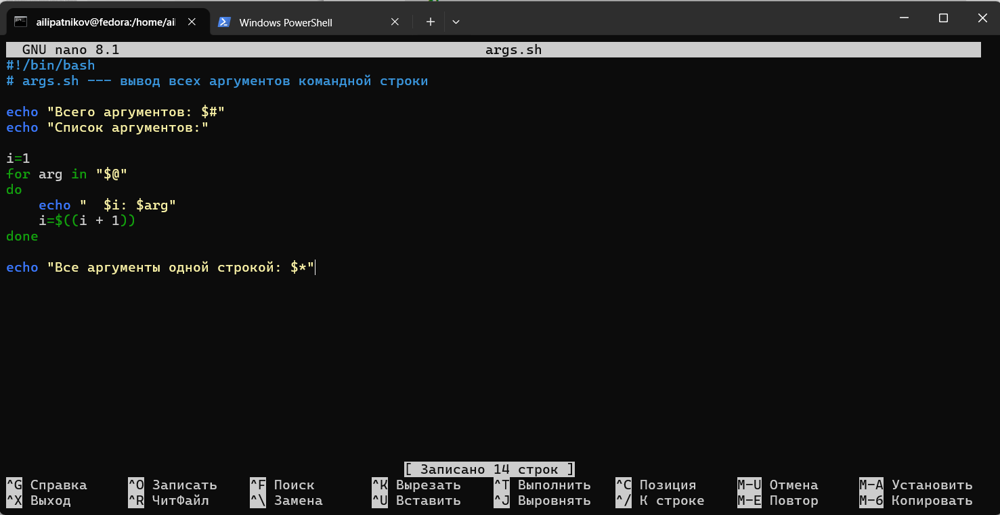
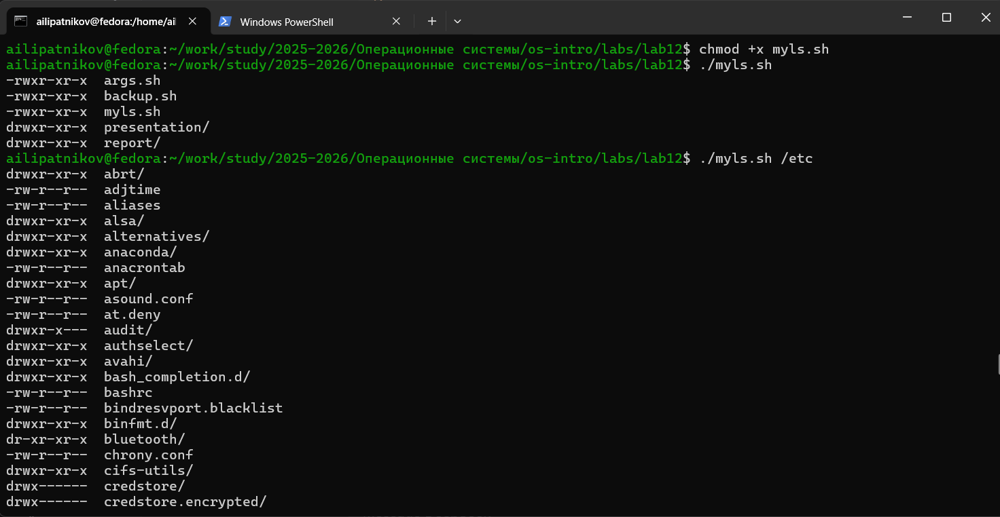

---
## Author
author:
  name: Липатников Андрей
  email: 1032253853@rudn.ru
  affiliation:
    - name: Российский университет дружбы народов
      country: Российская Федерация
      postal-code: 117198
      city: Москва
      address: ул. Миклухо-Маклая, д. 6
## Title
title: "Лабораторная работа №12"
subtitle: "Программирование в командном процессоре ОС UNIX"
license: "CC BY"
date: today
date-format: "2026-10-08"
---

# Информация

## Докладчик

:::::::::::::: {.columns align=center}
::: {.column width="70%"}

  * Липатников Андрей
  * Студент НКАбд-04-25
  * Российский университет дружбы народов
  * [1032253853@rudn.ru](mailto:1032253853@rudn.ru)

:::
::: {.column width="30%"}


:::
::::::::::::::

::: notes
- Поприветствовать аудиторию.
- Представиться кратко, даже если вас объявили.
- Доклад посвящён лабораторной работе по программированию в командном процессоре ОС UNIX.
:::

# Вводная часть

## Актуальность

::: {.incremental}
- bash --- основной инструмент автоматизации в UNIX/Linux
- скрипты решают задачи резервного копирования, обработки данных, администрирования
- владение переменными, метасимволами и управляющими конструкциями обязательно для администратора
:::

::: notes
- Подчеркнуть универсальность bash.
- Время: не более 1 минуты.
:::

## Объект и предмет исследования

- **Объект**: командный процессор bash
- **Предмет**: переменные, метасимволы, командные файлы, функции, управляющие конструкции

::: notes
- Объект --- широкая область (командные оболочки UNIX).
- Предмет --- конкретные элементы языка bash.
:::

## Цели и задачи

- **Цель**: изучить основы программирования в командном процессоре ОС UNIX; приобрести практические навыки написания командных файлов на bash.
- **Задачи**:

::: {.incremental}
- изучить переменные, метасимволы и экранирование
- освоить командные файлы, функции, передачу параметров
- освоить управляющие конструкции bash
- разработать четыре скрипта по заданиям методички
:::

::: notes
- Цель дословно из методических указаний.
- Задачи соответствуют пунктам 10.2 и 10.3.
:::

## Материалы и методы

- ОС: Fedora 41 (Sway), оболочка bash
- инструменты: bash, tar, bzip2, stat, chmod, man
- рабочий каталог: `~/work/study/2025-2026/Операционные системы/os-intro/labs/lab12`
- 4 скрипта, 8 снимков

::: notes
- Кратко по окружению и циклу.
- Подробная методика --- в отчёте.
:::

# Содержание исследования

## Командные оболочки

| Оболочка | Характеристика |
|----------|----------------|
| `sh` | Стандартная оболочка UNIX |
| `csh` | C-подобный синтаксис |
| `ksh` | Операторы Борна + удобства C |
| `bash` | Совмещает sh, csh, ksh; POSIX-совместима |

: Командные оболочки {#tbl-shells}

::: notes
- bash --- самая распространённая в Linux.
- POSIX --- набор стандартов совместимости UNIX-подобных ОС.
:::

## Переменные и метасимволы

- Присваивание: `var=value`, использование: `$var`
- Стандартные: `HOME`, `IFS`, `MAIL`, `TERM`, `LOGNAME`, `PS1`, `PS2`
- Метасимволы: `*`, `?`, `[c1-c2]`
- Экранирование: `\`, одинарные `'…'`, двойные `"…"`

::: notes
- `*` --- любая строка, `?` --- один символ, `[c1-c2]` --- диапазон.
- В двойных кавычках не экранируются `$`, `` ` ``, `\`, `!`.
:::

## Командные файлы и функции

- Скрипт: `chmod +x file.sh`, запуск: `./file.sh`
- Функция:
  ```bash
  function имя { команды; }
  # или
  имя() { команды; }
  ```
- Передача параметров: `$1`, `$2`, …, `$#`, `$@`, `$*`, `$?`, `$$`, `$!`
- `getopts` — разбор флагов командной строки; переменные `OPTARG`, `OPTIND`

::: notes
- `$0` — имя скрипта, `$#` — число параметров.
- `getopts` в цикле `while` + `case`.
:::

## Управляющие конструкции

::: {.incremental}
- `if … then … [elif … then …] [else …] fi`
- `case имя in шаблон) команды;; … esac`
- `for i in … do … done`
- `while условие do … done`
- `until условие do … done`
- `break`, `continue`
:::

::: notes
- `break` завершает цикл, `continue` — текущую итерацию.
- Операторы `true` и `false` — для бесконечных циклов.
:::

## Задание 1. backup.sh

- Резервная копия **самого себя** в `~/backup/`
- Архивация через `tar` + `bzip2` (ключ `-cjf`)
- Имя архива содержит дату и время

```bash
tar -cjf "$BACKUP_DIR/$FILENAME.tar.bz2" "$SELF"
```

{width=70%}

::: notes
- `$0` --- имя самого скрипта.
- `basename` отделяет имя от пути.
- `date` даёт метку времени.
:::

## Задание 1. Результат

{width=70%}

- Архив `backup.sh_YYYY-MM-DD_HH-MM-SS.tar.bz2` создан в `~/backup/`

::: notes
- Проверка: `ls -l ~/backup/`.
- Можно распаковать: `tar -tjf архив`.
:::

## Задание 2. args.sh

- Вывод **всех** аргументов командной строки
- Обработка **любого** числа аргументов (включая > 10)
- Использованы `$#`, `$@`, `$*`, цикл `for`, арифметика `$((...))`

```bash
for arg in "$@"
do
    echo "  $i: $arg"
    i=$((i + 1))
done
```

{width=70%}

::: notes
- `$@` — все аргументы как отдельные слова.
- `$#` — число аргументов.
:::

## Задание 2. Результат

{width=70%}

- Выведено **13 из 13** аргументов
- Обработка > 10 работает (в отличие от `$1`…`$9`)

::: notes
- Для `$10` нужно `${10}` или `shift`.
:::

## Задание 3. myls.sh

- Аналог `ls` **без** `ls` и `dir`
- Вывод прав через `stat -c "%A"`
- Поддержка скрытых файлов: `.[!.]*`
- Каталоги помечены `/`

```bash
perms=$(stat -c "%A" "$item")
```

{width=70%}

::: notes
- Проверка `-d` для каталогов, `-f` для файлов.
- `[ -e "$item" ] || continue` — пропуск несуществующих.
:::

## Задание 3. Результат

{width=70%}

- Список файлов с правами (аналог `ls -l`)
- Работает для любого каталога, переданного аргументом

::: notes
- Пример: `./myls.sh /etc`, `./myls.sh ~`.
:::

## Задание 4. count_ext.sh

- Подсчёт файлов указанного формата в каталоге
- Аргументы: `<формат>` и `<каталог>`
- Проверки: `$#`, `-d`, `-f`

```bash
for item in "$DIR"/*"$FORMAT"
do
    [ -f "$item" ] || continue
    count=$((count + 1))
done
```

{width=70%}

::: notes
- Формат передаётся как `.txt`, `.doc`, `.jpg`, `.pdf`.
- Путь — отдельным аргументом.
:::

## Задание 4. Результат

{width=70%}

- Подсчитаны файлы нужного формата в указанном каталоге
- Примеры: `./count_ext.sh .sh .`, `./count_ext.sh .conf /etc`

::: notes
- Работает для любого расширения.
:::

# Результаты

## Полученные результаты

| Задание | Файл | Результат |
|---------|------|-----------|
| 1 | `backup.sh` | Архив в `~/backup/` |
| 2 | `args.sh` | Вывод 13 из 13 аргументов |
| 3 | `myls.sh` | Аналог `ls -l` |
| 4 | `count_ext.sh` | Подсчёт файлов по формату |

: Сводка результатов {#tbl-results}

::: notes
- Все задания методички выполнены.
- 8 снимков.
:::

## Ключевые конструкции bash

| Элемент | Пример |
|---------|--------|
| Переменная | `var=value`, `$var` |
| Метасимвол | `*`, `?`, `[a-z]` |
| Экранирование | `\*`, `'a*b'` |
| Условие | `if [ -d "$dir" ]; then …` |
| Цикл | `for i in "$@"; do … done` |
| Функция | `f() { … }` |

: Ключевые конструкции {#tbl-constructs}

::: notes
- При вопросах о синтаксисе --- таблица на экране.
- Полные ответы --- в приложении А отчёта.
:::

# Заключение

## Главный вывод

bash предоставляет полный набор инструментов для автоматизации: переменные, метасимволы, командные файлы, функции, управляющие конструкции. Разработанные скрипты (резервное копирование, обработка аргументов, аналог `ls`, подсчёт файлов) демонстрируют применимость bash для задач администрирования и обработки данных в UNIX/Linux.

::: notes
- Финальный аккорд: повторить главную мысль и перейти к вопросам.
- После паузы: «Я готов ответить на ваши вопросы».
- Финальный слайд «Спасибо за внимание» не используется.
:::
