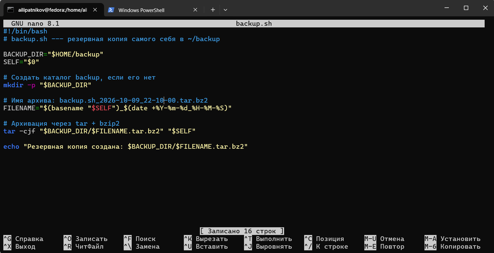
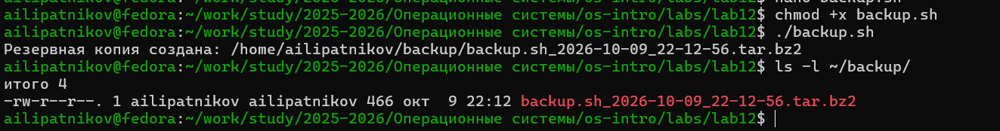
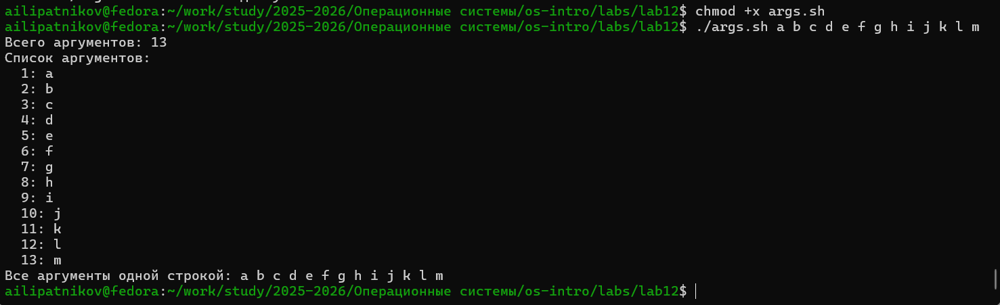
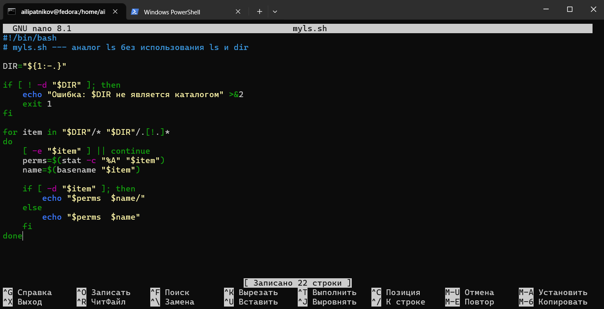
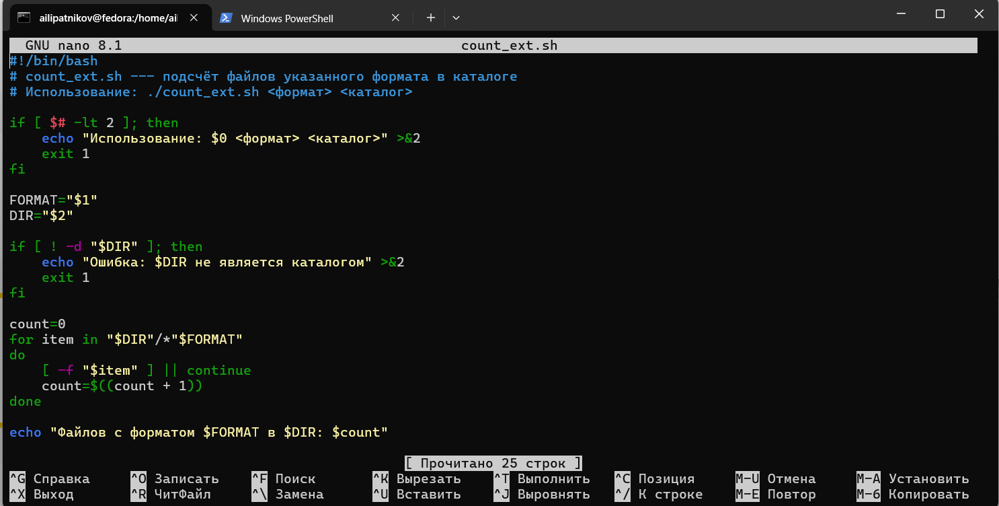
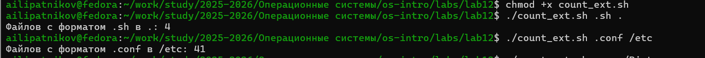

---
## Author
author:
  name: Липатников Андрей
  email: 1032253853@rudn.ru
  affiliation:
    - name: Российский университет дружбы народов
      country: Российская Федерация
      postal-code: 117198
      city: Москва
      address: ул. Миклухо-Маклая, д. 6

## Title
title: "Лабораторная работа №12"
subtitle: "Программирование в командном процессоре ОС UNIX"
license: "CC BY"
abstract: |
  В данном отчёте представлены результаты выполнения лабораторной работы по теме «Программирование в командном процессоре ОС UNIX».

  Описаны переменные, метасимволы, командные файлы, функции, управляющие конструкции bash, а также разработаны четыре прикладных скрипта.

  Сделаны выводы о достижении поставленной цели.
keywords: [лабораторная работа, Linux, bash, командный процессор, скрипты]
date: today
date-format: "2026.10.08"
---

# Введение

## Актуальность

Командный процессор bash — основной инструмент автоматизации задач в ОС UNIX/Linux. Владение переменными, метасимволами, управляющими конструкциями и функциями bash позволяет создавать скрипты для резервного копирования, обработки данных и администрирования. Навык программирования в bash — обязательная часть подготовки системного администратора и разработчика.

## Цель работы

Изучить основы программирования в командном процессоре ОС UNIX; приобрести практические навыки написания и отладки командных файлов на языке bash.

## Задачи

1. Изучить переменные, метасимволы и их экранирование в bash.
2. Освоить командные файлы, функции, передачу параметров и специальные переменные.
3. Освоить управляющие конструкции (`if`, `case`, `for`, `while`, `until`, `break`, `continue`).
4. Разработать скрипты по заданиям 1–4 методических указаний.
5. Ответить на контрольные вопросы.

## Объект и предмет исследования

Объект --- командный процессор bash.

Предмет --- переменные, метасимволы, командные файлы, функции и управляющие конструкции.

## Методы исследования

Практическая работа в терминале, изучение `man`-справок, написание скриптов, проверка их работы, фиксация результатов скриншотами.

## Схема выполнения работы

На рис. -@fig-flowchart представлена общая последовательность действий при выполнении работы.

::: {#fig-flowchart}

```{mermaid}
%%| fig-width: 100%
graph TD
    A@{ shape: circle, label: "Начало" } --> B[Изучить теорию bash]
    B --> C[Скрипт backup.sh]
    C --> D[Скрипт args.sh]
    D --> E[Скрипт myls.sh]
    E --> F[Скрипт count_ext.sh]
    F --> G[Зафиксировать скриншотами]
    G --> H[Занести в отчёт]
    H --> I[Поместить в git-репозиторий]
    I --> J@{ shape: dbl-circ, label: "Конец" }
```

Блок-схема выполнения лабораторной работы

:::

# Теоретическая часть

## Командные оболочки

| Оболочка | Характеристика |
|----------|----------------|
| `sh` (Bourne shell) | Стандартная оболочка UNIX, базовый набор функций |
| `csh` (C shell) | C-подобный синтаксис, история команд |
| `ksh` (Korn shell) | Операторы Борна + удобства C |
| `bash` (Bourne Again Shell) | Совмещает sh, csh, ksh; POSIX-совместима |

: Командные оболочки UNIX {#tbl-shells}

## Переменные

Присваивание: `mark=/usr/andy/bin`.  
Использование: `$mark` (с префиксом `$`).  
Стандартные: `HOME`, `IFS`, `MAIL`, `TERM`, `LOGNAME`, `PS1`, `PS2`.  
Просмотр: `set`.

## Метасимволы

| Метасимвол | Значение |
|-----------|----------|
| `*` | Произвольная строка (в том числе пустая) |
| `?` | Любой один символ |
| `[c1-c2]` | Символ в диапазоне c1–c2 |

: Метасимволы bash {#tbl-meta}

**Экранирование:** `\` перед метасимволом; группа — в одинарных `'...'` или двойных `"..."` кавычках (двойные не экранируют `$`, `` ` ``, `\`, `!`).

## Командные файлы и функции

Скрипт делается исполняемым: `chmod +x имя_файла`.  
Функция: `function имя { команды; }` или `имя() { команды; }`.  
Просмотр функций: `typeset -f`.  
Экспорт: `typeset -fx имя`.

## Передача параметров

- `$1`, `$2`, … --- позиционные параметры.
- `$0` --- имя скрипта.
- `$#` --- число параметров.
- `$*` --- все параметры одной строкой.
- `$?` --- код завершения последней команды.
- `$$` --- PID текущей оболочки.
- `$!` --- PID последней фоновой команды.

## Команда `getopts`

Синтаксис: `getopts option-string variable [arg ...]`.  
Флаги с аргументами обозначаются двоеточием: `o:i:ltr`.  
Специальные переменные: `OPTARG` (значение аргумента), `OPTIND` (индекс).

## Управляющие конструкции

- `if … then … [elif … then …] [else …] fi`
- `case имя in шаблон) команды;; … esac`
- `for i in … do … done`
- `while условие do … done`
- `until условие do … done`
- `break`, `continue`

Более подробно про Unix см. в [@tanenbaum_book_modern-os_ru; @robbins_book_bash_en; @zarrelli_book_mastering-bash_en; @newham_book_learning-bash_en].

# Материалы и методы

- **ОС:** Fedora 41 (Sway)
- **Терминал:** bash
- **Инструменты:** `bash`, `tar`, `bzip2`, `stat`, `chmod`, `man`

Рабочий каталог: `~/work/study/2025-2026/Операционные системы/os-intro/labs/lab12`.

Последовательность: изучение теории, написание четырёх скриптов, проверка работы, фиксация скриншотами.

# Выполнение лабораторной работы

## Подготовка каталога

```bash
mkdir -p ~/work/study/2025-2026/"Операционные системы"/os-intro/labs/lab12
cd ~/work/study/2025-2026/"Операционные системы"/os-intro/labs/lab12
```

## Задание 1. Резервная копия самого себя

Создан скрипт `backup.sh` (рис. -@fig-001).

{#fig-001 width=70%}

```bash
#!/bin/bash
BACKUP_DIR="$HOME/backup"
SELF="$0"
mkdir -p "$BACKUP_DIR"
FILENAME="$(basename "$SELF")_$(date +%Y-%m-%d_%H-%M-%S)"
tar -cjf "$BACKUP_DIR/$FILENAME.tar.bz2" "$SELF"
echo "Резервная копия создана: $BACKUP_DIR/$FILENAME.tar.bz2"
```

Запуск и результат (рис. -@fig-002).

{#fig-002 width=70%}

::: {.notes}
- Архивация через tar + bzip2 (ключ -cjf).
- Имя архива содержит дату и время.
:::

## Задание 2. Обработка произвольного числа аргументов

Создан скрипт `args.sh` (рис. -@fig-003).

{#fig-003 width=70%}

```bash
#!/bin/bash
echo "Всего аргументов: $#"
i=1
for arg in "$@"
do
    echo "  $i: $arg"
    i=$((i + 1))
done
echo "Все аргументы одной строкой: $*"
```

Запуск с 13 аргументами (рис. -@fig-004).

{#fig-004 width=70%}

::: {.notes}
- `$#` --- число аргументов (13).
- `$@` --- все аргументы как отдельные слова.
- Цикл `for` перебирает все аргументы.
:::

## Задание 3. Аналог `ls` без `ls` и `dir`

Создан скрипт `myls.sh` (рис. -@fig-005).

{#fig-005 width=70%}

```bash
#!/bin/bash
DIR="${1:-.}"
if [ ! -d "$DIR" ]; then
    echo "Ошибка: $DIR не является каталогом" >&2
    exit 1
fi
for item in "$DIR"/* "$DIR"/.[!.]*
do
    [ -e "$item" ] || continue
    perms=$(stat -c "%A" "$item")
    name=$(basename "$item")
    if [ -d "$item" ]; then
        echo "$perms  $name/"
    else
        echo "$perms  $name"
    fi
done
```

Запуск для домашнего каталога и `/etc` (рис. -@fig-006).

{#fig-006 width=70%}

::: {.notes}
- Права через `stat -c "%A"`.
- Каталоги помечены `/`.
- Поддерживаются скрытые файлы (`.[!.]*`).
:::

## Задание 4. Подсчёт файлов по формату

Создан скрипт `count_ext.sh` (рис. -@fig-007).

{#fig-007 width=70%}

```bash
#!/bin/bash
if [ $# -lt 2 ]; then
    echo "Использование: $0 <формат> <каталог>" >&2
    exit 1
fi
FORMAT="$1"
DIR="$2"
if [ ! -d "$DIR" ]; then
    echo "Ошибка: $DIR не является каталогом" >&2
    exit 1
fi
count=0
for item in "$DIR"/*"$FORMAT"
do
    [ -f "$item" ] || continue
    count=$((count + 1))
done
echo "Файлов с форматом $FORMAT в $DIR: $count"
```

Запуск (рис. -@fig-008).

{#fig-008 width=70%}

::: {.notes}
- Проверка числа аргументов (`$#`).
- Проверка, что каталог существует.
- Цикл `for` + счётчик.
:::

# Результаты

| Задание | Файл | Результат |
|---------|------|-----------|
| 1 | `backup.sh` | Архив `backup.sh_YYYY-MM-DD_HH-MM-SS.tar.bz2` в `~/backup/` |
| 2 | `args.sh` | Вывод всех аргументов (13 из 13) |
| 3 | `myls.sh` | Список файлов с правами (аналог `ls -l`) |
| 4 | `count_ext.sh` | Подсчёт файлов указанного формата |

: Сводка результатов {#tbl-results}

# Обсуждение результатов

Все четыре скрипта работают согласно заданию. `backup.sh` использует `tar` с ключами `-cjf` (bzip2) — это компактнее `zip` при больших объёмах. `args.sh` подтверждает работу с `$@`, `$#`, `$*`: bash корректно обрабатывает **любое** число аргументов, включая > 10 (в отличие от `$1`…`$9`, где нужны `shift` или `${10}`). `myls.sh` демонстрирует, что аналог `ls` можно реализовать через `stat` и `for` **без** вызова `ls` и `dir`. `count_ext.sh` проверяет корректность проверки условий (`-d`, `-f`) и арифметики (`$((...))`).

# Заключение

- Цель работы достигнута: изучены основы программирования в bash.
- Освоены переменные, метасимволы, экранирование.
- Освоены командные файлы, функции, передача параметров.
- Разработаны четыре скрипта по заданиям методички.
- Освоены управляющие конструкции: `if`, `case`, `for`, `while`, `until`, `break`, `continue`.

# Список литературы {.unnumbered}

::: {#refs}
:::

\appendix

# Приложение А. Ответы на контрольные вопросы {.appendix}

## 1. Командная оболочка. Примеры. Отличия

Командная оболочка (shell) --- программа, через которую пользователь взаимодействует с ОС посредством команд. Примеры: `sh` (Bourne), `csh` (C shell), `ksh` (Korn), `bash`. Отличия: синтаксис, набор встроенных команд, поддержка истории, POSIX-совместимость.

## 2. POSIX

POSIX (Portable Operating System Interface) --- набор стандартов IEEE для совместимости UNIX-подобных ОС и переносимости приложений на уровне исходного кода.

## 3. Переменные и массивы в bash

Присваивание: `var=value` (без пробелов). Использование: `$var` или `${var}`.  
Массив: `arr=(a b c)`, доступ `arr[0]`, `arr[@]` — все элементы, `#arr[@]` — длина.

## 4. Операторы `let` и `read`

`let` — арифметические операции: `let x=5+3`.  
`read` — чтение данных со stdin: `read -p "Введите имя: " name`.

## 5. Арифметические операции bash

`+`, `-`, `*`, `/`, `%`, `**` (возведение в степень).  
Побитовые: `&`, `|`, `^`, `~`, `<<`, `>>`.  
Логические: `&&`, `||`, `!`.  
Сравнения: `==`, `!=`, `<`, `>`, `<=`, `>=`.  
Присваивания: `=`, `+=`, `-=`, `*=`, `/=`, `%=`.

## 6. Операция `(( ))`

Двойные круглые скобки — **арифметическая подстановка** и **вычисление условий** в арифметическом контексте:
```bash
if (( x > 5 )); then ...
```

## 7. Стандартные имена переменных

`HOME`, `IFS`, `MAIL`, `TERM`, `LOGNAME`, `PS1`, `PS2`, `PATH`, `PWD`, `OLDPWD`, `SHELL`, `USER`, `UID`.

## 8. Метасимволы

Символы со специальным смыслом в bash: `*`, `?`, `[ ]`, `$`, `!`, `\`, `"`, `'`, `` ` ``, `{`, `}`, `(`, `)`, `|`, `&`, `;`, `<`, `>`.

## 9. Экранирование метасимволов

- `\` перед символом: `echo \$HOME` → `$HOME`.
- Одинарные кавычки: `'…'` — экранируют всё.
- Двойные: `"…"` — экранируют всё, кроме `$`, `` ` ``, `\`, `!`.

## 10. Создание и запуск командных файлов

Создать файл: `nano script.sh`.  
Сделать исполняемым: `chmod +x script.sh`.  
Запуск: `./script.sh` или `bash script.sh`.

## 11. Функции в bash

```bash
function имя {
    команды
}
# или
имя() {
    команды
}
```

## 12. Является ли файл каталогом

```bash
if [ -d "$file" ]; then echo "каталог"; fi
if [ -f "$file" ]; then echo "обычный файл"; fi
```
Или через `stat -c "%F" "$file"`.

## 13. Назначение `set`, `typeset`, `unset`

- `set` — вывести все переменные и функции; установить параметры оболочки.
- `typeset` — объявить переменную/функцию (в bash используется редко, чаще `declare`); `typeset -f` — вывести функции.
- `unset` — удалить переменную или функцию.

## 14. Передача параметров в командные файлы

```bash
./script.sh arg1 arg2 arg3
```
Внутри: `$1`, `$2`, `$3`, `$#`, `$@`, `$*`. Для > 9 — `${10}`, `${11}`, `shift`.

## 15. Специальные переменные bash

| Переменная | Назначение |
|-----------|-----------|
| `$0` | Имя скрипта |
| `$1`…`$9` | Позиционные параметры |
| `$#` | Число параметров |
| `$*` | Все параметры одной строкой |
| `$@` | Все параметры как отдельные слова |
| `$?` | Код завершения последней команды |
| `$$` | PID текущей оболочки |
| `$!` | PID последней фоновой команды |
| `$-` | Флаги оболочки |

: Специальные переменные bash {#tbl-special-vars}

# Приложение Б. Листинги скриптов {.appendix}

## Б.1. backup.sh

```bash
#!/bin/bash
BACKUP_DIR="$HOME/backup"
SELF="$0"
mkdir -p "$BACKUP_DIR"
FILENAME="$(basename "$SELF")_$(date +%Y-%m-%d_%H-%M-%S)"
tar -cjf "$BACKUP_DIR/$FILENAME.tar.bz2" "$SELF"
echo "Резервная копия создана: $BACKUP_DIR/$FILENAME.tar.bz2"
```

## Б.2. args.sh

```bash
#!/bin/bash
echo "Всего аргументов: $#"
i=1
for arg in "$@"
do
    echo "  $i: $arg"
    i=$((i + 1))
done
echo "Все аргументы одной строкой: $*"
```

## Б.3. myls.sh

```bash
#!/bin/bash
DIR="${1:-.}"
if [ ! -d "$DIR" ]; then
    echo "Ошибка: $DIR не является каталогом" >&2
    exit 1
fi
for item in "$DIR"/* "$DIR"/.[!.]*
do
    [ -e "$item" ] || continue
    perms=$(stat -c "%A" "$item")
    name=$(basename "$item")
    if [ -d "$item" ]; then
        echo "$perms  $name/"
    else
        echo "$perms  $name"
    fi
done
```

## Б.4. count_ext.sh

```bash
#!/bin/bash
if [ $# -lt 2 ]; then
    echo "Использование: $0 <формат> <каталог>" >&2
    exit 1
fi
FORMAT="$1"
DIR="$2"
if [ ! -d "$DIR" ]; then
    echo "Ошибка: $DIR не является каталогом" >&2
    exit 1
fi
count=0
for item in "$DIR"/*"$FORMAT"
do
    [ -f "$item" ] || continue
    count=$((count + 1))
done
echo "Файлов с форматом $FORMAT в $DIR: $count"
```

# Приложение В. Листинг команд {.appendix}

```bash
mkdir -p ~/work/study/2025-2026/"Операционные системы"/os-intro/labs/lab12
cd ~/work/study/2025-2026/"Операционные системы"/os-intro/labs/lab12

# Задание 1
nano backup.sh
chmod +x backup.sh
./backup.sh
ls -l ~/backup/

# Задание 2
nano args.sh
chmod +x args.sh
./args.sh a b c d e f g h i j k l m

# Задание 3
nano myls.sh
chmod +x myls.sh
./myls.sh
./myls.sh /etc

# Задание 4
nano count_ext.sh
chmod +x count_ext.sh
./count_ext.sh .sh .
./count_ext.sh .conf /etc
```
