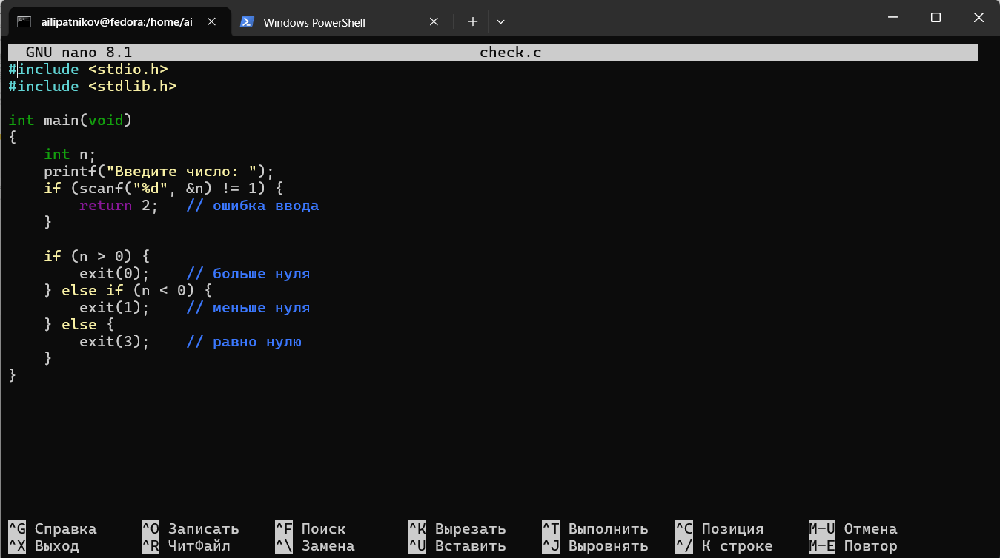
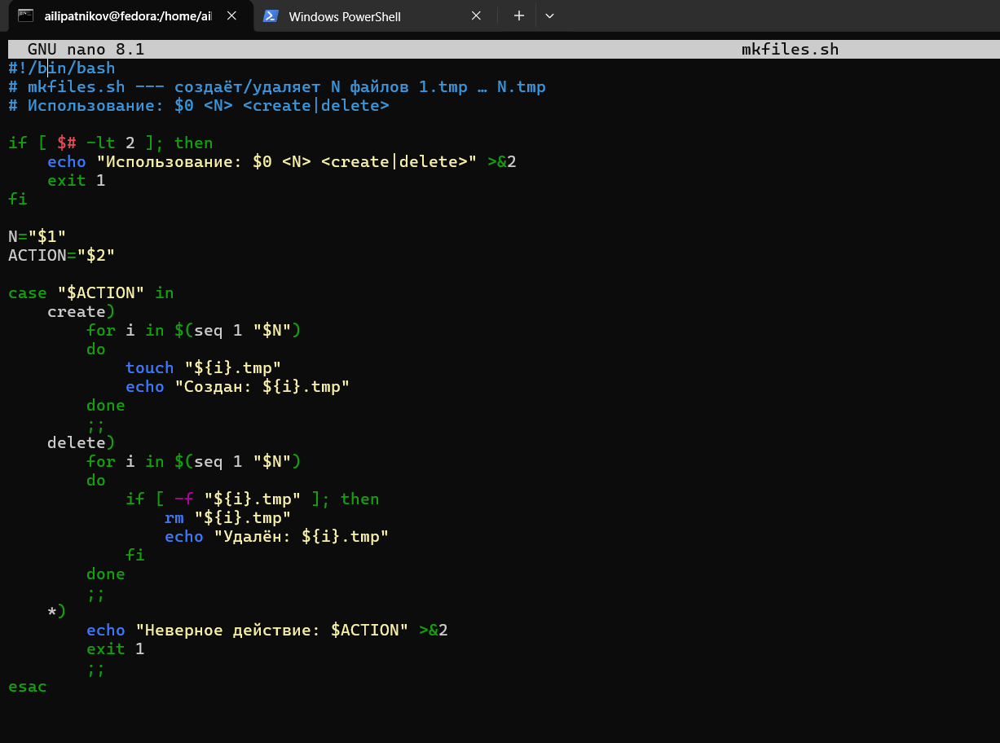
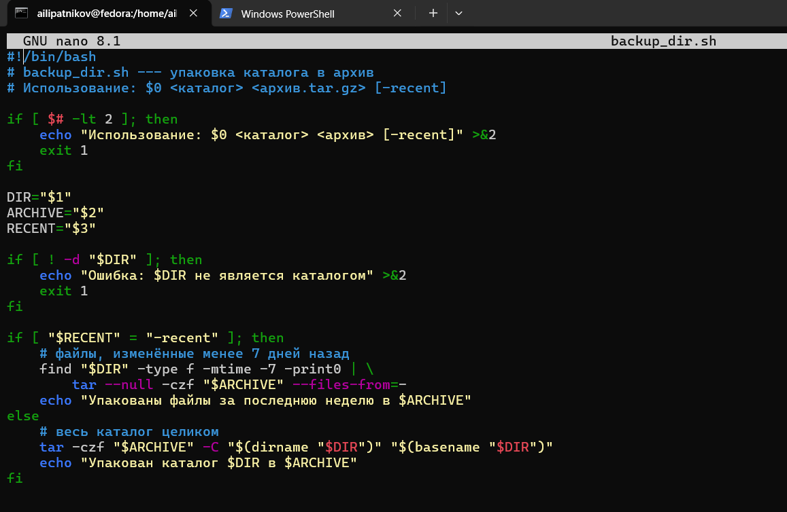
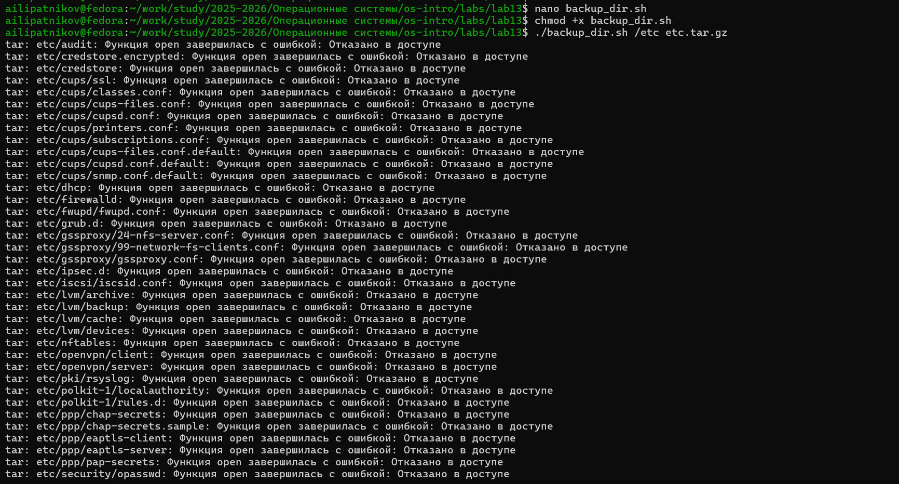
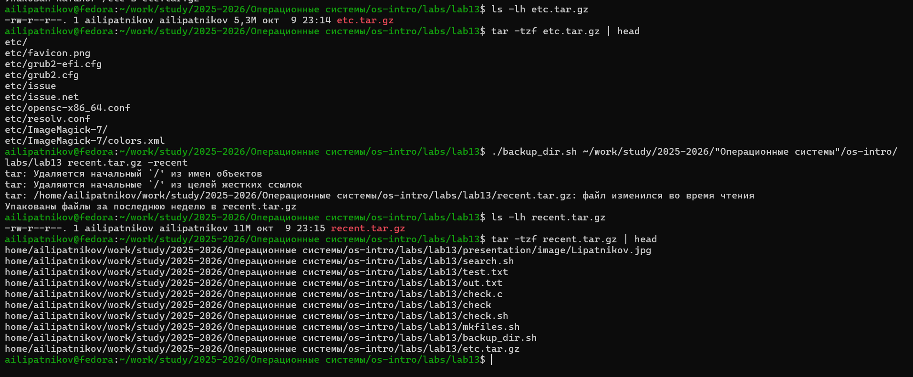

---
## Author
author:
  name: Липатников Андрей
  email: 1032253853@rudn.ru
  affiliation:
    - name: Российский университет дружбы народов
      country: Российская Федерация
      postal-code: 117198
      city: Москва
      address: ул. Миклухо-Маклая, д. 6
## Title
title: "Лабораторная работа №13"
subtitle: "Программирование в командном процессоре ОС UNIX. Ветвления и циклы"
license: "CC BY"
date: today
date-format: "2026-10-08"
---

# Информация

## Докладчик

:::::::::::::: {.columns align=center}
::: {.column width="70%"}

  * Липатников Андрей
  * Студент НКАбд-04-25
  * Российский университет дружбы народов
  * [1032253853@rudn.ru](mailto:1032253853@rudn.ru)

:::
::: {.column width="30%"}

:::
::::::::::::::

::: notes
- Поприветствовать аудиторию.
- Представиться кратко, даже если вас объявили.
- Доклад посвящён лабораторной работе по программированию в bash: ветвления и циклы.
:::

# Вводная часть

## Актуальность

::: {.incremental}
- bash --- основной инструмент автоматизации в UNIX/Linux
- ветвления и циклы --- основа сложных командных файлов
- getopts позволяет разбирать флаги командной строки
- навык необходим для администрирования и разработки
:::

::: notes
- Подчеркнуть универсальность bash.
- Время: не более 1 минуты.
:::

## Объект и предмет исследования

- **Объект**: командная оболочка ОС UNIX
- **Предмет**: логические управляющие конструкции и циклы в командных файлах

::: notes
- Объект --- широкая область (командные оболочки).
- Предмет --- конкретные конструкции: if, case, for, while, until.
:::

## Цели и задачи

- **Цель**: изучить основы программирования в оболочке ОС UNIX; научиться писать более сложные командные файлы с использованием логических управляющих конструкций и циклов.
- **Задачи**:

::: {.incremental}
- изучить getopts и разбор флагов командной строки
- написать поиск строк с ключами
- написать программу на C + скрипт анализа `$?`
- написать скрипт создания/удаления N файлов
- написать скрипт упаковки tar + find
:::

::: notes
- Цель дословно из методических указаний (п. 11.1).
- Задачи соответствуют пунктам 11.2.
:::

## Материалы и методы

- ОС: Fedora 41 (Sway), оболочка bash
- инструменты: bash, grep, getopts, gcc, tar, find
- рабочий каталог: `~/work/study/2025-2026/Операционные системы/os-intro/labs/lab13`
- 4 скрипта + 1 программа на C, 9 снимков

::: notes
- Кратко по окружению.
- Подробная методика --- в отчёте.
:::

# Содержание исследования

## Команда getopts

- Синтаксис: `getopts option-string variable [arg ...]`
- Флаги с аргументами обозначаются двоеточием: `i:o:p:Cn`
- `OPTARG` --- значение аргумента; `OPTIND` --- индекс
- Используется в цикле `while` + `case`

::: notes
- Ключевой инструмент для разбора командной строки.
- Без getopts пришлось бы парсить $1, $2 вручную.
:::

## Логические конструкции

| Конструкция | Назначение |
|-------------|-----------|
| `if … then … fi` | Условное выполнение |
| `case … esac` | Выбор из вариантов |
| `&&`, `\|\|`, `!` | Логические связки |
| `break` | Выход из цикла |
| `continue` | Пропуск итерации |

: Логические конструкции bash {#tbl-logic}

::: notes
- `if` и `case` --- основные ветвления.
- `&&` — И, `||` — ИЛИ, `!` — НЕ.
:::

## Циклы и true/false

| Цикл | Назначение |
|------|-----------|
| `for i in …` | Перебор списка |
| `while условие` | Пока **истинно** |
| `until условие` | Пока **ложно** |

- `true` — всегда возвращает 0 (истина).
- `false` — всегда возвращает ненулевой код (ложь).

: Циклы bash {#tbl-loops}

::: notes
- `while true; do … done` — бесконечный цикл.
- `until` — инвертированное условие.
:::

## Задание 1. search.sh — getopts + grep

- Ключи: `-i` (вход), `-o` (выход), `-p` (шаблон), `-C` (регистр), `-n` (номера строк)
- Поиск строк по шаблону в указанном файле

{width=70%}

::: notes
- `-C` в задании = «различать большие и малые буквы».
- Реализация: без -C — регистронезависимо; с -C — регистрозависимо.
:::

## Задание 1. Результат

{width=70%}

- Без `-C` → `Hello`, `HELLO`, `hello` (3 строки)
- С `-C` → `hello` (1 строка)
- С `-n` → добавлены номера строк
- С `-o` → вывод в файл

::: notes
- getopts корректно разбирает флаги с аргументами и без.
:::

## Задание 2. Программа на C

- `check.c` определяет, больше/меньше/равно нулю
- Возвращает код через `exit(n)`:
  - `0` — больше нуля
  - `1` — меньше нуля
  - `3` — равно нулю
  - `2` — ошибка ввода

{width=70%}

::: notes
- Программа на C возвращает код в оболочку.
- Оболочка получает его через `$?`.
:::

## Задание 2. Результат

{width=70%}

- `gcc -o check check.c` — компиляция
- `check.sh` вызывает программу и анализирует `$?`
- `case $rc in … esac` — вывод по коду

::: notes
- `$?` — код возврата последней команды.
- Многократный вызов `./check` показывает разные коды.
:::

## Задание 3. mkfiles.sh

- Создаёт/удаляет N файлов: `1.tmp`, `2.tmp`, …, `N.tmp`
- Аргументы: `<N>` и `<create|delete>`
- Цикл `for` + `seq`, проверка `-f`

{width=70%}

::: notes
- `case` выбирает действие create/delete.
- `for i in $(seq 1 "$N")` — перебор номеров.
:::

## Задание 3. Результат

{width=70%}

- `./mkfiles.sh 5 create` → 1.tmp … 5.tmp
- `./mkfiles.sh 5 delete` → все удалены

::: notes
- Проверка `[ -f "${i}.tmp" ]` перед удалением.
:::

## Задание 4. backup_dir.sh

- Упаковка каталога в архив `tar`
- Режим `-recent`: только файлы за последнюю неделю
- Связка `find -mtime -7` + `tar --files-from=-`

{width=70%}

::: notes
- `tar -czf archive.tar.gz -C parent dir` — упаковка всего каталога.
- `find -type f -mtime -7 -print0 | tar --null ... --files-from=-` — упаковка свежих файлов.
:::

## Задание 4. Первый запуск

{width=70%}

- `chmod +x backup_dir.sh` — сделать исполняемым
- `./backup_dir.sh /etc etc.tar.gz` — упаковка всего каталога

::: notes
- Без -recent: tar -czf etc.tar.gz -C / etc.
- Исходные файлы не изменяются.
:::

## Задание 4. Проверка и режим -recent

{width=70%}

- `ls -lh etc.tar.gz` — размер архива
- `tar -tzf etc.tar.gz | head` — содержимое
- `./backup_dir.sh ... recent.tar.gz -recent` — только свежие файлы
- `ls -lh recent.tar.gz` + `tar -tzf recent.tar.gz | head`

::: notes
- `find -mtime -7` — файлы, изменённые менее 7 дней назад.
- Архив recent меньше по размеру.
:::

# Результаты

## Полученные результаты

| Задание | Файл | Результат |
|---------|------|-----------|
| 1 | `search.sh` | Поиск строк с getopts + grep |
| 2 | `check.c` + `check.sh` | Программа на C + анализ `$?` |
| 3 | `mkfiles.sh` | Создание/удаление N файлов |
| 4 | `backup_dir.sh` | Упаковка tar + find -mtime |

: Сводка результатов {#tbl-results}

::: notes
- Все 4 задания методички выполнены.
- 9 снимков: по 2 на задания 1, 2, 4; по 1 на задание 3 и листинги.
:::

## Ключевые конструкции

| Элемент | Пример |
|---------|--------|
| getopts | `while getopts "i:o:p:Cn" opt` |
| if | `if [ -z "$VAR" ]; then …` |
| case | `case $rc in 0) … esac` |
| for | `for i in $(seq 1 "$N"); do … done` |
| while | `while [ $i -lt 5 ]; do … done` |
| until | `until [ $i -ge 5 ]; do … done` |

: Ключевые конструкции {#tbl-constructs}

::: notes
- При вопросах о синтаксисе --- таблица на экране.
- Полные ответы --- в отчёте (приложение А).
:::

# Заключение

## Главный вывод

bash предоставляет полный набор инструментов для написания сложных командных файлов: разбор флагов через `getopts`, ветвления (`if`, `case`), циклы (`for`, `while`, `until`). Разработанные скрипты (поиск строк, анализ `$?`, создание/удаление N файлов, упаковка tar + find) демонстрируют применимость этих конструкций для задач администрирования и автоматизации в UNIX/Linux.

::: notes
- Финальный аккорд: повторить главную мысль и перейти к вопросам.
- После паузы: «Я готов ответить на ваши вопросы».
- Финальный слайд «Спасибо за внимание» не используется.
:::
