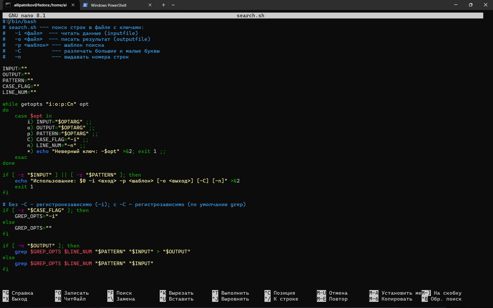
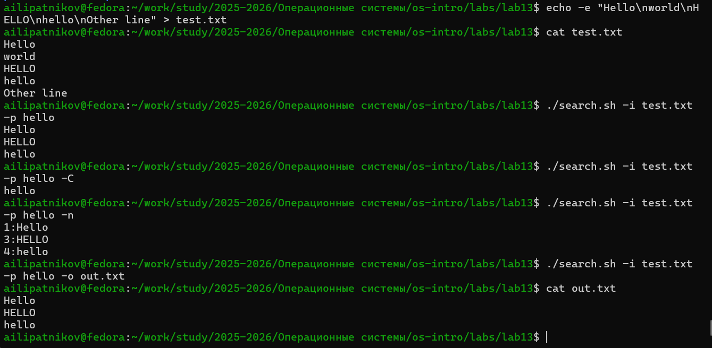
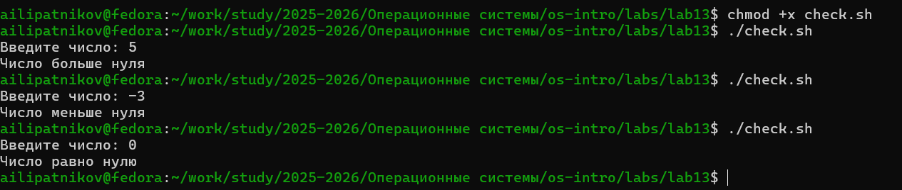
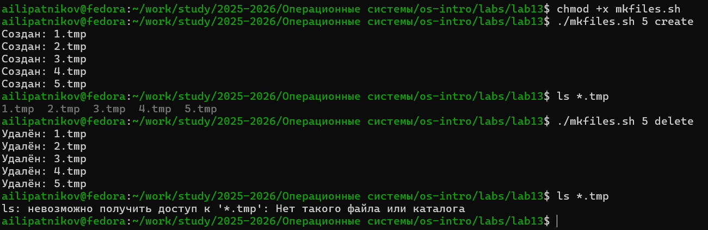

---
## Author
author:
  name: Липатников Андрей
  email: 1032253853@rudn.ru
  affiliation:
    - name: Российский университет дружбы народов
      country: Российская Федерация
      postal-code: 117198
      city: Москва
      address: ул. Миклухо-Маклая, д. 6

## Title
title: "Лабораторная работа №13"
subtitle: "Программирование в командном процессоре ОС UNIX. Ветвления и циклы"
license: "CC BY"
abstract: |
  В данном отчёте представлены результаты выполнения лабораторной работы по теме «Программирование в командном процессоре ОС UNIX. Ветвления и циклы».

  Описаны логические управляющие конструкции, циклы, команда getopts, а также разработаны четыре командных файла и программа на языке Си.

  Сделаны выводы о достижении поставленной цели.
keywords: [лабораторная работа, Linux, bash, getopts, циклы, ветвления]
date: today
date-format: "2026.10.08"
---

# Введение

## Актуальность

Логические управляющие конструкции и циклы — основа любых сложных командных файлов в ОС UNIX/Linux. Команда `getopts` позволяет разбирать флаги командной строки, а `while`, `until`, `for`, `case` дают возможность управлять последовательностью выполнения. Навык написания таких скриптов обязателен для системного администратора и разработчика.

## Цель работы

Изучить основы программирования в оболочке ОС UNIX. Научиться писать более сложные командные файлы с использованием логических управляющих конструкций и циклов.

## Задачи

1. Написать командный файл с `getopts` и `grep` для поиска строк в файле.
2. Написать программу на C, возвращающую код в зависимости от числа, и скрипт, анализирующий `$?`.
3. Написать командный файл для создания/удаления N файлов.
4. Написать командный файл для упаковки `tar` с фильтром по времени (`find -mtime`).
5. Ответить на контрольные вопросы.

## Объект и предмет исследования

Объект --- командная оболочка ОС UNIX.

Предмет --- логические управляющие конструкции и циклы в командных файлах.

## Методы исследования

Практическая работа в терминале, изучение `man`-справок, написание скриптов и программы на C, проверка результатов, фиксация скриншотами.

## Схема выполнения работы

На рис. -@fig-flowchart представлена общая последовательность действий при выполнении работы.

::: {#fig-flowchart}

```{mermaid}
%%| fig-width: 100%
graph TD
    A@{ shape: circle, label: "Начало" } --> B[Задание 1: search.sh]
    B --> C[Задание 2: check.c + check.sh]
    C --> D[Задание 3: mkfiles.sh]
    D --> E[Задание 4: backup_dir.sh]
    E --> F[Зафиксировать скриншотами]
    F --> G[Занести в отчёт]
    G --> H[Поместить в git-репозиторий]
    H --> I@{ shape: dbl-circ, label: "Конец" }
```

Блок-схема выполнения лабораторной работы

:::

# Теоретическая часть

## Команда getopts

Синтаксис: `getopts option-string variable [arg ...]`.  
Флаги с аргументами обозначаются двоеточием (`i:o:p:Cn`).  
Специальные переменные: `OPTARG` (значение аргумента), `OPTIND` (индекс).  
Принято включать `getopts` в цикл `while` и разбирать результаты через `case`.

## Логические управляющие конструкции

- `if условие; then … [elif … then …] [else …] fi`
- `case имя in шаблон) команды;; … esac`
- Логические связки `&&`, `||`
- `break`, `continue` — управление циклами

## Циклы

- `for i in …; do … done`
- `while условие; do … done`
- `until условие; do … done`

## Команды `true` и `false`

- `true` — всегда возвращает код 0 (истина).
- `false` — всегда возвращает ненулевой код (ложь).
Используются для организации бесконечных циклов: `while true; do … done`.

## `while` vs `until`

- `while` выполняет тело, **пока** условие истинно.
- `until` выполняет тело, **пока** условие **ложно** (проверка инвертируется).

Более подробно про Unix см. в [@tanenbaum_book_modern-os_ru; @robbins_book_bash_en; @zarrelli_book_mastering-bash_en; @newham_book_learning-bash_en].

# Материалы и методы

- **ОС:** Fedora 41 (Sway)
- **Терминал:** bash
- **Инструменты:** `bash`, `grep`, `getopts`, `gcc`, `tar`, `find`

Рабочий каталог: `~/work/study/2025-2026/Операционные системы/os-intro/labs/lab13`.

Последовательность: написание четырёх скриптов и программы на C, проверка работы, фиксация **9 скриншотами**.

# Выполнение лабораторной работы

## Задание 1. search.sh — getopts + grep

Создан скрипт `search.sh` (рис. -@fig-001).

{#fig-001 width=70%}

```bash
#!/bin/bash
INPUT=""; OUTPUT=""; PATTERN=""; CASE_FLAG=""; LINE_NUM=""
while getopts "i:o:p:Cn" opt
do
    case $opt in
        i) INPUT="$OPTARG" ;;
        o) OUTPUT="$OPTARG" ;;
        p) PATTERN="$OPTARG" ;;
        C) CASE_FLAG="-i" ;;
        n) LINE_NUM="-n" ;;
        *) echo "Неверный ключ: -$opt" >&2; exit 1 ;;
    esac
done
if [ -z "$INPUT" ] || [ -z "$PATTERN" ]; then
    echo "Использование: $0 -i <вход> -p <шаблон> [-o <выход>] [-C] [-n]" >&2
    exit 1
fi
if [ -z "$CASE_FLAG" ]; then GREP_OPTS="-i"; else GREP_OPTS=""; fi
if [ -n "$OUTPUT" ]; then
    grep $GREP_OPTS $LINE_NUM "$PATTERN" "$INPUT" > "$OUTPUT"
else
    grep $GREP_OPTS $LINE_NUM "$PATTERN" "$INPUT"
fi
```

Запуск и проверка (рис. -@fig-002).

{#fig-002 width=70%}

::: {.notes}
- Ключи: -i (вход), -o (выход), -p (шаблон), -C (регистр), -n (номера строк).
- Без -C — регистронезависимо; с -C — регистрозависимо.
:::

## Задание 2. Программа на C + $?

Создана программа `check.c` (рис. -@fig-003).

{#fig-003 width=70%}

```c
#include <stdio.h>
#include <stdlib.h>
int main(void) {
    int n;
    printf("Введите число: ");
    if (scanf("%d", &n) != 1) return 2;
    if (n > 0) exit(0);
    else if (n < 0) exit(1);
    else exit(3);
}
```

Компиляция и запуск (рис. -@fig-004).

{#fig-004 width=70%}

::: {.notes}
- Коды возврата: 0 = > 0, 1 = < 0, 3 = == 0, 2 = ошибка ввода.
- Скрипт check.sh анализирует $? через case.
:::

## Задание 3. mkfiles.sh — создание/удаление N файлов

Создан скрипт `mkfiles.sh` (рис. -@fig-005).

{#fig-005 width=70%}

```bash
#!/bin/bash
if [ $# -lt 2 ]; then
    echo "Использование: $0 <N> <create|delete>" >&2
    exit 1
fi
N="$1"; ACTION="$2"
case "$ACTION" in
    create)
        for i in $(seq 1 "$N"); do touch "${i}.tmp"; done ;;
    delete)
        for i in $(seq 1 "$N"); do
            [ -f "${i}.tmp" ] && rm "${i}.tmp"
        done ;;
    *) echo "Неверное действие: $ACTION" >&2; exit 1 ;;
esac
```

Запуск и проверка (рис. -@fig-006).

{#fig-006 width=70%}

::: {.notes}
- Создание: ./mkfiles.sh 5 create → 1.tmp … 5.tmp.
- Удаление: ./mkfiles.sh 5 delete.
:::

## Задание 4. backup_dir.sh — листинг и первый запуск

Создан скрипт `backup_dir.sh` (рис. -@fig-007).

{#fig-007 width=70%}

```bash
#!/bin/bash
if [ $# -lt 2 ]; then
    echo "Использование: $0 <каталог> <архив> [-recent]" >&2
    exit 1
fi
DIR="$1"; ARCHIVE="$2"; RECENT="$3"
if [ ! -d "$DIR" ]; then
    echo "Ошибка: $DIR не является каталогом" >&2
    exit 1
fi
if [ "$RECENT" = "-recent" ]; then
    find "$DIR" -type f -mtime -7 -print0 | \
        tar --null -czf "$ARCHIVE" --files-from=-
else
    tar -czf "$ARCHIVE" -C "$(dirname "$DIR")" "$(basename "$DIR")"
fi
```

Скрипт сделан исполняемым и запущен в режиме полной упаковки каталога `/etc` (рис. -@fig-008).

{#fig-008 width=70%}

::: {.notes}
- chmod +x backup_dir.sh — сделать исполняемым.
- ./backup_dir.sh /etc etc.tar.gz — упаковка всего каталога /etc.
- Без -recent: tar -czf etc.tar.gz -C / etc.
:::

## Задание 4. backup_dir.sh — проверка и режим -recent

Проверен первый архив и выполнен второй запуск — только файлы, изменённые менее 7 дней назад (рис. -@fig-009).

{#fig-009 width=70%}

::: {.notes}
- ls -lh etc.tar.gz — размер архива.
- tar -tzf etc.tar.gz | head — содержимое архива.
- ./backup_dir.sh ... recent.tar.gz -recent — только файлы за неделю (find -mtime -7).
- ls -lh recent.tar.gz — размер второго архива.
- tar -tzf recent.tar.gz | head — содержимое второго архива.
:::

# Результаты

| Задание | Файл | Результат |
|---------|------|-----------|
| 1 | `search.sh` | Поиск строк с ключами getopts + grep |
| 2 | `check.c` + `check.sh` | Программа на C + анализ `$?` |
| 3 | `mkfiles.sh` | Создание/удаление N файлов |
| 4 | `backup_dir.sh` | Упаковка tar + фильтр по времени |

: Сводка результатов {#tbl-results}

::: {.notes}
- Все четыре задания методички выполнены.
- 9 снимков: по 2 на задания 1, 2 и 4, по 1 на задание 3 и листинги.
:::

# Обсуждение результатов

Все четыре задания выполнены. `getopts` корректно разбирает флаги с аргументами и без, `case` выбирает нужное действие. Программа на C возвращает разные коды завершения, скрипт анализирует их через `$?` и `case`. `mkfiles.sh` демонстрирует цикл `for` с `seq` и проверку `-f`. `backup_dir.sh` показывает связку `find` + `tar` через `--files-from=-`, что позволяет упаковать произвольный список файлов, найденных по критерию.

# Заключение

- Цель работы достигнута: изучены основы программирования в оболочке UNIX.
- Освоена команда `getopts` и разбор флагов.
- Освоены логические конструкции (`if`, `case`) и циклы (`for`, `while`, `until`).
- Написаны и проверены четыре командных файла и программа на C.
- Освоена связка `find -mtime` + `tar`.

# Список литературы {.unnumbered}

::: {#refs}
:::

\appendix

# Приложение А. Ответы на контрольные вопросы {.appendix}

## 1. Предназначение команды getopts

`getopts` — встроенная команда bash для разбора флагов командной строки. Она распознаёт опции, указанные в строке `option-string`, присваивает переменной букву опции, а `OPTARG` — её аргумент. Используется в цикле `while` с `case`.

## 2. Отношение метасимволов к генерации имён файлов

Метасимволы `*`, `?`, `[c1-c2]` используются оболочкой для globbing — подстановки имён файлов. Оболочка до запуска команды заменяет шаблон на список подходящих имён из текущего каталога. Это и есть генерация имён файлов.

## 3. Операторы управления действиями

- `if … then … [elif … then …] [else …] fi` — условное выполнение.
- `case … in … esac` — выбор из нескольких вариантов.
- Логические связки `&&` (И), `||` (ИЛИ), `!` (НЕ).
- `break` — выход из цикла; `continue` — пропуск итерации.

## 4. Операторы для прерывания цикла

- `break` — завершает цикл полностью.
- `continue` — завершает текущую итерацию и переходит к следующей.

## 5. Назначение `true` и `false`

- `true` — всегда возвращает код 0 (истина).
- `false` — всегда возвращает ненулевой код (ложь).
Используются для организации бесконечных циклов (`while true; do … done`) и логических проверок.

## 6. Что означает строка `if test -f man$s/$i.$s`?

- `test -f` — проверка, что путь `man$s/$i.$s` — обычный файл.
- `$s` и `$i` — переменные оболочки, подставляются до выполнения.
- Если файл существует и является обычным — условие истинно, выполняется тело `if`.
- Иначе — переход к `else` (если есть) или к `fi`.

## 7. Различия между `while` и `until`

- `while условие; do … done` — тело выполняется, **пока условие истинно**.
- `until условие; do … done` — тело выполняется, **пока условие ложно** (проверка инвертируется).
В остальном конструкции идентичны.

# Приложение Б. Листинги {.appendix}

## Б.1. search.sh

```bash
#!/bin/bash
INPUT=""; OUTPUT=""; PATTERN=""; CASE_FLAG=""; LINE_NUM=""
while getopts "i:o:p:Cn" opt
do
    case $opt in
        i) INPUT="$OPTARG" ;;
        o) OUTPUT="$OPTARG" ;;
        p) PATTERN="$OPTARG" ;;
        C) CASE_FLAG="-i" ;;
        n) LINE_NUM="-n" ;;
        *) echo "Неверный ключ: -$opt" >&2; exit 1 ;;
    esac
done
if [ -z "$INPUT" ] || [ -z "$PATTERN" ]; then
    echo "Использование: $0 -i <вход> -p <шаблон> [-o <выход>] [-C] [-n]" >&2
    exit 1
fi
if [ -z "$CASE_FLAG" ]; then GREP_OPTS="-i"; else GREP_OPTS=""; fi
if [ -n "$OUTPUT" ]; then
    grep $GREP_OPTS $LINE_NUM "$PATTERN" "$INPUT" > "$OUTPUT"
else
    grep $GREP_OPTS $LINE_NUM "$PATTERN" "$INPUT"
fi
```

## Б.2. check.c

```c
#include <stdio.h>
#include <stdlib.h>
int main(void) {
    int n;
    printf("Введите число: ");
    if (scanf("%d", &n) != 1) return 2;
    if (n > 0) exit(0);
    else if (n < 0) exit(1);
    else exit(3);
}
```

## Б.3. check.sh

```bash
#!/bin/bash
./check
rc=$?
case $rc in
    0) echo "Число больше нуля" ;;
    1) echo "Число меньше нуля" ;;
    3) echo "Число равно нулю" ;;
    2) echo "Ошибка ввода" ;;
    *) echo "Неизвестный код возврата: $rc" ;;
esac
```

## Б.4. mkfiles.sh

```bash
#!/bin/bash
if [ $# -lt 2 ]; then
    echo "Использование: $0 <N> <create|delete>" >&2
    exit 1
fi
N="$1"; ACTION="$2"
case "$ACTION" in
    create)
        for i in $(seq 1 "$N"); do touch "${i}.tmp"; done ;;
    delete)
        for i in $(seq 1 "$N"); do
            [ -f "${i}.tmp" ] && rm "${i}.tmp"
        done ;;
    *) echo "Неверное действие: $ACTION" >&2; exit 1 ;;
esac
```

## Б.5. backup_dir.sh

```bash
#!/bin/bash
if [ $# -lt 2 ]; then
    echo "Использование: $0 <каталог> <архив> [-recent]" >&2
    exit 1
fi
DIR="$1"; ARCHIVE="$2"; RECENT="$3"
if [ ! -d "$DIR" ]; then
    echo "Ошибка: $DIR не является каталогом" >&2
    exit 1
fi
if [ "$RECENT" = "-recent" ]; then
    find "$DIR" -type f -mtime -7 -print0 | \
        tar --null -czf "$ARCHIVE" --files-from=-
else
    tar -czf "$ARCHIVE" -C "$(dirname "$DIR")" "$(basename "$DIR")"
fi
```

# Приложение В. Листинг команд {.appendix}

```bash
cd ~/work/study/2025-2026/"Операционные системы"/os-intro/labs/lab13

# Задание 1
nano search.sh
chmod +x search.sh
./search.sh -i test.txt -p hello
./search.sh -i test.txt -p hello -C
./search.sh -i test.txt -p hello -n
./search.sh -i test.txt -p hello -o out.txt

# Задание 2
nano check.c
gcc -o check check.c
nano check.sh
chmod +x check.sh
./check.sh

# Задание 3
nano mkfiles.sh
chmod +x mkfiles.sh
./mkfiles.sh 5 create
./mkfiles.sh 5 delete

# Задание 4
nano backup_dir.sh
chmod +x backup_dir.sh
./backup_dir.sh /etc etc.tar.gz
ls -lh etc.tar.gz
tar -tzf etc.tar.gz | head
./backup_dir.sh ~/work/study/2025-2026/"Операционные системы"/os-intro/labs/lab13 recent.tar.gz -recent
ls -lh recent.tar.gz
tar -tzf recent.tar.gz | head
```
