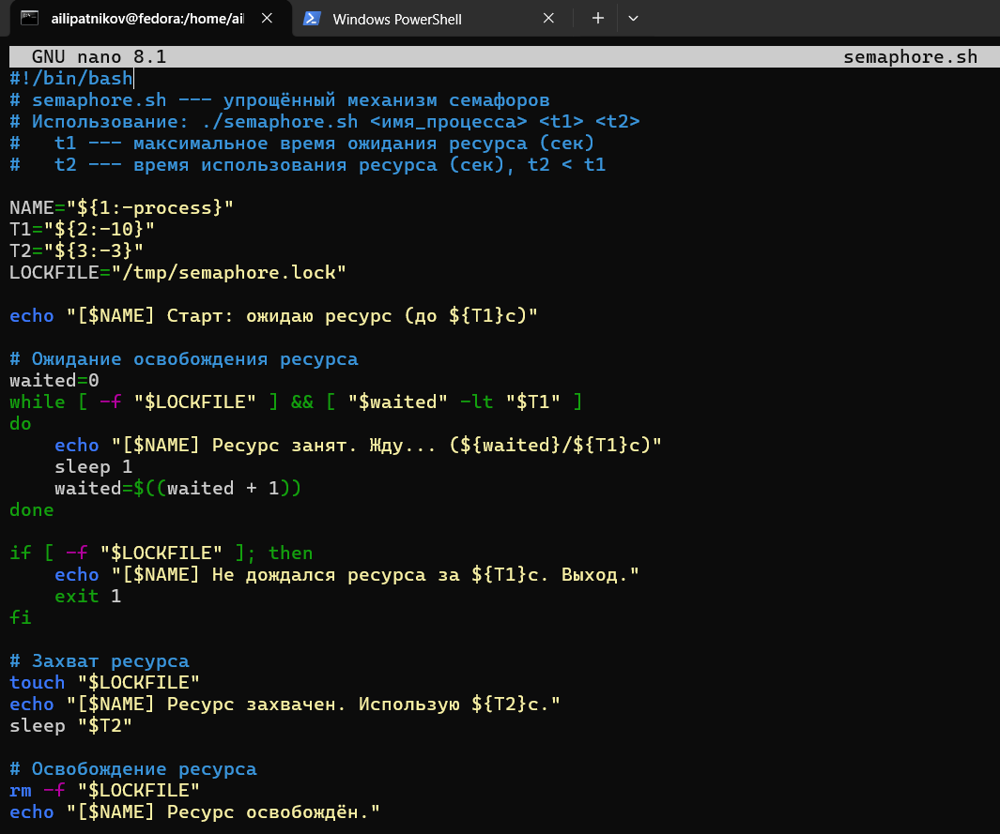
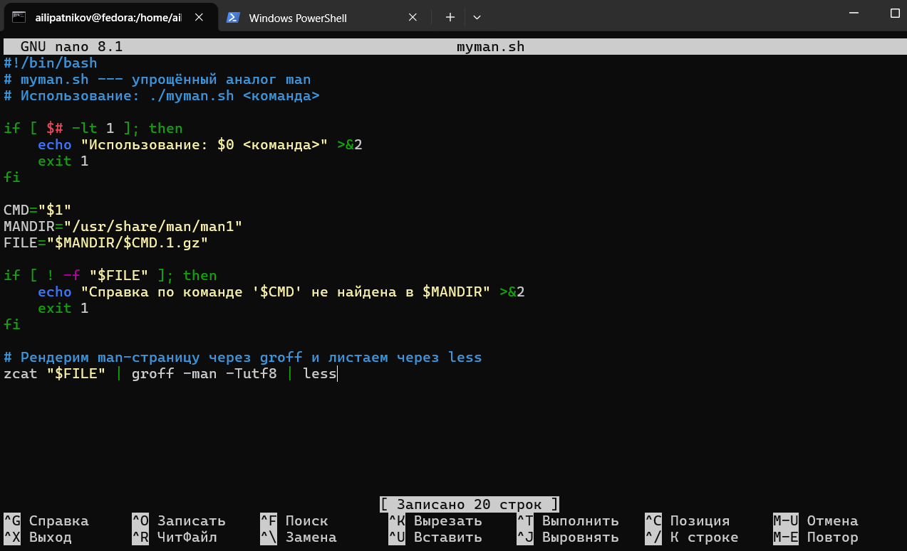
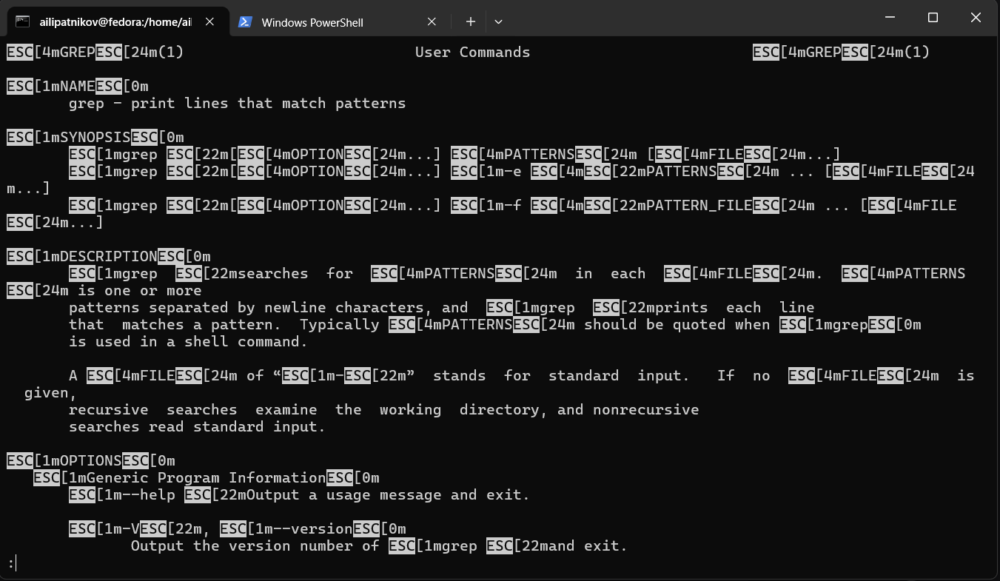
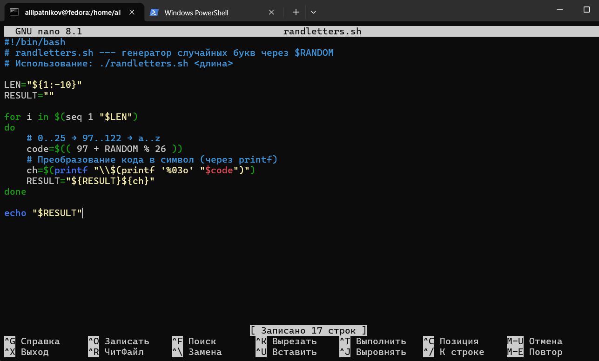
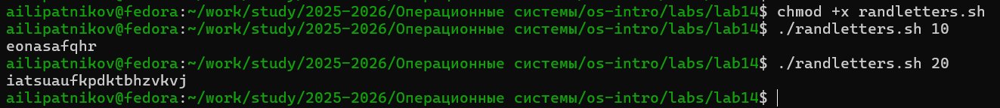

---
## Author
author:
  name: Липатников Андрей
  email: 1032253853@rudn.ru
  affiliation:
    - name: Российский университет дружбы народов
      country: Российская Федерация
      postal-code: 117198
      city: Москва
      address: ул. Миклухо-Маклая, д. 6
## Title
title: "Лабораторная работа №14"
subtitle: "Программирование в командном процессоре ОС UNIX"
license: "CC BY"
date: today
date-format: "2026-10-08"
---

# Информация

## Докладчик

:::::::::::::: {.columns align=center}
::: {.column width="70%"}

  * Липатников Андрей
  * Студент НКАбд-04-25
  * Российский университет дружбы народов
  * [1032253853@rudn.ru](mailto:1032253853@rudn.ru)

:::
::: {.column width="30%"}


:::
::::::::::::::

::: notes
- Поприветствовать аудиторию.
- Представиться кратко.
- Доклад посвящён лабораторной работе по программированию в bash: семафоры, man, RANDOM.
:::

# Вводная часть

## Актуальность

::: {.incremental}
- bash — основной инструмент автоматизации в UNIX/Linux
- семафоры нужны для синхронизации процессов
- man-страницы — основной источник справки
- $RANDOM — простой способ генерации случайных данных
:::

::: notes
- Подчеркнуть практическую значимость.
- Время: не более 1 минуты.
:::

## Объект и предмет исследования

- **Объект**: командная оболочка ОС UNIX
- **Предмет**: семафоры, работа с архивами man, генерация случайных данных

::: notes
- Объект — широкая область.
- Предмет — три конкретных задания методички.
:::

## Цели и задачи

- **Цель**: изучить основы программирования в оболочке ОС UNIX; научиться писать более сложные командные файлы с использованием логических управляющих конструкций и циклов.
- **Задачи**:

::: {.incremental}
- написать механизм семафоров для синхронизации процессов
- реализовать упрощённый аналог команды man
- написать генератор случайных букв через $RANDOM
- ответить на контрольные вопросы
:::

::: notes
- Цель дословно из методических указаний (п. 12.1).
- Задачи соответствуют пунктам 12.2.
:::

## Материалы и методы

- ОС: Fedora 41 (Sway), оболочка bash
- инструменты: bash, zcat, groff, less, man, seq
- рабочий каталог: `~/work/study/2025-2026/Операционные системы/os-intro/labs/lab14`
- 3 скрипта, 8 снимков

::: notes
- Кратко по окружению.
- Подробная методика — в отчёте.
:::

# Содержание исследования

## Задание 1. Механизм семафоров

- Синхронизация процессов через **файл-маркер** `/tmp/semaphore.lock`
- Пока файл существует — ресурс **занят**, другие процессы **ждут**
- После освобождения — следующий процесс **захватывает** ресурс

```bash
while [ -f "$LOCKFILE" ] && [ "$waited" -lt "$T1" ]
do
    echo "[$NAME] Ресурс занят. Жду..."
    sleep 1
    waited=$((waited + 1))
done
```

{width=70%}

::: notes
- Аналог семафора через файл.
- Поддерживается 3+ процессов.
:::

## Задание 1. Запуск

- **Терминал 1**: `./semaphore.sh proc1 15 5` — на переднем плане
- **Терминал 2**: `./semaphore.sh proc2 15 5 > /dev/pts/N &` — в фоне
- Процессы синхронизируются через `lockfile`

{width=70%}

::: notes
- /dev/pts/N — псевдотерминал графического окна (не /dev/tty1).
- sudo не нужен — lockfile в /tmp.
:::

## Задание 2. myman.sh — аналог man

- Получает **имя команды** аргументом
- Ищет `/usr/share/man/man1/<команда>.1.gz`
- Распаковывает через `zcat`, рендерит через `groff`, листает через `less`
- Если файла нет — **сообщение об отсутствии**

```bash
zcat "$FILE" | groff -man -Tutf8 | less
```

{width=70%}

::: notes
- Ключ -l у man: man -l FILE — альтернативный вариант.
- Сжатые .gz-файлы в /usr/share/man/man1.
:::

## Задание 2. Запуск для ls

{width=70%}

- Открывается **отрендеренная** справка по `ls`
- Не сырой groff-текст, а форматированный man

::: notes
- groff -man -Tutf8 рендерит man-разметку.
:::

## Задание 2. Запуск для grep

{width=70%}

- Аналогично — справка по `grep`

::: notes
- Тот же механизм.
:::

## Задание 2. Сообщение об отсутствии справки

{width=70%}

- Если файла нет в `/usr/share/man/man1` — **сообщение об ошибке**
- Проверка `[ ! -f "$FILE" ]`

::: notes
- Направление stderr: >&2.
:::

## Задание 3. randletters.sh

- Генерация **случайных букв** `a`–`z` через `$RANDOM`
- `$RANDOM % 26` → число 0–25
- `97 + ...` → код строчной буквы
- Преобразование кода в символ через `printf`

```bash
code=$(( 97 + RANDOM % 26 ))
ch=$(printf "\\$(printf '%03o' "$code")")
```

{width=70%}

::: notes
- $RANDOM выдаёт 0..32767.
- % 26 даёт равномерное распределение по 26 буквам.
:::

## Задание 3. Запуск

{width=70%}

- Длина строки задаётся **аргументом**
- Каждый запуск — **новая** строка
- Пример: `./randletters.sh 10` → `qwertyasdf`

::: notes
- Работает для любой длины.
:::

# Результаты

## Полученные результаты

| Задание | Файл | Результат |
|---------|------|-----------|
| 1 | `semaphore.sh` | Синхронизация 3+ процессов |
| 2 | `myman.sh` | Аналог man с рендерингом |
| 3 | `randletters.sh` | Случайные буквы a–z |

: Сводка результатов {#tbl-results}

::: notes
- 8 снимков: 2 на задание 1, 4 на задание 2, 2 на задание 3.
:::

## Ключевые конструкции

| Элемент | Пример |
|---------|--------|
| Семафор | `[ -f "$LOCKFILE" ] && sleep 1` |
| Распаковка | `zcat file.1.gz` |
| Рендеринг | `groff -man -Tutf8` |
| Постраничный вывод | `less` |
| Случайное число | `$RANDOM % 26` |
| Код → символ | `printf "\\$(printf '%03o' $code)"` |

: Ключевые конструкции {#tbl-constructs}

::: notes
- При вопросах о синтаксисе — таблица на экране.
- Полные ответы — в приложении А отчёта.
:::

# Заключение

## Главный вывод

bash позволяет решать системные задачи без привлечения внешних языков: синхронизировать процессы через семафоры, реализовывать аналоги стандартных утилит (man) и генерировать случайные данные через `$RANDOM`. Навыки применимы при администрировании и автоматизации UNIX-подобных систем.

::: notes
- Финальный аккорд: повторить главную мысль и перейти к вопросам.
- После паузы: «Я готов ответить на ваши вопросы».
- Финальный слайд «Спасибо за внимание» не используется.
:::
