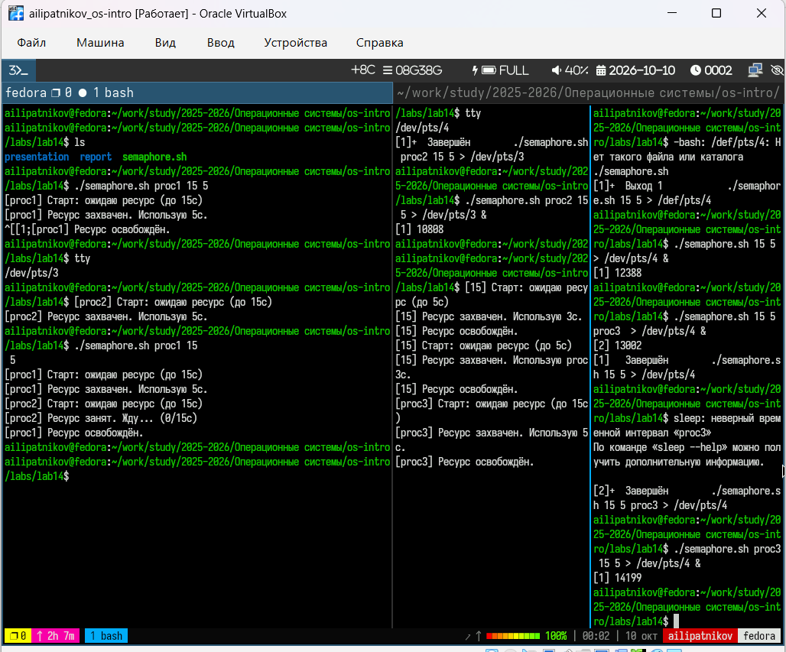
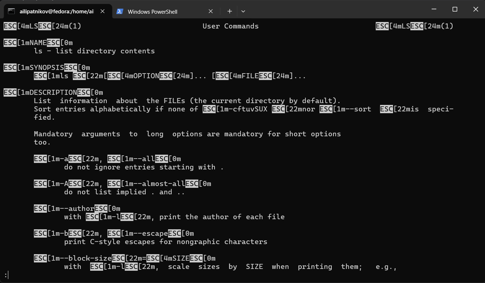
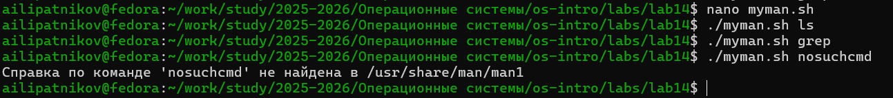

---
## Author
author:
  name: Липатников Андрей
  email: 1032253853@rudn.ru
  affiliation:
    - name: Российский университет дружбы народов
      country: Российская Федерация
      postal-code: 117198
      city: Москва
      address: ул. Миклухо-Маклая, д. 6

## Title
title: "Лабораторная работа №14"
subtitle: "Программирование в командном процессоре ОС UNIX"
license: "CC BY"
abstract: |
  В данном отчёте представлены результаты выполнения лабораторной работы по теме «Программирование в командном процессоре ОС UNIX».

  Описаны упрощённый механизм семафоров, аналог команды man и генератор случайных букв через $RANDOM.

  Сделаны выводы о достижении поставленной цели.
keywords: [лабораторная работа, Linux, bash, семафоры, man, RANDOM]
date: today
date-format: "2026.10.08"
---

# Введение

## Актуальность

Командный процессор bash позволяет решать задачи синхронизации процессов, работы с архивами справок и генерации случайных данных. Эти навыки востребованы при администрировании UNIX-подобных систем и автоматизации рутинных операций.

## Цель работы

Изучить основы программирования в оболочке ОС UNIX. Научиться писать более сложные командные файлы с использованием логических управляющих конструкций и циклов.

## Задачи

1. Написать командный файл, реализующий упрощённый механизм семафоров.
2. Реализовать команду man с помощью командного файла.
3. Написать командный файл, генерирующий случайную последовательность букв через `$RANDOM`.
4. Ответить на контрольные вопросы.

## Объект и предмет исследования

Объект --- командная оболочка ОС UNIX.

Предмет --- семафоры, работа с архивами man, генерация случайных данных.

## Методы исследования

Практическая работа в терминале, изучение `man`-справок, написание скриптов, проверка результатов, фиксация скриншотами.

## Схема выполнения работы

На рис. -@fig-flowchart представлена общая последовательность действий при выполнении работы.

::: {#fig-flowchart}

```{mermaid}
%%| fig-width: 100%
graph TD
    A@{ shape: circle, label: "Начало" } --> B[Задание 1: semaphore.sh]
    B --> C[Задание 2: myman.sh]
    C --> D[Задание 3: randletters.sh]
    D --> E[Зафиксировать скриншотами]
    E --> F[Занести в отчёт]
    F --> G[Поместить в git-репозиторий]
    G --> H@{ shape: dbl-circ, label: "Конец" }
```

Блок-схема выполнения лабораторной работы

:::

# Теоретическая часть

## Семафоры в UNIX

Семафор — механизм синхронизации процессов. В упрощённом виде реализуется через файл-маркер: если файл существует — ресурс занят, если нет — свободен.

## Сжатые man-страницы

Man-страницы хранятся в `/usr/share/man/man1` как сжатые файлы `.1.gz`. Для просмотра: `zcat файл.1.gz | less` или `man -l файл.1.gz`.

## Переменная $RANDOM

`$RANDOM` возвращает псевдослучайное число в диапазоне **0–32767**. Для получения буквы `a`–`z` используется остаток от деления на 26 и прибавление кода `97`.

Более подробно про Unix см. в [@tanenbaum_book_modern-os_ru; @robbins_book_bash_en; @zarrelli_book_mastering-bash_en; @newham_book_learning-bash_en].

# Материалы и методы

- **ОС:** Fedora 41 (Sway)
- **Терминал:** bash
- **Инструменты:** `bash`, `zcat`, `less`, `groff`, `man`, `seq`

Рабочий каталог: `~/work/study/2025-2026/Операционные системы/os-intro/labs/lab14`.

Последовательность: написание трёх скриптов, проверка работы, фиксация **8 скриншотами**.

# Выполнение лабораторной работы

## Задание 1. semaphore.sh

Создан скрипт `semaphore.sh` (рис. -@fig-001).

{#fig-001 width=70%}

```bash
#!/bin/bash
NAME="${1:-process}"
T1="${2:-10}"
T2="${3:-3}"
LOCKFILE="/tmp/semaphore.lock"

echo "[$NAME] Старт: ожидаю ресурс (до ${T1}с)"

waited=0
while [ -f "$LOCKFILE" ] && [ "$waited" -lt "$T1" ]
do
    echo "[$NAME] Ресурс занят. Жду... (${waited}/${T1}с)"
    sleep 1
    waited=$((waited + 1))
done

if [ -f "$LOCKFILE" ]; then
    echo "[$NAME] Не дождался ресурса за ${T1}с. Выход."
    exit 1
fi

touch "$LOCKFILE"
echo "[$NAME] Ресурс захвачен. Использую ${T2}с."
sleep "$T2"

rm -f "$LOCKFILE"
echo "[$NAME] Освободил ресурс."
```

Запуск в двух терминалах (рис. -@fig-002).

{#fig-002 width=70%}

::: {.notes}
- Синхронизация через /tmp/semaphore.lock.
- Фоновый процесс пишет в /dev/pts/N.
- Поддерживается 3+ процессов.
:::

## Задание 2. myman.sh — листинг

Создан скрипт `myman.sh` (рис. -@fig-003).

{#fig-003 width=70%}

```bash
#!/bin/bash
if [ $# -lt 1 ]; then
    echo "Использование: $0 <команда>" >&2
    exit 1
fi

CMD="$1"
MANDIR="/usr/share/man/man1"
FILE="$MANDIR/$CMD.1.gz"

if [ ! -f "$FILE" ]; then
    echo "Справка по команде '$CMD' не найдена в $MANDIR" >&2
    exit 1
fi

zcat "$FILE" | groff -man -Tutf8 | less
```

## Задание 2. Запуск для ls

{#fig-004 width=70%}

::: {.notes}
- Открывается справка по ls, отрендеренная через groff.
- Архив распаковывается через zcat.
:::

## Задание 2. Запуск для grep

{#fig-005 width=70%}

::: {.notes}
- Аналогично — справка по grep.
:::

## Задание 2. Сообщение об отсутствии справки

{#fig-006 width=70%}

::: {.notes}
- Если файла нет в /usr/share/man/man1 → сообщение об ошибке.
- Проверка [ ! -f "$FILE" ].
:::

## Задание 3. randletters.sh

Создан скрипт `randletters.sh` (рис. -@fig-007).

{#fig-007 width=70%}

```bash
#!/bin/bash
LEN="${1:-10}"
RESULT=""

for i in $(seq 1 "$LEN")
do
    code=$(( 97 + RANDOM % 26 ))
    ch=$(printf "\\$(printf '%03o' "$code")")
    RESULT="${RESULT}${ch}"
done

echo "$RESULT"
```

Запуск (рис. -@fig-008).

{#fig-008 width=70%}

::: {.notes}
- $RANDOM % 26 → буква a–z.
- Каждый запуск даёт новую строку.
- Длина задаётся аргументом.
:::

# Результаты

| Задание | Файл | Рисунки | Результат |
|---------|------|---------|-----------|
| 1 | `semaphore.sh` | fig-001, fig-002 | Синхронизация процессов |
| 2 | `myman.sh` | fig-003 — fig-006 | Аналог man |
| 3 | `randletters.sh` | fig-007, fig-008 | Случайные буквы |

: Сводка результатов {#tbl-results}

::: {.notes}
- 8 снимков: 2 на задание 1, 4 на задание 2, 2 на задание 3.
- Нумерация имён отражает содержимое.
:::

# Обсуждение результатов

Все три задания выполнены. Механизм семафоров через файл-маркер обеспечивает синхронизацию нескольких процессов: пока `/tmp/semaphore.lock` существует, другие процессы ждут. Скрипт `myman.sh` реализует упрощённый аналог `man`: ищет `.1.gz` в `/usr/share/man/man1`, распаковывает через `zcat`, рендерит через `groff` и листает через `less`; при отсутствии файла выдаёт сообщение. Генератор `randletters.sh` использует `$RANDOM` для получения букв `a`–`z`.

# Заключение

- Цель работы достигнута: изучены основы программирования в оболочке UNIX.
- Освоен механизм семафоров через файл-маркер.
- Реализован упрощённый аналог `man`.
- Освоена генерация случайных данных через `$RANDOM`.

# Список литературы {.unnumbered}

::: {#refs}
:::

\appendix

# Приложение А. Ответы на контрольные вопросы {.appendix}

## 1. Синтаксическая ошибка в строке `while [$1 != "exit"]`

**Ошибка:** отсутствуют **пробелы** после `[` и перед `]`.

**Правильно:**
```bash
while [ "$1" != "exit" ]
```

**Почему:** `[` — это **команда** (синоним `test`). Как и любая команда, она требует **пробелов** между именем команды и аргументами. Без пробелов bash пытается выполнить команду с именем `[$1`, которой не существует.

**Дополнительно:** переменную `$1` рекомендуется **брать в кавычки** — на случай пробелов в значении.

## 2. Как объединить (конкатенация) несколько строк в одну?

**Способы:**

**1. Присваивание с подстановкой переменных:**
```bash
line1="Hello, "
line2="world!"
combined="${line1}${line2}"
echo "$combined"     # Hello, world!
```

**2. Через `+=` (добавление к переменной):**
```bash
result=""
result+="Hello, "
result+="world!"
echo "$result"
```

**3. Объединение файлов:**
```bash
cat file1.txt file2.txt > combined.txt
```

**4. Многострочная переменная:**
```bash
text="строка1
строка2
строка3"
```

**5. Через `printf`:**
```bash
combined=$(printf "%s%s" "$line1" "$line2")
```

## 3. Утилита `seq` и её альтернативы

**`seq`** — генерирует последовательность чисел:
```bash
seq 1 5          # 1 2 3 4 5
seq 1 2 10       # 1 3 5 7 9 (шаг 2)
seq -w 1 10      # 01 02 03 ... 10 (с ведущими нулями)
```

**Альтернативы в bash:**

**1. Фигурные скобки (brace expansion):**
```bash
for i in {1..10}; do echo "$i"; done
```

**2. C-подобный цикл:**
```bash
for ((i=1; i<=10; i++)); do echo "$i"; done
```

**3. `while` со счётчиком:**
```bash
i=1
while [ $i -le 10 ]; do echo "$i"; i=$((i+1)); done
```

**4. `printf` в цикле:**
```bash
printf "%d\n" {1..10}
```

**5. Через `awk`:**
```bash
awk 'BEGIN { for(i=1; i<=10; i++) print i }'
```

**Вывод:** `seq` — не единственный способ; встроенные конструкции bash (`{1..10}`, `for ((...))`) работают быстрее и без внешних утилит.

## 4. Результат `$((10/3))`

**Результат: `3`.**

`$((...))` выполняет **целочисленную арифметику**. Дробная часть **отбрасывается**.  
`10 / 3 = 3.333...` → **3**.

**Для вещественного деления** нужны `bc`, `awk` или `zsh`:
```bash
echo "scale=2; 10/3" | bc     # 3.33
awk 'BEGIN { print 10/3 }'    # 3.33333
```

## 5. Основные отличия zsh от bash

| Признак | bash | zsh |
|---------|------|-----|
| **Расширение глоббинга** | Базовое (`*`, `?`, `[...]`) | Расширенное (`**/*`, `^`, `<...>`, рекурсивный `**`) |
| **Автодополнение** | Базовое | Продвинутое (контекстное, с меню) |
| **Коррекция опечаток** | Нет | `setopt correct` |
| **Массивы** | С 1D индексами | С 1-based и ассоциативными |
| **Плагины** | Ограничены | Oh My Zsh, Prezto и др. |
| **Промпт** | Простой (`PS1`) | Тематизированный, с `%`-расширениями |
| **Скорость** | Быстрее | Немного медленнее |
| **Совместимость с POSIX** | Полная | Частичная |
| **Популярность в скриптах** | Стандарт | Реже (обычно для интерактивной работы) |

**Вывод:** `bash` — стандарт для скриптов (POSIX-совместимость, установлен везде). `zsh` — удобнее для **интерактивной** работы.

## 6. Верен ли синтаксис `for ((a=1; a <= LIMIT; a++))`?

**Да, синтаксис верен** — это **арифметический цикл** bash (C-подобный).

**Условия корректности:**
1. **Переменная `LIMIT` должна быть определена** — иначе цикл не выполнится (сравнение с пустой строкой → ошибка или ложь).
2. **Внутри `((...))`** — пробелы **допустимы** (в отличие от `[ ]`).
3. **Двойные круглые скобки** — обязательны для арифметики.

**Пример:**
```bash
LIMIT=5
for ((a=1; a <= LIMIT; a++))
do
    echo "a = $a"
done
```
**Вывод:** `a = 1`, `a = 2`, …, `a = 5`.

**Ошибка** возникнет, если:
- `LIMIT` не задана.
- Пропущена `;` или перенос строки перед `do`.

## 7. Сравнение bash с другими языками

### Преимущества bash

| Преимущество | Пояснение |
|--------------|-----------|
| **Нативная работа с ОС** | Прямой доступ к файлам, процессам, сигналам |
| **Склеивание утилит** | Конвейеры `\|`, перенаправления |
| **Не требует компиляции** | Интерпретируется на ходу |
| **Установлен везде** | POSIX-совместимая оболочка |
| **Быстрое прототипирование** | Однострочники для задач автоматизации |
| **Встроенные glob-паттерны** | `*`, `?`, `[a-z]` |

### Недостатки bash

| Недостаток | Пояснение |
|------------|-----------|
| **Медленный** | Интерпретация + запуск внешних процессов на каждую операцию |
| **Слабая типизация** | Всё — строка (кроме арифметики) |
| **Нет сложных структур данных** | Массивы 1D, нет хэшей (в bash — только ассоциативные с 4.0) |
| **Плохая обработка ошибок** | `set -e` — грубый инструмент |
| **Ограниченная отладка** | `bash -x` — не всегда удобно |
| **Не подходит для алгоритмов** | Рекурсия, сортировки, математика — плохо |

### Сравнение с конкретными языками

**bash vs Python:**
- bash — быстро для shell-задач (файлы, процессы).
- Python — быстрее для алгоритмов, лучше структуры данных.

**bash vs Perl:**
- Perl мощнее в **regex**.
- bash проще для **оркестрации** утилит.

**bash vs C:**
- C быстрее, но требует **компиляции**.
- bash — интерпретация «на лету».

**Вывод:** bash — **не универсальный** язык, а **клей** между утилитами UNIX. Для сложной логики — лучше Python/Perl. Для быстрых операций с файлами и процессами — bash незаменим.

# Приложение Б. Листинги {.appendix}

## Б.1. semaphore.sh

```bash
#!/bin/bash
NAME="${1:-process}"
T1="${2:-10}"
T2="${3:-3}"
LOCKFILE="/tmp/semaphore.lock"
echo "[$NAME] Старт: ожидаю ресурс (до ${T1}с)"
waited=0
while [ -f "$LOCKFILE" ] && [ "$waited" -lt "$T1" ]
do
    echo "[$NAME] Ресурс занят. Жду... (${waited}/${T1}с)"
    sleep 1
    waited=$((waited + 1))
done
if [ -f "$LOCKFILE" ]; then
    echo "[$NAME] Не дождался ресурса за ${T1}с. Выход."
    exit 1
fi
touch "$LOCKFILE"
echo "[$NAME] Ресурс захвачен. Использую ${T2}с."
sleep "$T2"
rm -f "$LOCKFILE"
echo "[$NAME] Освободил ресурс."
```

## Б.2. myman.sh

```bash
#!/bin/bash
if [ $# -lt 1 ]; then
    echo "Использование: $0 <команда>" >&2
    exit 1
fi
CMD="$1"
MANDIR="/usr/share/man/man1"
FILE="$MANDIR/$CMD.1.gz"
if [ ! -f "$FILE" ]; then
    echo "Справка по команде '$CMD' не найдена в $MANDIR" >&2
    exit 1
fi
zcat "$FILE" | groff -man -Tutf8 | less
```

## Б.3. randletters.sh

```bash
#!/bin/bash
LEN="${1:-10}"
RESULT=""
for i in $(seq 1 "$LEN")
do
    code=$(( 97 + RANDOM % 26 ))
    ch=$(printf "\\$(printf '%03o' "$code")")
    RESULT="${RESULT}${ch}"
done
echo "$RESULT"
```

# Приложение В. Листинг команд {.appendix}

```bash
cd ~/work/study/2025-2026/"Операционные системы"/os-intro/labs/lab14

# Задание 1
nano semaphore.sh
chmod +x semaphore.sh
./semaphore.sh proc1 15 5
# в другом терминале
./semaphore.sh proc2 15 5 > /dev/pts/1 &

# Задание 2
nano myman.sh
chmod +x myman.sh
./myman.sh ls
./myman.sh grep
./myman.sh nosuchcmd

# Задание 3
nano randletters.sh
chmod +x randletters.sh
./randletters.sh 10
./randletters.sh 20
```
